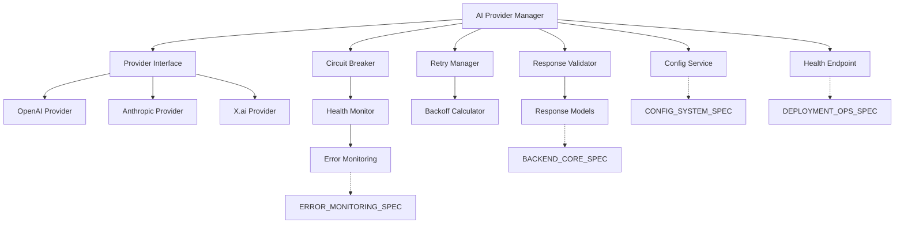

# AI Provider Framework Specification Prompt

You are an AI integration architect with expertise in provider abstraction patterns and fault-tolerant systems. Create a comprehensive specification document titled "AI_PROVIDER_SPEC.md" for SizeComparator's AI provider framework that emphasizes robustness, reliability, and extensibility while ensuring seamless integration with all system components.

## Context
SizeComparator requires a bulletproof AI provider abstraction layer that can handle multiple providers (OpenAI, Anthropic, X.ai) with automatic failover, sophisticated retry logic, and comprehensive error handling. The system must achieve 99% uptime despite individual provider failures and handle complex failure scenarios gracefully.

## Document Requirements
- **Target Length**: 9-10 pages maximum (most complex component)
- **Focus**: Provider abstraction patterns, concrete implementations, and reliability mechanisms
- **Format**: Code examples, architectural diagrams, decision matrices
- **Reference**: Link to SIZECOMPARATOR_SYSTEM_SPEC.md for overall architecture context

## Critical Integration Requirements

### 1. BACKEND_CORE_SPEC Integration
Your AI provider specification MUST align with the BACKEND_CORE_SPEC response format:
- Response models must use standardized Pydantic models from BACKEND_CORE_SPEC
- All AI responses must conform to WeightComparisonResponse schema
- Provider responses must integrate with FastAPI's async/await patterns
- Error responses must follow ErrorResponse format with request_id tracking

### 2. CONFIG_SYSTEM_SPEC Compliance
Configuration management must align with the configuration framework:
- Use CONFIG_SYSTEM_SPEC template system for prompt management
- Support hot-reload for provider configurations without restart
- Implement environment variable integration using SIZECOMPARATOR_* prefix
- Provider settings must validate against JSON schema from CONFIG_SYSTEM_SPEC
- Support A/B testing variants for prompt optimization

### 3. ERROR_MONITORING_SPEC Integration
Circuit breaker states and error handling must feed into the monitoring system:
- Circuit breaker state changes must emit structured log events with request IDs
- Provider health metrics must integrate with ERROR_MONITORING_SPEC metrics collection
- All errors must include contextual information as defined in ERROR_MONITORING_SPEC
- Rate limiting events must be logged with appropriate severity levels
- Timeout and retry events must be tracked for operational dashboards

### 4. DEPLOYMENT_OPS_SPEC Health Checks
Provider health must integrate with the deployment health check system:
- Implement standardized /health endpoint that aggregates provider status
- Provider health checks must report to DEPLOYMENT_OPS_SPEC monitoring
- Circuit breaker states must be exposed via health check endpoints
- Provider availability must feed into overall system SLA calculation
- Support graceful degradation signals for load balancer configuration

### 5. TESTING_SPEC Mock Interface
Define clear mock interfaces for comprehensive testing:
- Create MockAIProvider class that implements the full provider interface
- Support configurable response patterns for testing failover scenarios
- Enable rate limit simulation for testing circuit breaker behavior
- Provide fixture data management for consistent test scenarios
- Support non-deterministic response testing with confidence thresholds

## Core Sections (with page allocations)

### 1. Provider Architecture Overview (1.5 pages)

#### 1.1 Abstraction Philosophy
Define the core abstraction principles aligned with system-wide patterns:
- Provider-agnostic interface design conforming to BACKEND_CORE_SPEC contracts
- Dependency injection for provider implementations with FastAPI dependency system
- Strategy pattern for provider selection with CONFIG_SYSTEM_SPEC-driven configuration
- Observer pattern for health monitoring feeding ERROR_MONITORING_SPEC metrics
- Chain of responsibility for failover integrated with DEPLOYMENT_OPS_SPEC health checks

#### 1.2 Component Architecture Diagram


#### 1.3 Critical Design Decisions
| Decision | Choice | Rationale | Integration Point |
|----------|--------|-----------|------------------|
| Async Pattern | asyncio with connection pooling | Concurrent provider calls for speed | BACKEND_CORE_SPEC FastAPI async |
| Failure Detection | Circuit breaker + health checks | Fast failure detection and recovery | ERROR_MONITORING_SPEC states |
| Response Format | Pydantic WeightComparisonResponse | Provider-agnostic processing | BACKEND_CORE_SPEC models |
| Configuration | Hot-reload via CONFIG_SYSTEM_SPEC | Zero-downtime provider updates | CONFIG_SYSTEM_SPEC templates |
| Monitoring | Structured metrics + logging | Observable failure patterns | ERROR_MONITORING_SPEC framework |
| Health Checks | Standardized /health endpoint | SLA compliance monitoring | DEPLOYMENT_OPS_SPEC integration |
| Testing | MockAIProvider interface | Comprehensive test coverage | TESTING_SPEC requirements |

### 2. Abstract Provider Interface (1.5 pages)

#### 2.1 Core Provider Contract
Must align with BACKEND_CORE_SPEC Pydantic models and ERROR_MONITORING_SPEC logging:

```python
from abc import ABC, abstractmethod
from typing import List, Dict, Any, Optional
from enum import Enum
from pydantic import BaseModel, Field
from datetime import datetime
import uuid

# Aligned with BACKEND_CORE_SPEC models
from backend.models.requests import WeightComparisonRequest
from backend.models.responses import WeightComparisonResponse, WeightItem, ErrorResponse

class ProviderStatus(Enum):
    HEALTHY = "healthy"
    DEGRADED = "degraded"  
    UNHEALTHY = "unhealthy"
    CIRCUIT_OPEN = "circuit_open"

class ProviderHealth(BaseModel):
    """Health status model aligned with DEPLOYMENT_OPS_SPEC health checks."""
    status: ProviderStatus
    success_rate: float = Field(ge=0.0, le=1.0)
    avg_response_time_ms: float = Field(ge=0.0)
    error_count: int = Field(ge=0)
    last_error: Optional[str] = None
    circuit_state: str = Field(default="CLOSED")
    last_success: Optional[datetime] = None
    provider_name: str
    request_id: str = Field(default_factory=lambda: str(uuid.uuid4()))

class AIProviderRequest(BaseModel):
    """Request model that includes CONFIG_SYSTEM_SPEC template information."""
    item1_name: str
    item1_weight: str
    item2_name: str
    item2_weight: str
    prompt_template_id: str  # From CONFIG_SYSTEM_SPEC templates
    template_variables: Dict[str, Any] = Field(default_factory=dict)
    max_tokens: int = Field(default=150, ge=1, le=4000)
    temperature: float = Field(default=0.7, ge=0.0, le=2.0)
    timeout_seconds: float = Field(default=30.0, ge=1.0, le=300.0)
    request_id: str = Field(default_factory=lambda: str(uuid.uuid4()))

class AIProvider(ABC):
    """Abstract base class for AI provider implementations."""
    
    def __init__(self, config: Dict[str, Any], logger: Any = None):
        self.config = config
        self.name = self.__class__.__name__
        self.logger = logger  # ERROR_MONITORING_SPEC structured logging
        self._health = ProviderHealth(
            status=ProviderStatus.HEALTHY,
            success_rate=1.0,
            avg_response_time_ms=0.0,
            error_count=0,
            last_error=None,
            circuit_state="CLOSED",
            provider_name=self.name
        )
    
    @abstractmethod
    async def generate_comparison(
        self, 
        request: AIProviderRequest
    ) -> WeightComparisonResponse:
        """Generate weight comparison using provider-specific API.
        
        Must return BACKEND_CORE_SPEC WeightComparisonResponse format.
        All errors must include request_id for ERROR_MONITORING_SPEC tracing.
        """
        pass
    
    @abstractmethod
    def validate_response(self, response: Any) -> bool:
        """Validate provider-specific response format."""
        pass
    
    @abstractmethod
    def parse_response(
        self, 
        response: Any, 
        request: AIProviderRequest
    ) -> WeightComparisonResponse:
        """Parse provider-specific response into BACKEND_CORE_SPEC format."""
        pass
    
    def get_health_status(self) -> ProviderHealth:
        """Return current provider health for DEPLOYMENT_OPS_SPEC monitoring."""
        self._health.request_id = str(uuid.uuid4())
        return self._health
    
    async def health_check(self) -> bool:
        """Perform provider-specific health check for DEPLOYMENT_OPS_SPEC."""
        try:
            test_request = AIProviderRequest(
                item1_name="Test Item 1",
                item1_weight="10 lbs",
                item2_name="Test Item 2", 
                item2_weight="5 kg",
                prompt_template_id="health_check",
                timeout_seconds=5.0
            )
            await self.generate_comparison(test_request)
            return True
        except Exception as e:
            if self.logger:
                self.logger.error(
                    "Provider health check failed",
                    extra={
                        "provider": self.name,
                        "error": str(e),
                        "request_id": test_request.request_id
                    }
                )
            return False
    
    def _log_structured_event(self, level: str, message: str, **kwargs):
        """Log structured events for ERROR_MONITORING_SPEC integration."""
        if self.logger:
            log_data = {
                "provider": self.name,
                "timestamp": datetime.utcnow().isoformat(),
                **kwargs
            }
            getattr(self.logger, level)(message, extra=log_data)
```

#### 2.2 Provider Lifecycle Hooks
```python
class ProviderLifecycle:
    async def on_startup(self):
        """Initialize provider resources."""
        pass
    
    async def on_shutdown(self):
        """Cleanup provider resources."""
        pass
    
    async def on_error(self, error: Exception):
        """Handle provider-specific errors."""
        pass
    
    async def on_rate_limit(self, retry_after: float):
        """Handle rate limit with backoff."""
        pass
```

### 3. Concrete Provider Implementations (2 pages)

#### 3.1 OpenAI Provider Implementation
```python
import openai
from typing import List, Dict, Any
import json

class OpenAIProvider(AIProvider):
    """OpenAI GPT-4 provider implementation."""
    
    def __init__(self, config: Dict[str, Any]):
        super().__init__(config)
        self.client = openai.AsyncOpenAI(
            api_key=config["api_key"],
            timeout=config.get("timeout", 30.0),
            max_retries=0  # We handle retries ourselves
        )
        self.model = config.get("model", "gpt-4")
    
    async def generate_comparisons(
        self, 
        request: ComparisonRequest
    ) -> List[Comparison]:
        try:
            response = await self.client.chat.completions.create(
                model=self.model,
                messages=[
                    {"role": "system", "content": request.prompt_template},
                    {"role": "user", "content": f"Convert {request.weight} {request.unit}"}
                ],
                max_tokens=request.max_tokens,
                temperature=request.temperature,
                response_format={"type": "json_object"},  # Structured output
                timeout=request.timeout_seconds
            )
            
            if not self.validate_response(response):
                raise ValueError("Invalid response format")
            
            return self.parse_response(response)
            
        except openai.RateLimitError as e:
            await self.on_rate_limit(e.retry_after or 60)
            raise
        except openai.APIError as e:
            await self.on_error(e)
            raise
    
    def validate_response(self, response: Any) -> bool:
        try:
            content = response.choices[0].message.content
            data = json.loads(content)
            return (
                "comparisons" in data and
                isinstance(data["comparisons"], list) and
                len(data["comparisons"]) == 2
            )
        except:
            return False
    
    def parse_response(self, response: Any) -> List[Comparison]:
        content = response.choices[0].message.content
        data = json.loads(content)
        
        comparisons = []
        for comp in data["comparisons"]:
            comparisons.append(Comparison(
                description=comp["description"],
                individual_weight=comp["individual_weight"],
                total_weight=comp["total_weight"],
                confidence=comp.get("confidence", 0.8),
                category=comp.get("category", "object"),
                provider_metadata={
                    "model": self.model,
                    "finish_reason": response.choices[0].finish_reason,
                    "usage": response.usage.model_dump()
                }
            ))
        return comparisons
```

#### 3.2 Anthropic Provider Implementation
```python
import anthropic
from typing import List, Dict, Any

class AnthropicProvider(AIProvider):
    """Anthropic Claude provider implementation."""
    
    def __init__(self, config: Dict[str, Any]):
        super().__init__(config)
        self.client = anthropic.AsyncAnthropic(
            api_key=config["api_key"],
            timeout=config.get("timeout", 30.0)
        )
        self.model = config.get("model", "claude-3-sonnet-20240229")
    
    async def generate_comparisons(
        self, 
        request: ComparisonRequest
    ) -> List[Comparison]:
        try:
            # Anthropic-specific prompt formatting
            formatted_prompt = f"""
{request.prompt_template}

Convert {request.weight} {request.unit} into exactly 2 comparisons.

Return your response in this JSON format:
{{
    "comparisons": [
        {{
            "description": "Object description",
            "individual_weight": "X units each",
            "total_weight": "Y units total",
            "confidence": 0.9,
            "category": "category"
        }}
    ]
}}
"""
            
            response = await self.client.messages.create(
                model=self.model,
                max_tokens=request.max_tokens,
                temperature=request.temperature,
                messages=[{
                    "role": "user",
                    "content": formatted_prompt
                }],
                timeout=request.timeout_seconds
            )
            
            if not self.validate_response(response):
                raise ValueError("Invalid response format")
            
            return self.parse_response(response)
            
        except anthropic.RateLimitError as e:
            await self.on_rate_limit(60)  # Anthropic doesn't provide retry_after
            raise
        except anthropic.APIError as e:
            await self.on_error(e)
            raise
    
    def validate_response(self, response: Any) -> bool:
        try:
            # Extract JSON from Claude's response
            content = response.content[0].text
            json_start = content.find('{')
            json_end = content.rfind('}') + 1
            json_str = content[json_start:json_end]
            
            data = json.loads(json_str)
            return (
                "comparisons" in data and
                isinstance(data["comparisons"], list) and
                len(data["comparisons"]) == 2
            )
        except:
            return False
```

#### 3.3 X.ai Provider Implementation
```python
class XAIProvider(AIProvider):
    """X.ai Grok provider implementation."""
    
    # Similar structure with X.ai-specific quirks:
    # - Different rate limit handling
    # - Custom response parsing for Grok's format
    # - Specific timeout behaviors
```

### 4. Retry Logic & Exponential Backoff (1.5 pages)

#### 4.1 Retry Manager Implementation
```python
import asyncio
from typing import TypeVar, Callable, Optional
from datetime import datetime, timedelta
import random

T = TypeVar('T')

class RetryConfig:
    def __init__(
        self,
        max_attempts: int = 3,
        initial_delay_ms: int = 100,
        max_delay_ms: int = 10000,
        exponential_base: float = 2.0,
        jitter: bool = True
    ):
        self.max_attempts = max_attempts
        self.initial_delay_ms = initial_delay_ms
        self.max_delay_ms = max_delay_ms
        self.exponential_base = exponential_base
        self.jitter = jitter

class RetryManager:
    """Sophisticated retry logic with exponential backoff."""
    
    def __init__(self, config: RetryConfig):
        self.config = config
        self.retry_stats = defaultdict(lambda: {"attempts": 0, "last_error": None})
    
    async def execute_with_retry(
        self,
        func: Callable[[], T],
        provider_name: str,
        retryable_exceptions: tuple = (Exception,)
    ) -> T:
        """Execute function with exponential backoff retry."""
        
        for attempt in range(self.config.max_attempts):
            try:
                result = await func()
                # Reset stats on success
                self.retry_stats[provider_name]["attempts"] = 0
                return result
                
            except retryable_exceptions as e:
                self.retry_stats[provider_name]["attempts"] += 1
                self.retry_stats[provider_name]["last_error"] = str(e)
                
                if attempt == self.config.max_attempts - 1:
                    raise
                
                delay = self._calculate_delay(attempt)
                await asyncio.sleep(delay / 1000)  # Convert to seconds
    
    def _calculate_delay(self, attempt: int) -> int:
        """Calculate delay with exponential backoff and jitter."""
        delay = self.config.initial_delay_ms * (
            self.config.exponential_base ** attempt
        )
        
        # Cap at max delay
        delay = min(delay, self.config.max_delay_ms)
        
        # Add jitter to prevent thundering herd
        if self.config.jitter:
            delay = delay * (0.5 + random.random() * 0.5)
        
        return int(delay)
```

#### 4.2 Provider-Specific Retry Strategies
| Provider | Retryable Errors | Non-Retryable | Backoff Strategy |
|----------|------------------|---------------|------------------|
| OpenAI | RateLimitError, APIConnectionError | AuthenticationError, InvalidRequestError | Exponential with jitter |
| Anthropic | RateLimitError, APIStatusError | PermissionError, InvalidRequestError | Exponential with jitter |
| X.ai | RateLimitError, TimeoutError | AuthError, ValidationError | Linear backoff for first 2 |

### 5. Circuit Breaker Pattern (1.5 pages)

#### 5.1 Circuit Breaker Implementation
Integrated with ERROR_MONITORING_SPEC for state tracking and DEPLOYMENT_OPS_SPEC health reporting:

```python
from enum import Enum
from datetime import datetime, timedelta
from typing import Callable, Any, Optional
import asyncio
import uuid

class CircuitState(Enum):
    CLOSED = "closed"      # Normal operation
    OPEN = "open"          # Failing, reject calls
    HALF_OPEN = "half_open"  # Testing recovery

class CircuitBreakerError(Exception):
    """Circuit breaker specific exception for ERROR_MONITORING_SPEC."""
    def __init__(self, message: str, circuit_state: str, request_id: str):
        self.circuit_state = circuit_state
        self.request_id = request_id
        super().__init__(message)

class CircuitBreaker:
    """Circuit breaker for provider failure isolation with monitoring integration."""
    
    def __init__(
        self,
        provider_name: str,
        failure_threshold: int = 5,
        success_threshold: int = 2,
        timeout_seconds: int = 60,
        half_open_max_calls: int = 3,
        logger: Any = None
    ):
        self.provider_name = provider_name
        self.failure_threshold = failure_threshold
        self.success_threshold = success_threshold
        self.timeout_seconds = timeout_seconds
        self.half_open_max_calls = half_open_max_calls
        self.logger = logger
        
        self.state = CircuitState.CLOSED
        self.failure_count = 0
        self.success_count = 0
        self.last_failure_time = None
        self.half_open_calls = 0
        self._lock = asyncio.Lock()
        self._state_change_times = []
    
    async def call(self, func: Callable, request_id: str = None) -> Any:
        """Execute function through circuit breaker with ERROR_MONITORING_SPEC logging."""
        if not request_id:
            request_id = str(uuid.uuid4())
            
        async with self._lock:
            if self.state == CircuitState.OPEN:
                if self._should_attempt_reset():
                    await self._transition_state(CircuitState.HALF_OPEN, request_id)
                    self.half_open_calls = 0
                else:
                    time_until_reset = self._time_until_reset()
                    self._log_circuit_event(
                        "circuit_breaker_rejected",
                        request_id,
                        {"time_until_reset": time_until_reset}
                    )
                    raise CircuitBreakerError(
                        f"Circuit breaker is OPEN. Retry after {time_until_reset} seconds",
                        self.state.value,
                        request_id
                    )
            
            if self.state == CircuitState.HALF_OPEN:
                if self.half_open_calls >= self.half_open_max_calls:
                    self._log_circuit_event(
                        "half_open_limit_reached", 
                        request_id,
                        {"current_calls": self.half_open_calls}
                    )
                    raise CircuitBreakerError(
                        "Half-open call limit reached",
                        self.state.value,
                        request_id
                    )
                self.half_open_calls += 1
        
        try:
            result = await func()
            await self._on_success(request_id)
            return result
        except Exception as e:
            await self._on_failure(request_id, e)
            raise
    
    async def _on_success(self, request_id: str):
        """Handle successful call with monitoring integration."""
        async with self._lock:
            self.failure_count = 0
            
            if self.state == CircuitState.HALF_OPEN:
                self.success_count += 1
                self._log_circuit_event(
                    "circuit_breaker_success",
                    request_id,
                    {"success_count": self.success_count, "threshold": self.success_threshold}
                )
                
                if self.success_count >= self.success_threshold:
                    await self._transition_state(CircuitState.CLOSED, request_id)
                    self.success_count = 0
    
    async def _on_failure(self, request_id: str, error: Exception):
        """Handle failed call with ERROR_MONITORING_SPEC integration."""
        async with self._lock:
            self.failure_count += 1
            self.last_failure_time = datetime.now()
            
            self._log_circuit_event(
                "circuit_breaker_failure",
                request_id,
                {
                    "failure_count": self.failure_count,
                    "error_type": type(error).__name__,
                    "error_message": str(error)
                }
            )
            
            if self.state == CircuitState.HALF_OPEN:
                await self._transition_state(CircuitState.OPEN, request_id)
                self.success_count = 0
            elif (self.state == CircuitState.CLOSED and 
                  self.failure_count >= self.failure_threshold):
                await self._transition_state(CircuitState.OPEN, request_id)
    
    async def _transition_state(self, new_state: CircuitState, request_id: str):
        """Transition circuit state with ERROR_MONITORING_SPEC logging."""
        old_state = self.state
        self.state = new_state
        transition_time = datetime.now()
        self._state_change_times.append((old_state, new_state, transition_time))
        
        # Log state transition for ERROR_MONITORING_SPEC
        self._log_circuit_event(
            "circuit_breaker_state_change",
            request_id,
            {
                "from_state": old_state.value,
                "to_state": new_state.value,
                "failure_count": self.failure_count,
                "success_count": self.success_count
            },
            level="WARNING" if new_state == CircuitState.OPEN else "INFO"
        )
    
    def _log_circuit_event(self, event_type: str, request_id: str, data: dict, level: str = "INFO"):
        """Log circuit breaker events for ERROR_MONITORING_SPEC."""
        if self.logger:
            log_data = {
                "event_type": event_type,
                "provider": self.provider_name,
                "circuit_state": self.state.value,
                "request_id": request_id,
                "timestamp": datetime.utcnow().isoformat(),
                **data
            }
            getattr(self.logger, level.lower())(f"Circuit breaker event: {event_type}", extra=log_data)
    
    def get_health_metrics(self) -> dict:
        """Return health metrics for DEPLOYMENT_OPS_SPEC monitoring."""
        return {
            "state": self.state.value,
            "failure_count": self.failure_count,
            "success_count": self.success_count,
            "last_failure_time": self.last_failure_time.isoformat() if self.last_failure_time else None,
            "time_until_reset": self._time_until_reset() if self.state == CircuitState.OPEN else 0,
            "provider": self.provider_name
        }
    
    def _should_attempt_reset(self) -> bool:
        """Check if enough time has passed to try recovery."""
        return (
            self.last_failure_time and
            datetime.now() - self.last_failure_time > 
            timedelta(seconds=self.timeout_seconds)
        )
    
    def _time_until_reset(self) -> int:
        """Calculate seconds until circuit can attempt reset."""
        if not self.last_failure_time:
            return 0
        elapsed = datetime.now() - self.last_failure_time
        remaining = timedelta(seconds=self.timeout_seconds) - elapsed
        return max(0, int(remaining.total_seconds()))
```

#### 5.2 Circuit Breaker Integration
```python
class ProviderWithCircuitBreaker:
    """Wrapper that adds circuit breaker to any provider."""
    
    def __init__(self, provider: AIProvider, circuit_config: Dict):
        self.provider = provider
        self.circuit_breaker = CircuitBreaker(**circuit_config)
    
    async def generate_comparisons(self, request: ComparisonRequest):
        return await self.circuit_breaker.call(
            lambda: self.provider.generate_comparisons(request)
        )
```

### 6. Response Validation & Quality Control (1 page)

#### 6.1 Response Validator Implementation
```python
class ResponseValidator:
    """Comprehensive response validation and quality checks."""
    
    def __init__(self, validation_config: Dict[str, Any]):
        self.config = validation_config
        self.quality_metrics = QualityMetrics()
    
    def validate_comparisons(
        self, 
        comparisons: List[Comparison],
        original_weight: Weight
    ) -> ValidationResult:
        """Validate AI-generated comparisons."""
        
        errors = []
        warnings = []
        
        # Structural validation
        if len(comparisons) != 2:
            errors.append("Must have exactly 2 comparisons")
        
        for i, comp in enumerate(comparisons):
            # Required field validation
            if not comp.description:
                errors.append(f"Comparison {i+1}: Missing description")
            
            # Weight relationship validation
            if not self._validate_weight_relationship(comp, original_weight):
                warnings.append(
                    f"Comparison {i+1}: Weight seems unrealistic"
                )
            
            # Content appropriateness
            if self._contains_inappropriate_content(comp.description):
                errors.append(
                    f"Comparison {i+1}: Inappropriate content detected"
                )
            
            # Object recognition
            if not self._is_recognizable_object(comp.description):
                warnings.append(
                    f"Comparison {i+1}: May not be commonly recognizable"
                )
        
        # Quality scoring
        quality_score = self._calculate_quality_score(comparisons)
        
        return ValidationResult(
            is_valid=len(errors) == 0,
            errors=errors,
            warnings=warnings,
            quality_score=quality_score
        )
    
    def _validate_weight_relationship(
        self, 
        comparison: Comparison,
        original_weight: Weight
    ) -> bool:
        """Ensure weight relationships are mathematically sound."""
        # Extract numeric values and validate
        # E.g., "4 chickens at 6 lbs each" should equal ~24 lbs
        pass
    
    def _contains_inappropriate_content(self, text: str) -> bool:
        """Screen for inappropriate comparisons."""
        inappropriate_patterns = [
            r'\b(weapon|drug|explosive)\b',
            r'\b(dead|corpse|body)\b',
            # Add more patterns as needed
        ]
        return any(re.search(pattern, text, re.I) 
                  for pattern in inappropriate_patterns)
```

#### 6.2 Quality Metrics
| Metric | Weight | Description |
|--------|--------|-------------|
| Accuracy | 40% | Mathematical correctness of weight |
| Relatability | 30% | How common/recognizable the object is |
| Diversity | 20% | Different categories between comparisons |
| Clarity | 10% | Clear, specific descriptions |

### 7. Rate Limiting & Timeout Handling (1 page)

#### 7.1 Rate Limiter Implementation
```python
class TokenBucketRateLimiter:
    """Token bucket algorithm for rate limiting."""
    
    def __init__(
        self,
        capacity: int,
        refill_rate: float,  # tokens per second
        burst_capacity: Optional[int] = None
    ):
        self.capacity = capacity
        self.refill_rate = refill_rate
        self.burst_capacity = burst_capacity or capacity
        self.tokens = float(capacity)
        self.last_refill = time.time()
        self._lock = asyncio.Lock()
    
    async def acquire(self, tokens: int = 1) -> bool:
        """Try to acquire tokens, return True if successful."""
        async with self._lock:
            self._refill()
            
            if self.tokens >= tokens:
                self.tokens -= tokens
                return True
            return False
    
    async def wait_and_acquire(self, tokens: int = 1):
        """Wait until tokens are available."""
        while True:
            if await self.acquire(tokens):
                return
            
            # Calculate wait time
            needed = tokens - self.tokens
            wait_time = needed / self.refill_rate
            await asyncio.sleep(wait_time)
    
    def _refill(self):
        """Refill tokens based on elapsed time."""
        now = time.time()
        elapsed = now - self.last_refill
        
        self.tokens = min(
            self.burst_capacity,
            self.tokens + (elapsed * self.refill_rate)
        )
        self.last_refill = now
```

#### 7.2 Timeout Strategies
```python
class TimeoutManager:
    """Sophisticated timeout handling with context."""
    
    def __init__(self, base_timeout: float = 10.0):
        self.base_timeout = base_timeout
        self.provider_stats = defaultdict(lambda: {
            "avg_response_time": base_timeout / 2,
            "p95_response_time": base_timeout,
            "timeout_count": 0
        })
    
    def calculate_timeout(
        self, 
        provider: str,
        request_complexity: float = 1.0
    ) -> float:
        """Calculate dynamic timeout based on provider performance."""
        stats = self.provider_stats[provider]
        
        # Use P95 response time with buffer
        timeout = stats["p95_response_time"] * 1.5 * request_complexity
        
        # Cap at reasonable limits
        return min(max(timeout, 5.0), 30.0)
    
    async def execute_with_timeout(
        self,
        coro: Coroutine,
        provider: str,
        timeout: Optional[float] = None
    ):
        """Execute coroutine with timeout tracking."""
        timeout = timeout or self.calculate_timeout(provider)
        
        try:
            start = time.time()
            result = await asyncio.wait_for(coro, timeout=timeout)
            
            # Update statistics
            response_time = time.time() - start
            self._update_stats(provider, response_time, success=True)
            
            return result
            
        except asyncio.TimeoutError:
            self._update_stats(provider, timeout, success=False)
            raise
```

### 8. Provider-Specific Quirks & Handling (0.5 pages)

#### 8.1 Known Provider Quirks
| Provider | Quirk | Handling Strategy |
|----------|-------|------------------|
| OpenAI | JSON mode sometimes adds markdown | Strip markdown in parser |
| Anthropic | May include preamble text | Extract JSON with regex |
| X.ai | Inconsistent response format | Multiple parsing attempts |
| All | Temperature affects format compliance | Lower temp for structured output |

#### 8.2 API Key Security
```python
class SecureAPIKeyManager:
    """Secure API key handling with rotation support."""
    
    def __init__(self):
        self._keys = {}
        self._key_rotation_callbacks = []
    
    def load_key(self, provider: str) -> str:
        """Load API key from secure source."""
        # Never log or expose keys
        key = os.environ.get(f"{provider.upper()}_API_KEY")
        if not key:
            raise ConfigurationError(
                f"Missing API key for {provider}"
            )
        return key
    
    def rotate_key(self, provider: str, new_key: str):
        """Support key rotation without restart."""
        self._keys[provider] = new_key
        for callback in self._key_rotation_callbacks:
            callback(provider, new_key)
```

### 9. TESTING_SPEC Mock Interface Implementation (1 page)

#### 9.1 MockAIProvider Class
Complete mock implementation aligned with TESTING_SPEC requirements:

```python
from typing import Dict, Any, List, Optional, Callable
import asyncio
import random
from datetime import datetime, timedelta

class MockAIProvider(AIProvider):
    """Mock AI provider for comprehensive testing as per TESTING_SPEC."""
    
    def __init__(self, config: Dict[str, Any] = None, test_config: Dict[str, Any] = None):
        super().__init__(config or {})
        self.test_config = test_config or {}
        self.call_count = 0
        self.call_history: List[AIProviderRequest] = []
        self.response_fixtures: Dict[str, WeightComparisonResponse] = {}
        self.error_fixtures: Dict[str, Exception] = {}
        self.rate_limit_config = self.test_config.get('rate_limit', {})
        self.latency_config = self.test_config.get('latency', {})
        self.failure_config = self.test_config.get('failures', {})
        self._setup_default_responses()
    
    async def generate_comparison(self, request: AIProviderRequest) -> WeightComparisonResponse:
        """Generate mock comparison response with configurable behavior."""
        self.call_count += 1
        self.call_history.append(request)
        
        # Simulate rate limiting
        if self._should_rate_limit():
            await asyncio.sleep(0.1)  # Brief delay for rate limit
            raise Exception("Rate limit exceeded")
        
        # Simulate configured latency
        await self._simulate_latency()
        
        # Check for configured failures
        if self._should_fail():
            error = self._get_configured_error(request)
            raise error
        
        # Return configured response or generate default
        response_key = self._get_response_key(request)
        if response_key in self.response_fixtures:
            return self.response_fixtures[response_key]
        
        return self._generate_default_response(request)
    
    def set_response_fixture(self, request_pattern: str, response: WeightComparisonResponse):
        """Set fixed response for testing deterministic scenarios."""
        self.response_fixtures[request_pattern] = response
    
    def set_error_fixture(self, request_pattern: str, error: Exception):
        """Set error response for testing failure scenarios."""
        self.error_fixtures[request_pattern] = error
    
    def configure_rate_limiting(self, requests_per_minute: int, burst_limit: int = None):
        """Configure rate limiting behavior for testing circuit breakers."""
        self.rate_limit_config = {
            'requests_per_minute': requests_per_minute,
            'burst_limit': burst_limit or requests_per_minute // 4,
            'window_start': datetime.now(),
            'request_count': 0
        }
    
    def configure_latency(self, min_ms: int, max_ms: int, variability: bool = True):
        """Configure response latency for performance testing."""
        self.latency_config = {
            'min_ms': min_ms,
            'max_ms': max_ms,
            'variability': variability
        }
    
    def configure_failures(self, failure_rate: float, failure_after_calls: int = None):
        """Configure failure patterns for resilience testing."""
        self.failure_config = {
            'failure_rate': failure_rate,
            'failure_after_calls': failure_after_calls
        }
    
    def get_call_statistics(self) -> Dict[str, Any]:
        """Return call statistics for test verification."""
        return {
            'total_calls': self.call_count,
            'call_history': self.call_history,
            'avg_response_time': self._calculate_avg_response_time(),
            'error_rate': self._calculate_error_rate()
        }
    
    def reset_state(self):
        """Reset mock state between tests."""
        self.call_count = 0
        self.call_history.clear()
        self.response_fixtures.clear()
        self.error_fixtures.clear()
    
    # Private methods for mock behavior
    def _should_rate_limit(self) -> bool:
        if not self.rate_limit_config:
            return False
        
        config = self.rate_limit_config
        now = datetime.now()
        
        # Reset window if needed
        if now - config['window_start'] > timedelta(minutes=1):
            config['window_start'] = now
            config['request_count'] = 0
        
        config['request_count'] += 1
        return config['request_count'] > config['requests_per_minute']
    
    async def _simulate_latency(self):
        if not self.latency_config:
            return
        
        config = self.latency_config
        if config['variability']:
            delay_ms = random.randint(config['min_ms'], config['max_ms'])
        else:
            delay_ms = (config['min_ms'] + config['max_ms']) // 2
        
        await asyncio.sleep(delay_ms / 1000)
    
    def _should_fail(self) -> bool:
        config = self.failure_config
        if not config:
            return False
        
        if config.get('failure_after_calls') and self.call_count >= config['failure_after_calls']:
            return True
        
        if config.get('failure_rate', 0) > random.random():
            return True
        
        return False
    
    def _get_configured_error(self, request: AIProviderRequest) -> Exception:
        request_key = self._get_response_key(request)
        return self.error_fixtures.get(request_key, Exception("Mock provider error"))
    
    def _get_response_key(self, request: AIProviderRequest) -> str:
        return f"{request.item1_name}_{request.item2_name}_{request.prompt_template_id}"
    
    def _generate_default_response(self, request: AIProviderRequest) -> WeightComparisonResponse:
        """Generate realistic default response for testing."""
        from backend.models.responses import WeightComparisonResponse, WeightItem, ComparisonResult
        
        return WeightComparisonResponse(
            item1=WeightItem(
                name=request.item1_name,
                original_input=request.item1_weight,
                weight_kg=10.0,  # Mock values
                weight_display="10.0 kg",
                unit_used="kg"
            ),
            item2=WeightItem(
                name=request.item2_name,
                original_input=request.item2_weight,
                weight_kg=5.0,  # Mock values
                weight_display="5.0 kg", 
                unit_used="kg"
            ),
            comparison=ComparisonResult(
                ratio=2.0,
                explanation="Mock comparison explanation",
                confidence=0.9
            ),
            visualization_prompt="Mock visualization prompt",
            metadata={
                "provider": "mock",
                "request_id": request.request_id,
                "mock_call_count": self.call_count
            }
        )
    
    def _setup_default_responses(self):
        """Setup common test fixture responses."""
        # Add common test scenarios
        pass
    
    # Required abstract method implementations
    def validate_response(self, response: Any) -> bool:
        return isinstance(response, WeightComparisonResponse)
    
    def parse_response(self, response: Any, request: AIProviderRequest) -> WeightComparisonResponse:
        return response
```

#### 9.2 Test Helper Classes
```python
class AIProviderTestSuite:
    """Test suite helper for comprehensive provider testing."""
    
    def __init__(self, provider_class: type):
        self.provider_class = provider_class
        self.mock_provider = MockAIProvider()
    
    async def test_failover_scenarios(self):
        """Test all failover scenarios per TESTING_SPEC."""
        # Test provider unavailable
        self.mock_provider.configure_failures(failure_rate=1.0)
        # Add failover test logic
    
    async def test_rate_limit_handling(self):
        """Test rate limit compliance per TESTING_SPEC."""
        self.mock_provider.configure_rate_limiting(requests_per_minute=10)
        # Add rate limit test logic
    
    async def test_circuit_breaker_integration(self):
        """Test circuit breaker behavior per TESTING_SPEC."""
        # Configure failure patterns to trigger circuit breaker
        # Verify state transitions are logged correctly
```

### 10. Integration & Configuration (0.5 pages)

#### 10.1 Provider Manager Configuration
Must align with CONFIG_SYSTEM_SPEC template and validation system:

```yaml
# config/base/ai_providers.yaml - follows CONFIG_SYSTEM_SPEC structure
ai_providers:
  selection_strategy: "priority_with_fallback"
  parallel_requests: true
  timeout_multiplier: 1.2
  
  circuit_breaker:
    failure_threshold: 5
    recovery_timeout: 60
    half_open_calls: 3
  
  retry_config:
    max_attempts: 3
    initial_delay_ms: 100
    max_delay_ms: 10000
    jitter: true
  
  # Template integration with CONFIG_SYSTEM_SPEC
  prompt_templates:
    size_comparison: "size_comp_v1"
    health_check: "health_check_v1"
    error_fallback: "error_fallback_v1"
  
  providers:
    openai:
      priority: 1
      enabled: true
      model: "${OPENAI_MODEL:-gpt-4}"
      api_key: "${OPENAI_API_KEY}"
      rate_limit: 3500
      timeout_override: 15
    
    anthropic:
      priority: 2
      enabled: true
      model: "${ANTHROPIC_MODEL:-claude-3-sonnet}"
      api_key: "${ANTHROPIC_API_KEY}" 
      rate_limit: 1000
    
    xai:
      priority: 3
      enabled: true
      model: "${XAI_MODEL:-grok-beta}"
      api_key: "${XAI_API_KEY}"
      rate_limit: 500

# JSON Schema validation for CONFIG_SYSTEM_SPEC
ai_providers_schema:
  type: object
  required: ["providers", "circuit_breaker", "retry_config"]
  properties:
    providers:
      type: object
      patternProperties:
        "^[a-z]+$":
          type: object
          required: ["priority", "enabled", "api_key"]
```

#### 10.2 System Integration Points
- **CONFIG_SYSTEM_SPEC**: Hot-reload configuration, template management, environment variables
- **ERROR_MONITORING_SPEC**: Structured logging, metrics collection, alert generation  
- **BACKEND_CORE_SPEC**: FastAPI dependency injection, Pydantic model validation
- **DEPLOYMENT_OPS_SPEC**: Health check aggregation, SLA monitoring, graceful shutdown
- **TESTING_SPEC**: Mock provider interface, fixture management, test scenarios

## Key Deliverables

1. **Complete abstract provider interface** with BACKEND_CORE_SPEC Pydantic model alignment
2. **Three concrete provider implementations** with quirk handling and BACKEND_CORE_SPEC integration
3. **Sophisticated retry manager** with exponential backoff and ERROR_MONITORING_SPEC logging
4. **Circuit breaker implementation** with auto-recovery and state tracking for ERROR_MONITORING_SPEC
5. **Comprehensive response validation framework** ensuring BACKEND_CORE_SPEC compliance
6. **Rate limiting and timeout management** with structured logging
7. **Security patterns for API key handling** aligned with CONFIG_SYSTEM_SPEC environment variables
8. **Integration configuration schema** compatible with CONFIG_SYSTEM_SPEC hot-reload system
9. **MockAIProvider implementation** meeting all TESTING_SPEC requirements
10. **Health check integration** feeding DEPLOYMENT_OPS_SPEC monitoring endpoints

## Critical Integration Compliance

### BACKEND_CORE_SPEC Alignment
- All responses must use WeightComparisonResponse Pydantic models
- Error responses must follow ErrorResponse format with request_id
- FastAPI async/await patterns throughout
- Proper dependency injection integration

### CONFIG_SYSTEM_SPEC Integration  
- Environment variable template resolution (${VAR_NAME:-default})
- JSON schema validation for all configuration
- Hot-reload support without service restart
- Prompt template system integration

### ERROR_MONITORING_SPEC Compliance
- Structured logging with request ID propagation
- Circuit breaker state changes logged with appropriate severity
- Provider health metrics exposed for monitoring
- Error categorization following specified taxonomy

### DEPLOYMENT_OPS_SPEC Requirements
- Standardized /health endpoint implementation
- Circuit breaker state exposure for load balancer decisions
- SLA compliance metrics feeding
- Graceful degradation signal support

### TESTING_SPEC Implementation
- Complete MockAIProvider with configurable behaviors
- Fixture data management system
- Non-deterministic response testing capabilities
- Circuit breaker and failover scenario testing

## Critical Bug Prevention

### API Key Exposure
- CONFIG_SYSTEM_SPEC environment variable loading only (${PROVIDER_API_KEY})
- No key logging at any level with ERROR_MONITORING_SPEC sanitization
- Secure key rotation support via CONFIG_SYSTEM_SPEC hot-reload
- Key validation on startup with structured error logging

### Infinite Retry Prevention
- Max attempt limits enforced with ERROR_MONITORING_SPEC tracking
- Circuit breaker stops cascading failures with state logging
- Timeout caps on all operations aligned with DEPLOYMENT_OPS_SPEC SLA
- Retry budget tracking for operational monitoring

### Integration Contract Violations
- Pydantic model validation prevents BACKEND_CORE_SPEC contract violations
- Request ID propagation ensures ERROR_MONITORING_SPEC traceability
- Health check format compliance with DEPLOYMENT_OPS_SPEC requirements
- Mock interface completeness for TESTING_SPEC coverage

### Malformed Response Handling
- Provider-specific parsers with fallback to BACKEND_CORE_SPEC defaults
- Response validation against WeightComparisonResponse schema
- Structured error logging for parsing failures
- Graceful degradation with appropriate health status reporting

## Writing Guidelines

1. **Include working code examples** that demonstrate integration with all specs
2. **Show error handling** with ERROR_MONITORING_SPEC structured logging examples
3. **Document failure modes** and recovery strategies feeding health checks
4. **Emphasize observability** with metrics aligned to monitoring framework
5. **Focus on integration contracts** ensuring seamless system operation
6. **Provide complete mock implementations** for comprehensive testing

The specification should serve as a complete implementation guide for building a bulletproof AI provider framework that integrates seamlessly with all SizeComparator components while handling real-world failures gracefully and maintaining high performance and reliability through proper monitoring and testing.