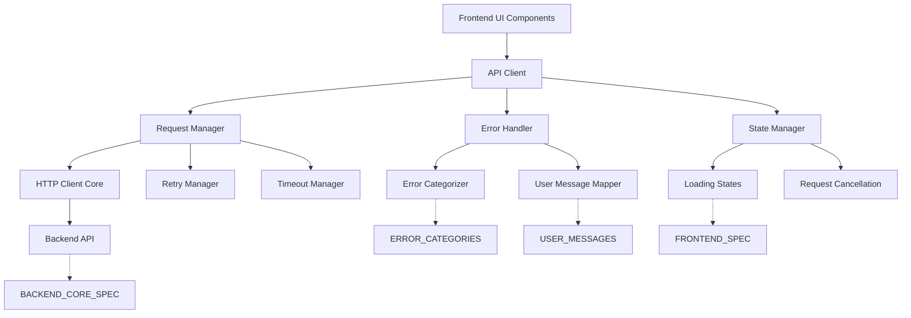

# SizeComparator Frontend API Client Specification

## Overview
This specification defines the HTTP client architecture for SizeComparator's frontend, providing type-safe API communication with robust error handling, timeout management, request cancellation, and offline support. The client integrates with the backend core API contracts, handles all BACKEND_CORE_SPEC error categories, and maintains consistent loading states for optimal user experience.

## Document Requirements
- **Target Length**: 5-6 pages maximum
- **Focus**: Type-safe client implementation with comprehensive error handling
- **Integration**: Must align with FRONTEND_SPEC vanilla JavaScript approach and BACKEND_CORE_SPEC API contracts
- **Performance**: Sub-2 second perceived response times with proper loading state management

## 1. API Client Architecture Overview (1 page)

### 1.1 Client Design Philosophy
The API client follows a modular, adapter-based architecture that provides:
- **Type Safety**: Full TypeScript interface definitions aligned with BACKEND_CORE_SPEC Pydantic models
- **Error Resilience**: Comprehensive error handling for all BACKEND_CORE_SPEC error categories
- **Request Management**: Automatic retries, timeouts, and cancellation support
- **State Integration**: Seamless loading state management for FRONTEND_SPEC UI components
- **Offline Support**: Graceful degradation and network failure handling

### 1.2 Core Client Structure
```javascript
class SizeComparatorAPIClient {
    constructor(config = {}) {
        this.baseURL = config.baseURL || '/api/v1';
        this.timeout = config.timeout || 30000; // 30 seconds
        this.retryConfig = {
            maxAttempts: config.maxRetries || 3,
            baseDelay: config.baseRetryDelay || 1000,
            maxDelay: config.maxRetryDelay || 10000,
            backoffFactor: config.backoffFactor || 2
        };
        this.requestInterceptors = [];
        this.responseInterceptors = [];
        this.activeRequests = new Map(); // For cancellation
        this.requestId = this._generateRequestId();
    }
    
    // Core methods implementation...
}
```

### 1.3 Integration Architecture


## 2. TypeScript Interface Definitions (1 page)

### 2.1 Request/Response Type Definitions
Aligned with BACKEND_CORE_SPEC Pydantic models:

```typescript
// Core Types aligned with BACKEND_CORE_SPEC
interface WeightUnit {
    KILOGRAM: 'kg';
    POUND: 'lb';
    OUNCE: 'oz';
    GRAM: 'g';
    STONE: 'st';
    METRIC_TON: 'mt';
}

interface WeightComparisonRequest {
    item1_name: string;
    item1_weight: string;
    item2_name: string;
    item2_weight: string;
    output_unit?: keyof WeightUnit;
}

interface WeightItem {
    name: string;
    original_input: string;
    weight_kg: number;
    weight_display: string;
    unit_used: keyof WeightUnit;
    confidence: number;
}

interface ComparisonResult {
    ratio: number;
    percentage_difference: number;
    heavier_item: string;
    weight_difference_kg: number;
    calculation_method: string;
}

interface VisualizationPrompt {
    prompt: string;
    comparisons: Array<{
        description: string;
        individual_weight: string;
        total_weight: string;
        confidence: number;
        category: string;
    }>;
    confidence_score: number;
    generation_time_ms: number;
    provider_used: string;
}

interface ResponseMetadata {
    request_id: string;
    processing_time_ms: number;
    ai_provider_used: string;
    ai_response_time_ms: number;
    cache_hit: boolean;
    timestamp: string;
    version: string;
}

interface WeightComparisonResponse {
    item1: WeightItem;
    item2: WeightItem;
    comparison: ComparisonResult;
    visualization: VisualizationPrompt;
    metadata: ResponseMetadata;
}

// Error Types aligned with BACKEND_CORE_SPEC
type ErrorCategory = 'client_error' | 'server_error' | 'integration_error' | 'business_logic_error';
type ErrorSeverity = 'critical' | 'warning' | 'info';

interface ErrorResponse {
    error_code: string;
    error_category: ErrorCategory;
    message: string;
    details?: Record<string, any>;
    request_id: string;
    timestamp: string;
    severity: ErrorSeverity;
    remediation_hint?: string;
}

interface ValidationErrorResponse extends ErrorResponse {
    error_category: 'client_error';
    field_errors: Array<{
        field: string;
        message: string;
    }>;
}
```

### 2.2 Client Configuration Types
```typescript
interface APIClientConfig {
    baseURL?: string;
    timeout?: number;
    maxRetries?: number;
    baseRetryDelay?: number;
    maxRetryDelay?: number;
    backoffFactor?: number;
    enableRequestLogging?: boolean;
    enableOfflineSupport?: boolean;
    requestIdHeader?: string;
}

interface RequestConfig extends APIClientConfig {
    signal?: AbortSignal;
    headers?: Record<string, string>;
    onProgress?: (loaded: number, total: number) => void;
    onRetry?: (attempt: number, error: Error) => void;
}

interface RequestState {
    id: string;
    url: string;
    method: string;
    status: 'pending' | 'success' | 'error' | 'cancelled';
    startTime: number;
    endTime?: number;
    retryCount: number;
    error?: APIError;
}
```

## 3. HTTP Client Implementation with Timeout and Retry Logic (1.5 pages)

### 3.1 Core HTTP Client with Advanced Timeout Management
```javascript
class HTTPClient {
    constructor(config) {
        this.config = config;
        this.retryManager = new RetryManager(config.retryConfig);
        this.timeoutManager = new TimeoutManager(config.timeout);
    }
    
    async request(url, options = {}) {
        const requestId = options.requestId || this._generateRequestId();
        const controller = new AbortController();
        const timeoutId = setTimeout(() => {
            controller.abort();
        }, options.timeout || this.config.timeout);
        
        // Combine user signal with timeout signal
        const signal = this._combineAbortSignals([
            controller.signal,
            options.signal
        ].filter(Boolean));
        
        const requestState = {
            id: requestId,
            url,
            method: options.method || 'GET',
            status: 'pending',
            startTime: Date.now(),
            retryCount: 0
        };
        
        this.activeRequests.set(requestId, { controller, state: requestState });
        
        try {
            const response = await this.retryManager.executeWithRetry(
                async (attempt) => {
                    requestState.retryCount = attempt;
                    
                    if (options.onRetry && attempt > 0) {
                        options.onRetry(attempt, requestState.error);
                    }
                    
                    const fetchOptions = {
                        method: options.method || 'GET',
                        headers: {
                            'Content-Type': 'application/json',
                            'Accept': 'application/json',
                            'X-Request-ID': requestId,
                            ...options.headers
                        },
                        signal,
                        ...options
                    };
                    
                    if (options.body && typeof options.body === 'object') {
                        fetchOptions.body = JSON.stringify(options.body);
                    }
                    
                    const response = await fetch(url, fetchOptions);
                    
                    if (!response.ok) {
                        throw new HTTPError(response.status, response.statusText, requestId);
                    }
                    
                    return response;
                },
                {
                    shouldRetry: (error, attempt) => this._shouldRetryRequest(error, attempt),
                    onRetry: (error, attempt) => {
                        requestState.error = error;
                        this._logRetryAttempt(requestId, attempt, error);
                    }
                }
            );
            
            clearTimeout(timeoutId);
            requestState.status = 'success';
            requestState.endTime = Date.now();
            
            return response;
            
        } catch (error) {
            clearTimeout(timeoutId);
            requestState.status = error.name === 'AbortError' ? 'cancelled' : 'error';
            requestState.endTime = Date.now();
            requestState.error = error;
            
            if (error.name === 'AbortError') {
                throw new RequestCancelledError('Request was cancelled', requestId);
            }
            
            throw this._enrichError(error, requestId);
            
        } finally {
            this.activeRequests.delete(requestId);
        }
    }
    
    _shouldRetryRequest(error, attempt) {
        // Don't retry if request was cancelled
        if (error.name === 'AbortError') {
            return false;
        }
        
        // Don't retry client errors (4xx) except specific cases
        if (error instanceof HTTPError) {
            const retryableClientErrors = [408, 429]; // Timeout, Rate Limited
            const retryableServerErrors = [500, 502, 503, 504]; // Server errors
            
            return retryableClientErrors.includes(error.status) || 
                   retryableServerErrors.includes(error.status);
        }
        
        // Retry network errors
        return error instanceof TypeError || error.message.includes('fetch');
    }
    
    _combineAbortSignals(signals) {
        const controller = new AbortController();
        
        signals.forEach(signal => {
            if (signal.aborted) {
                controller.abort();
            } else {
                signal.addEventListener('abort', () => controller.abort());
            }
        });
        
        return controller.signal;
    }
}
```

### 3.2 Sophisticated Retry Manager
```javascript
class RetryManager {
    constructor(config) {
        this.maxAttempts = config.maxAttempts || 3;
        this.baseDelay = config.baseDelay || 1000;
        this.maxDelay = config.maxDelay || 10000;
        this.backoffFactor = config.backoffFactor || 2;
        this.jitter = config.jitter !== false; // Default true
    }
    
    async executeWithRetry(operation, options = {}) {
        let lastError;
        
        for (let attempt = 0; attempt < this.maxAttempts; attempt++) {
            try {
                return await operation(attempt);
            } catch (error) {
                lastError = error;
                
                // Call retry callback if provided
                if (options.onRetry) {
                    options.onRetry(error, attempt);
                }
                
                // Check if we should retry
                if (!options.shouldRetry || !options.shouldRetry(error, attempt)) {
                    throw error;
                }
                
                // Don't delay after the last attempt
                if (attempt < this.maxAttempts - 1) {
                    const delay = this._calculateDelay(attempt);
                    await this._delay(delay);
                }
            }
        }
        
        throw lastError;
    }
    
    _calculateDelay(attempt) {
        const exponentialDelay = this.baseDelay * Math.pow(this.backoffFactor, attempt);
        const cappedDelay = Math.min(exponentialDelay, this.maxDelay);
        
        if (this.jitter) {
            // Add ±25% jitter to prevent thundering herd
            const jitterRange = cappedDelay * 0.25;
            const jitter = (Math.random() - 0.5) * 2 * jitterRange;
            return Math.max(0, cappedDelay + jitter);
        }
        
        return cappedDelay;
    }
    
    _delay(ms) {
        return new Promise(resolve => setTimeout(resolve, ms));
    }
}
```

### 3.3 Request Cancellation Manager
```javascript
class RequestCancellationManager {
    constructor() {
        this.activeRequests = new Map();
        this.requestGroups = new Map(); // For cancelling groups of requests
    }
    
    createCancellableRequest(requestId, groupId = null) {
        const controller = new AbortController();
        
        this.activeRequests.set(requestId, {
            controller,
            groupId,
            timestamp: Date.now()
        });
        
        if (groupId) {
            if (!this.requestGroups.has(groupId)) {
                this.requestGroups.set(groupId, new Set());
            }
            this.requestGroups.get(groupId).add(requestId);
        }
        
        return controller.signal;
    }
    
    cancelRequest(requestId) {
        const request = this.activeRequests.get(requestId);
        if (request) {
            request.controller.abort();
            this._cleanupRequest(requestId);
            return true;
        }
        return false;
    }
    
    cancelRequestGroup(groupId) {
        const group = this.requestGroups.get(groupId);
        if (group) {
            let cancelledCount = 0;
            group.forEach(requestId => {
                if (this.cancelRequest(requestId)) {
                    cancelledCount++;
                }
            });
            this.requestGroups.delete(groupId);
            return cancelledCount;
        }
        return 0;
    }
    
    cancelAllRequests() {
        let cancelledCount = 0;
        this.activeRequests.forEach((request, requestId) => {
            request.controller.abort();
            cancelledCount++;
        });
        this.activeRequests.clear();
        this.requestGroups.clear();
        return cancelledCount;
    }
    
    _cleanupRequest(requestId) {
        const request = this.activeRequests.get(requestId);
        if (request && request.groupId) {
            const group = this.requestGroups.get(request.groupId);
            if (group) {
                group.delete(requestId);
                if (group.size === 0) {
                    this.requestGroups.delete(request.groupId);
                }
            }
        }
        this.activeRequests.delete(requestId);
    }
}
```

## 4. Error Handling and Message Mapping (1.5 pages)

### 4.1 Comprehensive Error Handling System
```javascript
// Error Classes aligned with BACKEND_CORE_SPEC error categories
class APIError extends Error {
    constructor(message, category, code, requestId, details = {}) {
        super(message);
        this.name = 'APIError';
        this.category = category;
        this.code = code;
        this.requestId = requestId;
        this.details = details;
        this.timestamp = new Date().toISOString();
    }
}

class NetworkError extends APIError {
    constructor(message, requestId) {
        super(message, 'integration_error', 'NETWORK_ERROR', requestId);
        this.name = 'NetworkError';
    }
}

class TimeoutError extends APIError {
    constructor(message, requestId, timeoutMs) {
        super(message, 'integration_error', 'TIMEOUT_ERROR', requestId, { timeoutMs });
        this.name = 'TimeoutError';
    }
}

class ValidationError extends APIError {
    constructor(message, requestId, fieldErrors = []) {
        super(message, 'client_error', 'VALIDATION_ERROR', requestId, { fieldErrors });
        this.name = 'ValidationError';
        this.fieldErrors = fieldErrors;
    }
}

class ServerError extends APIError {
    constructor(message, requestId, status) {
        super(message, 'server_error', 'SERVER_ERROR', requestId, { status });
        this.name = 'ServerError';
        this.status = status;
    }
}

class BusinessLogicError extends APIError {
    constructor(message, requestId, details) {
        super(message, 'business_logic_error', 'BUSINESS_LOGIC_ERROR', requestId, details);
        this.name = 'BusinessLogicError';
    }
}

class RequestCancelledError extends APIError {
    constructor(message, requestId) {
        super(message, 'client_error', 'REQUEST_CANCELLED', requestId);
        this.name = 'RequestCancelledError';
    }
}
```

### 4.2 Error Response Handler
```javascript
class ErrorHandler {
    constructor() {
        this.errorMappings = new Map([
            // Network and connectivity errors
            ['TypeError', { category: 'integration_error', userMessage: 'Unable to connect. Please check your internet connection.' }],
            ['NETWORK_ERROR', { category: 'integration_error', userMessage: 'Network connection failed. Please try again.' }],
            ['TIMEOUT_ERROR', { category: 'integration_error', userMessage: 'Request timed out. Please try again.' }],
            
            // Client errors (4xx)
            [400, { category: 'client_error', userMessage: 'Invalid request. Please check your input.' }],
            [401, { category: 'client_error', userMessage: 'Authentication required.' }],
            [403, { category: 'client_error', userMessage: 'Access denied.' }],
            [404, { category: 'client_error', userMessage: 'Service not found.' }],
            [408, { category: 'client_error', userMessage: 'Request timeout. Please try again.' }],
            [422, { category: 'client_error', userMessage: 'Invalid input data. Please check your entries.' }],
            [429, { category: 'client_error', userMessage: 'Too many requests. Please wait a moment.' }],
            
            // Server errors (5xx)
            [500, { category: 'server_error', userMessage: 'Internal server error. Please try again later.' }],
            [502, { category: 'server_error', userMessage: 'Service temporarily unavailable.' }],
            [503, { category: 'server_error', userMessage: 'Service temporarily unavailable. Please try again in a few moments.' }],
            [504, { category: 'server_error', userMessage: 'Gateway timeout. Please try again.' }]
        ]);
        
        this.retryStrategies = new Map([
            ['integration_error', { shouldRetry: true, maxAttempts: 3, baseDelay: 1000 }],
            ['server_error', { shouldRetry: true, maxAttempts: 2, baseDelay: 2000 }],
            ['client_error', { shouldRetry: false, maxAttempts: 0, baseDelay: 0 }],
            ['business_logic_error', { shouldRetry: false, maxAttempts: 0, baseDelay: 0 }]
        ]);
    }
    
    async handleResponse(response, requestId) {
        if (response.ok) {
            try {
                return await response.json();
            } catch (error) {
                throw new APIError(
                    'Invalid response format',
                    'server_error',
                    'INVALID_RESPONSE',
                    requestId
                );
            }
        }
        
        let errorData;
        try {
            errorData = await response.json();
        } catch {
            // Fallback for non-JSON error responses
            errorData = {
                error_code: `HTTP_${response.status}`,
                error_category: this._categorizeHttpStatus(response.status),
                message: response.statusText || 'Unknown error',
                request_id: requestId
            };
        }
        
        throw this._createErrorFromResponse(errorData, response.status, requestId);
    }
    
    _createErrorFromResponse(errorData, status, requestId) {
        const mapping = this.errorMappings.get(status) || this.errorMappings.get(errorData.error_code);
        
        if (errorData.error_category === 'client_error' && errorData.field_errors) {
            return new ValidationError(
                errorData.message,
                requestId,
                errorData.field_errors
            );
        }
        
        const errorClass = this._getErrorClass(errorData.error_category);
        return new errorClass(
            errorData.message,
            requestId,
            errorData.details
        );
    }
    
    _getErrorClass(category) {
        const errorClasses = {
            'client_error': ValidationError,
            'server_error': ServerError,
            'integration_error': NetworkError,
            'business_logic_error': BusinessLogicError
        };
        return errorClasses[category] || APIError;
    }
    
    _categorizeHttpStatus(status) {
        if (status >= 400 && status < 500) return 'client_error';
        if (status >= 500) return 'server_error';
        return 'server_error'; // Default fallback
    }
    
    getUserMessage(error) {
        // Check for specific error code mapping
        const codeMapping = this.errorMappings.get(error.code);
        if (codeMapping) {
            return codeMapping.userMessage;
        }
        
        // Check for HTTP status mapping
        if (error.status) {
            const statusMapping = this.errorMappings.get(error.status);
            if (statusMapping) {
                return statusMapping.userMessage;
            }
        }
        
        // Category-based fallback messages
        const categoryMessages = {
            'client_error': 'Please check your input and try again.',
            'server_error': 'Service temporarily unavailable. Please try again later.',
            'integration_error': 'Connection problem. Please check your internet connection.',
            'business_logic_error': 'Invalid data provided. Please verify your inputs.'
        };
        
        return categoryMessages[error.category] || 'An unexpected error occurred. Please try again.';
    }
    
    getRetryStrategy(error) {
        return this.retryStrategies.get(error.category) || { shouldRetry: false, maxAttempts: 0 };
    }
}
```

### 4.3 User-Friendly Error Message Display
```javascript
class UserErrorDisplay {
    constructor(containerId) {
        this.container = document.getElementById(containerId);
        this.currentError = null;
        this.dismissTimer = null;
    }
    
    showError(error, options = {}) {
        this.clearError();
        
        const errorElement = this._createErrorElement(error, options);
        this.container.appendChild(errorElement);
        this.currentError = { element: errorElement, error };
        
        // Auto-dismiss non-critical errors
        if (error.category !== 'server_error' && options.autoDismiss !== false) {
            this.dismissTimer = setTimeout(() => {
                this.clearError();
            }, options.dismissDelay || 8000);
        }
        
        // Announce to screen readers
        this._announceError(error);
    }
    
    _createErrorElement(error, options) {
        const errorDiv = document.createElement('div');
        errorDiv.className = `error-message error-${error.category}`;
        errorDiv.setAttribute('role', 'alert');
        errorDiv.setAttribute('aria-live', 'polite');
        
        const messageText = options.customMessage || this._getDisplayMessage(error);
        
        errorDiv.innerHTML = `
            <div class="error-content">
                <span class="error-icon">${this._getErrorIcon(error.category)}</span>
                <span class="error-text">${messageText}</span>
                ${this._shouldShowRetry(error) ? '<button class="error-retry-btn">Try Again</button>' : ''}
                <button class="error-dismiss-btn" aria-label="Dismiss error">&times;</button>
            </div>
            ${error.details?.remediation_hint ? `<div class="error-hint">${error.details.remediation_hint}</div>` : ''}
        `;
        
        // Add event listeners
        const retryBtn = errorDiv.querySelector('.error-retry-btn');
        if (retryBtn && options.onRetry) {
            retryBtn.addEventListener('click', options.onRetry);
        }
        
        const dismissBtn = errorDiv.querySelector('.error-dismiss-btn');
        dismissBtn.addEventListener('click', () => this.clearError());
        
        return errorDiv;
    }
    
    _getDisplayMessage(error) {
        if (error instanceof ValidationError && error.fieldErrors.length > 0) {
            const fieldMessages = error.fieldErrors.map(fe => `${fe.field}: ${fe.message}`);
            return `Validation errors:\n${fieldMessages.join('\n')}`;
        }
        
        return error.message || 'An error occurred';
    }
    
    _getErrorIcon(category) {
        const icons = {
            'client_error': '⚠️',
            'server_error': '🚫',
            'integration_error': '📡',
            'business_logic_error': '❌'
        };
        return icons[category] || '⚠️';
    }
    
    _shouldShowRetry(error) {
        const retryableCategories = ['integration_error', 'server_error'];
        return retryableCategories.includes(error.category);
    }
    
    clearError() {
        if (this.currentError) {
            this.currentError.element.remove();
            this.currentError = null;
        }
        
        if (this.dismissTimer) {
            clearTimeout(this.dismissTimer);
            this.dismissTimer = null;
        }
    }
    
    _announceError(error) {
        const announcement = document.createElement('div');
        announcement.setAttribute('aria-live', 'assertive');
        announcement.className = 'sr-only';
        announcement.textContent = `Error: ${this._getDisplayMessage(error)}`;
        
        document.body.appendChild(announcement);
        setTimeout(() => announcement.remove(), 1000);
    }
}
```

## 5. Loading State Management and Request Cancellation (1 page)

### 5.1 Loading State Manager
```javascript
class LoadingStateManager {
    constructor() {
        this.loadingStates = new Map();
        this.globalLoadingCount = 0;
        this.observers = new Set();
    }
    
    startLoading(requestId, context = {}) {
        const loadingState = {
            id: requestId,
            startTime: Date.now(),
            context,
            cancelled: false
        };
        
        this.loadingStates.set(requestId, loadingState);
        this.globalLoadingCount++;
        
        this._notifyObservers('start', loadingState);
        this._updateGlobalUI(true);
        
        return loadingState;
    }
    
    updateLoadingProgress(requestId, progress) {
        const state = this.loadingStates.get(requestId);
        if (state && !state.cancelled) {
            state.progress = progress;
            this._notifyObservers('progress', state);
        }
    }
    
    finishLoading(requestId, result = null, error = null) {
        const state = this.loadingStates.get(requestId);
        if (state) {
            state.endTime = Date.now();
            state.duration = state.endTime - state.startTime;
            state.result = result;
            state.error = error;
            state.success = !error;
            
            this.loadingStates.delete(requestId);
            this.globalLoadingCount--;
            
            this._notifyObservers('finish', state);
            
            if (this.globalLoadingCount === 0) {
                this._updateGlobalUI(false);
            }
        }
    }
    
    cancelLoading(requestId) {
        const state = this.loadingStates.get(requestId);
        if (state) {
            state.cancelled = true;
            state.endTime = Date.now();
            state.duration = state.endTime - state.startTime;
            
            this.loadingStates.delete(requestId);
            this.globalLoadingCount--;
            
            this._notifyObservers('cancel', state);
            
            if (this.globalLoadingCount === 0) {
                this._updateGlobalUI(false);
            }
        }
    }
    
    isLoading(requestId = null) {
        if (requestId) {
            return this.loadingStates.has(requestId);
        }
        return this.globalLoadingCount > 0;
    }
    
    getLoadingStates() {
        return Array.from(this.loadingStates.values());
    }
    
    addObserver(callback) {
        this.observers.add(callback);
        return () => this.observers.delete(callback);
    }
    
    _notifyObservers(event, state) {
        this.observers.forEach(callback => {
            try {
                callback(event, state, this.globalLoadingCount);
            } catch (error) {
                console.error('Error in loading state observer:', error);
            }
        });
    }
    
    _updateGlobalUI(isLoading) {
        // Update global loading indicators
        const globalSpinner = document.getElementById('global-loading-spinner');
        const submitButton = document.getElementById('compare-btn');
        const form = document.getElementById('comparison-form');
        
        if (globalSpinner) {
            globalSpinner.style.display = isLoading ? 'block' : 'none';
        }
        
        if (submitButton) {
            submitButton.disabled = isLoading;
            submitButton.textContent = isLoading ? 'Comparing...' : 'Compare';
            submitButton.setAttribute('aria-busy', isLoading.toString());
        }
        
        if (form) {
            form.setAttribute('aria-busy', isLoading.toString());
        }
        
        // Add loading class to body for global styling
        document.body.classList.toggle('api-loading', isLoading);
    }
}
```

### 5.2 Request ID Propagation System
```javascript
class RequestIDManager {
    constructor() {
        this.currentRequestId = null;
        this.requestHistory = [];
        this.maxHistorySize = 100;
    }
    
    generateRequestId() {
        const timestamp = Date.now();
        const random = Math.random().toString(36).substr(2, 9);
        return `req_${timestamp}_${random}`;
    }
    
    setCurrentRequest(requestId, context = {}) {
        this.currentRequestId = requestId;
        
        const requestEntry = {
            id: requestId,
            timestamp: Date.now(),
            context
        };
        
        this.requestHistory.unshift(requestEntry);
        
        // Maintain history size
        if (this.requestHistory.length > this.maxHistorySize) {
            this.requestHistory = this.requestHistory.slice(0, this.maxHistorySize);
        }
        
        // Store in session storage for debugging
        try {
            sessionStorage.setItem('sizecomparator_current_request', requestId);
            sessionStorage.setItem('sizecomparator_request_history', 
                JSON.stringify(this.requestHistory.slice(0, 10))
            );
        } catch (error) {
            console.warn('Could not store request ID in session storage:', error);
        }
    }
    
    getCurrentRequestId() {
        return this.currentRequestId;
    }
    
    clearCurrentRequest() {
        this.currentRequestId = null;
        try {
            sessionStorage.removeItem('sizecomparator_current_request');
        } catch (error) {
            // Ignore storage errors
        }
    }
    
    getRequestHistory() {
        return [...this.requestHistory];
    }
    
    findRequestById(requestId) {
        return this.requestHistory.find(req => req.id === requestId);
    }
}
```

## 6. Network Failure and Offline Handling (1 page)

### 6.1 Network Status Monitor
```javascript
class NetworkStatusMonitor {
    constructor() {
        this.isOnline = navigator.onLine;
        this.connectionType = this._getConnectionType();
        this.lastOnlineTime = this.isOnline ? Date.now() : null;
        this.lastOfflineTime = this.isOnline ? null : Date.now();
        this.observers = new Set();
        this.retryQueue = [];
        
        this._setupEventListeners();
    }
    
    _setupEventListeners() {
        window.addEventListener('online', () => {
            this._handleOnline();
        });
        
        window.addEventListener('offline', () => {
            this._handleOffline();
        });
        
        // Monitor connection quality
        if ('connection' in navigator) {
            navigator.connection.addEventListener('change', () => {
                this._handleConnectionChange();
            });
        }
    }
    
    _handleOnline() {
        const wasOffline = !this.isOnline;
        this.isOnline = true;
        this.lastOnlineTime = Date.now();
        this.connectionType = this._getConnectionType();
        
        this._notifyObservers('online', {
            wasOffline,
            connectionType: this.connectionType,
            offlineDuration: wasOffline ? (Date.now() - this.lastOfflineTime) : 0
        });
        
        // Process retry queue
        if (wasOffline && this.retryQueue.length > 0) {
            this._processRetryQueue();
        }
    }
    
    _handleOffline() {
        this.isOnline = false;
        this.lastOfflineTime = Date.now();
        
        this._notifyObservers('offline', {
            onlineDuration: this.lastOnlineTime ? (Date.now() - this.lastOnlineTime) : 0
        });
    }
    
    _handleConnectionChange() {
        const newConnectionType = this._getConnectionType();
        const oldConnectionType = this.connectionType;
        this.connectionType = newConnectionType;
        
        this._notifyObservers('connection-change', {
            from: oldConnectionType,
            to: newConnectionType,
            effectiveType: navigator.connection?.effectiveType
        });
    }
    
    _getConnectionType() {
        if ('connection' in navigator) {
            return {
                type: navigator.connection.type,
                effectiveType: navigator.connection.effectiveType,
                downlink: navigator.connection.downlink,
                rtt: navigator.connection.rtt
            };
        }
        return { type: 'unknown' };
    }
    
    addToRetryQueue(request) {
        this.retryQueue.push({
            ...request,
            queuedAt: Date.now()
        });
        
        // Limit queue size to prevent memory issues
        if (this.retryQueue.length > 50) {
            this.retryQueue = this.retryQueue.slice(-50);
        }
    }
    
    async _processRetryQueue() {
        const queueCopy = [...this.retryQueue];
        this.retryQueue = [];
        
        this._notifyObservers('retry-queue-processing', { 
            queueSize: queueCopy.length 
        });
        
        for (const request of queueCopy) {
            try {
                // Add delay between retries to avoid overwhelming
                await this._delay(100);
                await request.retryFunction();
                
                this._notifyObservers('retry-success', { 
                    requestId: request.requestId 
                });
            } catch (error) {
                this._notifyObservers('retry-failed', { 
                    requestId: request.requestId, 
                    error 
                });
                
                // Re-queue if it's still a network error
                if (this._isNetworkError(error)) {
                    this.addToRetryQueue(request);
                }
            }
        }
    }
    
    _isNetworkError(error) {
        return error instanceof TypeError || 
               error.message.includes('fetch') ||
               error.message.includes('network');
    }
    
    _delay(ms) {
        return new Promise(resolve => setTimeout(resolve, ms));
    }
    
    addObserver(callback) {
        this.observers.add(callback);
        return () => this.observers.delete(callback);
    }
    
    _notifyObservers(event, data) {
        this.observers.forEach(callback => {
            try {
                callback(event, data);
            } catch (error) {
                console.error('Error in network status observer:', error);
            }
        });
    }
    
    getStatus() {
        return {
            isOnline: this.isOnline,
            connectionType: this.connectionType,
            lastOnlineTime: this.lastOnlineTime,
            lastOfflineTime: this.lastOfflineTime,
            queueSize: this.retryQueue.length
        };
    }
}
```

### 6.2 Offline-First API Client Integration
```javascript
class OfflineCapableAPIClient extends SizeComparatorAPIClient {
    constructor(config) {
        super(config);
        this.networkMonitor = new NetworkStatusMonitor();
        this.offlineStorage = new OfflineStorage();
        this.pendingRequests = new Map();
        
        this._setupOfflineHandling();
    }
    
    _setupOfflineHandling() {
        this.networkMonitor.addObserver((event, data) => {
            switch (event) {
                case 'offline':
                    this._handleGoingOffline();
                    break;
                case 'online':
                    this._handleComingOnline();
                    break;
                case 'retry-queue-processing':
                    this._showRetryProgress(data.queueSize);
                    break;
            }
        });
    }
    
    async compare(request) {
        const requestId = this._generateRequestId();
        
        // Check if we're offline
        if (!this.networkMonitor.isOnline) {
            return this._handleOfflineRequest(request, requestId);
        }
        
        try {
            const response = await super.compare(request, requestId);
            
            // Cache successful response
            this.offlineStorage.cacheResponse(request, response);
            
            return response;
        } catch (error) {
            // If it's a network error and we have cached data, return it
            if (this._isNetworkError(error)) {
                const cachedResponse = this.offlineStorage.getCachedResponse(request);
                if (cachedResponse) {
                    this._showOfflineNotice('Using cached data while offline');
                    return {
                        ...cachedResponse,
                        metadata: {
                            ...cachedResponse.metadata,
                            offline_mode: true,
                            cache_timestamp: cachedResponse._cached_at
                        }
                    };
                }
                
                // Queue for retry when online
                this.networkMonitor.addToRetryQueue({
                    requestId,
                    request,
                    retryFunction: () => this.compare(request)
                });
            }
            
            throw error;
        }
    }
    
    _handleOfflineRequest(request, requestId) {
        const cachedResponse = this.offlineStorage.getCachedResponse(request);
        
        if (cachedResponse) {
            this._showOfflineNotice('You are offline. Showing cached results.');
            return Promise.resolve({
                ...cachedResponse,
                metadata: {
                    ...cachedResponse.metadata,
                    offline_mode: true,
                    cache_timestamp: cachedResponse._cached_at
                }
            });
        }
        
        // Queue the request for when we're back online
        this.networkMonitor.addToRetryQueue({
            requestId,
            request,
            retryFunction: () => this.compare(request)
        });
        
        throw new NetworkError(
            'You are offline and no cached data is available. The request will be retried when you reconnect.',
            requestId
        );
    }
    
    _showOfflineNotice(message) {
        const notice = document.createElement('div');
        notice.className = 'offline-notice';
        notice.textContent = message;
        
        const container = document.querySelector('.notifications-container') || document.body;
        container.appendChild(notice);
        
        setTimeout(() => notice.remove(), 5000);
    }
    
    _showRetryProgress(queueSize) {
        if (queueSize > 0) {
            this._showOfflineNotice(`Retrying ${queueSize} queued request(s)...`);
        }
    }
}

// Simple offline storage implementation
class OfflineStorage {
    constructor() {
        this.storageKey = 'sizecomparator_cache';
        this.maxCacheSize = 50;
        this.maxCacheAge = 24 * 60 * 60 * 1000; // 24 hours
    }
    
    cacheResponse(request, response) {
        try {
            const cache = this._getCache();
            const cacheKey = this._generateCacheKey(request);
            
            cache[cacheKey] = {
                ...response,
                _cached_at: Date.now(),
                _request_hash: this._hashRequest(request)
            };
            
            this._pruneCache(cache);
            localStorage.setItem(this.storageKey, JSON.stringify(cache));
        } catch (error) {
            console.warn('Failed to cache response:', error);
        }
    }
    
    getCachedResponse(request) {
        try {
            const cache = this._getCache();
            const cacheKey = this._generateCacheKey(request);
            const cachedItem = cache[cacheKey];
            
            if (cachedItem && this._isCacheValid(cachedItem)) {
                return cachedItem;
            }
            
            return null;
        } catch (error) {
            console.warn('Failed to retrieve cached response:', error);
            return null;
        }
    }
    
    _getCache() {
        try {
            const stored = localStorage.getItem(this.storageKey);
            return stored ? JSON.parse(stored) : {};
        } catch {
            return {};
        }
    }
    
    _generateCacheKey(request) {
        return `${request.item1_name}_${request.item1_weight}_${request.item2_name}_${request.item2_weight}`;
    }
    
    _hashRequest(request) {
        return btoa(JSON.stringify(request)).replace(/[^a-zA-Z0-9]/g, '').substr(0, 16);
    }
    
    _isCacheValid(cachedItem) {
        const age = Date.now() - cachedItem._cached_at;
        return age < this.maxCacheAge;
    }
    
    _pruneCache(cache) {
        const entries = Object.entries(cache);
        
        // Remove expired entries
        const validEntries = entries.filter(([key, item]) => this._isCacheValid(item));
        
        // Keep only the most recent entries if we're over the limit
        if (validEntries.length > this.maxCacheSize) {
            validEntries.sort((a, b) => b[1]._cached_at - a[1]._cached_at);
            validEntries.splice(this.maxCacheSize);
        }
        
        // Rebuild cache object
        Object.keys(cache).forEach(key => delete cache[key]);
        validEntries.forEach(([key, item]) => cache[key] = item);
    }
}
```

## Integration with FRONTEND_SPEC Components

### API Client Usage Example
```javascript
// Initialize the API client
const apiClient = new OfflineCapableAPIClient({
    baseURL: '/api/v1',
    timeout: 30000,
    maxRetries: 3,
    enableOfflineSupport: true
});

// Initialize loading state management
const loadingManager = new LoadingStateManager();
const errorDisplay = new UserErrorDisplay('error-container');

// Set up form handling
document.getElementById('comparison-form').addEventListener('submit', async (e) => {
    e.preventDefault();
    
    const formData = new FormData(e.target);
    const request = {
        item1_name: formData.get('item1_name'),
        item1_weight: formData.get('item1_weight'),
        item2_name: formData.get('item2_name'),
        item2_weight: formData.get('item2_weight')
    };
    
    const requestId = apiClient._generateRequestId();
    loadingManager.startLoading(requestId, { operation: 'weight_comparison' });
    
    try {
        const response = await apiClient.compare(request);
        displayResults(response);
        errorDisplay.clearError();
    } catch (error) {
        errorDisplay.showError(error, {
            onRetry: () => {
                // Retry the same request
                e.target.dispatchEvent(new Event('submit'));
            }
        });
    } finally {
        loadingManager.finishLoading(requestId);
    }
});
```

## Summary

This API client specification provides a comprehensive, type-safe HTTP client for SizeComparator's frontend that:

1. **Maintains Type Safety** with TypeScript interfaces aligned to BACKEND_CORE_SPEC Pydantic models
2. **Handles All Error Categories** from BACKEND_CORE_SPEC with user-friendly message mapping
3. **Implements Robust Retry Logic** with exponential backoff and intelligent retry strategies
4. **Manages Loading States** with request cancellation and progress tracking
5. **Propagates Request IDs** for end-to-end error tracking and debugging
6. **Supports Offline Operation** with caching and automatic retry queue
7. **Integrates Seamlessly** with FRONTEND_SPEC vanilla JavaScript components

The client ensures reliable communication with the backend while providing an excellent user experience through comprehensive error handling, loading state management, and offline capabilities.