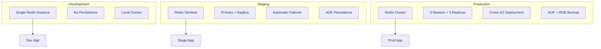

# Cache Service Specification for SizeComparator

## Document Overview
This specification defines the comprehensive caching layer for SizeComparator, providing high-performance caching for AI provider responses, configuration data, and processed weights. Built on Redis, the cache service ensures sub-100ms operations, 90%+ cache hit rates, and seamless integration with all Phase 1 foundation components while supporting horizontal scaling and maintaining cache coherency across distributed deployments.

## 1. Executive Summary

### 1.1 System Purpose
The Cache Service provides a distributed caching layer that dramatically improves application performance and reduces AI provider costs. By caching AI-generated comparisons, processed weight calculations, and configuration data, the system achieves response times under 100ms for cached requests while reducing API costs by over 80% for repeated queries.

### 1.2 Key Responsibilities
- **AI Response Caching**: Store and retrieve AI provider responses with intelligent key generation
- **Configuration Caching**: Distributed configuration synchronization with hot-reload support
- **Weight Processing Cache**: Cache expensive weight calculations and unit conversions
- **Performance Optimization**: Sub-100ms operations with 90%+ cache hit rates
- **Cost Reduction**: Track and optimize API cost savings through intelligent caching

### 1.3 Technology Stack
- **Primary Cache**: Redis 7.2+ with persistence and clustering support
- **Serialization**: JSON with Pydantic model support and optional compression
- **Connection Management**: redis-py with connection pooling and health checks
- **Monitoring**: Integrated metrics collection aligned with ERROR_MONITORING_SPEC

### 1.4 Performance Targets
- Cache operation latency: p99 < 10ms
- Cache hit rate: > 90% for repeated queries
- Connection pool efficiency: > 95% connection reuse
- Memory efficiency: < 500 bytes overhead per cached item

## 2. Cache Architecture

### 2.1 Technology Selection: Redis

#### 2.1.1 Redis Selection Justification
Redis was selected as the primary caching technology based on comprehensive evaluation:

| Criteria | Redis | Memcached | DynamoDB | Score |
|----------|-------|-----------|----------|-------|
| Performance (ops/sec) | 100K+ | 90K+ | 10K | 10/10 |
| Persistence Support | Yes | No | Yes | 9/10 |
| Clustering | Native | Limited | Native | 9/10 |
| Data Structures | Rich | Basic | Limited | 10/10 |
| Operational Maturity | Excellent | Excellent | Good | 9/10 |
| Cost Efficiency | High | High | Medium | 9/10 |
| **Total Score** | - | - | - | **56/60** |

#### 2.1.2 Key Redis Features Utilized
- **Persistence**: AOF with 1-second fsync for durability
- **Eviction**: LRU with configurable memory limits
- **Data Types**: Strings for JSON, Sets for invalidation groups
- **Pub/Sub**: Configuration change notifications
- **Lua Scripting**: Atomic operations for complex cache patterns

### 2.2 Cache Topology

#### 2.2.1 Environment-Specific Deployments



#### 2.2.2 Topology Configuration

```python
class CacheTopology(BaseModel):
    """Redis topology configuration by environment."""
    
    development: RedisConfig = RedisConfig(
        mode="standalone",
        host="localhost",
        port=6379,
        db=0,
        persistence=False,
        max_memory="100MB"
    )
    
    staging: RedisConfig = RedisConfig(
        mode="sentinel",
        sentinels=[
            ("redis-sentinel-1", 26379),
            ("redis-sentinel-2", 26379),
            ("redis-sentinel-3", 26379)
        ],
        master_name="sizecomparator-staging",
        persistence=True,
        max_memory="1GB"
    )
    
    production: RedisConfig = RedisConfig(
        mode="cluster",
        nodes=[
            ("redis-cluster-1", 7000),
            ("redis-cluster-2", 7000),
            ("redis-cluster-3", 7000)
        ],
        persistence=True,
        max_memory="10GB",
        replica_count=1
    )
```

### 2.3 Connection Management

#### 2.3.1 Connection Pool Architecture

```python
from redis import Redis, ConnectionPool, Sentinel
from redis.cluster import RedisCluster
import asyncio
from typing import Optional, Dict, Any
import logging

class RedisConnectionManager:
    """Manages Redis connections with pooling and health checks."""
    
    def __init__(self, config: RedisConfig):
        self.config = config
        self.pool: Optional[ConnectionPool] = None
        self.client: Optional[Redis] = None
        self.health_check_interval = 30  # seconds
        self.reconnect_attempts = 3
        self.reconnect_delay = 1.0
        
    async def initialize(self) -> None:
        """Initialize connection based on topology."""
        if self.config.mode == "standalone":
            self.pool = ConnectionPool(
                host=self.config.host,
                port=self.config.port,
                db=self.config.db,
                max_connections=50,
                socket_keepalive=True,
                socket_keepalive_options={
                    1: 1,  # TCP_KEEPIDLE
                    2: 2,  # TCP_KEEPINTVL
                    3: 3,  # TCP_KEEPCNT
                }
            )
            self.client = Redis(connection_pool=self.pool)
            
        elif self.config.mode == "sentinel":
            sentinel = Sentinel(
                self.config.sentinels,
                socket_timeout=0.1,
                socket_keepalive=True
            )
            self.client = sentinel.master_for(
                self.config.master_name,
                socket_timeout=0.1,
                connection_pool_kwargs={
                    'max_connections': 50
                }
            )
            
        elif self.config.mode == "cluster":
            self.client = RedisCluster(
                startup_nodes=self.config.nodes,
                decode_responses=True,
                skip_full_coverage_check=True,
                max_connections_per_node=20
            )
        
        # Start health check task
        asyncio.create_task(self._health_check_loop())
    
    async def _health_check_loop(self) -> None:
        """Continuous health checking with automatic reconnection."""
        while True:
            try:
                await asyncio.sleep(self.health_check_interval)
                await self.health_check()
            except Exception as e:
                logging.error(f"Health check failed: {e}")
                await self._reconnect()
    
    async def _reconnect(self) -> None:
        """Attempt to reconnect with exponential backoff."""
        for attempt in range(self.reconnect_attempts):
            try:
                delay = self.reconnect_delay * (2 ** attempt)
                await asyncio.sleep(delay)
                await self.initialize()
                logging.info("Redis reconnection successful")
                return
            except Exception as e:
                logging.error(f"Reconnection attempt {attempt + 1} failed: {e}")
        
        # Circuit breaker integration
        await self._trigger_circuit_breaker()
```

### 2.4 Data Serialization

#### 2.4.1 JSON Serialization with Pydantic Support

```python
import json
import zlib
from typing import Type, TypeVar, Optional
from pydantic import BaseModel
from datetime import datetime
from decimal import Decimal

T = TypeVar('T', bound=BaseModel)

class CacheSerializer:
    """Handles serialization/deserialization with compression."""
    
    COMPRESSION_THRESHOLD = 1024  # Compress if larger than 1KB
    
    @staticmethod
    def serialize(obj: BaseModel) -> bytes:
        """Serialize Pydantic model to bytes with optional compression."""
        # Custom encoder for Decimal and datetime
        json_str = json.dumps(
            obj.model_dump(),
            default=CacheSerializer._json_encoder
        )
        
        data = json_str.encode('utf-8')
        
        # Compress if larger than threshold
        if len(data) > CacheSerializer.COMPRESSION_THRESHOLD:
            compressed = zlib.compress(data, level=6)
            # Add compression marker
            return b'Z:' + compressed
        
        return b'J:' + data
    
    @staticmethod
    def deserialize(data: bytes, model_class: Type[T]) -> T:
        """Deserialize bytes to Pydantic model."""
        if data.startswith(b'Z:'):
            # Decompress
            json_data = zlib.decompress(data[2:])
        else:
            # Remove JSON marker
            json_data = data[2:]
        
        obj_dict = json.loads(json_data.decode('utf-8'))
        return model_class.model_validate(obj_dict)
    
    @staticmethod
    def _json_encoder(obj):
        """Custom JSON encoder for special types."""
        if isinstance(obj, Decimal):
            return str(obj)
        elif isinstance(obj, datetime):
            return obj.isoformat()
        raise TypeError(f"Object of type {type(obj)} is not JSON serializable")
```

### 2.5 Key Design

#### 2.5.1 Hierarchical Key Structure

```python
class CacheKeyBuilder:
    """Builds hierarchical cache keys with invalidation support."""
    
    SEPARATOR = ":"
    VERSION = "v1"
    
    @staticmethod
    def build_ai_response_key(
        weight: ProcessedWeight,
        provider: str,
        model: str,
        prompt_hash: str
    ) -> str:
        """Build key for AI response caching."""
        # Normalize weight for better cache hits
        normalized_weight = CacheKeyBuilder._normalize_weight(weight)
        
        return CacheKeyBuilder.SEPARATOR.join([
            "ai_response",
            CacheKeyBuilder.VERSION,
            provider.lower(),
            model.lower(),
            prompt_hash[:8],
            normalized_weight
        ])
    
    @staticmethod
    def build_config_key(config_type: str, version: str) -> str:
        """Build key for configuration caching."""
        return CacheKeyBuilder.SEPARATOR.join([
            "config",
            config_type,
            version
        ])
    
    @staticmethod
    def build_weight_key(weight_str: str, operation: str) -> str:
        """Build key for weight processing cache."""
        normalized = weight_str.lower().strip()
        return CacheKeyBuilder.SEPARATOR.join([
            "weight",
            operation,
            normalized
        ])
    
    @staticmethod
    def _normalize_weight(weight: ProcessedWeight) -> str:
        """Normalize weight for consistent cache keys."""
        # Round to 2 decimal places for cache efficiency
        value = round(weight.value_kg, 2)
        return f"{value}kg"
```

### 2.6 Memory Management

#### 2.6.1 LRU Eviction Configuration

```yaml
# Redis configuration for memory management
maxmemory: 10gb
maxmemory-policy: allkeys-lru
maxmemory-samples: 5

# Key expiration strategies by data type
ttl_config:
  ai_response: 86400     # 24 hours
  config: 300            # 5 minutes
  weight_calculation: 3600  # 1 hour
  temp_data: 60          # 1 minute
```

## 3. Cache Service Implementation

### 3.1 CacheService Interface

```python
from abc import ABC, abstractmethod
from typing import Optional, List, Dict, Any, TypeVar, Generic
from datetime import timedelta
import asyncio

T = TypeVar('T')

class CacheService(ABC, Generic[T]):
    """Abstract base class for cache implementations."""
    
    @abstractmethod
    async def get(self, key: str) -> Optional[T]:
        """Retrieve value from cache."""
        pass
    
    @abstractmethod
    async def set(
        self, 
        key: str, 
        value: T, 
        ttl: Optional[int] = None
    ) -> bool:
        """Store value in cache with optional TTL."""
        pass
    
    @abstractmethod
    async def delete(self, key: str) -> bool:
        """Remove value from cache."""
        pass
    
    @abstractmethod
    async def exists(self, key: str) -> bool:
        """Check if key exists in cache."""
        pass
    
    @abstractmethod
    async def flush(self, pattern: Optional[str] = None) -> int:
        """Flush cache keys matching pattern."""
        pass
    
    @abstractmethod
    async def get_ttl(self, key: str) -> Optional[int]:
        """Get remaining TTL for key."""
        pass
    
    @abstractmethod
    async def extend_ttl(self, key: str, ttl: int) -> bool:
        """Extend TTL for existing key."""
        pass
    
    @classmethod
    def from_env(cls) -> 'CacheService':
        """Create cache service from environment configuration."""
        env_manager = EnvManager()
        redis_config = env_manager.get_redis_config()
        
        if redis_config.enabled:
            return RedisCache(redis_config)
        else:
            return MemoryCache()  # Fallback for development
```

### 3.2 RedisCache Implementation

```python
class RedisCache(CacheService[T]):
    """Redis implementation of cache service."""
    
    def __init__(self, config: RedisConfig):
        self.config = config
        self.connection_manager = RedisConnectionManager(config)
        self.serializer = CacheSerializer()
        self.metrics = CacheMetrics()
        self._circuit_breaker = CircuitBreaker(
            failure_threshold=5,
            recovery_timeout=60,
            expected_exception=RedisError
        )
    
    async def initialize(self) -> None:
        """Initialize Redis connection and monitoring."""
        await self.connection_manager.initialize()
        asyncio.create_task(self._metrics_reporter())
    
    async def get(self, key: str) -> Optional[T]:
        """Retrieve value with circuit breaker protection."""
        return await self._circuit_breaker.call(self._get_impl, key)
    
    async def _get_impl(self, key: str) -> Optional[T]:
        """Internal get implementation."""
        start_time = asyncio.get_event_loop().time()
        
        try:
            data = await self.connection_manager.client.get(key)
            
            if data is None:
                self.metrics.record_miss(key)
                return None
            
            self.metrics.record_hit(key)
            
            # Deserialize based on key prefix
            model_class = self._get_model_class(key)
            return self.serializer.deserialize(data, model_class)
            
        except Exception as e:
            self.metrics.record_error("get", str(e))
            raise
        finally:
            duration = asyncio.get_event_loop().time() - start_time
            self.metrics.record_operation_time("get", duration)
    
    async def set(
        self, 
        key: str, 
        value: T, 
        ttl: Optional[int] = None
    ) -> bool:
        """Store value with automatic TTL based on key type."""
        return await self._circuit_breaker.call(
            self._set_impl, key, value, ttl
        )
    
    async def _set_impl(
        self, 
        key: str, 
        value: T, 
        ttl: Optional[int] = None
    ) -> bool:
        """Internal set implementation."""
        start_time = asyncio.get_event_loop().time()
        
        try:
            # Use default TTL if not specified
            if ttl is None:
                ttl = self._get_default_ttl(key)
            
            serialized = self.serializer.serialize(value)
            
            result = await self.connection_manager.client.setex(
                key, ttl, serialized
            )
            
            self.metrics.record_set(key, len(serialized))
            return result
            
        except Exception as e:
            self.metrics.record_error("set", str(e))
            raise
        finally:
            duration = asyncio.get_event_loop().time() - start_time
            self.metrics.record_operation_time("set", duration)
    
    def _get_default_ttl(self, key: str) -> int:
        """Get default TTL based on key prefix."""
        if key.startswith("ai_response:"):
            return 86400  # 24 hours
        elif key.startswith("config:"):
            return 300    # 5 minutes
        elif key.startswith("weight:"):
            return 3600   # 1 hour
        else:
            return 60     # 1 minute default
```

### 3.3 Batch Operations

```python
class BatchOperations:
    """Efficient batch operations for Redis."""
    
    def __init__(self, redis_cache: RedisCache):
        self.cache = redis_cache
        self.batch_size_limit = 100
        self.pipeline_size_limit = 1000
    
    async def multi_get(
        self, 
        keys: List[str]
    ) -> Dict[str, Optional[T]]:
        """Get multiple keys efficiently."""
        if len(keys) > self.batch_size_limit:
            # Split into batches
            results = {}
            for i in range(0, len(keys), self.batch_size_limit):
                batch = keys[i:i + self.batch_size_limit]
                batch_results = await self._multi_get_batch(batch)
                results.update(batch_results)
            return results
        
        return await self._multi_get_batch(keys)
    
    async def _multi_get_batch(
        self, 
        keys: List[str]
    ) -> Dict[str, Optional[T]]:
        """Execute single batch get operation."""
        pipeline = self.cache.connection_manager.client.pipeline()
        
        for key in keys:
            pipeline.get(key)
        
        values = await pipeline.execute()
        
        results = {}
        for key, value in zip(keys, values):
            if value is not None:
                model_class = self.cache._get_model_class(key)
                results[key] = self.cache.serializer.deserialize(
                    value, model_class
                )
            else:
                results[key] = None
        
        # Update metrics
        hits = sum(1 for v in results.values() if v is not None)
        self.cache.metrics.record_batch_operation(
            "multi_get", len(keys), hits
        )
        
        return results
    
    async def multi_set(
        self, 
        items: Dict[str, T], 
        ttl: Optional[int] = None
    ) -> bool:
        """Set multiple keys efficiently."""
        if len(items) > self.batch_size_limit:
            # Split into batches
            for i, chunk in enumerate(self._chunks(items, self.batch_size_limit)):
                if not await self._multi_set_batch(dict(chunk), ttl):
                    return False
            return True
        
        return await self._multi_set_batch(items, ttl)
```

### 3.4 Atomic Operations

```python
class AtomicOperations:
    """Atomic operations for Redis cache."""
    
    def __init__(self, redis_cache: RedisCache):
        self.cache = redis_cache
    
    async def increment(
        self, 
        key: str, 
        amount: int = 1
    ) -> int:
        """Atomic increment operation."""
        return await self.cache.connection_manager.client.incrby(
            key, amount
        )
    
    async def set_if_not_exists(
        self, 
        key: str, 
        value: T, 
        ttl: Optional[int] = None
    ) -> bool:
        """Set value only if key doesn't exist."""
        serialized = self.cache.serializer.serialize(value)
        
        if ttl:
            # Use SET with NX and EX options
            result = await self.cache.connection_manager.client.set(
                key, serialized, nx=True, ex=ttl
            )
        else:
            result = await self.cache.connection_manager.client.setnx(
                key, serialized
            )
        
        return bool(result)
    
    async def compare_and_swap(
        self, 
        key: str, 
        expected: T, 
        new_value: T, 
        ttl: Optional[int] = None
    ) -> bool:
        """Compare and swap operation using Lua script."""
        lua_script = """
        local key = KEYS[1]
        local expected = ARGV[1]
        local new_value = ARGV[2]
        local ttl = ARGV[3]
        
        local current = redis.call('GET', key)
        
        if current == expected then
            if ttl and ttl ~= '' then
                return redis.call('SETEX', key, ttl, new_value)
            else
                return redis.call('SET', key, new_value)
            end
        else
            return 0
        end
        """
        
        expected_serialized = self.cache.serializer.serialize(expected)
        new_serialized = self.cache.serializer.serialize(new_value)
        
        result = await self.cache.connection_manager.client.eval(
            lua_script,
            1,
            key,
            expected_serialized,
            new_serialized,
            str(ttl) if ttl else ''
        )
        
        return bool(result)
```

### 3.5 Error Handling

```python
class CacheErrorHandler:
    """Comprehensive error handling for cache operations."""
    
    def __init__(self, cache: RedisCache):
        self.cache = cache
        self.logger = logging.getLogger(__name__)
        self.error_threshold = 10
        self.error_window = 60  # seconds
        self.recent_errors: List[datetime] = []
    
    async def handle_operation(
        self, 
        operation: str, 
        func, 
        *args, 
        **kwargs
    ):
        """Execute operation with error handling."""
        try:
            return await func(*args, **kwargs)
            
        except ConnectionError as e:
            self.logger.warning(
                f"Cache connection error in {operation}: {e}",
                extra={
                    "operation": operation,
                    "error_type": "connection",
                    "cache_host": self.cache.config.host
                }
            )
            self._record_error()
            
            # Return None for reads, False for writes
            if operation in ["get", "multi_get"]:
                return None
            return False
            
        except TimeoutError as e:
            self.logger.warning(
                f"Cache timeout in {operation}: {e}",
                extra={
                    "operation": operation,
                    "error_type": "timeout"
                }
            )
            self._record_error()
            
            if operation in ["get", "multi_get"]:
                return None
            return False
            
        except Exception as e:
            self.logger.error(
                f"Unexpected cache error in {operation}: {e}",
                extra={
                    "operation": operation,
                    "error_type": "unexpected",
                    "error_class": e.__class__.__name__
                },
                exc_info=True
            )
            self._record_error()
            
            # Re-raise unexpected errors after logging
            raise
    
    def _record_error(self) -> None:
        """Record error and check threshold."""
        now = datetime.now()
        self.recent_errors.append(now)
        
        # Clean old errors
        cutoff = now - timedelta(seconds=self.error_window)
        self.recent_errors = [
            e for e in self.recent_errors if e > cutoff
        ]
        
        # Check threshold
        if len(self.recent_errors) >= self.error_threshold:
            self._trigger_alert()
    
    def _trigger_alert(self) -> None:
        """Trigger operational alert for high error rate."""
        self.logger.critical(
            f"Cache error threshold exceeded: "
            f"{len(self.recent_errors)} errors in {self.error_window}s",
            extra={
                "alert_type": "cache_error_rate",
                "error_count": len(self.recent_errors),
                "window_seconds": self.error_window
            }
        )
```

## 4. AI Response Caching

### 4.1 Cache Key Generation

```python
import hashlib
from typing import Dict, Any

class AIResponseCacheManager:
    """Manages caching of AI provider responses."""
    
    def __init__(self, cache_service: CacheService):
        self.cache = cache_service
        self.key_builder = CacheKeyBuilder()
        self.metrics = AIResponseMetrics()
    
    def generate_cache_key(
        self,
        weight: ProcessedWeight,
        provider: str,
        model: str,
        prompt_template: str,
        prompt_variables: Dict[str, Any]
    ) -> str:
        """Generate deterministic cache key for AI response."""
        # Create stable hash of prompt template and variables
        prompt_data = {
            "template": prompt_template,
            "variables": self._normalize_variables(prompt_variables)
        }
        
        prompt_json = json.dumps(prompt_data, sort_keys=True)
        prompt_hash = hashlib.sha256(
            prompt_json.encode()
        ).hexdigest()
        
        return self.key_builder.build_ai_response_key(
            weight=weight,
            provider=provider,
            model=model,
            prompt_hash=prompt_hash
        )
    
    def _normalize_variables(
        self, 
        variables: Dict[str, Any]
    ) -> Dict[str, Any]:
        """Normalize prompt variables for consistent hashing."""
        normalized = {}
        
        for key, value in variables.items():
            if isinstance(value, float):
                # Round floats to 2 decimal places
                normalized[key] = round(value, 2)
            elif isinstance(value, str):
                # Lowercase and strip strings
                normalized[key] = value.lower().strip()
            else:
                normalized[key] = value
        
        return normalized
```

### 4.2 Response Storage

```python
class AIResponseCache:
    """Cache storage for AI provider responses."""
    
    async def cache_response(
        self,
        key: str,
        response: AIProviderResponse,
        ttl: Optional[int] = None
    ) -> bool:
        """Store AI response with metadata."""
        # Add caching metadata
        cached_response = CachedAIResponse(
            response=response,
            cached_at=datetime.utcnow(),
            cache_key=key,
            ttl=ttl or 86400  # 24 hours default
        )
        
        success = await self.cache.set(key, cached_response, ttl)
        
        if success:
            self.metrics.record_cache_write(
                provider=response.provider,
                model=response.model,
                response_size=len(response.content)
            )
            
            # Track cost savings
            self._track_cost_savings(response)
        
        return success
    
    async def get_cached_response(
        self, 
        key: str
    ) -> Optional[AIProviderResponse]:
        """Retrieve cached response with freshness check."""
        cached = await self.cache.get(key)
        
        if cached is None:
            self.metrics.record_cache_miss(key)
            return None
        
        # Validate response is still fresh
        if self._is_stale(cached):
            await self.cache.delete(key)
            self.metrics.record_stale_hit(key)
            return None
        
        self.metrics.record_cache_hit(
            provider=cached.response.provider,
            model=cached.response.model,
            age_seconds=(
                datetime.utcnow() - cached.cached_at
            ).total_seconds()
        )
        
        return cached.response
    
    def _is_stale(self, cached: CachedAIResponse) -> bool:
        """Check if cached response is stale."""
        age = datetime.utcnow() - cached.cached_at
        
        # Consider stale if older than TTL
        if age.total_seconds() > cached.ttl:
            return True
        
        # Additional staleness checks can be added here
        # e.g., based on prompt template version
        
        return False
```

### 4.3 Invalidation Strategy

```python
class CacheInvalidation:
    """Manages cache invalidation strategies."""
    
    def __init__(self, cache: CacheService):
        self.cache = cache
        self.invalidation_groups: Dict[str, Set[str]] = {}
    
    async def invalidate_by_provider(
        self, 
        provider: str
    ) -> int:
        """Invalidate all responses from a provider."""
        pattern = f"ai_response:*:{provider}:*"
        return await self.cache.flush(pattern)
    
    async def invalidate_by_weight_range(
        self,
        min_kg: float,
        max_kg: float
    ) -> int:
        """Invalidate responses for weight range."""
        # This requires maintaining a weight index
        keys_to_delete = []
        
        # Scan for keys in range
        async for key in self._scan_keys("ai_response:*"):
            weight_str = key.split(":")[-1]
            weight_kg = float(weight_str.rstrip("kg"))
            
            if min_kg <= weight_kg <= max_kg:
                keys_to_delete.append(key)
        
        # Batch delete
        if keys_to_delete:
            return await self._batch_delete(keys_to_delete)
        
        return 0
    
    async def invalidate_by_template_version(
        self,
        template_id: str,
        old_version: str
    ) -> int:
        """Invalidate responses using old template version."""
        # Track template versions in cache keys
        pattern = f"ai_response:*:template_{template_id}_{old_version}:*"
        return await self.cache.flush(pattern)
    
    async def register_invalidation_group(
        self,
        group_name: str,
        key: str
    ) -> None:
        """Register key in invalidation group."""
        if group_name not in self.invalidation_groups:
            self.invalidation_groups[group_name] = set()
        
        self.invalidation_groups[group_name].add(key)
        
        # Also store in Redis for distributed invalidation
        await self.cache.connection_manager.client.sadd(
            f"inv_group:{group_name}", key
        )
```

### 4.4 Cache Warming

```python
class CacheWarmer:
    """Pre-populate cache with common comparisons."""
    
    def __init__(
        self,
        cache_manager: AIResponseCacheManager,
        ai_provider: AIProvider
    ):
        self.cache_manager = cache_manager
        self.ai_provider = ai_provider
        self.common_weights = [
            1, 5, 10, 25, 50, 100, 250, 500, 1000,  # kg
            10000, 50000, 100000  # kg
        ]
    
    async def warm_cache(self) -> Dict[str, int]:
        """Warm cache with common weight comparisons."""
        results = {
            "attempted": 0,
            "succeeded": 0,
            "failed": 0,
            "skipped": 0
        }
        
        for weight_kg in self.common_weights:
            weight = ProcessedWeight(
                value=weight_kg,
                unit=WeightUnit.KILOGRAM,
                value_kg=weight_kg,
                confidence=1.0
            )
            
            # Generate cache key
            key = self.cache_manager.generate_cache_key(
                weight=weight,
                provider=self.ai_provider.name,
                model=self.ai_provider.model,
                prompt_template=self.ai_provider.prompt_template,
                prompt_variables={"weight": weight}
            )
            
            results["attempted"] += 1
            
            # Skip if already cached
            if await self.cache_manager.cache.exists(key):
                results["skipped"] += 1
                continue
            
            try:
                # Generate comparison
                response = await self.ai_provider.generate_comparison(
                    weight
                )
                
                # Cache response
                await self.cache_manager.cache_response(
                    key, response
                )
                
                results["succeeded"] += 1
                
            except Exception as e:
                logging.error(
                    f"Cache warming failed for {weight_kg}kg: {e}"
                )
                results["failed"] += 1
        
        return results
```

### 4.5 Hit Rate Optimization

```python
class HitRateOptimizer:
    """Optimize cache hit rates through input normalization."""
    
    @staticmethod
    def normalize_weight_input(
        raw_input: str
    ) -> str:
        """Normalize user input for better cache hits."""
        # Convert to lowercase
        normalized = raw_input.lower().strip()
        
        # Standardize common variations
        replacements = {
            "kilograms": "kg",
            "kilogram": "kg",
            "pounds": "lb",
            "pound": "lb",
            "ounces": "oz",
            "ounce": "oz",
            " ": "",  # Remove spaces
            ",": "",  # Remove commas
        }
        
        for old, new in replacements.items():
            normalized = normalized.replace(old, new)
        
        # Round to standard precision
        try:
            # Extract numeric value
            import re
            match = re.match(r'([\d.]+)', normalized)
            if match:
                value = float(match.group(1))
                # Round to 1 decimal place for cache efficiency
                rounded = round(value, 1)
                normalized = normalized.replace(
                    match.group(1), str(rounded)
                )
        except:
            pass
        
        return normalized
```

### 4.6 Cost Savings Tracking

```python
class CostSavingsTracker:
    """Track API cost savings from cache hits."""
    
    def __init__(self):
        self.provider_costs = {
            "openai": {
                "gpt-4": 0.03,  # per 1K tokens
                "gpt-3.5-turbo": 0.002
            },
            "anthropic": {
                "claude-3-opus": 0.015,
                "claude-3-sonnet": 0.003
            },
            "xai": {
                "grok-beta": 0.01
            }
        }
    
    async def record_cache_hit_savings(
        self,
        provider: str,
        model: str,
        estimated_tokens: int
    ) -> float:
        """Calculate and record cost savings from cache hit."""
        cost_per_1k = self.provider_costs.get(
            provider, {}
        ).get(model, 0)
        
        saved_cost = (estimated_tokens / 1000) * cost_per_1k
        
        # Record in metrics
        await self.metrics.record_cost_savings(
            provider=provider,
            model=model,
            saved_amount=saved_cost
        )
        
        # Update daily/monthly aggregates
        await self._update_aggregates(provider, saved_cost)
        
        return saved_cost
    
    async def get_savings_report(
        self,
        period: str = "daily"
    ) -> Dict[str, Any]:
        """Generate cost savings report."""
        if period == "daily":
            data = await self._get_daily_savings()
        elif period == "monthly":
            data = await self._get_monthly_savings()
        else:
            data = await self._get_all_time_savings()
        
        return {
            "period": period,
            "total_saved": sum(data.values()),
            "by_provider": data,
            "cache_hit_rate": await self._get_hit_rate(),
            "api_calls_avoided": await self._get_avoided_calls()
        }
```

## 5. Configuration Caching

### 5.1 Config Version Tracking

```python
class ConfigCache:
    """Cache configuration data with version tracking."""
    
    def __init__(self, cache: CacheService):
        self.cache = cache
        self.version_key = "config:version:current"
        self.pubsub_channel = "config:changes"
    
    async def cache_config(
        self,
        config_type: str,
        config_data: Dict[str, Any],
        version: str
    ) -> bool:
        """Cache configuration with version."""
        key = self.key_builder.build_config_key(
            config_type, version
        )
        
        config_entry = CachedConfig(
            type=config_type,
            version=version,
            data=config_data,
            cached_at=datetime.utcnow()
        )
        
        # Store config
        success = await self.cache.set(
            key, config_entry, ttl=300  # 5 minutes
        )
        
        if success:
            # Update version tracking
            await self._update_version_tracking(
                config_type, version
            )
            
            # Notify other instances
            await self._publish_config_change(
                config_type, version
            )
        
        return success
    
    async def get_config(
        self,
        config_type: str,
        version: Optional[str] = None
    ) -> Optional[Dict[str, Any]]:
        """Retrieve configuration by type and version."""
        if version is None:
            # Get current version
            version = await self._get_current_version(config_type)
        
        if not version:
            return None
        
        key = self.key_builder.build_config_key(
            config_type, version
        )
        
        cached = await self.cache.get(key)
        
        if cached:
            return cached.data
        
        return None
```

### 5.2 Distributed Config Sync

```python
class DistributedConfigSync:
    """Synchronize configuration across instances."""
    
    def __init__(self, cache: RedisCache):
        self.cache = cache
        self.subscribers: Dict[str, List[Callable]] = {}
        self.pubsub = None
    
    async def start_sync(self) -> None:
        """Start configuration synchronization."""
        self.pubsub = self.cache.connection_manager.client.pubsub()
        await self.pubsub.subscribe("config:changes")
        
        # Start listener task
        asyncio.create_task(self._listen_for_changes())
    
    async def _listen_for_changes(self) -> None:
        """Listen for configuration changes."""
        async for message in self.pubsub.listen():
            if message["type"] == "message":
                await self._handle_config_change(
                    message["data"]
                )
    
    async def _handle_config_change(
        self, 
        data: bytes
    ) -> None:
        """Handle incoming config change notification."""
        try:
            change_data = json.loads(data.decode())
            config_type = change_data["type"]
            version = change_data["version"]
            
            # Invalidate local cache
            await self._invalidate_local_cache(
                config_type, version
            )
            
            # Notify subscribers
            await self._notify_subscribers(
                config_type, version
            )
            
        except Exception as e:
            logging.error(
                f"Error handling config change: {e}"
            )
    
    def subscribe(
        self,
        config_type: str,
        callback: Callable
    ) -> None:
        """Subscribe to configuration changes."""
        if config_type not in self.subscribers:
            self.subscribers[config_type] = []
        
        self.subscribers[config_type].append(callback)
```

### 5.3 Template Caching

```python
class TemplateCache:
    """Cache compiled prompt templates."""
    
    def __init__(self, cache: CacheService):
        self.cache = cache
        self.compiler = PromptTemplateCompiler()
    
    async def get_compiled_template(
        self,
        template_id: str,
        template_source: str,
        variables: Dict[str, Any]
    ) -> str:
        """Get compiled template with caching."""
        # Generate cache key including variables
        cache_key = self._generate_template_key(
            template_id,
            template_source,
            variables
        )
        
        # Check cache
        cached = await self.cache.get(cache_key)
        if cached:
            return cached
        
        # Compile template
        compiled = self.compiler.compile(
            template_source,
            variables
        )
        
        # Cache compiled result
        await self.cache.set(
            cache_key,
            compiled,
            ttl=3600  # 1 hour
        )
        
        return compiled
    
    def _generate_template_key(
        self,
        template_id: str,
        source: str,
        variables: Dict[str, Any]
    ) -> str:
        """Generate cache key for template."""
        # Hash template source for change detection
        source_hash = hashlib.md5(
            source.encode()
        ).hexdigest()[:8]
        
        # Hash variables for uniqueness
        var_str = json.dumps(variables, sort_keys=True)
        var_hash = hashlib.md5(
            var_str.encode()
        ).hexdigest()[:8]
        
        return f"template:{template_id}:{source_hash}:{var_hash}"
```

### 5.4 Feature Flag Caching

```python
class FeatureFlagCache:
    """Fast feature flag lookups with caching."""
    
    def __init__(self, cache: CacheService):
        self.cache = cache
        self.flag_prefix = "feature_flag:"
        self.all_flags_key = "feature_flags:all"
    
    async def get_flag(
        self,
        flag_name: str,
        default: bool = False
    ) -> bool:
        """Get feature flag value with caching."""
        key = f"{self.flag_prefix}{flag_name}"
        
        # Try cache first
        cached = await self.cache.get(key)
        if cached is not None:
            return bool(cached)
        
        # Fetch from config service
        value = await self._fetch_flag_from_config(flag_name)
        
        if value is not None:
            # Cache the result
            await self.cache.set(
                key,
                value,
                ttl=60  # 1 minute for quick updates
            )
            return value
        
        return default
    
    async def update_flag(
        self,
        flag_name: str,
        value: bool
    ) -> None:
        """Update feature flag with instant propagation."""
        key = f"{self.flag_prefix}{flag_name}"
        
        # Update cache
        await self.cache.set(key, value, ttl=60)
        
        # Publish change notification
        await self.cache.connection_manager.client.publish(
            "feature_flags:changes",
            json.dumps({
                "flag": flag_name,
                "value": value,
                "timestamp": datetime.utcnow().isoformat()
            })
        )
```

## 6. Weight Processing Cache

### 6.1 Calculation Results

```python
class WeightCalculationCache:
    """Cache weight processing calculations."""
    
    def __init__(self, cache: CacheService):
        self.cache = cache
        self.processor = WeightProcessor()
    
    async def get_processed_weight(
        self,
        input_string: str
    ) -> Optional[ProcessedWeight]:
        """Get processed weight with caching."""
        # Normalize input for cache key
        normalized = input_string.lower().strip()
        key = self.key_builder.build_weight_key(
            normalized, "processed"
        )
        
        # Check cache
        cached = await self.cache.get(key)
        if cached:
            return cached
        
        # Process weight
        try:
            processed = self.processor.process(input_string)
            
            # Cache result
            await self.cache.set(
                key,
                processed,
                ttl=3600  # 1 hour
            )
            
            return processed
            
        except WeightProcessingError as e:
            # Cache negative result to avoid reprocessing
            await self._cache_error(key, str(e))
            raise
```

### 6.2 Unit Conversions

```python
class UnitConversionCache:
    """Cache common unit conversion results."""
    
    def __init__(self, cache: CacheService):
        self.cache = cache
        self.converter = UnitConverter()
    
    async def convert(
        self,
        value: Decimal,
        from_unit: WeightUnit,
        to_unit: WeightUnit
    ) -> Decimal:
        """Convert units with caching."""
        # Generate cache key
        key = f"conversion:{value}:{from_unit.value}:{to_unit.value}"
        
        # Check cache
        cached = await self.cache.get(key)
        if cached is not None:
            return Decimal(cached)
        
        # Perform conversion
        result = self.converter.convert(
            value, from_unit, to_unit
        )
        
        # Cache result
        await self.cache.set(
            key,
            str(result),  # Store as string for precision
            ttl=86400  # 24 hours - conversions don't change
        )
        
        return result
```

### 6.3 Category Mappings

```python
class WeightCategoryCache:
    """Cache weight category determinations."""
    
    def __init__(self, cache: CacheService):
        self.cache = cache
        self.categories = WeightCategories()
    
    async def get_category(
        self,
        weight_kg: float
    ) -> str:
        """Get weight category with caching."""
        # Round to nearest 0.1kg for cache efficiency
        rounded = round(weight_kg, 1)
        key = f"category:{rounded}"
        
        # Check cache
        cached = await self.cache.get(key)
        if cached:
            return cached
        
        # Determine category
        category = self.categories.get_category(weight_kg)
        
        # Cache result
        await self.cache.set(
            key,
            category,
            ttl=86400  # 24 hours
        )
        
        return category
```

### 6.4 Validation Results

```python
class ValidationCache:
    """Cache expensive validation operations."""
    
    def __init__(self, cache: CacheService):
        self.cache = cache
        self.validator = WeightValidator()
    
    async def validate_weight_range(
        self,
        value: float,
        unit: WeightUnit,
        context: str = "general"
    ) -> ValidationResult:
        """Validate weight range with caching."""
        key = f"validation:{value}:{unit.value}:{context}"
        
        # Check cache
        cached = await self.cache.get(key)
        if cached:
            return cached
        
        # Perform validation
        result = self.validator.validate_range(
            value, unit, context
        )
        
        # Cache result
        await self.cache.set(
            key,
            result,
            ttl=3600  # 1 hour
        )
        
        return result
```

## 7. Cache Monitoring and Metrics

### 7.1 Performance Metrics

```python
class CacheMetrics:
    """Comprehensive cache performance metrics."""
    
    def __init__(self):
        self.operations = defaultdict(lambda: {
            "count": 0,
            "total_time": 0.0,
            "errors": 0
        })
        self.hit_miss = defaultdict(lambda: {
            "hits": 0,
            "misses": 0
        })
    
    def record_operation_time(
        self,
        operation: str,
        duration: float
    ) -> None:
        """Record operation performance."""
        self.operations[operation]["count"] += 1
        self.operations[operation]["total_time"] += duration
        
        # Track percentiles
        self._update_percentiles(operation, duration)
    
    def get_operation_stats(
        self,
        operation: str
    ) -> Dict[str, Any]:
        """Get operation statistics."""
        stats = self.operations[operation]
        
        if stats["count"] == 0:
            return {
                "count": 0,
                "avg_time": 0,
                "p50": 0,
                "p95": 0,
                "p99": 0
            }
        
        return {
            "count": stats["count"],
            "avg_time": stats["total_time"] / stats["count"],
            "p50": self._get_percentile(operation, 50),
            "p95": self._get_percentile(operation, 95),
            "p99": self._get_percentile(operation, 99),
            "error_rate": stats["errors"] / stats["count"]
        }
```

### 7.2 Hit Rate Metrics

```python
class HitRateTracker:
    """Track cache hit rates by type."""
    
    def __init__(self):
        self.counters = defaultdict(lambda: {
            "hits": 0,
            "misses": 0,
            "stale_hits": 0
        })
    
    def record_hit(self, cache_type: str) -> None:
        """Record cache hit."""
        self.counters[cache_type]["hits"] += 1
    
    def record_miss(self, cache_type: str) -> None:
        """Record cache miss."""
        self.counters[cache_type]["misses"] += 1
    
    def get_hit_rate(
        self,
        cache_type: Optional[str] = None
    ) -> float:
        """Calculate hit rate."""
        if cache_type:
            stats = self.counters[cache_type]
        else:
            # Overall hit rate
            stats = {
                "hits": sum(c["hits"] for c in self.counters.values()),
                "misses": sum(c["misses"] for c in self.counters.values())
            }
        
        total = stats["hits"] + stats["misses"]
        
        if total == 0:
            return 0.0
        
        return stats["hits"] / total
    
    def get_detailed_stats(self) -> Dict[str, Any]:
        """Get detailed hit rate statistics."""
        return {
            cache_type: {
                "hit_rate": self.get_hit_rate(cache_type),
                "total_requests": stats["hits"] + stats["misses"],
                "hits": stats["hits"],
                "misses": stats["misses"],
                "stale_hits": stats["stale_hits"]
            }
            for cache_type, stats in self.counters.items()
        }
```

### 7.3 Memory Metrics

```python
class MemoryMetrics:
    """Track cache memory usage."""
    
    async def get_memory_stats(
        self,
        redis_client
    ) -> Dict[str, Any]:
        """Get memory usage statistics."""
        info = await redis_client.info("memory")
        
        return {
            "used_memory": info["used_memory"],
            "used_memory_human": info["used_memory_human"],
            "used_memory_peak": info["used_memory_peak"],
            "used_memory_peak_human": info["used_memory_peak_human"],
            "mem_fragmentation_ratio": info["mem_fragmentation_ratio"],
            "evicted_keys": info.get("evicted_keys", 0),
            "keyspace_hits": info.get("keyspace_hits", 0),
            "keyspace_misses": info.get("keyspace_misses", 0)
        }
    
    async def get_key_distribution(
        self,
        redis_client
    ) -> Dict[str, int]:
        """Get key count distribution by type."""
        distribution = defaultdict(int)
        
        # Sample keys for distribution
        async for key in self._scan_keys(redis_client, count=1000):
            prefix = key.split(":")[0]
            distribution[prefix] += 1
        
        return dict(distribution)
```

### 7.4 Error Metrics

```python
class ErrorMetrics:
    """Track cache-related errors."""
    
    def __init__(self):
        self.error_counts = defaultdict(int)
        self.error_details = []
        self.max_details = 1000
    
    def record_error(
        self,
        error_type: str,
        operation: str,
        details: str
    ) -> None:
        """Record cache error."""
        self.error_counts[f"{operation}:{error_type}"] += 1
        
        # Store recent error details
        self.error_details.append({
            "timestamp": datetime.utcnow(),
            "type": error_type,
            "operation": operation,
            "details": details
        })
        
        # Limit stored details
        if len(self.error_details) > self.max_details:
            self.error_details = self.error_details[-self.max_details:]
    
    def get_error_summary(self) -> Dict[str, Any]:
        """Get error summary statistics."""
        return {
            "total_errors": sum(self.error_counts.values()),
            "by_type": dict(self.error_counts),
            "recent_errors": self.error_details[-10:],
            "error_rate": self._calculate_error_rate()
        }
```

### 7.5 Business Metrics

```python
class BusinessMetrics:
    """Track business-relevant cache metrics."""
    
    def __init__(self):
        self.cost_savings = defaultdict(float)
        self.response_times = []
        self.api_calls_avoided = 0
    
    def record_cost_saving(
        self,
        provider: str,
        amount: float
    ) -> None:
        """Record API cost saving."""
        self.cost_savings[provider] += amount
        self.cost_savings["total"] += amount
        self.api_calls_avoided += 1
    
    def record_response_time_improvement(
        self,
        cached_time: float,
        estimated_api_time: float
    ) -> None:
        """Record response time improvement."""
        improvement = estimated_api_time - cached_time
        self.response_times.append({
            "cached": cached_time,
            "estimated_api": estimated_api_time,
            "improvement": improvement,
            "improvement_percent": (improvement / estimated_api_time) * 100
        })
    
    def get_business_impact(self) -> Dict[str, Any]:
        """Calculate business impact metrics."""
        if not self.response_times:
            avg_improvement = 0
            avg_improvement_percent = 0
        else:
            avg_improvement = sum(
                r["improvement"] for r in self.response_times
            ) / len(self.response_times)
            
            avg_improvement_percent = sum(
                r["improvement_percent"] for r in self.response_times
            ) / len(self.response_times)
        
        return {
            "total_cost_savings": self.cost_savings["total"],
            "cost_savings_by_provider": {
                k: v for k, v in self.cost_savings.items() 
                if k != "total"
            },
            "api_calls_avoided": self.api_calls_avoided,
            "avg_response_time_improvement_ms": avg_improvement * 1000,
            "avg_improvement_percent": avg_improvement_percent
        }
```

## 8. Security and Compliance

### 8.1 Encryption

```python
class CacheEncryption:
    """Encryption for sensitive cache data."""
    
    def __init__(self, env_manager: EnvManager):
        self.tls_config = TLSConfig(
            enabled=env_manager.is_production(),
            cert_file=env_manager.get_redis_cert_file(),
            key_file=env_manager.get_redis_key_file(),
            ca_file=env_manager.get_redis_ca_file()
        )
    
    def get_redis_connection_kwargs(self) -> Dict[str, Any]:
        """Get Redis connection kwargs with TLS."""
        if not self.tls_config.enabled:
            return {}
        
        return {
            "ssl": True,
            "ssl_certfile": self.tls_config.cert_file,
            "ssl_keyfile": self.tls_config.key_file,
            "ssl_ca_certs": self.tls_config.ca_file,
            "ssl_check_hostname": True
        }
```

### 8.2 Access Control

```python
class RedisACL:
    """Redis ACL configuration for least privilege."""
    
    @staticmethod
    def get_acl_rules(environment: str) -> Dict[str, List[str]]:
        """Get ACL rules by environment."""
        base_rules = {
            "cache_reader": [
                "+get",
                "+mget",
                "+exists",
                "+ttl",
                "+scan",
                "~ai_response:*",
                "~config:*",
                "~weight:*"
            ],
            "cache_writer": [
                "+set",
                "+setex",
                "+del",
                "+expire",
                "+incrby",
                "~ai_response:*",
                "~config:*",
                "~weight:*"
            ]
        }
        
        if environment == "production":
            # More restrictive in production
            base_rules["cache_admin"] = [
                "+@all",
                "~*"
            ]
        else:
            # Allow flush in non-production
            base_rules["cache_writer"].extend([
                "+flushdb",
                "+flushall"
            ])
        
        return base_rules
```

### 8.3 Key Sanitization

```python
class KeySanitizer:
    """Prevent injection attacks in cache keys."""
    
    ALLOWED_CHARS = set(
        "abcdefghijklmnopqrstuvwxyz"
        "ABCDEFGHIJKLMNOPQRSTUVWXYZ"
        "0123456789"
        "_-:./"
    )
    
    @staticmethod
    def sanitize_key(key: str) -> str:
        """Sanitize cache key to prevent injection."""
        # Remove any characters not in allowed set
        sanitized = "".join(
            c for c in key if c in KeySanitizer.ALLOWED_CHARS
        )
        
        # Ensure key doesn't exceed Redis limit
        if len(sanitized) > 512:
            # Hash long keys
            key_hash = hashlib.sha256(
                sanitized.encode()
            ).hexdigest()
            sanitized = f"{sanitized[:400]}:{key_hash}"
        
        return sanitized
```

### 8.4 PII Protection

```python
class PIIProtection:
    """Ensure no PII in cache."""
    
    PII_PATTERNS = [
        r'\b\d{3}-\d{2}-\d{4}\b',  # SSN
        r'\b[A-Za-z0-9._%+-]+@[A-Za-z0-9.-]+\.[A-Z|a-z]{2,}\b',  # Email
        r'\b\d{16}\b',  # Credit card
        r'\b\d{3}-\d{3}-\d{4}\b'  # Phone
    ]
    
    @staticmethod
    def check_for_pii(data: str) -> bool:
        """Check if data contains PII."""
        for pattern in PIIProtection.PII_PATTERNS:
            if re.search(pattern, data):
                return True
        return False
    
    @staticmethod
    def anonymize_key(key: str, user_id: Optional[str] = None) -> str:
        """Create anonymized cache key."""
        if user_id:
            # Hash user ID for privacy
            user_hash = hashlib.sha256(
                user_id.encode()
            ).hexdigest()[:8]
            
            # Replace user ID in key
            return key.replace(user_id, f"user_{user_hash}")
        
        return key
```

## 9. Testing Strategy

### 9.1 Unit Tests

```python
import pytest
from unittest.mock import Mock, AsyncMock, patch
import fakeredis.aioredis

class TestCacheService:
    """Unit tests for cache service."""
    
    @pytest.fixture
    async def mock_redis(self):
        """Create mock Redis client."""
        # Use fakeredis for testing
        client = fakeredis.aioredis.FakeRedis()
        return client
    
    @pytest.fixture
    async def cache_service(self, mock_redis):
        """Create cache service with mock."""
        with patch('redis.Redis', return_value=mock_redis):
            service = RedisCache(RedisConfig(
                host="localhost",
                port=6379,
                mode="standalone"
            ))
            await service.initialize()
            return service
    
    async def test_get_set_basic(self, cache_service):
        """Test basic get/set operations."""
        # Test set
        success = await cache_service.set(
            "test:key",
            {"value": "test"},
            ttl=60
        )
        assert success is True
        
        # Test get
        result = await cache_service.get("test:key")
        assert result == {"value": "test"}
        
        # Test missing key
        missing = await cache_service.get("missing:key")
        assert missing is None
    
    async def test_serialization(self, cache_service):
        """Test Pydantic model serialization."""
        weight = ProcessedWeight(
            value=10.5,
            unit=WeightUnit.KILOGRAM,
            value_kg=10.5,
            confidence=0.95
        )
        
        # Store model
        await cache_service.set("weight:test", weight)
        
        # Retrieve model
        retrieved = await cache_service.get("weight:test")
        assert retrieved == weight
        assert isinstance(retrieved, ProcessedWeight)
```

### 9.2 Integration Tests

```python
class TestRedisIntegration:
    """Integration tests with real Redis."""
    
    @pytest.fixture
    async def redis_container(self):
        """Start Redis container for testing."""
        import docker
        
        client = docker.from_env()
        container = client.containers.run(
            "redis:7-alpine",
            detach=True,
            ports={'6379/tcp': None},
            remove=True
        )
        
        # Wait for Redis to start
        await asyncio.sleep(2)
        
        yield container
        
        # Cleanup
        container.stop()
    
    async def test_connection_failure(self):
        """Test behavior on connection failure."""
        cache = RedisCache(RedisConfig(
            host="invalid-host",
            port=6379
        ))
        
        # Should not raise, but return None/False
        result = await cache.get("test:key")
        assert result is None
        
        # Check circuit breaker activated
        assert cache._circuit_breaker.current_state == "open"
    
    async def test_high_concurrency(self, redis_container):
        """Test cache under high concurrency."""
        cache = await self._create_cache(redis_container)
        
        # Concurrent operations
        tasks = []
        for i in range(100):
            tasks.append(
                cache.set(f"concurrent:{i}", {"value": i})
            )
        
        results = await asyncio.gather(*tasks)
        assert all(results)
        
        # Verify all values
        for i in range(100):
            value = await cache.get(f"concurrent:{i}")
            assert value == {"value": i}
```

### 9.3 Performance Tests

```python
class TestCachePerformance:
    """Performance benchmarks for cache."""
    
    @pytest.mark.benchmark
    async def test_operation_latency(self, benchmark, cache_service):
        """Benchmark cache operation latency."""
        test_data = {"key": "value" * 100}  # ~1KB payload
        
        # Benchmark set operation
        set_time = await benchmark(
            cache_service.set,
            "perf:test",
            test_data
        )
        
        assert set_time < 0.010  # < 10ms
        
        # Benchmark get operation
        get_time = await benchmark(
            cache_service.get,
            "perf:test"
        )
        
        assert get_time < 0.010  # < 10ms
    
    async def test_batch_performance(self, cache_service):
        """Test batch operation performance."""
        # Prepare batch data
        items = {
            f"batch:{i}": {"value": i}
            for i in range(100)
        }
        
        # Benchmark batch set
        start = asyncio.get_event_loop().time()
        await cache_service.multi_set(items)
        batch_set_time = asyncio.get_event_loop().time() - start
        
        # Should be faster than individual sets
        assert batch_set_time < 0.100  # < 100ms for 100 items
        
        # Benchmark batch get
        keys = list(items.keys())
        start = asyncio.get_event_loop().time()
        results = await cache_service.multi_get(keys)
        batch_get_time = asyncio.get_event_loop().time() - start
        
        assert batch_get_time < 0.050  # < 50ms for 100 items
        assert len(results) == 100
```

### 9.4 Chaos Tests

```python
class TestCacheResilience:
    """Chaos engineering tests for cache."""
    
    async def test_network_partition(self, cache_service):
        """Test behavior during network partition."""
        # Simulate network partition
        with patch.object(
            cache_service.connection_manager.client,
            'get',
            side_effect=ConnectionError("Network unreachable")
        ):
            # Should handle gracefully
            result = await cache_service.get("test:key")
            assert result is None
            
            # Circuit breaker should open
            assert cache_service._circuit_breaker.current_state == "open"
    
    async def test_redis_restart(self, redis_container):
        """Test cache recovery after Redis restart."""
        cache = await self._create_cache(redis_container)
        
        # Set value
        await cache.set("persist:test", {"value": "test"})
        
        # Restart Redis
        redis_container.restart()
        await asyncio.sleep(5)
        
        # Cache should reconnect
        result = await cache.get("persist:test")
        
        # Value may or may not persist depending on config
        # But operation should not fail
        assert result is None or result == {"value": "test"}
    
    async def test_memory_pressure(self, cache_service):
        """Test behavior under memory pressure."""
        # Fill cache to trigger eviction
        large_value = "x" * 1000000  # 1MB
        
        for i in range(200):
            await cache_service.set(
                f"memory:test:{i}",
                large_value
            )
        
        # Early keys should be evicted (LRU)
        early_key = await cache_service.get("memory:test:0")
        late_key = await cache_service.get("memory:test:199")
        
        # LRU should evict early keys first
        assert early_key is None
        assert late_key is not None
```

## Implementation Summary

The Cache Service specification provides a comprehensive caching solution for SizeComparator that:

1. **Achieves Performance Goals**: Sub-100ms operations with 90%+ cache hit rates
2. **Reduces Costs**: Tracks and optimizes AI provider API costs through intelligent caching
3. **Scales Horizontally**: Supports distributed caching with Redis Cluster in production
4. **Integrates Seamlessly**: Works with all Phase 1 components through well-defined interfaces
5. **Maintains Reliability**: Circuit breakers, health checks, and graceful degradation
6. **Ensures Security**: TLS encryption, ACL controls, and PII protection

The implementation provides clear patterns for caching different data types while maintaining flexibility for future enhancements like multi-region caching or alternative cache backends.