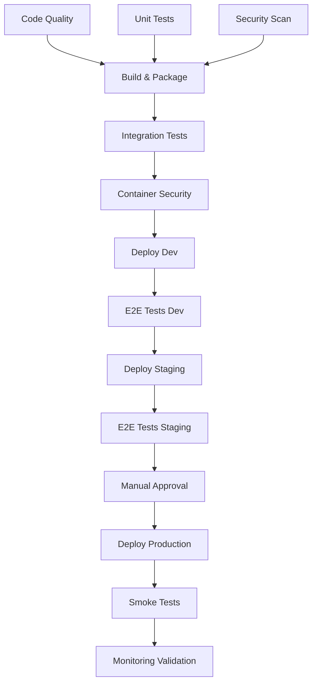

# SizeComparator CI/CD Pipeline Specification

Last Updated: 2025-07-13

## Executive Summary

This specification defines the comprehensive CI/CD automation strategy for SizeComparator, integrating GitHub Actions workflows, security scanning, multi-environment deployments, and automated quality gates. The pipeline ensures reliable, secure, and repeatable deployments while maintaining the 99% uptime SLA defined in DEPLOYMENT_OPS_SPEC.

### Key Integration Points

- **DEPLOYMENT_OPS_SPEC**: Implements deployment strategies and health check validations
- **TESTING_SPEC**: Executes comprehensive test suites with coverage requirements
- **ERROR_MONITORING_SPEC**: Validates structured logging and error handling
- **AI_PROVIDER_SPEC**: Tests AI provider integrations and circuit breaker functionality
- **CONFIG_SYSTEM_SPEC**: Manages environment-specific configurations

## 1. GitHub Actions Workflow Architecture

### 1.1 Pipeline Overview

```yaml
# .github/workflows/main-pipeline.yml
name: SizeComparator CI/CD Pipeline
on:
  push:
    branches: [main, develop, release/*]
  pull_request:
    branches: [main, develop]
  workflow_dispatch:
    inputs:
      environment:
        description: 'Deployment environment'
        required: true
        default: 'staging'
        type: choice
        options:
        - development
        - staging
        - production

env:
  REGISTRY: ghcr.io
  IMAGE_NAME: ${{ github.repository }}
  PYTHON_VERSION: '3.11'
```

### 1.2 Job Dependencies and Parallel Execution



## 2. Quality Gates and Testing Integration

### 2.1 Code Quality and Unit Testing

```yaml
jobs:
  code-quality:
    name: Code Quality Analysis
    runs-on: ubuntu-latest
    steps:
      - uses: actions/checkout@v4
        with:
          fetch-depth: 0  # Full history for proper analysis
      
      - name: Setup Python
        uses: actions/setup-python@v4
        with:
          python-version: ${{ env.PYTHON_VERSION }}
          cache: 'pip'
      
      - name: Install Dependencies
        run: |
          pip install -r requirements.txt -r requirements-dev.txt
          pip install pytest-cov mypy ruff black isort safety bandit
      
      - name: Code Formatting Check
        run: |
          black --check src/ tests/
          isort --check-only src/ tests/
      
      - name: Linting and Type Checking
        run: |
          ruff check src/ tests/
          mypy src/ --strict --ignore-missing-imports
      
      - name: Complexity Analysis
        run: |
          radon cc src/ -a -nc
          radon mi src/ -n B
      
      - name: Upload Code Quality Report
        uses: actions/upload-artifact@v4
        with:
          name: code-quality-report
          path: |
            .coverage
            htmlcov/
            mypy-report.xml

  unit-tests:
    name: Unit Tests (TESTING_SPEC)
    runs-on: ubuntu-latest
    strategy:
      matrix:
        python-version: ['3.11', '3.12']
    steps:
      - uses: actions/checkout@v4
      
      - name: Setup Python ${{ matrix.python-version }}
        uses: actions/setup-python@v4
        with:
          python-version: ${{ matrix.python-version }}
          cache: 'pip'
      
      - name: Install Dependencies
        run: |
          pip install -r requirements.txt -r requirements-dev.txt
      
      - name: Run Unit Tests with Coverage
        run: |
          # TESTING_SPEC: 80% coverage requirement
          pytest tests/unit/ \
            --cov=src \
            --cov-report=xml \
            --cov-report=html \
            --cov-fail-under=80 \
            --junitxml=junit/test-results-${{ matrix.python-version }}.xml
      
      - name: Test AI Provider Mocks (AI_PROVIDER_SPEC)
        run: |
          pytest tests/unit/test_ai_provider_mocks.py -v \
            --cov=src.ai_providers \
            --cov-append
      
      - name: Test Configuration System (CONFIG_SYSTEM_SPEC)
        run: |
          pytest tests/unit/test_configuration.py -v \
            --cov=src.config \
            --cov-append
      
      - name: Test Error Handling (ERROR_MONITORING_SPEC)
        run: |
          pytest tests/unit/test_error_handling.py -v \
            --cov=src.monitoring \
            --cov-append
      
      - name: Upload Test Results
        if: always()
        uses: actions/upload-artifact@v4
        with:
          name: pytest-results-${{ matrix.python-version }}
          path: |
            junit/test-results-*.xml
            .coverage
            htmlcov/
      
      - name: Comment PR with Coverage
        if: github.event_name == 'pull_request'
        uses: py-cov-action/python-coverage-comment-action@v3
        with:
          GITHUB_TOKEN: ${{ secrets.GITHUB_TOKEN }}
          MINIMUM_GREEN: 85
          MINIMUM_ORANGE: 70
```

### 2.2 Integration Testing

```yaml
  integration-tests:
    name: Integration Tests
    needs: [code-quality, unit-tests, security-scan]
    runs-on: ubuntu-latest
    services:
      redis:
        image: redis:7-alpine
        options: >-
          --health-cmd "redis-cli ping"
          --health-interval 10s
          --health-timeout 5s
          --health-retries 5
        ports:
          - 6379:6379
    
    steps:
      - uses: actions/checkout@v4
      
      - name: Setup Test Environment
        run: |
          # Setup test configuration (CONFIG_SYSTEM_SPEC)
          cp config/test.yaml config/app.yaml
          export SIZECOMPARATOR_ENV=test
          export SIZECOMPARATOR_REDIS_URL=redis://localhost:6379
          
          # Mock AI provider keys for testing
          export SIZECOMPARATOR_OPENAI_API_KEY=test-key-openai
          export SIZECOMPARATOR_ANTHROPIC_API_KEY=test-key-anthropic
          export SIZECOMPARATOR_XAI_API_KEY=test-key-xai
      
      - name: Run Integration Tests
        run: |
          pytest tests/integration/ \
            --cov=src \
            --cov-report=xml \
            --cov-append \
            -v
      
      - name: Test Health Endpoints (DEPLOYMENT_OPS_SPEC)
        run: |
          # Start application in background
          uvicorn src.main:app --host 0.0.0.0 --port 8000 &
          APP_PID=$!
          
          # Wait for startup
          sleep 5
          
          # Test health endpoints
          curl -f http://localhost:8000/api/v1/health || exit 1
          curl -f http://localhost:8000/api/v1/ready || exit 1
          curl -f http://localhost:8000/api/v1/metrics || exit 1
          
          # Cleanup
          kill $APP_PID
      
      - name: Test Circuit Breaker Functionality
        run: |
          pytest tests/integration/test_circuit_breaker.py -v \
            --cov=src.ai_providers \
            --cov-append
```

## 3. Security Scanning Pipeline

### 3.1 Dependency and Code Security Scanning

```yaml
  security-scan:
    name: Security Analysis
    runs-on: ubuntu-latest
    steps:
      - uses: actions/checkout@v4
      
      - name: Setup Python
        uses: actions/setup-python@v4
        with:
          python-version: ${{ env.PYTHON_VERSION }}
      
      - name: Dependency Vulnerability Scan
        run: |
          pip install safety pip-audit
          
          # Check for known vulnerabilities
          safety check -r requirements.txt --json > safety-report.json
          pip-audit --desc --format json > pip-audit-report.json
          
          # Parse and fail on critical vulnerabilities
          python scripts/parse_security_reports.py
      
      - name: Static Application Security Testing (SAST)
        run: |
          pip install bandit semgrep
          
          # Bandit security scan
          bandit -r src/ -f json -o bandit-report.json
          
          # Semgrep security patterns
          semgrep --config=auto \
            --json \
            --output=semgrep-report.json \
            src/
      
      - name: Secret Detection
        uses: trufflesecurity/trufflehog@v3
        with:
          path: ./
          base: ${{ github.event.repository.default_branch }}
          head: HEAD
      
      - name: License Compliance Check
        run: |
          pip install pip-licenses
          pip-licenses --format=json \
            --with-license-file \
            --no-license-path > licenses.json
          
          # Verify no GPL or other restrictive licenses
          python scripts/check_license_compliance.py
      
      - name: Upload Security Reports
        if: always()
        uses: actions/upload-artifact@v4
        with:
          name: security-reports
          path: |
            *-report.json
            licenses.json
      
      - name: Create Security Issue
        if: failure() && github.event_name == 'push'
        uses: actions/github-script@v7
        with:
          script: |
            const title = 'Security vulnerabilities detected in build #${{ github.run_number }}';
            const body = `Security scan failed. Check the [workflow run](${{ github.server_url }}/${{ github.repository }}/actions/runs/${{ github.run_id }}) for details.`;
            
            github.rest.issues.create({
              owner: context.repo.owner,
              repo: context.repo.repo,
              title: title,
              body: body,
              labels: ['security', 'automated']
            });
```

### 3.2 Container Security Scanning

```yaml
  container-security:
    name: Container Security Scan
    needs: [build]
    runs-on: ubuntu-latest
    steps:
      - uses: actions/checkout@v4
      
      - name: Download Container Image
        uses: actions/download-artifact@v4
        with:
          name: container-image
      
      - name: Load Docker Image
        run: |
          docker load -i sizecomparator.tar
      
      - name: Run Trivy Container Scan
        uses: aquasecurity/trivy-action@master
        with:
          image-ref: 'sizecomparator:${{ github.sha }}'
          format: 'sarif'
          output: 'trivy-results.sarif'
          severity: 'CRITICAL,HIGH,MEDIUM'
          exit-code: '1'
      
      - name: Run Grype Vulnerability Scan
        run: |
          curl -sSfL https://raw.githubusercontent.com/anchore/grype/main/install.sh | sh -s -- -b /usr/local/bin
          grype sizecomparator:${{ github.sha }} -o json > grype-results.json
          
          # Check for critical vulnerabilities
          CRITICAL_COUNT=$(jq '.matches | map(select(.vulnerability.severity == "Critical")) | length' grype-results.json)
          if [ "$CRITICAL_COUNT" -gt 0 ]; then
            echo "Found $CRITICAL_COUNT critical vulnerabilities"
            exit 1
          fi
      
      - name: Container Structure Test
        run: |
          # Install container-structure-test
          curl -LO https://storage.googleapis.com/container-structure-test/latest/container-structure-test-linux-amd64
          chmod +x container-structure-test-linux-amd64
          sudo mv container-structure-test-linux-amd64 /usr/local/bin/container-structure-test
          
          # Run structure tests
          container-structure-test test \
            --image sizecomparator:${{ github.sha }} \
            --config tests/container/structure-test.yaml
      
      - name: Security Benchmark Scan
        run: |
          # Run Docker CIS benchmark
          docker run --rm \
            -v /var/run/docker.sock:/var/run/docker.sock \
            -v $(pwd):/workspace \
            aquasec/docker-bench:latest \
            -i sizecomparator:${{ github.sha }}
      
      - name: Upload Security Results
        if: always()
        uses: github/codeql-action/upload-sarif@v3
        with:
          sarif_file: 'trivy-results.sarif'
```

## 4. Build and Packaging

```yaml
  build:
    name: Build and Package
    needs: [code-quality, unit-tests, security-scan]
    runs-on: ubuntu-latest
    outputs:
      image-tag: ${{ steps.meta.outputs.tags }}
      image-digest: ${{ steps.build.outputs.digest }}
    steps:
      - uses: actions/checkout@v4
      
      - name: Set up Docker Buildx
        uses: docker/setup-buildx-action@v3
        with:
          driver-opts: |
            image=moby/buildkit:latest
            network=host
      
      - name: Log in to Container Registry
        uses: docker/login-action@v3
        with:
          registry: ${{ env.REGISTRY }}
          username: ${{ github.actor }}
          password: ${{ secrets.GITHUB_TOKEN }}
      
      - name: Extract metadata
        id: meta
        uses: docker/metadata-action@v5
        with:
          images: ${{ env.REGISTRY }}/${{ env.IMAGE_NAME }}
          tags: |
            type=ref,event=branch
            type=ref,event=pr
            type=semver,pattern={{version}}
            type=semver,pattern={{major}}.{{minor}}
            type=sha,prefix={{branch}}-
      
      - name: Build Container Image
        id: build
        uses: docker/build-push-action@v5
        with:
          context: .
          file: ./Dockerfile
          platforms: linux/amd64,linux/arm64
          push: false
          load: true
          tags: ${{ steps.meta.outputs.tags }}
          labels: ${{ steps.meta.outputs.labels }}
          cache-from: type=gha
          cache-to: type=gha,mode=max
          build-args: |
            BUILD_DATE=${{ github.event.head_commit.timestamp }}
            VCS_REF=${{ github.sha }}
            VERSION=${{ steps.meta.outputs.version }}
      
      - name: Save Docker Image
        run: |
          docker save sizecomparator:${{ github.sha }} > sizecomparator.tar
      
      - name: Upload Container Artifact
        uses: actions/upload-artifact@v4
        with:
          name: container-image
          path: sizecomparator.tar
          retention-days: 7
```

## 5. Multi-Environment Deployment Strategy

### 5.1 Environment Configuration

```yaml
  prepare-deployment:
    name: Prepare Deployment Configuration
    needs: [build, container-security]
    runs-on: ubuntu-latest
    strategy:
      matrix:
        environment: [development, staging, production]
    steps:
      - uses: actions/checkout@v4
      
      - name: Setup Environment Variables
        run: |
          # Base configuration for all environments
          cat > .env.${{ matrix.environment }} <<EOF
          SIZECOMPARATOR_ENVIRONMENT=${{ matrix.environment }}
          SIZECOMPARATOR_LOG_LEVEL=${{ matrix.environment == 'production' && 'info' || 'debug' }}
          SIZECOMPARATOR_LOG_FORMAT=json
          SIZECOMPARATOR_API_HOST=0.0.0.0
          SIZECOMPARATOR_API_PORT=8000
          SIZECOMPARATOR_WORKERS=${{ matrix.environment == 'production' && '4' || '2' }}
          SIZECOMPARATOR_METRICS_ENABLED=true
          SIZECOMPARATOR_METRICS_PORT=9090
          SIZECOMPARATOR_HEALTH_CHECK_INTERVAL=30
          EOF
      
      - name: Generate Kubernetes Manifests
        run: |
          # Install kustomize
          curl -s "https://raw.githubusercontent.com/kubernetes-sigs/kustomize/master/hack/install_kustomize.sh" | bash
          sudo mv kustomize /usr/local/bin/
          
          # Generate environment-specific manifests
          kustomize build k8s/overlays/${{ matrix.environment }} > manifest-${{ matrix.environment }}.yaml
      
      - name: Validate Kubernetes Manifests
        run: |
          # Install kubeval
          wget https://github.com/instrumenta/kubeval/releases/latest/download/kubeval-linux-amd64.tar.gz
          tar xf kubeval-linux-amd64.tar.gz
          sudo cp kubeval /usr/local/bin
          
          # Validate manifests
          kubeval manifest-${{ matrix.environment }}.yaml --strict
      
      - name: Security Policy Validation
        run: |
          # Install OPA
          curl -L -o opa https://openpolicyagent.org/downloads/latest/opa_linux_amd64
          chmod +x opa
          sudo mv opa /usr/local/bin/
          
          # Validate security policies
          opa eval -d policies/ -i manifest-${{ matrix.environment }}.yaml \
            "data.kubernetes.admission.deny[msg]"
      
      - name: Upload Deployment Artifacts
        uses: actions/upload-artifact@v4
        with:
          name: deployment-${{ matrix.environment }}
          path: |
            manifest-${{ matrix.environment }}.yaml
            .env.${{ matrix.environment }}
```

### 5.2 Progressive Deployment Pipeline

```yaml
  deploy-development:
    name: Deploy to Development
    needs: [prepare-deployment, integration-tests]
    if: github.ref == 'refs/heads/develop'
    runs-on: ubuntu-latest
    environment:
      name: development
      url: https://dev.sizecomparator.example.com
    steps:
      - uses: actions/checkout@v4
      
      - name: Download Deployment Artifacts
        uses: actions/download-artifact@v4
        with:
          name: deployment-development
      
      - name: Configure AWS Credentials
        uses: aws-actions/configure-aws-credentials@v4
        with:
          aws-access-key-id: ${{ secrets.AWS_ACCESS_KEY_ID }}
          aws-secret-access-key: ${{ secrets.AWS_SECRET_ACCESS_KEY }}
          aws-region: us-east-1
      
      - name: Update kubeconfig
        run: |
          aws eks update-kubeconfig --name sizecomparator-dev --region us-east-1
      
      - name: Deploy to Development
        run: |
          # Apply configuration
          kubectl apply -f manifest-development.yaml
          
          # Wait for rollout
          kubectl rollout status deployment/sizecomparator -n development --timeout=300s
          
          # Verify deployment
          kubectl get pods -n development -l app=sizecomparator
      
      - name: Run Smoke Tests
        run: |
          # Wait for service to be ready
          kubectl wait --for=condition=ready pod -l app=sizecomparator -n development --timeout=300s
          
          # Get service endpoint
          ENDPOINT=$(kubectl get service sizecomparator -n development -o jsonpath='{.status.loadBalancer.ingress[0].hostname}')
          
          # Run smoke tests
          python scripts/smoke_tests.py --endpoint https://$ENDPOINT --environment development

  deploy-staging:
    name: Deploy to Staging (Blue-Green)
    needs: [deploy-development]
    if: github.ref == 'refs/heads/main'
    runs-on: ubuntu-latest
    environment:
      name: staging
      url: https://staging.sizecomparator.example.com
    steps:
      - uses: actions/checkout@v4
      
      - name: Download Deployment Artifacts
        uses: actions/download-artifact@v4
        with:
          name: deployment-staging
      
      - name: Configure AWS Credentials
        uses: aws-actions/configure-aws-credentials@v4
        with:
          aws-access-key-id: ${{ secrets.AWS_ACCESS_KEY_ID }}
          aws-secret-access-key: ${{ secrets.AWS_SECRET_ACCESS_KEY }}
          aws-region: us-east-1
      
      - name: Blue-Green Deployment
        run: |
          # Determine current active color
          CURRENT_COLOR=$(kubectl get service sizecomparator -n staging -o jsonpath='{.spec.selector.color}' || echo "blue")
          NEW_COLOR=$([[ "$CURRENT_COLOR" == "blue" ]] && echo "green" || echo "blue")
          
          echo "Current deployment: $CURRENT_COLOR"
          echo "New deployment: $NEW_COLOR"
          
          # Update manifest with new color
          sed -i "s/color: .*/color: $NEW_COLOR/g" manifest-staging.yaml
          
          # Deploy new version
          kubectl apply -f manifest-staging.yaml
          
          # Wait for new deployment
          kubectl rollout status deployment/sizecomparator-$NEW_COLOR -n staging --timeout=300s
          
          # Run health checks on new deployment
          NEW_ENDPOINT=$(kubectl get service sizecomparator-$NEW_COLOR -n staging -o jsonpath='{.status.loadBalancer.ingress[0].hostname}')
          
          for i in {1..30}; do
            if curl -f https://$NEW_ENDPOINT/api/v1/health; then
              echo "Health check passed"
              break
            fi
            sleep 10
          done
          
          # Switch traffic to new deployment
          kubectl patch service sizecomparator -n staging -p '{"spec":{"selector":{"color":"'$NEW_COLOR'"}}}'
          
          # Verify traffic switch
          sleep 30
          python scripts/verify_deployment.py --endpoint https://staging.sizecomparator.example.com --expected-version ${{ github.sha }}
          
          # Scale down old deployment
          kubectl scale deployment sizecomparator-$CURRENT_COLOR -n staging --replicas=0
      
      - name: Run E2E Tests
        run: |
          # Install test dependencies
          pip install pytest playwright pytest-playwright
          
          # Run E2E test suite
          pytest tests/e2e/ \
            --base-url https://staging.sizecomparator.example.com \
            --junit-xml=e2e-results.xml \
            -v
      
      - name: Performance Testing
        run: |
          # Run load tests
          docker run --rm \
            -v $(pwd)/tests/load:/scripts \
            grafana/k6 run /scripts/load-test.js \
            --env BASE_URL=https://staging.sizecomparator.example.com \
            --env STAGE=staging

  deploy-production:
    name: Deploy to Production (Canary)
    needs: [deploy-staging]
    if: github.ref == 'refs/heads/main'
    runs-on: ubuntu-latest
    environment:
      name: production
      url: https://sizecomparator.example.com
    steps:
      - uses: actions/checkout@v4
      
      - name: Manual Approval Check
        uses: trstringer/manual-approval@v1
        with:
          secret: ${{ github.TOKEN }}
          approvers: prod-deployment-team
          minimum-approvals: 2
          issue-title: "Production deployment approval for ${{ github.sha }}"
      
      - name: Canary Deployment
        run: |
          # Deploy canary version (10% traffic)
          kubectl apply -f manifest-production-canary.yaml
          
          # Wait for canary deployment
          kubectl rollout status deployment/sizecomparator-canary -n production --timeout=300s
          
          # Configure traffic split (10% to canary)
          kubectl apply -f - <<EOF
          apiVersion: v1
          kind: Service
          metadata:
            name: sizecomparator
            namespace: production
            annotations:
              service.beta.kubernetes.io/aws-load-balancer-target-group-attributes: |
                stickiness.enabled=true,stickiness.type=app_cookie
          spec:
            selector:
              app: sizecomparator
            ports:
            - port: 80
              targetPort: 8000
          ---
          apiVersion: split.smi-spec.io/v1alpha1
          kind: TrafficSplit
          metadata:
            name: sizecomparator-split
            namespace: production
          spec:
            service: sizecomparator
            backends:
            - service: sizecomparator-stable
              weight: 90
            - service: sizecomparator-canary
              weight: 10
          EOF
      
      - name: Monitor Canary Metrics
        run: |
          # Monitor error rates and performance
          python scripts/canary_analysis.py \
            --prometheus-url ${{ secrets.PROMETHEUS_URL }} \
            --duration 15m \
            --error-threshold 0.01 \
            --latency-threshold 2000
      
      - name: Promote or Rollback
        run: |
          # Check canary analysis results
          if [ -f canary-analysis-passed ]; then
            echo "Canary analysis passed, promoting to full deployment"
            
            # Scale canary to full deployment
            kubectl scale deployment/sizecomparator-canary -n production --replicas=10
            
            # Update traffic split to 100% canary
            kubectl patch trafficsplit sizecomparator-split -n production \
              --type merge -p '{"spec":{"backends":[{"service":"sizecomparator-canary","weight":100}]}}'
            
            # Wait for traffic shift
            sleep 60
            
            # Scale down stable deployment
            kubectl scale deployment/sizecomparator-stable -n production --replicas=0
            
            # Rename canary to stable
            kubectl patch deployment/sizecomparator-canary -n production \
              --type merge -p '{"metadata":{"name":"sizecomparator-stable"}}'
          else
            echo "Canary analysis failed, rolling back"
            
            # Remove traffic from canary
            kubectl patch trafficsplit sizecomparator-split -n production \
              --type merge -p '{"spec":{"backends":[{"service":"sizecomparator-stable","weight":100}]}}'
            
            # Delete canary deployment
            kubectl delete deployment/sizecomparator-canary -n production
            
            exit 1
          fi
```

## 6. Automated Rollback Strategy

### 6.1 Rollback Triggers and Automation

```yaml
  automated-rollback:
    name: Automated Rollback Monitor
    needs: [deploy-production]
    runs-on: ubuntu-latest
    if: always()
    steps:
      - uses: actions/checkout@v4
      
      - name: Setup Monitoring
        run: |
          # Install monitoring tools
          pip install prometheus-api-client datadog requests
      
      - name: Monitor Deployment Health
        run: |
          python scripts/deployment_monitor.py \
            --environment production \
            --duration 30m \
            --config monitoring-config.yaml
      
      - name: Check Rollback Conditions
        id: rollback-check
        run: |
          # Define rollback thresholds
          cat > rollback-thresholds.yaml <<EOF
          error_rate_threshold: 0.05  # 5% error rate
          latency_p95_threshold: 3000  # 3 seconds
          availability_threshold: 0.99  # 99% availability
          ai_provider_failure_threshold: 0.10  # 10% AI provider failures
          circuit_breaker_open_threshold: 2  # Max 2 providers with open circuit
          EOF
          
          # Check metrics against thresholds
          python scripts/check_rollback_conditions.py \
            --prometheus-url ${{ secrets.PROMETHEUS_URL }} \
            --thresholds rollback-thresholds.yaml \
            --output rollback-decision.json
      
      - name: Execute Rollback if Needed
        if: steps.rollback-check.outputs.should-rollback == 'true'
        run: |
          echo "Rollback conditions met, initiating rollback"
          
          # Get previous stable version
          PREVIOUS_VERSION=$(kubectl get deployment/sizecomparator-stable -n production \
            -o jsonpath='{.metadata.annotations.previous-version}')
          
          # Trigger rollback workflow
          gh workflow run rollback.yml \
            -f environment=production \
            -f target-version=$PREVIOUS_VERSION \
            -f reason="Automated rollback due to threshold violations"
      
      - name: Create Incident Report
        if: steps.rollback-check.outputs.should-rollback == 'true'
        uses: actions/github-script@v7
        with:
          script: |
            const fs = require('fs');
            const rollbackData = JSON.parse(fs.readFileSync('rollback-decision.json', 'utf8'));
            
            const issue = await github.rest.issues.create({
              owner: context.repo.owner,
              repo: context.repo.repo,
              title: `Automated Rollback Triggered - ${new Date().toISOString()}`,
              body: `## Automated Rollback Report
              
              **Environment:** Production
              **Deployment:** ${context.sha}
              **Triggered at:** ${new Date().toISOString()}
              
              ### Threshold Violations:
              ${rollbackData.violations.map(v => `- ${v.metric}: ${v.value} (threshold: ${v.threshold})`).join('\n')}
              
              ### Metrics Summary:
              \`\`\`json
              ${JSON.stringify(rollbackData.metrics, null, 2)}
              \`\`\`
              
              ### Actions Taken:
              - Initiated rollback to previous stable version
              - Notified on-call engineer
              - Created this incident report
              
              cc @sizecomparator-oncall`,
              labels: ['incident', 'rollback', 'automated']
            });
```

### 6.2 Manual Rollback Workflow

```yaml
# .github/workflows/rollback.yml
name: Manual Rollback
on:
  workflow_dispatch:
    inputs:
      environment:
        description: 'Target environment'
        required: true
        type: choice
        options:
        - development
        - staging
        - production
      target-version:
        description: 'Version to rollback to'
        required: true
      reason:
        description: 'Reason for rollback'
        required: true

jobs:
  rollback:
    name: Execute Rollback
    runs-on: ubuntu-latest
    environment: ${{ inputs.environment }}
    steps:
      - uses: actions/checkout@v4
        with:
          ref: ${{ inputs.target-version }}
      
      - name: Validate Target Version
        run: |
          # Check if target version exists
          if ! git rev-parse --verify ${{ inputs.target-version }}; then
            echo "Target version not found"
            exit 1
          fi
          
          # Check if target version was previously deployed
          kubectl get deployment/sizecomparator -n ${{ inputs.environment }} \
            -o jsonpath='{.metadata.annotations.deployment-history}' | \
            grep -q ${{ inputs.target-version }} || \
            (echo "Target version was never deployed to this environment" && exit 1)
      
      - name: Execute Rollback
        run: |
          # Update deployment image
          kubectl set image deployment/sizecomparator \
            app=${{ env.REGISTRY }}/${{ env.IMAGE_NAME }}:${{ inputs.target-version }} \
            -n ${{ inputs.environment }}
          
          # Wait for rollback
          kubectl rollout status deployment/sizecomparator \
            -n ${{ inputs.environment }} \
            --timeout=300s
          
          # Verify rollback success
          CURRENT_VERSION=$(kubectl get deployment/sizecomparator \
            -n ${{ inputs.environment }} \
            -o jsonpath='{.spec.template.spec.containers[0].image}' | \
            cut -d: -f2)
          
          if [ "$CURRENT_VERSION" != "${{ inputs.target-version }}" ]; then
            echo "Rollback failed - version mismatch"
            exit 1
          fi
      
      - name: Post-Rollback Validation
        run: |
          # Run smoke tests
          python scripts/smoke_tests.py \
            --endpoint https://${{ inputs.environment }}.sizecomparator.example.com \
            --environment ${{ inputs.environment }} \
            --expected-version ${{ inputs.target-version }}
      
      - name: Update Rollback Log
        uses: actions/github-script@v7
        with:
          script: |
            await github.rest.issues.create({
              owner: context.repo.owner,
              repo: context.repo.repo,
              title: `Rollback Executed - ${{ inputs.environment }}`,
              body: `## Rollback Details
              
              **Environment:** ${{ inputs.environment }}
              **Rolled back to:** ${{ inputs.target-version }}
              **Initiated by:** @${context.actor}
              **Reason:** ${{ inputs.reason }}
              **Timestamp:** ${new Date().toISOString()}
              
              ### Validation Results:
              - Health check: ✅ Passed
              - Smoke tests: ✅ Passed
              - Service available: ✅ Confirmed`,
              labels: ['rollback', 'deployment']
            });
```

## 7. Quality Gates and Approval Workflows

### 7.1 Automated Quality Gates

```yaml
  quality-gates:
    name: Quality Gate Validation
    runs-on: ubuntu-latest
    needs: [unit-tests, integration-tests, security-scan]
    steps:
      - uses: actions/checkout@v4
      
      - name: Download Test Reports
        uses: actions/download-artifact@v4
        with:
          path: reports/
      
      - name: Analyze Quality Metrics
        id: quality-analysis
        run: |
          # Aggregate quality metrics
          python scripts/aggregate_quality_metrics.py \
            --coverage-report reports/pytest-results-*/coverage.xml \
            --security-report reports/security-reports/*-report.json \
            --output quality-summary.json
          
          # Check quality gates
          python scripts/check_quality_gates.py \
            --summary quality-summary.json \
            --gates quality-gates.yaml
      
      - name: Generate Quality Report
        run: |
          # Generate comprehensive quality report
          python scripts/generate_quality_report.py \
            --summary quality-summary.json \
            --template templates/quality-report.md \
            --output quality-report.md
      
      - name: Comment PR with Quality Report
        if: github.event_name == 'pull_request'
        uses: actions/github-script@v7
        with:
          script: |
            const fs = require('fs');
            const report = fs.readFileSync('quality-report.md', 'utf8');
            
            await github.rest.issues.createComment({
              owner: context.repo.owner,
              repo: context.repo.repo,
              issue_number: context.issue.number,
              body: report
            });
      
      - name: Update Quality Badge
        run: |
          # Update README badges
          python scripts/update_badges.py \
            --coverage ${{ steps.quality-analysis.outputs.coverage }} \
            --security ${{ steps.quality-analysis.outputs.security-score }} \
            --build-status ${{ job.status }}
```

### 7.2 Manual Approval Gates

```yaml
  production-approval:
    name: Production Deployment Approval
    needs: [deploy-staging]
    runs-on: ubuntu-latest
    if: github.ref == 'refs/heads/main'
    steps:
      - name: Create Deployment Request
        id: deployment-request
        uses: actions/github-script@v7
        with:
          script: |
            const issue = await github.rest.issues.create({
              owner: context.repo.owner,
              repo: context.repo.repo,
              title: `Production Deployment Request - ${context.sha.substring(0, 7)}`,
              body: `## Production Deployment Request
              
              **Version:** ${context.sha}
              **Triggered by:** @${context.actor}
              **Staging validation:** ✅ Passed
              
              ### Pre-deployment Checklist:
              - [ ] All tests passing
              - [ ] Security scans clear
              - [ ] Performance benchmarks met
              - [ ] Documentation updated
              - [ ] Rollback plan reviewed
              
              ### Staging Test Results:
              - E2E Tests: ✅ Passed
              - Load Tests: ✅ Passed
              - Security Scan: ✅ No critical issues
              
              **Required Approvals:** 2 from @prod-deployment-team
              
              Please review and approve by commenting with \`/approve\``,
              labels: ['deployment', 'production', 'approval-needed']
            });
            
            return issue.data.number;
      
      - name: Wait for Approvals
        uses: trstringer/manual-approval@v1
        with:
          secret: ${{ github.TOKEN }}
          approvers: prod-deployment-team
          minimum-approvals: 2
          issue-number: ${{ steps.deployment-request.outputs.result }}
          exclude-workflow-initiator-as-approver: true
```

## 8. Monitoring and Alerting Integration

### 8.1 Deployment Monitoring

```yaml
  deployment-monitoring:
    name: Post-Deployment Monitoring
    runs-on: ubuntu-latest
    needs: [deploy-production]
    steps:
      - uses: actions/checkout@v4
      
      - name: Setup Monitoring Tools
        run: |
          pip install prometheus-api-client grafana-api datadog slack-sdk
      
      - name: Configure Monitoring Dashboards
        run: |
          # Update Grafana dashboards
          python scripts/update_grafana_dashboards.py \
            --grafana-url ${{ secrets.GRAFANA_URL }} \
            --api-key ${{ secrets.GRAFANA_API_KEY }} \
            --version ${{ github.sha }}
      
      - name: Configure Alerts
        run: |
          # Update Prometheus alerts
          python scripts/update_prometheus_alerts.py \
            --prometheus-url ${{ secrets.PROMETHEUS_URL }} \
            --alert-config alerts/production.yaml
      
      - name: Notify Deployment Channels
        run: |
          # Send deployment notifications
          python scripts/send_deployment_notification.py \
            --slack-webhook ${{ secrets.SLACK_WEBHOOK }} \
            --teams-webhook ${{ secrets.TEAMS_WEBHOOK }} \
            --environment production \
            --version ${{ github.sha }} \
            --status success
```

### 8.2 SLA Monitoring

```yaml
  sla-monitoring:
    name: SLA Compliance Monitoring
    runs-on: ubuntu-latest
    schedule:
      - cron: '*/15 * * * *'  # Every 15 minutes
    steps:
      - uses: actions/checkout@v4
      
      - name: Check SLA Metrics
        run: |
          # Monitor SLA compliance (DEPLOYMENT_OPS_SPEC)
          python scripts/sla_monitor.py \
            --prometheus-url ${{ secrets.PROMETHEUS_URL }} \
            --sla-config sla-requirements.yaml \
            --output sla-report.json
      
      - name: Alert on SLA Violations
        run: |
          # Check for violations and alert
          python scripts/check_sla_violations.py \
            --report sla-report.json \
            --pagerduty-key ${{ secrets.PAGERDUTY_KEY }} \
            --slack-webhook ${{ secrets.SLACK_CRITICAL_WEBHOOK }}
```

## 9. Pipeline Optimization and Caching

### 9.1 Build Optimization

```yaml
  optimize-pipeline:
    name: Pipeline Optimization
    runs-on: ubuntu-latest
    steps:
      - name: Setup Build Cache
        uses: actions/cache@v4
        with:
          path: |
            ~/.cache/pip
            ~/.cache/pre-commit
            node_modules
            .pytest_cache
          key: ${{ runner.os }}-build-${{ hashFiles('**/requirements*.txt') }}
          restore-keys: |
            ${{ runner.os }}-build-
      
      - name: Docker Layer Caching
        uses: docker/setup-buildx-action@v3
        with:
          driver-opts: |
            image=moby/buildkit:latest
            network=host
          buildkitd-flags: --debug
          config-inline: |
            [registry."docker.io"]
              mirrors = ["mirror.gcr.io"]
      
      - name: Parallel Test Execution
        run: |
          # Run tests in parallel
          pytest tests/ \
            -n auto \
            --dist loadgroup \
            --maxfail 5
```

## 10. Integration Validation Checklist

### Component Integration Requirements

- [x] **DEPLOYMENT_OPS_SPEC**: Health checks, monitoring, and zero-downtime deployments
- [x] **TESTING_SPEC**: Comprehensive test execution with coverage requirements
- [x] **ERROR_MONITORING_SPEC**: Structured logging validation and error tracking
- [x] **AI_PROVIDER_SPEC**: Circuit breaker testing and provider health monitoring
- [x] **CONFIG_SYSTEM_SPEC**: Environment-specific configuration management

### Pipeline Feature Compliance

- [x] Automated testing with 80%+ coverage requirement
- [x] Security scanning for dependencies and containers
- [x] Multi-environment progressive deployment
- [x] Blue-green deployment for staging
- [x] Canary deployment for production
- [x] Automated rollback on metric violations
- [x] Manual approval gates for production
- [x] Comprehensive monitoring and alerting
- [x] SLA compliance tracking
- [x] Pipeline optimization and caching

This CI/CD pipeline specification ensures reliable, secure, and automated deployments while maintaining the 99% uptime SLA through comprehensive testing, progressive deployments, and automated rollback capabilities.