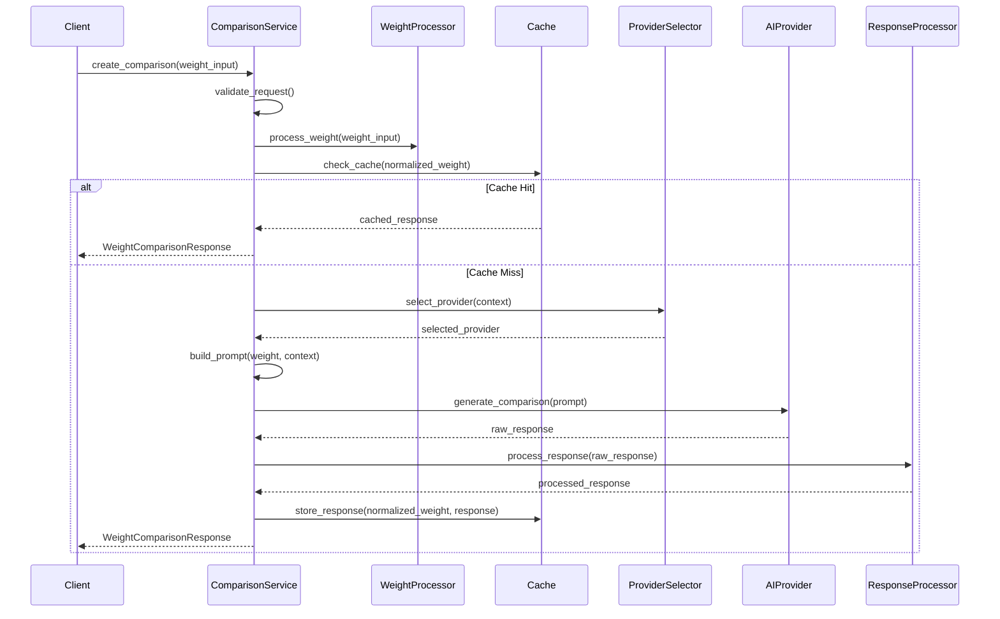

# Weight Comparison Service Specification

## Executive Summary

The Weight Comparison Service is the central orchestrator of the SizeComparator application, responsible for transforming weight inputs into engaging, contextual comparisons using AI providers. This service implements an orchestrator pattern that coordinates between weight processing, AI provider selection, prompt generation, response processing, and caching to deliver comparisons with <2 second response time and 99% uptime SLA.

## Table of Contents

1. [Service Architecture](#1-service-architecture)
2. [Core Comparison Logic](#2-core-comparison-logic)
3. [AI Provider Selection](#3-ai-provider-selection)
4. [Prompt Engineering](#4-prompt-engineering)
5. [Response Processing](#5-response-processing)
6. [Error Handling and Resilience](#6-error-handling-and-resilience)
7. [Performance Optimization](#7-performance-optimization)
8. [Monitoring and Analytics](#8-monitoring-and-analytics)
9. [Testing Strategy](#9-testing-strategy)

---

## 1. Service Architecture

### 1.1 Orchestrator Pattern Design

The Comparison Service implements a sophisticated orchestrator pattern that coordinates multiple components to deliver weight comparisons:

```python
class ComparisonService:
    """Central orchestrator for weight comparison operations."""
    
    def __init__(
        self,
        weight_processor: WeightProcessor,
        provider_factory: AIProviderFactory,
        cache_service: CacheService,
        config: ConfigManager,
        metrics: MetricsCollector,
        logger: Logger
    ):
        self._weight_processor = weight_processor
        self._provider_factory = provider_factory
        self._cache_service = cache_service
        self._config = config
        self._metrics = metrics
        self._logger = logger
        
        # Initialize sub-components
        self._provider_selector = ProviderSelector(provider_factory, config)
        self._prompt_builder = PromptBuilder(config)
        self._response_processor = ResponseProcessor(config)
        self._fallback_handler = FallbackHandler(cache_service, config)
```

### 1.2 Component Architecture

The service is composed of specialized components, each responsible for a specific aspect of the comparison flow:

```
┌─────────────────────────────────────────────────────────────────┐
│                      ComparisonService                          │
│  ┌─────────────┐  ┌──────────────────┐  ┌─────────────────┐  │
│  │   Request   │  │    Provider      │  │    Response     │  │
│  │  Validator  │  │    Selector      │  │   Processor     │  │
│  └─────────────┘  └──────────────────┘  └─────────────────┘  │
│                                                                 │
│  ┌─────────────┐  ┌──────────────────┐  ┌─────────────────┐  │
│  │   Prompt    │  │    Fallback      │  │  Comparison     │  │
│  │   Builder   │  │    Handler       │  │    Cache        │  │
│  └─────────────┘  └──────────────────┘  └─────────────────┘  │
└─────────────────────────────────────────────────────────────────┘
                               │
                               ▼
┌─────────────────┬─────────────────┬─────────────────┐
│ WeightProcessor │  AI Providers   │  CacheService   │
└─────────────────┴─────────────────┴─────────────────┘
```

### 1.3 Request Flow Architecture

The service processes requests through a well-defined pipeline:



### 1.4 Concurrency Model

The service implements an async/await concurrency model with proper timeout handling:

```python
class ComparisonService:
    async def create_comparison(
        self,
        weight_input: str,
        preferred_provider: Optional[AIProvider] = None,
        comparison_style: str = "default",
        include_visualization: bool = True,
        user_context: Optional[Dict[str, Any]] = None
    ) -> WeightComparisonResponse:
        """Create weight comparison with timeout protection."""
        
        timeout = self._config.get("comparison_service.performance.provider_timeout_ms", 1500) / 1000
        
        try:
            async with asyncio.timeout(timeout):
                return await self._process_comparison_request(
                    weight_input, preferred_provider, comparison_style,
                    include_visualization, user_context
                )
        except asyncio.TimeoutError:
            self._logger.warning(f"Comparison request timed out after {timeout}s")
            return await self._fallback_handler.get_fallback_response(weight_input)
```

### 1.5 Dependency Management

All dependencies are injected through the constructor, enabling easy testing and configuration:

```python
# Dependency injection container setup
def create_comparison_service(container: DependencyContainer) -> ComparisonService:
    return ComparisonService(
        weight_processor=container.get(WeightProcessor),
        provider_factory=container.get(AIProviderFactory),
        cache_service=container.get(CacheService),
        config=container.get(ConfigManager),
        metrics=container.get(MetricsCollector),
        logger=container.get(Logger)
    )
```

### 1.6 State Management

The service maintains a stateless design for horizontal scaling:

- No instance variables store request-specific state
- All request context is passed through method parameters
- Provider state is managed externally by AIProviderFactory
- Cache state is managed by CacheService
- Configuration changes are handled through ConfigManager

---

## 2. Core Comparison Logic

### 2.1 Request Processing Pipeline

The core comparison logic implements a sophisticated pipeline that transforms weight inputs into rich comparisons:

```python
async def _process_comparison_request(
    self,
    weight_input: str,
    preferred_provider: Optional[AIProvider],
    comparison_style: str,
    include_visualization: bool,
    user_context: Optional[Dict[str, Any]]
) -> WeightComparisonResponse:
    """Core comparison processing pipeline."""
    
    # Step 1: Parse and validate weight input
    weight_result = await self._weight_processor.process_weight(weight_input)
    if not weight_result.is_valid:
        raise ValidationError(f"Invalid weight input: {weight_result.error_message}")
    
    # Step 2: Determine weight category and context
    weight_context = self._determine_weight_context(weight_result)
    
    # Step 3: Check cache
    cache_key = self._generate_cache_key(weight_result, comparison_style)
    cached_response = await self._cache_service.get(cache_key)
    if cached_response:
        self._metrics.increment("comparison.cache_hit")
        return self._enrich_cached_response(cached_response, weight_result)
    
    # Step 4: Select comparison objects
    comparison_objects = self._select_comparison_objects(
        weight_result, weight_context, comparison_style
    )
    
    # Step 5: Build provider-specific prompt
    prompt = await self._prompt_builder.build_prompt(
        weight_result, comparison_objects, weight_context,
        comparison_style, user_context
    )
    
    # Step 6: Generate comparison
    provider = await self._provider_selector.select_provider(
        preferred_provider, weight_context, comparison_style
    )
    
    raw_response = await self._generate_with_fallback(
        provider, prompt, weight_context
    )
    
    # Step 7: Process and cache response
    processed_response = await self._response_processor.process(
        raw_response, weight_result, comparison_objects,
        include_visualization
    )
    
    await self._cache_service.set(
        cache_key, processed_response,
        ttl=self._config.get("comparison_service.performance.cache_ttl_seconds", 86400)
    )
    
    return processed_response
```

### 2.2 Context Enhancement

The service enriches comparisons with contextual information based on weight categories:

```python
def _determine_weight_context(self, weight_result: WeightResult) -> WeightContext:
    """Determine contextual information for the weight."""
    
    weight_in_kg = weight_result.value_in_kg
    
    # Categorize weight
    if weight_in_kg < 0.001:  # Less than 1 gram
        category = WeightCategory.MICROSCOPIC
        scale_context = "microscopic scale, like cells or dust particles"
        measurement_context = "typically measured in milligrams or micrograms"
    elif weight_in_kg < 0.1:  # Less than 100 grams
        category = WeightCategory.VERY_LIGHT
        scale_context = "everyday small objects"
        measurement_context = "commonly measured in grams"
    elif weight_in_kg < 10:  # Less than 10 kg
        category = WeightCategory.LIGHT
        scale_context = "objects you can easily carry"
        measurement_context = "typically measured in kilograms or pounds"
    elif weight_in_kg < 1000:  # Less than 1 tonne
        category = WeightCategory.MEDIUM
        scale_context = "furniture or large appliances"
        measurement_context = "measured in kilograms or pounds"
    elif weight_in_kg < 100000:  # Less than 100 tonnes
        category = WeightCategory.HEAVY
        scale_context = "vehicles or large animals"
        measurement_context = "measured in tonnes or tons"
    else:
        category = WeightCategory.MASSIVE
        scale_context = "buildings or large structures"
        measurement_context = "measured in thousands of tonnes"
    
    return WeightContext(
        category=category,
        scale_context=scale_context,
        measurement_context=measurement_context,
        original_unit=weight_result.original_unit,
        is_metric=weight_result.unit_system == UnitSystem.METRIC
    )
```

### 2.3 Comparison Strategies

The service implements multiple comparison strategies based on weight and style:

```python
def _select_comparison_objects(
    self,
    weight_result: WeightResult,
    weight_context: WeightContext,
    comparison_style: str
) -> List[ComparisonObject]:
    """Select appropriate objects for comparison."""
    
    if comparison_style == "creative":
        return self._select_creative_comparisons(weight_result, weight_context)
    elif comparison_style == "technical":
        return self._select_technical_comparisons(weight_result, weight_context)
    elif comparison_style == "educational":
        return self._select_educational_comparisons(weight_result, weight_context)
    else:  # default
        return self._select_balanced_comparisons(weight_result, weight_context)

def _select_balanced_comparisons(
    self,
    weight_result: WeightResult,
    weight_context: WeightContext
) -> List[ComparisonObject]:
    """Select a balanced mix of comparison objects."""
    
    objects = []
    weight_kg = weight_result.value_in_kg
    
    # Find objects within 20% of the target weight
    close_matches = self._comparison_database.find_objects(
        min_weight_kg=weight_kg * 0.8,
        max_weight_kg=weight_kg * 1.2,
        category=weight_context.category
    )
    
    if close_matches:
        objects.append(random.choice(close_matches))
    
    # Find combination of smaller objects
    if weight_kg > 0.1:  # Only for weights above 100g
        combinations = self._find_object_combinations(weight_kg, max_objects=3)
        if combinations:
            objects.extend(combinations[0])  # Best combination
    
    # Add a relatable object from a different category
    cross_category = self._comparison_database.find_relatable_object(
        weight_kg, exclude_category=weight_context.category
    )
    if cross_category:
        objects.append(cross_category)
    
    return objects[:5]  # Limit to 5 objects
```

### 2.4 Localization Support

The service formats weights and comparisons based on user locale:

```python
def _localize_response(
    self,
    response: WeightComparisonResponse,
    user_locale: str = "en_US"
) -> WeightComparisonResponse:
    """Localize weight formats and text based on user locale."""
    
    locale_config = self._get_locale_config(user_locale)
    
    # Format weights according to locale
    if locale_config.uses_metric:
        response.formatted_weight = self._format_metric_weight(
            response.weight_value, response.weight_unit, locale_config
        )
    else:
        response.formatted_weight = self._format_imperial_weight(
            response.weight_value, response.weight_unit, locale_config
        )
    
    # Localize number formatting
    response.comparison_text = self._localize_numbers(
        response.comparison_text, locale_config
    )
    
    return response
```

### 2.5 Response Enrichment

The service adds metadata and additional context to enhance responses:

```python
def _enrich_response(
    self,
    base_response: ComparisonResponse,
    weight_result: WeightResult,
    weight_context: WeightContext,
    comparison_objects: List[ComparisonObject]
) -> WeightComparisonResponse:
    """Enrich response with metadata and additional context."""
    
    return WeightComparisonResponse(
        comparison_text=base_response.comparison_text,
        weight_value=weight_result.value,
        weight_unit=weight_result.unit,
        weight_in_kg=weight_result.value_in_kg,
        weight_category=weight_context.category,
        comparison_objects=[obj.name for obj in comparison_objects],
        visualization_prompt=self._generate_visualization_prompt(
            weight_result, comparison_objects
        ),
        metadata=ComparisonMetadata(
            provider_used=base_response.provider,
            model_used=base_response.model,
            response_time_ms=base_response.response_time_ms,
            cache_hit=False,
            confidence_score=self._calculate_confidence_score(base_response),
            comparison_style=base_response.style,
            locale=base_response.locale,
            generated_at=datetime.utcnow().isoformat()
        ),
        related_weights=self._find_related_weights(weight_result),
        fun_facts=self._get_weight_fun_facts(weight_result, weight_context)
    )
```

---

## 3. AI Provider Selection

### 3.1 Selection Criteria Implementation

The provider selection system implements a sophisticated multi-criteria decision engine:

```python
class ProviderSelector:
    """Intelligent AI provider selection based on multiple criteria."""
    
    def __init__(self, provider_factory: AIProviderFactory, config: ConfigManager):
        self._provider_factory = provider_factory
        self._config = config
        self._selection_history = deque(maxlen=1000)
        self._provider_metrics = defaultdict(ProviderMetrics)
    
    async def select_provider(
        self,
        preferred_provider: Optional[AIProvider],
        weight_context: WeightContext,
        comparison_style: str
    ) -> AIProvider:
        """Select optimal provider based on criteria."""
        
        # Check if user has explicit preference
        if preferred_provider and await self._is_provider_available(preferred_provider):
            return preferred_provider
        
        # Get all available providers
        available_providers = await self._get_available_providers()
        if not available_providers:
            raise NoProvidersAvailableError("All AI providers are currently unavailable")
        
        # Score providers based on criteria
        provider_scores = {}
        for provider in available_providers:
            score = await self._calculate_provider_score(
                provider, weight_context, comparison_style
            )
            provider_scores[provider] = score
        
        # Select provider based on strategy
        selection_strategy = self._config.get(
            "comparison_service.provider_selection.strategy",
            "cost_optimized"
        )
        
        selected = self._apply_selection_strategy(
            provider_scores, selection_strategy
        )
        
        # Track selection for analytics
        self._track_selection(selected, weight_context, comparison_style)
        
        return selected
```

### 3.2 Provider Scoring System

```python
async def _calculate_provider_score(
    self,
    provider: AIProvider,
    weight_context: WeightContext,
    comparison_style: str
) -> ProviderScore:
    """Calculate multi-dimensional score for provider."""
    
    # Base scores
    availability_score = await self._get_availability_score(provider)
    cost_score = self._get_cost_score(provider, weight_context)
    capability_score = self._get_capability_score(provider, comparison_style)
    performance_score = self._get_performance_score(provider)
    
    # Weight factors based on context
    if comparison_style == "creative":
        weights = {
            "availability": 0.2,
            "cost": 0.1,
            "capability": 0.5,
            "performance": 0.2
        }
    elif weight_context.category == WeightCategory.MICROSCOPIC:
        # Technical accuracy important
        weights = {
            "availability": 0.2,
            "cost": 0.1,
            "capability": 0.4,
            "performance": 0.3
        }
    else:  # Default weights
        weights = {
            "availability": 0.3,
            "cost": 0.3,
            "capability": 0.2,
            "performance": 0.2
        }
    
    # Calculate weighted score
    total_score = (
        availability_score * weights["availability"] +
        cost_score * weights["cost"] +
        capability_score * weights["capability"] +
        performance_score * weights["performance"]
    )
    
    return ProviderScore(
        provider=provider,
        total_score=total_score,
        availability=availability_score,
        cost=cost_score,
        capability=capability_score,
        performance=performance_score
    )
```

### 3.3 Fallback Chain Management

```python
class FallbackChainManager:
    """Manages provider fallback chains with configuration."""
    
    def __init__(self, config: ConfigManager):
        self._config = config
        self._fallback_chains = self._load_fallback_chains()
    
    def _load_fallback_chains(self) -> Dict[str, List[str]]:
        """Load fallback chains from configuration."""
        
        default_chain = self._config.get(
            "comparison_service.provider_selection.fallback_chain",
            ["openai", "anthropic", "xai"]
        )
        
        return {
            "default": default_chain,
            "creative": ["anthropic", "openai", "xai"],
            "technical": ["openai", "anthropic", "xai"],
            "cost_sensitive": ["xai", "openai", "anthropic"]
        }
    
    async def execute_with_fallback(
        self,
        primary_provider: AIProvider,
        prompt: str,
        context: Dict[str, Any]
    ) -> Tuple[str, AIProvider]:
        """Execute request with automatic fallback."""
        
        fallback_chain = self._get_fallback_chain(context.get("style", "default"))
        attempted_providers = set()
        last_error = None
        
        # Try primary provider first
        try:
            response = await primary_provider.generate(prompt, context)
            return response, primary_provider
        except Exception as e:
            last_error = e
            attempted_providers.add(primary_provider.name)
        
        # Try fallback chain
        for provider_name in fallback_chain:
            if provider_name in attempted_providers:
                continue
            
            try:
                provider = await self._provider_factory.get_provider(provider_name)
                if await self._is_provider_available(provider):
                    response = await provider.generate(prompt, context)
                    return response, provider
            except Exception as e:
                last_error = e
                attempted_providers.add(provider_name)
        
        raise AllProvidersFailed(
            f"All providers failed. Last error: {last_error}",
            attempted=attempted_providers
        )
```

### 3.4 Load Balancing Implementation

```python
class LoadBalancer:
    """Load balancing across available providers."""
    
    def __init__(self, strategy: str = "weighted_round_robin"):
        self._strategy = strategy
        self._round_robin_index = 0
        self._provider_weights = {}
        self._request_counts = defaultdict(int)
    
    def select_provider_balanced(
        self,
        available_providers: List[ProviderScore]
    ) -> AIProvider:
        """Select provider using load balancing strategy."""
        
        if self._strategy == "round_robin":
            selected = available_providers[self._round_robin_index % len(available_providers)]
            self._round_robin_index += 1
            return selected.provider
        
        elif self._strategy == "weighted_round_robin":
            # Weight by inverse of recent usage
            weights = []
            for score in available_providers:
                recent_usage = self._request_counts[score.provider.name]
                weight = 1.0 / (1.0 + recent_usage * 0.1)
                weights.append(weight)
            
            # Select based on weights
            selected_score = random.choices(available_providers, weights=weights)[0]
            self._request_counts[selected_score.provider.name] += 1
            
            # Decay counts periodically
            if sum(self._request_counts.values()) > 100:
                for provider in self._request_counts:
                    self._request_counts[provider] //= 2
            
            return selected_score.provider
        
        elif self._strategy == "least_connections":
            # Select provider with least active requests
            return min(
                available_providers,
                key=lambda s: self._get_active_requests(s.provider)
            ).provider
```

### 3.5 A/B Testing Support

```python
class ABTestManager:
    """Manage A/B testing for provider selection."""
    
    def __init__(self, config: ConfigManager, metrics: MetricsCollector):
        self._config = config
        self._metrics = metrics
        self._active_tests = {}
        self._test_results = defaultdict(TestResults)
    
    def should_use_test_provider(
        self,
        test_name: str,
        user_id: Optional[str] = None
    ) -> Tuple[bool, Optional[str]]:
        """Determine if request should use test provider."""
        
        test_config = self._config.get(f"ab_tests.{test_name}")
        if not test_config or not test_config.get("enabled"):
            return False, None
        
        # Check traffic percentage
        traffic_percentage = test_config.get("traffic_percentage", 0)
        if random.random() * 100 > traffic_percentage:
            return False, None
        
        # Consistent assignment for users
        if user_id:
            hash_value = int(hashlib.md5(
                f"{test_name}:{user_id}".encode()
            ).hexdigest()[:8], 16)
            if hash_value % 100 >= traffic_percentage:
                return False, None
        
        test_provider = test_config.get("test_provider")
        return True, test_provider
    
    def track_test_result(
        self,
        test_name: str,
        provider: str,
        success: bool,
        response_time_ms: float,
        quality_score: Optional[float] = None
    ):
        """Track results for A/B test analysis."""
        
        result = self._test_results[test_name]
        result.add_result(
            provider=provider,
            success=success,
            response_time_ms=response_time_ms,
            quality_score=quality_score
        )
        
        # Report to metrics
        self._metrics.record_ab_test_result(
            test_name=test_name,
            variant=provider,
            success=success,
            response_time_ms=response_time_ms
        )
```

### 3.6 Provider Specialization

```python
class ProviderSpecializationMap:
    """Map weight categories to specialized providers."""
    
    def __init__(self):
        self._specializations = {
            WeightCategory.MICROSCOPIC: {
                "primary": "openai",  # Good at scientific/technical
                "secondary": "anthropic"
            },
            WeightCategory.VERY_LIGHT: {
                "primary": "anthropic",  # Creative comparisons
                "secondary": "openai"
            },
            WeightCategory.LIGHT: {
                "primary": "xai",  # Cost-effective for common weights
                "secondary": "openai"
            },
            WeightCategory.MEDIUM: {
                "primary": "xai",
                "secondary": "anthropic"
            },
            WeightCategory.HEAVY: {
                "primary": "anthropic",  # Good with vehicles/animals
                "secondary": "openai"
            },
            WeightCategory.MASSIVE: {
                "primary": "openai",  # Technical accuracy for large scale
                "secondary": "anthropic"
            }
        }
    
    def get_specialized_provider(
        self,
        category: WeightCategory,
        available_providers: Set[str]
    ) -> Optional[str]:
        """Get specialized provider for weight category."""
        
        specialization = self._specializations.get(category)
        if not specialization:
            return None
        
        # Check primary
        if specialization["primary"] in available_providers:
            return specialization["primary"]
        
        # Check secondary
        if specialization["secondary"] in available_providers:
            return specialization["secondary"]
        
        return None
```

---

## 4. Prompt Engineering

### 4.1 Template Management System

The prompt engineering system uses a flexible template management approach:

```python
class PromptBuilder:
    """Build provider-specific prompts using templates."""
    
    def __init__(self, config: ConfigManager):
        self._config = config
        self._template_loader = TemplateLoader()
        self._template_cache = {}
        self._variable_validator = VariableValidator()
    
    async def build_prompt(
        self,
        weight_result: WeightResult,
        comparison_objects: List[ComparisonObject],
        weight_context: WeightContext,
        comparison_style: str,
        user_context: Optional[Dict[str, Any]]
    ) -> str:
        """Build optimized prompt for weight comparison."""
        
        # Load appropriate template
        template = await self._get_template(comparison_style, weight_context.category)
        
        # Prepare variables
        variables = self._prepare_template_variables(
            weight_result, comparison_objects, weight_context, user_context
        )
        
        # Validate variables
        self._variable_validator.validate(template, variables)
        
        # Render template
        prompt = self._render_template(template, variables)
        
        # Apply safety filters
        prompt = self._apply_safety_filters(prompt)
        
        return prompt
```

### 4.2 Variable Injection System

```python
def _prepare_template_variables(
    self,
    weight_result: WeightResult,
    comparison_objects: List[ComparisonObject],
    weight_context: WeightContext,
    user_context: Optional[Dict[str, Any]]
) -> Dict[str, Any]:
    """Prepare all variables for template injection."""
    
    # Core weight variables
    variables = {
        "weight_value": weight_result.value,
        "weight_unit": weight_result.unit,
        "weight_in_kg": weight_result.value_in_kg,
        "formatted_weight": self._format_weight_display(weight_result),
        
        # Category and context
        "weight_category": weight_context.category.value,
        "scale_context": weight_context.scale_context,
        "measurement_context": weight_context.measurement_context,
        
        # Comparison objects
        "primary_object": comparison_objects[0].name if comparison_objects else None,
        "comparison_objects": [
            {
                "name": obj.name,
                "weight_kg": obj.weight_kg,
                "description": obj.description,
                "category": obj.category
            }
            for obj in comparison_objects
        ],
        "object_count": len(comparison_objects),
        
        # Style directives
        "tone": self._get_tone_directive(comparison_style),
        "length_directive": self._get_length_directive(comparison_style),
        "creativity_level": self._get_creativity_level(comparison_style),
        
        # User context
        "user_locale": user_context.get("locale", "en_US") if user_context else "en_US",
        "user_expertise": user_context.get("expertise_level", "general") if user_context else "general",
        "include_metric": user_context.get("prefer_metric", True) if user_context else True,
        "include_imperial": user_context.get("prefer_imperial", True) if user_context else True
    }
    
    # Add calculated ratios for comparison objects
    if comparison_objects:
        variables["object_ratios"] = [
            {
                "object": obj.name,
                "ratio": weight_result.value_in_kg / obj.weight_kg,
                "inverse_ratio": obj.weight_kg / weight_result.value_in_kg
            }
            for obj in comparison_objects
        ]
    
    return variables
```

### 4.3 Context Building

```python
class ContextBuilder:
    """Build rich context for prompt generation."""
    
    def build_comparison_context(
        self,
        weight_result: WeightResult,
        comparison_objects: List[ComparisonObject]
    ) -> str:
        """Build contextual information for the prompt."""
        
        context_parts = []
        
        # Weight scale context
        if weight_result.value_in_kg < 0.001:
            context_parts.append(
                "This is an extremely light weight, typically found in scientific "
                "or medical contexts. Comparisons should be precise and relatable."
            )
        elif weight_result.value_in_kg > 10000:
            context_parts.append(
                "This is a very heavy weight, often associated with vehicles, "
                "buildings, or large animals. Use familiar large-scale objects."
            )
        
        # Comparison strategy context
        if len(comparison_objects) == 1:
            context_parts.append(
                f"Focus on comparing directly to {comparison_objects[0].name}, "
                "providing specific ratios or multiples."
            )
        elif len(comparison_objects) > 1:
            context_parts.append(
                "Provide multiple comparison points, showing how the weight "
                "relates to different familiar objects."
            )
        
        # Measurement system context
        if weight_result.unit_system == UnitSystem.METRIC:
            context_parts.append(
                "The user provided a metric weight, so maintain metric units "
                "in the primary comparison."
            )
        else:
            context_parts.append(
                "The user provided an imperial weight, so maintain imperial units "
                "in the primary comparison."
            )
        
        return " ".join(context_parts)
```

### 4.4 Provider Adaptation

```python
def adapt_prompt_for_provider(
    self,
    base_prompt: str,
    provider_name: str,
    model_capabilities: ModelCapabilities
) -> str:
    """Adapt prompt for specific provider requirements."""
    
    if provider_name == "openai":
        # OpenAI specific adaptations
        prompt = self._add_openai_directives(base_prompt)
        if model_capabilities.supports_json_mode:
            prompt = self._add_json_output_directive(prompt)
    
    elif provider_name == "anthropic":
        # Anthropic specific adaptations
        prompt = self._add_anthropic_style_markers(base_prompt)
        prompt = self._add_constitutional_ai_hints(prompt)
    
    elif provider_name == "xai":
        # X.ai specific adaptations
        prompt = self._add_conciseness_directive(base_prompt)
        prompt = self._limit_response_length(prompt, max_tokens=150)
    
    return prompt

def _add_openai_directives(self, prompt: str) -> str:
    """Add OpenAI-specific directives."""
    
    return f"""{prompt}

Please structure your response clearly and ensure all comparisons are factually accurate.
Use specific numbers and ratios where applicable."""

def _add_anthropic_style_markers(self, prompt: str) -> str:
    """Add Anthropic-specific style markers."""
    
    return f"""<comparison_request>
{prompt}
</comparison_request>

<guidelines>
- Be creative but accurate
- Use vivid imagery where appropriate
- Maintain a helpful and engaging tone
</guidelines>"""
```

### 4.5 Prompt Optimization

```python
class PromptOptimizer:
    """Track and optimize prompt performance."""
    
    def __init__(self, metrics: MetricsCollector):
        self._metrics = metrics
        self._prompt_performance = defaultdict(PromptMetrics)
        self._successful_patterns = []
    
    def track_prompt_result(
        self,
        prompt_template: str,
        provider: str,
        success: bool,
        quality_score: float,
        response_time_ms: float
    ):
        """Track prompt performance for optimization."""
        
        key = f"{prompt_template}:{provider}"
        metrics = self._prompt_performance[key]
        
        metrics.total_uses += 1
        if success:
            metrics.successful_uses += 1
        metrics.average_quality = (
            (metrics.average_quality * (metrics.total_uses - 1) + quality_score) /
            metrics.total_uses
        )
        metrics.average_response_time = (
            (metrics.average_response_time * (metrics.total_uses - 1) + response_time_ms) /
            metrics.total_uses
        )
        
        # Identify successful patterns
        if success and quality_score > 0.8:
            self._analyze_successful_prompt(prompt_template, provider)
    
    def get_optimization_suggestions(
        self,
        prompt_template: str,
        provider: str
    ) -> List[str]:
        """Get suggestions for improving prompt performance."""
        
        suggestions = []
        key = f"{prompt_template}:{provider}"
        metrics = self._prompt_performance.get(key)
        
        if not metrics:
            return ["No performance data available yet"]
        
        # Check success rate
        success_rate = metrics.successful_uses / metrics.total_uses
        if success_rate < 0.8:
            suggestions.append(
                f"Low success rate ({success_rate:.1%}). "
                "Consider simplifying the prompt or adding clearer instructions."
            )
        
        # Check quality
        if metrics.average_quality < 0.7:
            suggestions.append(
                "Low average quality score. "
                "Review successful prompts for patterns to emulate."
            )
        
        # Check response time
        if metrics.average_response_time > 1000:
            suggestions.append(
                "High average response time. "
                "Consider shortening the prompt or reducing complexity."
            )
        
        return suggestions
```

### 4.6 Safety Filters

```python
class SafetyFilter:
    """Ensure appropriate content generation."""
    
    def __init__(self, config: ConfigManager):
        self._config = config
        self._blocked_terms = set(config.get("safety.blocked_terms", []))
        self._sensitive_categories = set(config.get("safety.sensitive_categories", []))
    
    def apply_safety_filters(self, prompt: str) -> str:
        """Apply safety filters to prompt."""
        
        # Check for blocked terms
        prompt_lower = prompt.lower()
        for term in self._blocked_terms:
            if term in prompt_lower:
                raise SafetyViolation(f"Blocked term detected: {term}")
        
        # Add safety instructions
        safety_instructions = """
Note: Please ensure all comparisons are:
- Family-friendly and appropriate for all ages
- Factually accurate and educational
- Free from potentially offensive content
- Respectful of all cultures and backgrounds
"""
        
        return f"{prompt}\n\n{safety_instructions}"
    
    def validate_comparison_objects(
        self,
        objects: List[ComparisonObject]
    ) -> List[ComparisonObject]:
        """Validate comparison objects for appropriateness."""
        
        validated = []
        for obj in objects:
            if obj.category not in self._sensitive_categories:
                validated.append(obj)
            else:
                # Log for review but don't include
                self._log_filtered_object(obj)
        
        return validated
```

---

## 5. Response Processing

### 5.1 Response Parsing

The response processing system extracts and validates comparison data from AI responses:

```python
class ResponseProcessor:
    """Process and enhance AI responses."""
    
    def __init__(self, config: ConfigManager):
        self._config = config
        self._parser = ResponseParser()
        self._validator = ResponseValidator()
        self._enhancer = ResponseEnhancer()
    
    async def process(
        self,
        raw_response: str,
        weight_result: WeightResult,
        comparison_objects: List[ComparisonObject],
        include_visualization: bool
    ) -> WeightComparisonResponse:
        """Process raw AI response into structured format."""
        
        # Parse response
        parsed = self._parser.parse_ai_response(raw_response)
        
        # Validate response
        validation_result = self._validator.validate(
            parsed, weight_result, comparison_objects
        )
        
        if not validation_result.is_valid:
            raise InvalidResponseError(
                f"Response validation failed: {validation_result.errors}"
            )
        
        # Enhance response
        enhanced = await self._enhancer.enhance(
            parsed, weight_result, comparison_objects,
            include_visualization
        )
        
        return enhanced
```

### 5.2 Response Validation

```python
class ResponseValidator:
    """Validate AI responses for quality and accuracy."""
    
    def validate(
        self,
        parsed_response: ParsedResponse,
        weight_result: WeightResult,
        expected_objects: List[ComparisonObject]
    ) -> ValidationResult:
        """Comprehensive response validation."""
        
        errors = []
        warnings = []
        
        # Check response length
        if len(parsed_response.comparison_text) < 50:
            errors.append("Response too short (minimum 50 characters)")
        elif len(parsed_response.comparison_text) > 500:
            warnings.append("Response exceeds recommended length")
        
        # Check for actual comparisons
        if not self._contains_comparison(parsed_response.comparison_text):
            errors.append("Response does not contain valid comparisons")
        
        # Verify mentioned objects
        mentioned_objects = self._extract_mentioned_objects(
            parsed_response.comparison_text
        )
        
        expected_names = {obj.name.lower() for obj in expected_objects}
        mentioned_names = {obj.lower() for obj in mentioned_objects}
        
        if not mentioned_names.intersection(expected_names):
            warnings.append(
                "Response doesn't mention expected comparison objects"
            )
        
        # Check for weight accuracy
        if not self._verify_weight_accuracy(
            parsed_response.comparison_text,
            weight_result
        ):
            errors.append("Response contains inaccurate weight information")
        
        # Check for inappropriate content
        if self._contains_inappropriate_content(parsed_response.comparison_text):
            errors.append("Response contains inappropriate content")
        
        return ValidationResult(
            is_valid=len(errors) == 0,
            errors=errors,
            warnings=warnings,
            confidence_score=self._calculate_confidence(errors, warnings)
        )
```

### 5.3 Response Enhancement

```python
class ResponseEnhancer:
    """Enhance validated responses with additional data."""
    
    async def enhance(
        self,
        parsed_response: ParsedResponse,
        weight_result: WeightResult,
        comparison_objects: List[ComparisonObject],
        include_visualization: bool
    ) -> WeightComparisonResponse:
        """Enhance response with metadata and suggestions."""
        
        # Base response
        enhanced = WeightComparisonResponse(
            comparison_text=self._polish_comparison_text(
                parsed_response.comparison_text
            ),
            weight_value=weight_result.value,
            weight_unit=weight_result.unit,
            weight_in_kg=weight_result.value_in_kg
        )
        
        # Add comparison objects with details
        enhanced.comparison_objects = [
            {
                "name": obj.name,
                "weight_kg": obj.weight_kg,
                "ratio": weight_result.value_in_kg / obj.weight_kg,
                "description": obj.description
            }
            for obj in comparison_objects
        ]
        
        # Add visualization if requested
        if include_visualization:
            enhanced.visualization_prompt = self._generate_visualization_prompt(
                weight_result, comparison_objects, parsed_response
            )
            enhanced.visualization_suggestions = self._get_visualization_suggestions(
                weight_result.value_in_kg
            )
        
        # Add confidence score
        enhanced.confidence_score = self._calculate_response_confidence(
            parsed_response, comparison_objects
        )
        
        # Add fun facts
        enhanced.fun_facts = await self._get_relevant_fun_facts(
            weight_result, comparison_objects
        )
        
        # Add related comparisons
        enhanced.related_comparisons = self._suggest_related_comparisons(
            weight_result
        )
        
        return enhanced
```

### 5.4 Fallback Response System

```python
class FallbackHandler:
    """Handle fallback responses when AI providers fail."""
    
    def __init__(self, cache_service: CacheService, config: ConfigManager):
        self._cache_service = cache_service
        self._config = config
        self._precomputed_responses = self._load_precomputed_responses()
    
    async def get_fallback_response(
        self,
        weight_input: str,
        weight_result: Optional[WeightResult] = None
    ) -> WeightComparisonResponse:
        """Get fallback response using various strategies."""
        
        # Try similar weight from cache
        if weight_result:
            similar_response = await self._find_similar_cached_response(
                weight_result
            )
            if similar_response:
                return self._adapt_cached_response(
                    similar_response, weight_result
                )
        
        # Try precomputed response
        if weight_result:
            precomputed = self._get_precomputed_response(weight_result)
            if precomputed:
                return precomputed
        
        # Generate basic mathematical comparison
        if weight_result:
            return self._generate_mathematical_comparison(weight_result)
        
        # Last resort - generic error response
        return self._create_error_response(weight_input)
    
    def _generate_mathematical_comparison(
        self,
        weight_result: WeightResult
    ) -> WeightComparisonResponse:
        """Generate basic mathematical comparison."""
        
        weight_kg = weight_result.value_in_kg
        comparisons = []
        
        # Common weight references
        references = [
            (0.001, "gram", "A paperclip weighs about 1 gram"),
            (0.1, "100 grams", "A medium apple weighs about 100 grams"),
            (1.0, "kilogram", "A liter of water weighs 1 kilogram"),
            (5.0, "5 kilograms", "A house cat weighs about 5 kilograms"),
            (50.0, "50 kilograms", "An average adult weighs 50-80 kilograms"),
            (1000.0, "metric ton", "A small car weighs about 1 metric ton")
        ]
        
        # Find closest references
        for ref_weight, ref_name, ref_description in references:
            ratio = weight_kg / ref_weight
            if 0.1 <= ratio <= 10:
                if ratio < 1:
                    comparisons.append(
                        f"{weight_result.value} {weight_result.unit} is about "
                        f"{ratio:.1f} times lighter than {ref_name}. {ref_description}."
                    )
                else:
                    comparisons.append(
                        f"{weight_result.value} {weight_result.unit} is about "
                        f"{ratio:.1f} times heavier than {ref_name}. {ref_description}."
                    )
        
        comparison_text = " ".join(comparisons[:2]) if comparisons else (
            f"{weight_result.value} {weight_result.unit} is approximately "
            f"{weight_kg:.3f} kilograms."
        )
        
        return WeightComparisonResponse(
            comparison_text=comparison_text,
            weight_value=weight_result.value,
            weight_unit=weight_result.unit,
            weight_in_kg=weight_kg,
            comparison_objects=[ref[1] for ref in references[:2]],
            metadata=ComparisonMetadata(
                provider_used="fallback",
                model_used="mathematical",
                response_time_ms=10,
                cache_hit=False,
                confidence_score=0.5,
                is_fallback=True
            )
        )
```

### 5.5 Response Caching

```python
class ComparisonCache:
    """Specialized caching for comparison responses."""
    
    def __init__(self, cache_service: CacheService, config: ConfigManager):
        self._cache_service = cache_service
        self._config = config
        self._ttl = config.get("comparison_service.performance.cache_ttl_seconds", 86400)
    
    async def get_cached_response(
        self,
        cache_key: str
    ) -> Optional[WeightComparisonResponse]:
        """Retrieve cached response if available."""
        
        cached_data = await self._cache_service.get(cache_key)
        if not cached_data:
            return None
        
        try:
            # Deserialize response
            response = WeightComparisonResponse.from_dict(cached_data)
            
            # Update metadata to indicate cache hit
            response.metadata.cache_hit = True
            response.metadata.cached_at = cached_data.get("cached_at")
            
            return response
        except Exception as e:
            self._logger.error(f"Failed to deserialize cached response: {e}")
            return None
    
    async def cache_response(
        self,
        cache_key: str,
        response: WeightComparisonResponse,
        ttl: Optional[int] = None
    ):
        """Cache comparison response."""
        
        # Serialize response
        cache_data = response.to_dict()
        cache_data["cached_at"] = datetime.utcnow().isoformat()
        
        # Store with TTL
        await self._cache_service.set(
            cache_key,
            cache_data,
            ttl=ttl or self._ttl
        )
        
        # Also store in similarity index for fallback searches
        await self._update_similarity_index(response)
```

---

## 6. Error Handling and Resilience

### 6.1 Comprehensive Error Scenarios

The service handles various error scenarios with specific strategies:

```python
class ErrorHandler:
    """Comprehensive error handling for comparison service."""
    
    def __init__(self, logger: Logger, metrics: MetricsCollector):
        self._logger = logger
        self._metrics = metrics
        self._error_strategies = self._initialize_error_strategies()
    
    async def handle_error(
        self,
        error: Exception,
        context: ErrorContext
    ) -> ErrorHandlingResult:
        """Handle errors with appropriate strategies."""
        
        error_type = type(error).__name__
        strategy = self._error_strategies.get(
            error_type,
            self._default_error_strategy
        )
        
        # Log error with context
        self._logger.error(
            f"Error in comparison service: {error}",
            extra={
                "error_type": error_type,
                "weight_input": context.weight_input,
                "provider": context.provider,
                "attempt": context.attempt_number
            }
        )
        
        # Track error metrics
        self._metrics.increment(
            "comparison.errors",
            tags={"error_type": error_type, "provider": context.provider}
        )
        
        # Execute error handling strategy
        return await strategy(error, context)
```

### 6.2 Error Handling Strategies

```python
def _initialize_error_strategies(self) -> Dict[str, Callable]:
    """Initialize specific error handling strategies."""
    
    return {
        "ValidationError": self._handle_validation_error,
        "ProviderTimeoutError": self._handle_timeout_error,
        "ProviderQuotaExceeded": self._handle_quota_exceeded,
        "ProviderUnavailable": self._handle_provider_unavailable,
        "InvalidResponseError": self._handle_invalid_response,
        "NetworkError": self._handle_network_error,
        "CacheError": self._handle_cache_error
    }

async def _handle_validation_error(
    self,
    error: ValidationError,
    context: ErrorContext
) -> ErrorHandlingResult:
    """Handle weight validation errors."""
    
    # Return user-friendly error message
    user_message = self._get_validation_error_message(error)
    
    return ErrorHandlingResult(
        should_retry=False,
        fallback_response=None,
        user_message=user_message,
        status_code=400
    )

async def _handle_timeout_error(
    self,
    error: ProviderTimeoutError,
    context: ErrorContext
) -> ErrorHandlingResult:
    """Handle provider timeout errors."""
    
    # Try faster provider or fallback
    if context.attempt_number < 3:
        return ErrorHandlingResult(
            should_retry=True,
            retry_with_provider="xai",  # Fastest provider
            fallback_response=None
        )
    
    # Use fallback response
    fallback = await self._fallback_handler.get_fallback_response(
        context.weight_input,
        context.weight_result
    )
    
    return ErrorHandlingResult(
        should_retry=False,
        fallback_response=fallback,
        user_message="Response generated using cached data"
    )
```

### 6.3 Graceful Degradation

```python
class GracefulDegradation:
    """Implement graceful degradation strategies."""
    
    def __init__(
        self,
        cache_service: CacheService,
        fallback_handler: FallbackHandler
    ):
        self._cache_service = cache_service
        self._fallback_handler = fallback_handler
        self._degradation_levels = [
            self._try_cached_exact_match,
            self._try_cached_similar_weight,
            self._try_precomputed_response,
            self._try_mathematical_comparison,
            self._return_basic_response
        ]
    
    async def get_degraded_response(
        self,
        weight_result: WeightResult,
        original_error: Exception
    ) -> WeightComparisonResponse:
        """Get best available degraded response."""
        
        for level, strategy in enumerate(self._degradation_levels):
            try:
                response = await strategy(weight_result)
                if response:
                    response.metadata.degradation_level = level
                    response.metadata.degradation_reason = str(original_error)
                    return response
            except Exception as e:
                self._logger.warning(
                    f"Degradation level {level} failed: {e}"
                )
                continue
        
        # Should never reach here, but safety fallback
        return self._create_error_response(weight_result)
```

### 6.4 Circuit Breaker Integration

```python
class CircuitBreakerManager:
    """Manage circuit breakers for providers."""
    
    def __init__(self, config: ConfigManager):
        self._config = config
        self._circuit_breakers = {}
        self._initialize_circuit_breakers()
    
    def _initialize_circuit_breakers(self):
        """Initialize circuit breakers for each provider."""
        
        providers = ["openai", "anthropic", "xai"]
        for provider in providers:
            self._circuit_breakers[provider] = CircuitBreaker(
                failure_threshold=self._config.get(
                    f"circuit_breaker.{provider}.failure_threshold", 5
                ),
                recovery_timeout=self._config.get(
                    f"circuit_breaker.{provider}.recovery_timeout", 60
                ),
                expected_exception=ProviderError
            )
    
    async def call_with_circuit_breaker(
        self,
        provider_name: str,
        operation: Callable,
        *args,
        **kwargs
    ):
        """Execute operation with circuit breaker protection."""
        
        circuit_breaker = self._circuit_breakers.get(provider_name)
        if not circuit_breaker:
            # No circuit breaker configured, call directly
            return await operation(*args, **kwargs)
        
        try:
            return await circuit_breaker.call(operation, *args, **kwargs)
        except CircuitBreakerOpen:
            self._logger.warning(
                f"Circuit breaker open for {provider_name}"
            )
            raise ProviderUnavailable(
                f"Provider {provider_name} is temporarily unavailable"
            )
```

### 6.5 Retry Logic

```python
class RetryManager:
    """Manage retry logic with exponential backoff."""
    
    def __init__(self, config: ConfigManager):
        self._config = config
        self._max_retries = config.get("retry.max_retries", 3)
        self._base_delay = config.get("retry.base_delay_ms", 100)
        self._max_delay = config.get("retry.max_delay_ms", 5000)
    
    async def retry_with_backoff(
        self,
        operation: Callable,
        operation_name: str,
        retry_on: Tuple[Type[Exception], ...] = (Exception,)
    ):
        """Execute operation with exponential backoff retry."""
        
        last_exception = None
        
        for attempt in range(self._max_retries):
            try:
                return await operation()
            except retry_on as e:
                last_exception = e
                
                if attempt == self._max_retries - 1:
                    # Last attempt failed
                    raise
                
                # Calculate delay with jitter
                delay = min(
                    self._base_delay * (2 ** attempt) + random.randint(0, 100),
                    self._max_delay
                ) / 1000  # Convert to seconds
                
                self._logger.info(
                    f"Retry {attempt + 1}/{self._max_retries} for {operation_name} "
                    f"after {delay:.2f}s delay. Error: {e}"
                )
                
                await asyncio.sleep(delay)
        
        raise last_exception
```

---

## 7. Performance Optimization

### 7.1 Caching Strategy

The service implements a multi-layered caching strategy for optimal performance:

```python
class CachingStrategy:
    """Multi-layered caching for performance optimization."""
    
    def __init__(self, cache_service: CacheService, config: ConfigManager):
        self._cache_service = cache_service
        self._config = config
        self._local_cache = TTLCache(maxsize=1000, ttl=300)  # 5-minute local cache
        self._cache_stats = CacheStatistics()
    
    async def get_with_cache(
        self,
        cache_key: str,
        generator: Callable,
        ttl: int = 86400
    ) -> Any:
        """Get value with multi-layer caching."""
        
        # Check local cache first (fastest)
        if cache_key in self._local_cache:
            self._cache_stats.local_hits += 1
            return self._local_cache[cache_key]
        
        # Check distributed cache
        cached_value = await self._cache_service.get(cache_key)
        if cached_value:
            self._cache_stats.distributed_hits += 1
            self._local_cache[cache_key] = cached_value
            return cached_value
        
        # Generate new value
        self._cache_stats.misses += 1
        value = await generator()
        
        # Store in both caches
        self._local_cache[cache_key] = value
        await self._cache_service.set(cache_key, value, ttl=ttl)
        
        return value
```

### 7.2 Input Normalization for Cache Efficiency

```python
class CacheKeyGenerator:
    """Generate normalized cache keys for better hit rates."""
    
    def generate_comparison_cache_key(
        self,
        weight_result: WeightResult,
        comparison_style: str
    ) -> str:
        """Generate normalized cache key."""
        
        # Normalize weight to standard precision
        normalized_kg = self._normalize_weight(weight_result.value_in_kg)
        
        # Include style but not user-specific data
        components = [
            "comparison",
            "v1",
            str(normalized_kg),
            comparison_style
        ]
        
        return ":".join(components)
    
    def _normalize_weight(self, weight_kg: float) -> float:
        """Normalize weight for cache bucketing."""
        
        if weight_kg < 0.01:
            # For very small weights, round to nearest 0.001
            return round(weight_kg, 3)
        elif weight_kg < 1:
            # For small weights, round to nearest 0.01
            return round(weight_kg, 2)
        elif weight_kg < 100:
            # For medium weights, round to nearest 0.1
            return round(weight_kg, 1)
        else:
            # For large weights, round to nearest 1
            return round(weight_kg, 0)
```

### 7.3 Parallel Processing

```python
class ParallelProcessor:
    """Handle parallel processing for performance."""
    
    async def query_providers_parallel(
        self,
        providers: List[AIProvider],
        prompt: str,
        timeout: float = 1.5
    ) -> Tuple[str, AIProvider]:
        """Query multiple providers in parallel."""
        
        tasks = []
        for provider in providers:
            task = asyncio.create_task(
                self._query_with_timeout(provider, prompt, timeout)
            )
            tasks.append((task, provider))
        
        # Wait for first successful response
        pending = [task for task, _ in tasks]
        
        while pending:
            done, pending = await asyncio.wait(
                pending,
                return_when=asyncio.FIRST_COMPLETED
            )
            
            for task in done:
                try:
                    result = await task
                    if result:
                        # Cancel remaining tasks
                        for p in pending:
                            p.cancel()
                        
                        # Find which provider succeeded
                        for t, provider in tasks:
                            if t == task:
                                return result, provider
                except Exception as e:
                    self._logger.debug(f"Provider query failed: {e}")
                    continue
        
        raise AllProvidersFailed("All parallel queries failed")
```

### 7.4 Request Deduplication

```python
class RequestDeduplicator:
    """Deduplicate identical concurrent requests."""
    
    def __init__(self):
        self._pending_requests: Dict[str, asyncio.Future] = {}
        self._lock = asyncio.Lock()
    
    async def deduplicate_request(
        self,
        request_key: str,
        operation: Callable
    ) -> Any:
        """Deduplicate concurrent identical requests."""
        
        async with self._lock:
            # Check if identical request is pending
            if request_key in self._pending_requests:
                # Wait for existing request
                return await self._pending_requests[request_key]
            
            # Create new future for this request
            future = asyncio.Future()
            self._pending_requests[request_key] = future
        
        try:
            # Execute operation
            result = await operation()
            future.set_result(result)
            return result
        except Exception as e:
            future.set_exception(e)
            raise
        finally:
            # Clean up
            async with self._lock:
                self._pending_requests.pop(request_key, None)
```

### 7.5 Resource Pooling

```python
class ResourcePoolManager:
    """Manage connection pools for optimal resource usage."""
    
    def __init__(self, config: ConfigManager):
        self._config = config
        self._http_session = None
        self._redis_pool = None
        
    async def initialize(self):
        """Initialize resource pools."""
        
        # HTTP connection pool
        connector = aiohttp.TCPConnector(
            limit=self._config.get("http.pool_size", 100),
            limit_per_host=self._config.get("http.pool_size_per_host", 10),
            ttl_dns_cache=300
        )
        
        timeout = aiohttp.ClientTimeout(
            total=self._config.get("http.total_timeout", 30),
            connect=self._config.get("http.connect_timeout", 5),
            sock_read=self._config.get("http.read_timeout", 10)
        )
        
        self._http_session = aiohttp.ClientSession(
            connector=connector,
            timeout=timeout
        )
        
        # Redis connection pool
        self._redis_pool = await aioredis.create_redis_pool(
            self._config.get("redis.url"),
            maxsize=self._config.get("redis.pool_size", 50),
            minsize=self._config.get("redis.pool_min_size", 10)
        )
    
    async def cleanup(self):
        """Clean up resource pools."""
        
        if self._http_session:
            await self._http_session.close()
        
        if self._redis_pool:
            self._redis_pool.close()
            await self._redis_pool.wait_closed()
```

---

## 8. Monitoring and Analytics

### 8.1 Service Metrics

The service implements comprehensive RED (Rate, Errors, Duration) metrics:

```python
class ComparisonServiceMetrics:
    """Comprehensive metrics for comparison service."""
    
    def __init__(self, metrics_collector: MetricsCollector):
        self._metrics = metrics_collector
        
        # Define metric names
        self.REQUEST_COUNTER = "comparison_service.requests.total"
        self.ERROR_COUNTER = "comparison_service.errors.total"
        self.DURATION_HISTOGRAM = "comparison_service.duration.seconds"
        self.PROVIDER_SELECTION = "comparison_service.provider_selection"
        self.CACHE_HIT_RATE = "comparison_service.cache.hit_rate"
        self.FALLBACK_USAGE = "comparison_service.fallback.usage"
    
    def track_request(
        self,
        weight_category: str,
        comparison_style: str,
        provider: str,
        cache_hit: bool,
        duration_ms: float,
        success: bool,
        error_type: Optional[str] = None
    ):
        """Track comprehensive request metrics."""
        
        tags = {
            "weight_category": weight_category,
            "style": comparison_style,
            "provider": provider,
            "cache_hit": str(cache_hit),
            "success": str(success)
        }
        
        # Rate metrics
        self._metrics.increment(self.REQUEST_COUNTER, tags=tags)
        
        if not success:
            error_tags = {**tags, "error_type": error_type or "unknown"}
            self._metrics.increment(self.ERROR_COUNTER, tags=error_tags)
        
        # Duration metrics
        self._metrics.histogram(
            self.DURATION_HISTOGRAM,
            duration_ms / 1000,  # Convert to seconds
            tags=tags
        )
        
        # Provider selection distribution
        self._metrics.increment(
            self.PROVIDER_SELECTION,
            tags={"provider": provider}
        )
```

### 8.2 Business Metrics

```python
class BusinessMetricsTracker:
    """Track business-relevant metrics."""
    
    def __init__(self, metrics_collector: MetricsCollector):
        self._metrics = metrics_collector
        self._popular_weights = Counter()
        self._comparison_costs = defaultdict(float)
    
    def track_comparison_request(
        self,
        weight_kg: float,
        provider: str,
        estimated_cost: float,
        user_satisfaction: Optional[float] = None
    ):
        """Track business metrics for comparison."""
        
        # Track popular weights
        weight_bucket = self._get_weight_bucket(weight_kg)
        self._popular_weights[weight_bucket] += 1
        
        # Track costs
        self._comparison_costs[provider] += estimated_cost
        self._metrics.gauge(
            "comparison_service.cost.total",
            sum(self._comparison_costs.values())
        )
        
        # Track satisfaction if provided
        if user_satisfaction is not None:
            self._metrics.histogram(
                "comparison_service.user_satisfaction",
                user_satisfaction,
                tags={"provider": provider}
            )
    
    def get_popular_weight_analysis(self) -> Dict[str, Any]:
        """Analyze popular weight comparisons."""
        
        total_requests = sum(self._popular_weights.values())
        
        return {
            "total_requests": total_requests,
            "top_weights": self._popular_weights.most_common(10),
            "weight_distribution": {
                bucket: count / total_requests
                for bucket, count in self._popular_weights.items()
            }
        }
```

### 8.3 Quality Metrics

```python
class QualityMetricsCollector:
    """Collect quality metrics for responses."""
    
    def __init__(self, metrics_collector: MetricsCollector):
        self._metrics = metrics_collector
        self._response_analyzer = ResponseQualityAnalyzer()
    
    async def analyze_response_quality(
        self,
        response: WeightComparisonResponse,
        weight_result: WeightResult,
        expected_objects: List[ComparisonObject]
    ) -> QualityScore:
        """Analyze response quality comprehensively."""
        
        # Analyze relevance
        relevance_score = self._response_analyzer.calculate_relevance(
            response.comparison_text,
            expected_objects
        )
        
        # Analyze accuracy
        accuracy_score = self._response_analyzer.calculate_accuracy(
            response.comparison_text,
            weight_result
        )
        
        # Analyze creativity
        creativity_score = self._response_analyzer.calculate_creativity(
            response.comparison_text
        )
        
        # Calculate overall quality
        overall_quality = (
            relevance_score * 0.4 +
            accuracy_score * 0.4 +
            creativity_score * 0.2
        )
        
        # Track metrics
        self._metrics.histogram(
            "comparison_service.quality.overall",
            overall_quality,
            tags={"provider": response.metadata.provider_used}
        )
        
        self._metrics.histogram(
            "comparison_service.quality.relevance",
            relevance_score,
            tags={"provider": response.metadata.provider_used}
        )
        
        return QualityScore(
            overall=overall_quality,
            relevance=relevance_score,
            accuracy=accuracy_score,
            creativity=creativity_score
        )
```

### 8.4 Performance Monitoring

```python
class PerformanceMonitor:
    """Monitor service performance against SLAs."""
    
    def __init__(self, metrics_collector: MetricsCollector, config: ConfigManager):
        self._metrics = metrics_collector
        self._config = config
        self._sla_target = config.get("sla.response_time_ms", 2000)
        self._performance_window = deque(maxlen=1000)
    
    def track_request_performance(
        self,
        response_time_ms: float,
        cache_hit: bool,
        provider: str
    ):
        """Track request performance."""
        
        self._performance_window.append({
            "response_time_ms": response_time_ms,
            "cache_hit": cache_hit,
            "provider": provider,
            "timestamp": datetime.utcnow()
        })
        
        # Check SLA compliance
        sla_met = response_time_ms < self._sla_target
        self._metrics.increment(
            "comparison_service.sla.compliance",
            tags={"met": str(sla_met), "cache_hit": str(cache_hit)}
        )
        
        # Calculate percentiles
        if len(self._performance_window) >= 100:
            response_times = [r["response_time_ms"] for r in self._performance_window]
            response_times.sort()
            
            p50 = response_times[int(len(response_times) * 0.5)]
            p95 = response_times[int(len(response_times) * 0.95)]
            p99 = response_times[int(len(response_times) * 0.99)]
            
            self._metrics.gauge("comparison_service.latency.p50", p50)
            self._metrics.gauge("comparison_service.latency.p95", p95)
            self._metrics.gauge("comparison_service.latency.p99", p99)
```

### 8.5 Analytics Dashboard Data

```python
class AnalyticsDashboard:
    """Provide data for analytics dashboards."""
    
    def get_dashboard_metrics(self) -> Dict[str, Any]:
        """Get comprehensive dashboard metrics."""
        
        return {
            "real_time": {
                "requests_per_second": self._calculate_request_rate(),
                "error_rate": self._calculate_error_rate(),
                "average_latency_ms": self._calculate_average_latency(),
                "cache_hit_rate": self._calculate_cache_hit_rate()
            },
            "provider_health": {
                provider: {
                    "availability": self._get_provider_availability(provider),
                    "average_latency": self._get_provider_latency(provider),
                    "error_rate": self._get_provider_error_rate(provider),
                    "cost_per_request": self._get_provider_cost(provider)
                }
                for provider in ["openai", "anthropic", "xai"]
            },
            "weight_analytics": {
                "popular_categories": self._get_popular_weight_categories(),
                "comparison_styles": self._get_style_distribution(),
                "geographic_distribution": self._get_geographic_distribution()
            },
            "quality_metrics": {
                "average_quality_score": self._get_average_quality_score(),
                "user_satisfaction": self._get_user_satisfaction_score(),
                "response_relevance": self._get_relevance_scores()
            }
        }
```

---

## 9. Testing Strategy

### 9.1 Unit Testing

Comprehensive unit tests ensure component reliability:

```python
class TestComparisonService:
    """Unit tests for comparison service."""
    
    @pytest.fixture
    def mock_dependencies(self):
        """Create mock dependencies."""
        
        return {
            "weight_processor": Mock(spec=WeightProcessor),
            "provider_factory": Mock(spec=AIProviderFactory),
            "cache_service": Mock(spec=CacheService),
            "config": Mock(spec=ConfigManager),
            "metrics": Mock(spec=MetricsCollector),
            "logger": Mock(spec=Logger)
        }
    
    @pytest.mark.asyncio
    async def test_successful_comparison(self, mock_dependencies):
        """Test successful comparison generation."""
        
        # Setup
        service = ComparisonService(**mock_dependencies)
        mock_dependencies["weight_processor"].process_weight.return_value = WeightResult(
            is_valid=True,
            value=5.5,
            unit="kg",
            value_in_kg=5.5
        )
        mock_dependencies["cache_service"].get.return_value = None
        
        # Execute
        response = await service.create_comparison("5.5 kg")
        
        # Verify
        assert response.weight_value == 5.5
        assert response.weight_unit == "kg"
        assert len(response.comparison_text) > 50
```

### 9.2 Integration Testing

```python
class TestComparisonServiceIntegration:
    """Integration tests with real providers."""
    
    @pytest.mark.integration
    @pytest.mark.asyncio
    async def test_provider_fallback(self, test_providers):
        """Test fallback between providers."""
        
        # Configure primary provider to fail
        test_providers["openai"].set_failure_mode(True)
        
        service = create_test_comparison_service(test_providers)
        
        # Should fallback to secondary provider
        response = await service.create_comparison(
            "100 pounds",
            preferred_provider="openai"
        )
        
        assert response.metadata.provider_used == "anthropic"
        assert response.metadata.fallback_used == True
```

### 9.3 Load Testing

```python
class LoadTestScenarios:
    """Load test scenarios for comparison service."""
    
    @task(weight=70)
    async def common_weight_comparison(self):
        """Test common weight comparisons."""
        
        weight = random.choice([
            "5 kg", "10 pounds", "100 grams",
            "1 ton", "500 mg"
        ])
        
        response = await self.client.post(
            "/api/compare",
            json={"weight": weight}
        )
        
        assert response.status_code == 200
        assert response.elapsed.total_seconds() < 2.0
    
    @task(weight=20)
    async def creative_comparison(self):
        """Test creative style comparisons."""
        
        response = await self.client.post(
            "/api/compare",
            json={
                "weight": f"{random.randint(1, 1000)} kg",
                "style": "creative"
            }
        )
        
        assert response.status_code == 200
```

### 9.4 Chaos Testing

```python
class ChaosTests:
    """Chaos engineering tests."""
    
    @pytest.mark.chaos
    async def test_provider_failures(self, chaos_monkey):
        """Test behavior under provider failures."""
        
        # Inject random failures
        chaos_monkey.configure(
            failure_rate=0.5,
            timeout_rate=0.3,
            slow_response_rate=0.2
        )
        
        results = []
        for _ in range(100):
            try:
                response = await service.create_comparison("50 kg")
                results.append({
                    "success": True,
                    "provider": response.metadata.provider_used,
                    "cache_hit": response.metadata.cache_hit
                })
            except Exception as e:
                results.append({
                    "success": False,
                    "error": str(e)
                })
        
        # Verify resilience
        success_rate = sum(1 for r in results if r["success"]) / len(results)
        assert success_rate > 0.95  # Should maintain 95% success even with chaos
```

### 9.5 Contract Testing

```python
class ContractTests:
    """Contract tests for provider APIs."""
    
    @pytest.mark.contract
    @pytest.mark.parametrize("provider", ["openai", "anthropic", "xai"])
    async def test_provider_contract(self, provider):
        """Test provider API contracts."""
        
        provider_instance = await get_test_provider(provider)
        
        # Test request format
        test_prompt = "Compare 5 kg to everyday objects"
        response = await provider_instance.generate(
            test_prompt,
            {"max_tokens": 150}
        )
        
        # Verify response contract
        assert isinstance(response, str)
        assert len(response) > 0
        assert len(response) < 1000
```

## Implementation Guidelines

### Code Organization

```
src/services/comparison/
├── __init__.py
├── comparison_service.py      # Main orchestrator
├── provider_selector.py       # Provider selection logic
├── prompt_builder.py         # Prompt generation
├── response_processor.py     # Response enhancement
├── fallback_handler.py       # Fallback logic
├── comparison_cache.py       # Caching integration
├── error_handler.py          # Error handling
├── metrics.py               # Service metrics
└── tests/
    ├── test_comparison_service.py
    ├── test_provider_selector.py
    ├── test_response_processor.py
    └── test_integration.py
```

### Configuration Schema

```yaml
comparison_service:
  provider_selection:
    strategy: "cost_optimized"  # Options: cost_optimized, round_robin, capability_based
    fallback_chain: ["openai", "anthropic", "xai"]
    cost_threshold: 0.01
    specialization_enabled: true
  
  prompt_templates:
    default: "templates/comparison_default.json"
    creative: "templates/comparison_creative.json"
    technical: "templates/comparison_technical.json"
    educational: "templates/comparison_educational.json"
  
  response_processing:
    min_comparison_length: 50
    max_comparison_length: 500
    require_objects: true
    confidence_threshold: 0.7
    enhancement_enabled: true
  
  performance:
    provider_timeout_ms: 1500
    max_retries: 3
    cache_ttl_seconds: 86400
    enable_request_deduplication: true
    parallel_provider_queries: false
  
  resilience:
    circuit_breaker_enabled: true
    fallback_cache_enabled: true
    graceful_degradation: true
    
  monitoring:
    metrics_enabled: true
    quality_tracking: true
    cost_tracking: true
    dashboard_refresh_seconds: 10
```

## Success Metrics

1. **Performance**: 95th percentile response time < 2 seconds
2. **Availability**: 99% uptime with graceful degradation
3. **Cache Efficiency**: 90%+ cache hit rate for common weights
4. **Provider Resilience**: Zero user-visible failures during provider outages
5. **Cost Optimization**: 30% reduction in API costs through intelligent routing
6. **Quality**: 85%+ user satisfaction score for comparisons

## Conclusion

The Weight Comparison Service represents the heart of the SizeComparator application, orchestrating complex interactions between multiple components while maintaining high performance, reliability, and user satisfaction. Through careful architecture design, comprehensive error handling, and intelligent optimization strategies, the service delivers engaging weight comparisons that help users understand measurements in relatable terms.

The implementation prioritizes user experience through fast response times, graceful degradation, and high-quality comparisons while maintaining cost efficiency through intelligent provider selection and comprehensive caching. The extensive monitoring and testing strategies ensure the service meets its ambitious SLAs while providing the flexibility to enhance and expand functionality over time.