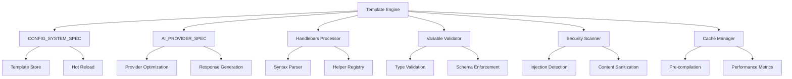

# SizeComparator Template Engine Specification

## 1. Overview

The Template Engine Specification defines a robust, security-focused template processing system for SizeComparator's AI prompt generation. This system provides Handlebars-style templating with advanced features including variable validation, conditional logic, template inheritance, provider-specific optimization, and comprehensive security controls to prevent template injection attacks.

### 1.1 Goals

- **Handlebars-style Template Processing**: Full compatibility with Handlebars syntax for AI prompt generation
- **Type-Safe Variable Substitution**: Strong typing and validation for all template variables
- **Conditional Logic & Inheritance**: Advanced template features for complex prompt scenarios
- **AI Provider Optimization**: Provider-specific template optimization and caching
- **Security-First Design**: Comprehensive protection against template injection vulnerabilities
- **Performance Optimization**: Intelligent caching and pre-compilation for production performance
- **Integration with CONFIG_SYSTEM_SPEC**: Seamless integration with configuration management
- **AI_PROVIDER_SPEC Compatibility**: Direct integration with AI provider framework

### 1.2 Integration Context



## 2. Template Engine Architecture

### 2.1 Core Components

```python
from abc import ABC, abstractmethod
from typing import Dict, Any, List, Optional, Union, Callable
from pydantic import BaseModel, Field, validator
from enum import Enum
import uuid
from datetime import datetime
import asyncio
import re

class TemplateType(Enum):
    """Template types aligned with AI_PROVIDER_SPEC requirements."""
    AI_PROMPT_SYSTEM = "ai_prompt_system"
    AI_PROMPT_USER = "ai_prompt_user"
    AI_PROMPT_ASSISTANT = "ai_prompt_assistant"
    CONDITIONAL_BLOCK = "conditional_block"
    PARTIAL_TEMPLATE = "partial_template"
    INHERITED_TEMPLATE = "inherited_template"

class VariableType(Enum):
    """Supported variable types with strict validation."""
    STRING = "string"
    NUMBER = "number"
    BOOLEAN = "boolean"
    ARRAY = "array"
    OBJECT = "object"
    ENUM = "enum"
    DATE = "date"
    URL = "url"
    EMAIL = "email"

class SecurityLevel(Enum):
    """Template security levels for execution control."""
    TRUSTED = "trusted"        # Full feature access
    RESTRICTED = "restricted"  # Limited helper access
    SANDBOXED = "sandboxed"   # Minimal features only

class TemplateVariable(BaseModel):
    """Template variable definition with comprehensive validation."""
    name: str = Field(..., regex=r"^[a-zA-Z_][a-zA-Z0-9_]*$")
    type: VariableType
    required: bool = True
    default: Optional[Any] = None
    description: str = Field(..., min_length=1, max_length=500)
    
    # Type-specific validation
    validation: Optional[Dict[str, Any]] = Field(default_factory=dict)
    
    # Security controls
    sanitize: bool = True
    allow_html: bool = False
    max_length: Optional[int] = None
    
    @validator('validation')
    def validate_validation_rules(cls, v, values):
        """Validate type-specific validation rules."""
        var_type = values.get('type')
        if not var_type:
            return v
            
        if var_type == VariableType.STRING:
            allowed_keys = {'min_length', 'max_length', 'pattern', 'enum'}
        elif var_type == VariableType.NUMBER:
            allowed_keys = {'minimum', 'maximum', 'multiple_of'}
        elif var_type == VariableType.ARRAY:
            allowed_keys = {'min_items', 'max_items', 'unique_items', 'item_type'}
        elif var_type == VariableType.ENUM:
            if 'options' not in v:
                raise ValueError("Enum type requires 'options' in validation")
            allowed_keys = {'options'}
        else:
            allowed_keys = set()
            
        invalid_keys = set(v.keys()) - allowed_keys
        if invalid_keys:
            raise ValueError(f"Invalid validation keys for {var_type}: {invalid_keys}")
        return v

class TemplateMetadata(BaseModel):
    """Comprehensive template metadata for management and optimization."""
    template_id: str = Field(..., regex=r"^[a-z][a-z0-9_]*_v\d+$")
    name: str = Field(..., min_length=1, max_length=100)
    description: str = Field(..., min_length=1, max_length=1000)
    version: str = Field(..., regex=r"^\d+\.\d+\.\d+$")
    
    # AI Provider integration
    ai_provider: Optional[str] = Field(None, regex=r"^(openai|anthropic|xai|custom)$")
    model_requirements: Optional[Dict[str, Any]] = Field(default_factory=dict)
    
    # Template hierarchy
    extends: Optional[str] = None  # Parent template ID
    blocks: List[str] = Field(default_factory=list)  # Defined blocks
    partials: List[str] = Field(default_factory=list)  # Used partials
    
    # Performance and caching
    cache_ttl_seconds: int = Field(default=3600, ge=60, le=86400)
    pre_compile: bool = True
    performance_tier: str = Field(default="standard", regex=r"^(fast|standard|comprehensive)$")
    
    # Security configuration
    security_level: SecurityLevel = SecurityLevel.RESTRICTED
    allowed_helpers: List[str] = Field(default_factory=list)
    content_security_policy: Dict[str, Any] = Field(default_factory=dict)
    
    # Usage tracking
    usage_stats: Dict[str, Any] = Field(default_factory=dict)
    last_modified: datetime = Field(default_factory=datetime.utcnow)
    created_by: str = "system"
    tags: List[str] = Field(default_factory=list)

class Template(BaseModel):
    """Complete template definition with content and metadata."""
    metadata: TemplateMetadata
    content: str = Field(..., min_length=1)
    variables: List[TemplateVariable] = Field(default_factory=list)
    
    # Template inheritance
    parent_template: Optional[str] = None
    blocks: Dict[str, str] = Field(default_factory=dict)
    
    # Conditional rendering
    conditions: Dict[str, str] = Field(default_factory=dict)
    
    # Output validation
    output_schema: Optional[Dict[str, Any]] = None
    
    # Examples and testing
    examples: List[Dict[str, Any]] = Field(default_factory=list)
    
    @validator('content')
    def validate_template_syntax(cls, v):
        """Basic syntax validation for Handlebars templates."""
        # Check for balanced braces
        open_count = v.count('{{')
        close_count = v.count('}}')
        if open_count != close_count:
            raise ValueError("Unbalanced template braces")
        
        # Check for dangerous patterns
        dangerous_patterns = [
            r'\{\{\s*#\s*exec\s*\}\}',  # Execution blocks
            r'\{\{\s*#\s*eval\s*\}\}',  # Evaluation blocks
            r'\{\{\s*require\s*["\'][^"\']*["\']',  # Module imports
        ]
        
        for pattern in dangerous_patterns:
            if re.search(pattern, v, re.IGNORECASE):
                raise ValueError(f"Potentially dangerous template pattern detected")
        
        return v
```

### 2.2 Template Engine Core

```python
class TemplateEngine:
    """Core template engine with security, performance, and AI provider integration."""
    
    def __init__(
        self,
        config_service: 'IConfigurationService',
        cache_manager: 'CacheManager',
        security_scanner: 'SecurityScanner',
        logger: Any = None
    ):
        self.config_service = config_service
        self.cache_manager = cache_manager
        self.security_scanner = security_scanner
        self.logger = logger
        
        # Template storage and management
        self.templates: Dict[str, Template] = {}
        self.compiled_templates: Dict[str, 'CompiledTemplate'] = {}
        self.helper_registry: Dict[str, Callable] = {}
        self.partial_registry: Dict[str, str] = {}
        
        # Performance tracking
        self.performance_metrics: Dict[str, Any] = {
            'render_count': 0,
            'cache_hits': 0,
            'compilation_time_ms': 0,
            'render_time_ms': 0
        }
        
        # Security configuration
        self.security_config = {
            'max_template_size': 50000,  # 50KB max template size
            'max_render_time_ms': 5000,  # 5 second render timeout
            'max_variable_count': 100,   # Max variables per template
            'max_nesting_depth': 10,     # Max nested block depth
            'allowed_protocols': ['http', 'https'],  # For URL variables
        }
        
        self._initialize_built_in_helpers()
    
    async def register_template(self, template: Template) -> bool:
        """Register template with comprehensive validation and security scanning."""
        try:
            # Validate template structure
            validation_result = await self._validate_template(template)
            if not validation_result.valid:
                self._log_error(
                    "Template validation failed",
                    template_id=template.metadata.template_id,
                    errors=validation_result.errors
                )
                return False
            
            # Security scanning
            security_result = await self.security_scanner.scan_template(template)
            if not security_result.safe:
                self._log_error(
                    "Template security scan failed",
                    template_id=template.metadata.template_id,
                    vulnerabilities=security_result.vulnerabilities
                )
                return False
            
            # Pre-compile if configured
            if template.metadata.pre_compile:
                compiled = await self._compile_template(template)
                self.compiled_templates[template.metadata.template_id] = compiled
            
            # Register template
            self.templates[template.metadata.template_id] = template
            
            # Update CONFIG_SYSTEM_SPEC integration
            await self._notify_template_registered(template)
            
            self._log_info(
                "Template registered successfully",
                template_id=template.metadata.template_id,
                version=template.metadata.version
            )
            
            return True
            
        except Exception as e:
            self._log_error(
                "Template registration failed",
                template_id=template.metadata.template_id,
                error=str(e)
            )
            return False
    
    async def render_template(
        self,
        template_id: str,
        variables: Dict[str, Any],
        ai_provider_context: Optional[Dict[str, Any]] = None,
        render_options: Optional[Dict[str, Any]] = None
    ) -> 'TemplateRenderResult':
        """Render template with comprehensive validation and optimization."""
        start_time = datetime.utcnow()
        request_id = str(uuid.uuid4())
        
        try:
            # Get template
            template = await self._get_template(template_id)
            if not template:
                raise TemplateNotFoundError(f"Template not found: {template_id}")
            
            # Validate variables
            validation_result = await self._validate_variables(template, variables)
            if not validation_result.valid:
                raise TemplateValidationError(
                    f"Variable validation failed: {validation_result.errors}"
                )
            
            # Apply AI provider optimizations
            optimized_template = await self._optimize_for_provider(
                template, ai_provider_context
            )
            
            # Check cache
            cache_key = self._generate_cache_key(template_id, variables)
            cached_result = await self.cache_manager.get(cache_key)
            if cached_result:
                self.performance_metrics['cache_hits'] += 1
                return cached_result
            
            # Render template
            rendered_content = await self._render_template_content(
                optimized_template, variables, render_options
            )
            
            # Validate output
            if template.output_schema:
                output_validation = await self._validate_output(
                    rendered_content, template.output_schema
                )
                if not output_validation.valid:
                    raise TemplateOutputValidationError(
                        f"Output validation failed: {output_validation.errors}"
                    )
            
            # Create result
            render_time_ms = (datetime.utcnow() - start_time).total_seconds() * 1000
            result = TemplateRenderResult(
                content=rendered_content,
                template_id=template_id,
                variables_used=list(variables.keys()),
                render_time_ms=render_time_ms,
                cache_key=cache_key,
                request_id=request_id,
                provider_optimizations=ai_provider_context.get('optimizations', []) if ai_provider_context else []
            )
            
            # Cache result
            await self.cache_manager.set(
                cache_key, result, ttl=template.metadata.cache_ttl_seconds
            )
            
            # Update metrics
            self.performance_metrics['render_count'] += 1
            self.performance_metrics['render_time_ms'] += render_time_ms
            
            return result
            
        except Exception as e:
            self._log_error(
                "Template rendering failed",
                template_id=template_id,
                request_id=request_id,
                error=str(e)
            )
            raise
    
    async def _render_template_content(
        self,
        template: Template,
        variables: Dict[str, Any],
        render_options: Optional[Dict[str, Any]] = None
    ) -> str:
        """Core template rendering with Handlebars processing."""
        try:
            # Get compiled template or compile on-demand
            compiled = self.compiled_templates.get(template.metadata.template_id)
            if not compiled:
                compiled = await self._compile_template(template)
            
            # Create rendering context
            context = self._create_render_context(variables, template, render_options)
            
            # Process template inheritance
            if template.parent_template:
                content = await self._process_inheritance(template, context)
            else:
                content = template.content
            
            # Render with Handlebars
            rendered = await self._handlebars_render(content, context, template)
            
            # Post-process security
            if template.metadata.security_level != SecurityLevel.TRUSTED:
                rendered = await self.security_scanner.sanitize_output(rendered)
            
            return rendered
            
        except Exception as e:
            raise TemplateRenderError(f"Template rendering failed: {str(e)}")
```

## 3. Handlebars Template Processing

### 3.1 Handlebars Parser Implementation

```python
import re
from typing import Pattern, Match, Generator

class HandlebarsParser:
    """Advanced Handlebars parser with security controls and AI provider optimization."""
    
    def __init__(self, security_level: SecurityLevel = SecurityLevel.RESTRICTED):
        self.security_level = security_level
        self.token_patterns = self._compile_patterns()
        self.max_nesting_depth = 10
        self.current_depth = 0
    
    def _compile_patterns(self) -> Dict[str, Pattern]:
        """Compile regex patterns for Handlebars tokens."""
        return {
            'variable': re.compile(r'\{\{\s*([a-zA-Z_][a-zA-Z0-9_\.]*)\s*\}\}'),
            'helper': re.compile(r'\{\{\s*([a-zA-Z_][a-zA-Z0-9_]*)\s+([^}]+)\s*\}\}'),
            'block_start': re.compile(r'\{\{\s*#\s*([a-zA-Z_][a-zA-Z0-9_]*)\s*([^}]*)\s*\}\}'),
            'block_end': re.compile(r'\{\{\s*/\s*([a-zA-Z_][a-zA-Z0-9_]*)\s*\}\}'),
            'conditional': re.compile(r'\{\{\s*#\s*if\s+([^}]+)\s*\}\}'),
            'else': re.compile(r'\{\{\s*else\s*\}\}'),
            'unless': re.compile(r'\{\{\s*#\s*unless\s+([^}]+)\s*\}\}'),
            'each': re.compile(r'\{\{\s*#\s*each\s+([a-zA-Z_][a-zA-Z0-9_\.]*)\s*\}\}'),
            'with': re.compile(r'\{\{\s*#\s*with\s+([a-zA-Z_][a-zA-Z0-9_\.]*)\s*\}\}'),
            'partial': re.compile(r'\{\{\s*>\s*([a-zA-Z_][a-zA-Z0-9_]*)\s*\}\}'),
            'comment': re.compile(r'\{\{\!--.*?--\}\}', re.DOTALL),
            'raw': re.compile(r'\{\{\{\s*([^}]+)\s*\}\}\}'),  # Triple braces for raw output
        }
    
    async def parse(self, template_content: str, context: Dict[str, Any]) -> str:
        """Parse and render Handlebars template with security controls."""
        if len(template_content) > 50000:  # 50KB limit
            raise TemplateSizeError("Template exceeds maximum size limit")
        
        # Remove comments first
        content = self.token_patterns['comment'].sub('', template_content)
        
        # Track processing for security
        self.current_depth = 0
        processing_start = datetime.utcnow()
        
        try:
            # Process in order: blocks, conditionals, variables, helpers
            content = await self._process_blocks(content, context)
            content = await self._process_conditionals(content, context)
            content = await self._process_partials(content, context)
            content = await self._process_helpers(content, context)
            content = await self._process_variables(content, context)
            
            # Check processing time
            processing_time = (datetime.utcnow() - processing_start).total_seconds() * 1000
            if processing_time > 5000:  # 5 second limit
                raise TemplateTimeoutError("Template processing timeout")
            
            return content
            
        except RecursionError:
            raise TemplateRecursionError("Template nesting depth exceeded")
    
    async def _process_variables(self, content: str, context: Dict[str, Any]) -> str:
        """Process variable substitutions with type validation."""
        def replace_variable(match: Match) -> str:
            var_path = match.group(1)
            try:
                value = self._resolve_variable_path(var_path, context)
                
                # Type-specific formatting
                if isinstance(value, bool):
                    return 'true' if value else 'false'
                elif isinstance(value, (int, float)):
                    return str(value)
                elif isinstance(value, str):
                    # Apply security sanitization
                    return self._sanitize_string_value(value, context.get('_security', {}))
                elif value is None:
                    return ''
                else:
                    return str(value)
                    
            except Exception:
                # Variable not found - return empty string or error based on config
                if context.get('_strict_mode', False):
                    raise VariableNotFoundError(f"Variable not found: {var_path}")
                return ''
        
        return self.token_patterns['variable'].sub(replace_variable, content)
    
    async def _process_conditionals(self, content: str, context: Dict[str, Any]) -> str:
        """Process if/unless conditional blocks."""
        # Process if blocks
        content = await self._process_if_blocks(content, context)
        
        # Process unless blocks  
        content = await self._process_unless_blocks(content, context)
        
        return content
    
    async def _process_if_blocks(self, content: str, context: Dict[str, Any]) -> str:
        """Process {{#if condition}} blocks with proper nesting."""
        pattern = r'\{\{\s*#\s*if\s+([^}]+)\s*\}\}(.*?)\{\{\s*/\s*if\s*\}\}'
        
        def process_if_block(match: Match) -> str:
            condition = match.group(1).strip()
            block_content = match.group(2)
            
            # Check for else clause
            else_pattern = r'^(.*?)\{\{\s*else\s*\}\}(.*)$'
            else_match = re.search(else_pattern, block_content, re.DOTALL)
            
            if else_match:
                if_content = else_match.group(1)
                else_content = else_match.group(2)
            else:
                if_content = block_content
                else_content = ''
            
            # Evaluate condition
            condition_result = self._evaluate_condition(condition, context)
            
            return if_content if condition_result else else_content
        
        # Process nested if blocks from inside out
        while re.search(pattern, content, re.DOTALL):
            content = re.sub(pattern, process_if_block, content, flags=re.DOTALL)
        
        return content
    
    async def _process_helpers(self, content: str, context: Dict[str, Any]) -> str:
        """Process helper function calls with security validation."""
        def process_helper(match: Match) -> str:
            helper_name = match.group(1)
            helper_args = match.group(2)
            
            # Security check - only allow registered helpers
            if helper_name not in context.get('_allowed_helpers', []):
                if self.security_level == SecurityLevel.SANDBOXED:
                    raise SecurityError(f"Helper not allowed: {helper_name}")
                elif self.security_level == SecurityLevel.RESTRICTED:
                    return ''  # Silently ignore
            
            # Get helper function
            helper_func = context.get('_helpers', {}).get(helper_name)
            if not helper_func:
                return ''  # Helper not found
            
            try:
                # Parse arguments
                args = self._parse_helper_arguments(helper_args, context)
                
                # Execute helper with timeout
                return asyncio.wait_for(
                    helper_func(*args), 
                    timeout=1.0  # 1 second per helper
                )
                
            except Exception as e:
                if context.get('_strict_mode', False):
                    raise HelperExecutionError(f"Helper {helper_name} failed: {str(e)}")
                return ''
        
        return self.token_patterns['helper'].sub(process_helper, content)
    
    def _evaluate_condition(self, condition: str, context: Dict[str, Any]) -> bool:
        """Safely evaluate conditional expressions."""
        # Simple condition evaluation - only allow safe operations
        safe_operators = ['==', '!=', '>', '<', '>=', '<=', 'and', 'or', 'not']
        
        # Parse condition safely
        condition = condition.strip()
        
        # Handle simple variable checks
        if ' ' not in condition:
            value = self._resolve_variable_path(condition, context)
            return bool(value)
        
        # Handle comparison operations
        for op in ['==', '!=', '>=', '<=', '>', '<']:
            if op in condition:
                parts = [p.strip() for p in condition.split(op, 1)]
                if len(parts) == 2:
                    left = self._resolve_variable_or_literal(parts[0], context)
                    right = self._resolve_variable_or_literal(parts[1], context)
                    
                    if op == '==':
                        return left == right
                    elif op == '!=':
                        return left != right
                    elif op == '>':
                        return left > right
                    elif op == '<':
                        return left < right
                    elif op == '>=':
                        return left >= right
                    elif op == '<=':
                        return left <= right
        
        # Fallback to false for complex expressions (security)
        return False
    
    def _resolve_variable_path(self, path: str, context: Dict[str, Any]) -> Any:
        """Resolve dotted variable paths like 'user.profile.name'."""
        parts = path.split('.')
        value = context
        
        for part in parts:
            if isinstance(value, dict) and part in value:
                value = value[part]
            elif hasattr(value, part):
                value = getattr(value, part)
            else:
                raise VariableNotFoundError(f"Variable path not found: {path}")
        
        return value
    
    def _sanitize_string_value(self, value: str, security_config: Dict[str, Any]) -> str:
        """Sanitize string values based on security configuration."""
        if not security_config.get('sanitize', True):
            return value
        
        # HTML escaping
        if not security_config.get('allow_html', False):
            value = (value
                    .replace('&', '&amp;')
                    .replace('<', '&lt;')
                    .replace('>', '&gt;')
                    .replace('"', '&quot;')
                    .replace("'", '&#x27;'))
        
        # Length limiting
        max_length = security_config.get('max_length')
        if max_length and len(value) > max_length:
            value = value[:max_length] + '...'
        
        return value
```

### 3.2 Built-in Helper Functions

```python
class BuiltInHelpers:
    """Built-in helper functions for template processing."""
    
    @staticmethod
    def format_number(value: Union[int, float], precision: int = 2) -> str:
        """Format numeric value with specified precision."""
        try:
            return f"{float(value):.{precision}f}"
        except (ValueError, TypeError):
            return str(value)
    
    @staticmethod
    def format_weight(value: Union[int, float], unit: str = "kg") -> str:
        """Format weight value with unit - AI provider optimized."""
        try:
            formatted_value = f"{float(value):.2f}"
            return f"{formatted_value} {unit}"
        except (ValueError, TypeError):
            return str(value)
    
    @staticmethod
    def uppercase(value: str) -> str:
        """Convert string to uppercase."""
        return str(value).upper()
    
    @staticmethod
    def lowercase(value: str) -> str:
        """Convert string to lowercase."""
        return str(value).lower()
    
    @staticmethod
    def capitalize(value: str) -> str:
        """Capitalize first letter of string."""
        return str(value).capitalize()
    
    @staticmethod
    def trim(value: str) -> str:
        """Remove leading and trailing whitespace."""
        return str(value).strip()
    
    @staticmethod
    def truncate(value: str, length: int = 50, suffix: str = "...") -> str:
        """Truncate string to specified length."""
        value_str = str(value)
        if len(value_str) <= length:
            return value_str
        return value_str[:length - len(suffix)] + suffix
    
    @staticmethod
    def default(value: Any, fallback: Any) -> Any:
        """Return fallback if value is None or empty."""
        if value is None or (isinstance(value, str) and not value.strip()):
            return fallback
        return value
    
    @staticmethod
    def join(array: List[Any], separator: str = ", ") -> str:
        """Join array elements into string."""
        if not isinstance(array, list):
            return str(array)
        return separator.join(str(item) for item in array)
    
    @staticmethod
    def length(value: Union[str, List, Dict]) -> int:
        """Get length of string, array, or object."""
        try:
            return len(value)
        except TypeError:
            return 0
    
    @staticmethod
    def math_add(a: Union[int, float], b: Union[int, float]) -> Union[int, float]:
        """Add two numbers."""
        return float(a) + float(b)
    
    @staticmethod
    def math_subtract(a: Union[int, float], b: Union[int, float]) -> Union[int, float]:
        """Subtract two numbers."""
        return float(a) - float(b)
    
    @staticmethod
    def math_multiply(a: Union[int, float], b: Union[int, float]) -> Union[int, float]:
        """Multiply two numbers."""
        return float(a) * float(b)
    
    @staticmethod
    def math_divide(a: Union[int, float], b: Union[int, float]) -> Union[int, float]:
        """Divide two numbers."""
        if float(b) == 0:
            raise ValueError("Division by zero")
        return float(a) / float(b)
    
    @staticmethod
    def ai_optimize_prompt(content: str, provider: str = "openai") -> str:
        """AI provider-specific prompt optimization."""
        if provider == "openai":
            # OpenAI prefers structured instructions
            return f"Please provide a precise response following this request:\n\n{content}"
        elif provider == "anthropic":
            # Anthropic works well with conversational tone
            return f"I need help with the following:\n\n{content}"
        elif provider == "xai":
            # X.ai benefits from explicit formatting requests
            return f"{content}\n\nPlease format your response clearly and concisely."
        else:
            return content
    
    @staticmethod
    def safe_url(value: str) -> str:
        """Validate and sanitize URL values."""
        import urllib.parse
        
        try:
            parsed = urllib.parse.urlparse(value)
            if parsed.scheme not in ['http', 'https']:
                return ''
            return value
        except Exception:
            return ''
```

## 4. Variable Validation & Type System

### 4.1 Variable Validator

```python
class VariableValidator:
    """Comprehensive variable validation with type safety."""
    
    def __init__(self, strict_mode: bool = True):
        self.strict_mode = strict_mode
        self.validation_cache: Dict[str, bool] = {}
    
    async def validate_variables(
        self,
        template: Template,
        variables: Dict[str, Any]
    ) -> ValidationResult:
        """Validate all variables against template requirements."""
        errors = []
        warnings = []
        
        # Check required variables
        required_vars = {v.name for v in template.variables if v.required}
        missing_vars = required_vars - set(variables.keys())
        if missing_vars:
            errors.extend([f"Missing required variable: {var}" for var in missing_vars])
        
        # Validate each provided variable
        for var_name, var_value in variables.items():
            var_def = self._find_variable_definition(template, var_name)
            if not var_def:
                if self.strict_mode:
                    warnings.append(f"Unknown variable: {var_name}")
                continue
            
            validation_result = await self._validate_single_variable(
                var_def, var_value
            )
            if not validation_result.valid:
                errors.extend([
                    f"Variable '{var_name}': {error}" 
                    for error in validation_result.errors
                ])
        
        return ValidationResult(
            valid=len(errors) == 0,
            errors=errors,
            warnings=warnings
        )
    
    async def _validate_single_variable(
        self,
        var_def: TemplateVariable,
        value: Any
    ) -> ValidationResult:
        """Validate single variable against its definition."""
        errors = []
        
        # Handle None/default values
        if value is None:
            if var_def.required and var_def.default is None:
                errors.append("Required variable cannot be None")
                return ValidationResult(valid=False, errors=errors)
            value = var_def.default
        
        # Type validation
        type_result = await self._validate_type(var_def.type, value)
        if not type_result.valid:
            errors.extend(type_result.errors)
        
        # Additional validation rules
        if var_def.validation:
            rule_result = await self._validate_rules(var_def, value)
            if not rule_result.valid:
                errors.extend(rule_result.errors)
        
        # Security validation
        if var_def.sanitize:
            security_result = await self._validate_security(var_def, value)
            if not security_result.valid:
                errors.extend(security_result.errors)
        
        return ValidationResult(valid=len(errors) == 0, errors=errors)
    
    async def _validate_type(self, expected_type: VariableType, value: Any) -> ValidationResult:
        """Validate value type against expected type."""
        if expected_type == VariableType.STRING:
            if not isinstance(value, str):
                return ValidationResult(valid=False, errors=["Expected string type"])
        
        elif expected_type == VariableType.NUMBER:
            if not isinstance(value, (int, float)):
                try:
                    float(value)  # Try to convert
                except (ValueError, TypeError):
                    return ValidationResult(valid=False, errors=["Expected numeric type"])
        
        elif expected_type == VariableType.BOOLEAN:
            if not isinstance(value, bool):
                # Allow string boolean representations
                if isinstance(value, str) and value.lower() in ['true', 'false']:
                    pass  # Valid
                else:
                    return ValidationResult(valid=False, errors=["Expected boolean type"])
        
        elif expected_type == VariableType.ARRAY:
            if not isinstance(value, list):
                return ValidationResult(valid=False, errors=["Expected array type"])
        
        elif expected_type == VariableType.OBJECT:
            if not isinstance(value, dict):
                return ValidationResult(valid=False, errors=["Expected object type"])
        
        elif expected_type == VariableType.DATE:
            if isinstance(value, str):
                try:
                    from datetime import datetime
                    datetime.fromisoformat(value.replace('Z', '+00:00'))
                except ValueError:
                    return ValidationResult(valid=False, errors=["Invalid date format"])
            elif not isinstance(value, datetime):
                return ValidationResult(valid=False, errors=["Expected date type"])
        
        elif expected_type == VariableType.URL:
            if not isinstance(value, str):
                return ValidationResult(valid=False, errors=["URL must be string"])
            
            import urllib.parse
            try:
                parsed = urllib.parse.urlparse(value)
                if not parsed.scheme or not parsed.netloc:
                    return ValidationResult(valid=False, errors=["Invalid URL format"])
            except Exception:
                return ValidationResult(valid=False, errors=["Invalid URL"])
        
        elif expected_type == VariableType.EMAIL:
            if not isinstance(value, str):
                return ValidationResult(valid=False, errors=["Email must be string"])
            
            # Simple email validation
            email_pattern = r'^[a-zA-Z0-9._%+-]+@[a-zA-Z0-9.-]+\.[a-zA-Z]{2,}$'
            if not re.match(email_pattern, value):
                return ValidationResult(valid=False, errors=["Invalid email format"])
        
        return ValidationResult(valid=True, errors=[])
    
    async def _validate_rules(self, var_def: TemplateVariable, value: Any) -> ValidationResult:
        """Validate value against specific validation rules."""
        errors = []
        rules = var_def.validation
        
        if var_def.type == VariableType.STRING:
            if 'min_length' in rules and len(str(value)) < rules['min_length']:
                errors.append(f"String too short (min: {rules['min_length']})")
            
            if 'max_length' in rules and len(str(value)) > rules['max_length']:
                errors.append(f"String too long (max: {rules['max_length']})")
            
            if 'pattern' in rules:
                if not re.match(rules['pattern'], str(value)):
                    errors.append(f"String doesn't match pattern: {rules['pattern']}")
            
            if 'enum' in rules and value not in rules['enum']:
                errors.append(f"Value must be one of: {rules['enum']}")
        
        elif var_def.type == VariableType.NUMBER:
            numeric_value = float(value)
            
            if 'minimum' in rules and numeric_value < rules['minimum']:
                errors.append(f"Number too small (min: {rules['minimum']})")
            
            if 'maximum' in rules and numeric_value > rules['maximum']:
                errors.append(f"Number too large (max: {rules['maximum']})")
            
            if 'multiple_of' in rules and numeric_value % rules['multiple_of'] != 0:
                errors.append(f"Number must be multiple of {rules['multiple_of']}")
        
        elif var_def.type == VariableType.ARRAY:
            if 'min_items' in rules and len(value) < rules['min_items']:
                errors.append(f"Array too short (min items: {rules['min_items']})")
            
            if 'max_items' in rules and len(value) > rules['max_items']:
                errors.append(f"Array too long (max items: {rules['max_items']})")
            
            if 'unique_items' in rules and rules['unique_items']:
                if len(value) != len(set(str(item) for item in value)):
                    errors.append("Array items must be unique")
        
        elif var_def.type == VariableType.ENUM:
            if 'options' in rules and value not in rules['options']:
                errors.append(f"Value must be one of: {rules['options']}")
        
        return ValidationResult(valid=len(errors) == 0, errors=errors)
```

## 5. Template Inheritance & Conditional Logic

### 5.1 Template Inheritance System

```python
class TemplateInheritanceProcessor:
    """Advanced template inheritance with block overrides and multiple inheritance."""
    
    def __init__(self, template_registry: Dict[str, Template]):
        self.template_registry = template_registry
        self.inheritance_cache: Dict[str, str] = {}
        self.processing_stack: List[str] = []  # Prevent circular inheritance
    
    async def process_inheritance(
        self,
        template: Template,
        context: Dict[str, Any]
    ) -> str:
        """Process template inheritance with block overrides."""
        if not template.parent_template:
            return template.content
        
        # Check for circular inheritance
        template_id = template.metadata.template_id
        if template_id in self.processing_stack:
            raise CircularInheritanceError(
                f"Circular inheritance detected: {' -> '.join(self.processing_stack + [template_id])}"
            )
        
        self.processing_stack.append(template_id)
        
        try:
            # Get parent template
            parent = self.template_registry.get(template.parent_template)
            if not parent:
                raise ParentTemplateNotFoundError(
                    f"Parent template not found: {template.parent_template}"
                )
            
            # Process parent inheritance recursively
            parent_content = await self.process_inheritance(parent, context)
            
            # Process block overrides
            final_content = await self._process_block_overrides(
                parent_content, template, context
            )
            
            return final_content
            
        finally:
            self.processing_stack.pop()
    
    async def _process_block_overrides(
        self,
        parent_content: str,
        child_template: Template,
        context: Dict[str, Any]
    ) -> str:
        """Process block overrides from child template."""
        content = parent_content
        
        # Find all block definitions in parent
        block_pattern = r'\{\{\s*#\s*block\s+([a-zA-Z_][a-zA-Z0-9_]*)\s*\}\}(.*?)\{\{\s*/\s*block\s*\}\}'
        
        def replace_block(match: Match) -> str:
            block_name = match.group(1)
            default_content = match.group(2)
            
            # Check if child template overrides this block
            if block_name in child_template.blocks:
                # Use child template's block content
                return child_template.blocks[block_name]
            else:
                # Use default content from parent
                return default_content
        
        # Replace blocks
        content = re.sub(block_pattern, replace_block, content, flags=re.DOTALL)
        
        return content
    
    def validate_inheritance_chain(self, template: Template) -> ValidationResult:
        """Validate template inheritance chain for circular dependencies."""
        visited = set()
        current = template
        
        while current and current.parent_template:
            if current.metadata.template_id in visited:
                return ValidationResult(
                    valid=False,
                    errors=[f"Circular inheritance in template: {current.metadata.template_id}"]
                )
            
            visited.add(current.metadata.template_id)
            current = self.template_registry.get(current.parent_template)
            
            if not current:
                return ValidationResult(
                    valid=False,
                    errors=[f"Parent template not found in chain"]
                )
        
        return ValidationResult(valid=True, errors=[])
```

### 5.2 Advanced Conditional Logic

```python
class ConditionalProcessor:
    """Advanced conditional logic processing with complex expressions."""
    
    def __init__(self):
        self.condition_cache: Dict[str, bool] = {}
        self.expression_parser = ExpressionParser()
    
    async def process_conditionals(
        self,
        content: str,
        context: Dict[str, Any]
    ) -> str:
        """Process all conditional logic in template."""
        # Process nested conditionals from innermost to outermost
        processed = content
        
        # Handle complex if/else/elseif chains
        processed = await self._process_if_elseif_else_chains(processed, context)
        
        # Handle unless blocks
        processed = await self._process_unless_blocks(processed, context)
        
        # Handle with blocks (context switching)
        processed = await self._process_with_blocks(processed, context)
        
        # Handle each blocks (iteration)
        processed = await self._process_each_blocks(processed, context)
        
        return processed
    
    async def _process_if_elseif_else_chains(
        self,
        content: str,
        context: Dict[str, Any]
    ) -> str:
        """Process complex if/elseif/else conditional chains."""
        # Pattern for if/elseif/else chains
        pattern = (
            r'\{\{\s*#\s*if\s+([^}]+)\s*\}\}'
            r'(.*?)'
            r'(?:\{\{\s*else\s*if\s+([^}]+)\s*\}\}(.*?))*'
            r'(?:\{\{\s*else\s*\}\}(.*?))?'
            r'\{\{\s*/\s*if\s*\}\}'
        )
        
        def process_conditional_chain(match: Match) -> str:
            groups = match.groups()
            
            # Primary if condition
            if_condition = groups[0]
            if_content = groups[1]
            
            # Evaluate primary condition
            if self._evaluate_condition(if_condition, context):
                return if_content
            
            # Check elseif conditions (would need more complex parsing)
            # For now, handle simple if/else
            if len(groups) > 4 and groups[4]:  # else content
                return groups[4]
            
            return ''  # No conditions matched
        
        # Process all conditional chains
        while re.search(pattern, content, re.DOTALL):
            content = re.sub(pattern, process_conditional_chain, content, flags=re.DOTALL)
        
        return content
    
    async def _process_each_blocks(
        self,
        content: str,
        context: Dict[str, Any]
    ) -> str:
        """Process each/iteration blocks with comprehensive context."""
        pattern = r'\{\{\s*#\s*each\s+([a-zA-Z_][a-zA-Z0-9_\.]*)\s*\}\}(.*?)\{\{\s*/\s*each\s*\}\}'
        
        def process_each_block(match: Match) -> str:
            array_path = match.group(1)
            block_content = match.group(2)
            
            try:
                array_value = self._resolve_variable_path(array_path, context)
                if not isinstance(array_value, list):
                    return ''  # Not iterable
                
                rendered_items = []
                for index, item in enumerate(array_value):
                    # Create iteration context
                    item_context = context.copy()
                    item_context.update({
                        'this': item,
                        '@index': index,
                        '@first': index == 0,
                        '@last': index == len(array_value) - 1,
                        '@length': len(array_value)
                    })
                    
                    # Render block content with item context
                    # This would need recursive processing
                    rendered_item = self._render_with_context(block_content, item_context)
                    rendered_items.append(rendered_item)
                
                return ''.join(rendered_items)
                
            except Exception:
                return ''  # Failed to process
        
        return re.sub(pattern, process_each_block, content, flags=re.DOTALL)
    
    def _evaluate_condition(self, condition: str, context: Dict[str, Any]) -> bool:
        """Evaluate complex conditional expressions safely."""
        # Cache frequently used conditions
        cache_key = f"{condition}:{hash(str(context))}"
        if cache_key in self.condition_cache:
            return self.condition_cache[cache_key]
        
        try:
            result = self.expression_parser.evaluate(condition, context)
            self.condition_cache[cache_key] = result
            return result
        except Exception:
            return False
    
    def _resolve_variable_path(self, path: str, context: Dict[str, Any]) -> Any:
        """Resolve dotted variable paths with safe fallbacks."""
        parts = path.split('.')
        value = context
        
        for part in parts:
            if isinstance(value, dict) and part in value:
                value = value[part]
            elif hasattr(value, part):
                value = getattr(value, part)
            else:
                return None
        
        return value

class ExpressionParser:
    """Safe expression parser for template conditionals."""
    
    def __init__(self):
        self.allowed_operators = {
            'and', 'or', 'not', '==', '!=', '>', '<', '>=', '<=',
            '+', '-', '*', '/', '%', 'in', 'not in'
        }
    
    def evaluate(self, expression: str, context: Dict[str, Any]) -> bool:
        """Safely evaluate boolean expressions."""
        # This is a simplified implementation
        # In production, use a proper expression parser like ast.literal_eval
        # with security restrictions
        
        # Handle simple comparisons
        for op in ['==', '!=', '>=', '<=', '>', '<']:
            if op in expression:
                left, right = expression.split(op, 1)
                left_val = self._resolve_value(left.strip(), context)
                right_val = self._resolve_value(right.strip(), context)
                
                if op == '==':
                    return left_val == right_val
                elif op == '!=':
                    return left_val != right_val
                elif op == '>':
                    return left_val > right_val
                elif op == '<':
                    return left_val < right_val
                elif op == '>=':
                    return left_val >= right_val
                elif op == '<=':
                    return left_val <= right_val
        
        # Handle logical operators
        if ' and ' in expression:
            parts = expression.split(' and ')
            return all(self.evaluate(part.strip(), context) for part in parts)
        
        if ' or ' in expression:
            parts = expression.split(' or ')
            return any(self.evaluate(part.strip(), context) for part in parts)
        
        if expression.startswith('not '):
            return not self.evaluate(expression[4:].strip(), context)
        
        # Handle simple variable checks
        return bool(self._resolve_value(expression, context))
    
    def _resolve_value(self, value_str: str, context: Dict[str, Any]) -> Any:
        """Resolve value from string - variable or literal."""
        value_str = value_str.strip()
        
        # String literals
        if (value_str.startswith('"') and value_str.endswith('"')) or \
           (value_str.startswith("'") and value_str.endswith("'")):
            return value_str[1:-1]
        
        # Numeric literals
        try:
            if '.' in value_str:
                return float(value_str)
            else:
                return int(value_str)
        except ValueError:
            pass
        
        # Boolean literals
        if value_str.lower() == 'true':
            return True
        if value_str.lower() == 'false':
            return False
        
        # Null literal
        if value_str.lower() in ['null', 'none']:
            return None
        
        # Variable reference
        return self._resolve_variable_path(value_str, context)
    
    def _resolve_variable_path(self, path: str, context: Dict[str, Any]) -> Any:
        """Resolve variable path in context."""
        parts = path.split('.')
        value = context
        
        for part in parts:
            if isinstance(value, dict) and part in value:
                value = value[part]
            elif hasattr(value, part):
                value = getattr(value, part)
            else:
                return None
        
        return value
```

## 6. AI Provider-Specific Template Optimization

### 6.1 Provider Optimization Engine

```python
class AIProviderOptimizer:
    """AI provider-specific template optimization and adaptation."""
    
    def __init__(self):
        self.optimization_strategies = {
            'openai': OpenAIOptimizationStrategy(),
            'anthropic': AnthropicOptimizationStrategy(),
            'xai': XAIOptimizationStrategy(),
            'custom': CustomProviderOptimizationStrategy()
        }
        self.optimization_cache: Dict[str, str] = {}
    
    async def optimize_template(
        self,
        template: Template,
        provider_context: Dict[str, Any]
    ) -> Template:
        """Optimize template for specific AI provider."""
        provider_name = provider_context.get('provider', 'openai')
        
        # Check cache
        cache_key = f"{template.metadata.template_id}:{provider_name}:{hash(str(provider_context))}"
        if cache_key in self.optimization_cache:
            optimized_template = template.copy()
            optimized_template.content = self.optimization_cache[cache_key]
            return optimized_template
        
        # Get optimization strategy
        strategy = self.optimization_strategies.get(provider_name)
        if not strategy:
            return template  # No optimization available
        
        # Apply optimizations
        optimized_content = await strategy.optimize(template, provider_context)
        
        # Cache result
        self.optimization_cache[cache_key] = optimized_content
        
        # Create optimized template
        optimized_template = template.copy()
        optimized_template.content = optimized_content
        
        return optimized_template
    
    def get_provider_requirements(self, provider: str) -> Dict[str, Any]:
        """Get provider-specific requirements and constraints."""
        requirements = {
            'openai': {
                'max_tokens': 128000,
                'supports_json_mode': True,
                'supports_functions': True,
                'preferred_format': 'structured',
                'temperature_range': [0.0, 2.0],
                'top_p_range': [0.0, 1.0]
            },
            'anthropic': {
                'max_tokens': 200000,
                'supports_json_mode': False,
                'supports_functions': False,
                'preferred_format': 'conversational',
                'temperature_range': [0.0, 1.0],
                'top_p_range': [0.0, 1.0]
            },
            'xai': {
                'max_tokens': 32000,
                'supports_json_mode': True,
                'supports_functions': False,
                'preferred_format': 'direct',
                'temperature_range': [0.0, 2.0],
                'top_p_range': [0.0, 1.0]
            }
        }
        
        return requirements.get(provider, {})

class OpenAIOptimizationStrategy:
    """OpenAI-specific template optimization."""
    
    async def optimize(self, template: Template, context: Dict[str, Any]) -> str:
        """Optimize template for OpenAI models."""
        content = template.content
        model = context.get('model', 'gpt-4')
        
        # Add structured output instructions for JSON mode
        if context.get('json_mode', False):
            content = self._add_json_instructions(content)
        
        # Optimize for specific models
        if model.startswith('gpt-4'):
            content = self._optimize_for_gpt4(content)
        elif model.startswith('gpt-3.5'):
            content = self._optimize_for_gpt35(content)
        
        # Add token efficiency optimizations
        content = self._optimize_token_usage(content)
        
        return content
    
    def _add_json_instructions(self, content: str) -> str:
        """Add JSON mode instructions for OpenAI."""
        json_suffix = "\n\nIMPORTANT: Respond with valid JSON only. Do not include any text outside the JSON structure."
        return content + json_suffix
    
    def _optimize_for_gpt4(self, content: str) -> str:
        """GPT-4 specific optimizations."""
        # GPT-4 handles complex instructions well
        return content
    
    def _optimize_for_gpt35(self, content: str) -> str:
        """GPT-3.5 specific optimizations."""
        # Simplify instructions for GPT-3.5
        # Break down complex requests
        return self._simplify_instructions(content)
    
    def _optimize_token_usage(self, content: str) -> str:
        """Optimize template for token efficiency."""
        # Remove redundant whitespace
        content = re.sub(r'\n\s*\n', '\n\n', content)
        content = re.sub(r'[ \t]+', ' ', content)
        
        # Replace verbose phrases with concise alternatives
        replacements = {
            'Please provide': 'Provide',
            'I would like you to': '',
            'Could you please': 'Please',
            'It would be great if you could': 'Please'
        }
        
        for verbose, concise in replacements.items():
            content = content.replace(verbose, concise)
        
        return content.strip()
    
    def _simplify_instructions(self, content: str) -> str:
        """Simplify complex instructions for better model understanding."""
        # Break long sentences into shorter ones
        content = re.sub(r'([.!?])\s*([A-Z])', r'\1\n\2', content)
        
        # Add numbered steps for complex processes
        if 'and' in content and len(content) > 200:
            # This is a simplified approach - in practice, use NLP parsing
            sentences = content.split('. ')
            if len(sentences) > 3:
                numbered_content = '\n'.join([
                    f"{i+1}. {sentence.strip()}" 
                    for i, sentence in enumerate(sentences)
                ])
                return numbered_content
        
        return content

class AnthropicOptimizationStrategy:
    """Anthropic Claude-specific template optimization."""
    
    async def optimize(self, template: Template, context: Dict[str, Any]) -> str:
        """Optimize template for Claude models."""
        content = template.content
        model = context.get('model', 'claude-3-sonnet')
        
        # Claude prefers conversational, helpful tone
        content = self._add_conversational_framing(content)
        
        # Add XML-style structure for better parsing
        content = self._add_xml_structure(content)
        
        # Optimize for specific Claude models
        if 'opus' in model:
            content = self._optimize_for_opus(content)
        elif 'sonnet' in model:
            content = self._optimize_for_sonnet(content)
        elif 'haiku' in model:
            content = self._optimize_for_haiku(content)
        
        return content
    
    def _add_conversational_framing(self, content: str) -> str:
        """Add conversational framing for Claude."""
        if not content.startswith(('Hi', 'Hello', 'I need', 'Please help')):
            return f"I need help with the following task:\n\n{content}"
        return content
    
    def _add_xml_structure(self, content: str) -> str:
        """Add XML-style structure that Claude handles well."""
        if '<task>' not in content:
            structured = f"<task>\n{content}\n</task>"
            
            # Add output format specification
            structured += "\n\n<output_format>\nProvide your response in the requested format.\n</output_format>"
            
            return structured
        return content
    
    def _optimize_for_opus(self, content: str) -> str:
        """Claude-3 Opus optimizations (most capable)."""
        # Opus can handle complex, detailed instructions
        return content
    
    def _optimize_for_sonnet(self, content: str) -> str:
        """Claude-3 Sonnet optimizations (balanced)."""
        # Sonnet benefits from clear structure
        return self._add_clear_structure(content)
    
    def _optimize_for_haiku(self, content: str) -> str:
        """Claude-3 Haiku optimizations (fast, simple)."""
        # Haiku works best with concise, direct instructions
        return self._make_concise(content)
    
    def _add_clear_structure(self, content: str) -> str:
        """Add clear structural elements."""
        if '\n\n' not in content and len(content) > 100:
            # Add paragraph breaks for readability
            sentences = content.split('. ')
            if len(sentences) > 2:
                midpoint = len(sentences) // 2
                content = '. '.join(sentences[:midpoint]) + '.\n\n' + '. '.join(sentences[midpoint:])
        return content
    
    def _make_concise(self, content: str) -> str:
        """Make content more concise for Haiku."""
        # Remove unnecessary words and phrases
        concise_replacements = {
            'in order to': 'to',
            'for the purpose of': 'to',
            'at this point in time': 'now',
            'due to the fact that': 'because',
            'in the event that': 'if'
        }
        
        for verbose, concise in concise_replacements.items():
            content = content.replace(verbose, concise)
        
        return content

class XAIOptimizationStrategy:
    """X.ai Grok-specific template optimization."""
    
    async def optimize(self, template: Template, context: Dict[str, Any]) -> str:
        """Optimize template for Grok models."""
        content = template.content
        
        # Grok benefits from direct, clear instructions
        content = self._make_direct(content)
        
        # Add explicit formatting requests
        content = self._add_formatting_instructions(content)
        
        # Optimize for Grok's unique characteristics
        content = self._optimize_for_grok(content)
        
        return content
    
    def _make_direct(self, content: str) -> str:
        """Make instructions more direct for Grok."""
        # Remove polite but unnecessary phrases
        direct_replacements = {
            'If you could please': 'Please',
            'I was wondering if you might': 'Please',
            'Would it be possible to': 'Please',
            'I would appreciate if you could': 'Please'
        }
        
        for polite, direct in direct_replacements.items():
            content = content.replace(polite, direct)
        
        return content
    
    def _add_formatting_instructions(self, content: str) -> str:
        """Add explicit formatting instructions for Grok."""
        if 'format' not in content.lower():
            content += "\n\nPlease format your response clearly and organize the information logically."
        return content
    
    def _optimize_for_grok(self, content: str) -> str:
        """Grok-specific optimizations."""
        # Grok sometimes benefits from explicit step-by-step instructions
        if len(content) > 150 and 'step' not in content.lower():
            content += "\n\nPlease approach this step-by-step."
        
        return content
```

## 7. Template Caching & Performance Optimization

### 7.1 Multi-Level Caching System

```python
class TemplateCacheManager:
    """Multi-level caching system for template performance optimization."""
    
    def __init__(self, config: Dict[str, Any]):
        self.config = config
        
        # Memory cache (L1) - fastest access
        self.memory_cache: Dict[str, Any] = {}
        self.memory_cache_stats = {
            'hits': 0, 'misses': 0, 'evictions': 0
        }
        
        # Redis cache (L2) - shared across instances
        self.redis_client = None
        if config.get('redis_enabled', True):
            self._initialize_redis()
        
        # File cache (L3) - persistent storage
        self.file_cache_dir = config.get('file_cache_dir', '/tmp/template_cache')
        os.makedirs(self.file_cache_dir, exist_ok=True)
        
        # Cache policies
        self.max_memory_cache_size = config.get('max_memory_cache_size', 1000)
        self.default_ttl = config.get('default_ttl', 3600)
        self.cache_compression = config.get('compression_enabled', True)
        
        # Performance tracking
        self.performance_metrics = {
            'total_requests': 0,
            'cache_hits': 0,
            'cache_misses': 0,
            'avg_render_time_ms': 0,
            'cache_size_bytes': 0
        }
    
    async def get_compiled_template(self, template_id: str) -> Optional['CompiledTemplate']:
        """Get compiled template from cache hierarchy."""
        self.performance_metrics['total_requests'] += 1
        
        # L1: Memory cache
        cache_key = f"compiled:{template_id}"
        if cache_key in self.memory_cache:
            self.performance_metrics['cache_hits'] += 1
            self.memory_cache_stats['hits'] += 1
            return self.memory_cache[cache_key]
        
        # L2: Redis cache
        if self.redis_client:
            try:
                cached_data = await self.redis_client.get(cache_key)
                if cached_data:
                    compiled_template = self._deserialize_template(cached_data)
                    # Promote to L1 cache
                    await self._store_in_memory_cache(cache_key, compiled_template)
                    self.performance_metrics['cache_hits'] += 1
                    return compiled_template
            except Exception as e:
                self._log_cache_error("Redis cache error", e)
        
        # L3: File cache
        file_path = os.path.join(self.file_cache_dir, f"{template_id}.cache")
        if os.path.exists(file_path):
            try:
                with open(file_path, 'rb') as f:
                    cached_data = f.read()
                    if self.cache_compression:
                        cached_data = gzip.decompress(cached_data)
                    
                    compiled_template = self._deserialize_template(cached_data)
                    
                    # Promote to higher cache levels
                    await self._store_in_memory_cache(cache_key, compiled_template)
                    if self.redis_client:
                        await self._store_in_redis_cache(cache_key, compiled_template)
                    
                    self.performance_metrics['cache_hits'] += 1
                    return compiled_template
            except Exception as e:
                self._log_cache_error("File cache error", e)
        
        # Cache miss
        self.performance_metrics['cache_misses'] += 1
        self.memory_cache_stats['misses'] += 1
        return None
    
    async def store_compiled_template(
        self,
        template_id: str,
        compiled_template: 'CompiledTemplate',
        ttl: Optional[int] = None
    ):
        """Store compiled template in cache hierarchy."""
        cache_key = f"compiled:{template_id}"
        ttl = ttl or self.default_ttl
        
        # Store in all cache levels
        await self._store_in_memory_cache(cache_key, compiled_template)
        
        if self.redis_client:
            await self._store_in_redis_cache(cache_key, compiled_template, ttl)
        
        await self._store_in_file_cache(cache_key, compiled_template)
    
    async def get_rendered_template(
        self,
        cache_key: str
    ) -> Optional['TemplateRenderResult']:
        """Get rendered template result from cache."""
        # Only use memory and Redis for rendered results (they expire faster)
        
        # L1: Memory cache
        if cache_key in self.memory_cache:
            self.performance_metrics['cache_hits'] += 1
            return self.memory_cache[cache_key]
        
        # L2: Redis cache
        if self.redis_client:
            try:
                cached_data = await self.redis_client.get(cache_key)
                if cached_data:
                    result = self._deserialize_render_result(cached_data)
                    # Promote to L1
                    await self._store_in_memory_cache(cache_key, result)
                    self.performance_metrics['cache_hits'] += 1
                    return result
            except Exception as e:
                self._log_cache_error("Redis render cache error", e)
        
        self.performance_metrics['cache_misses'] += 1
        return None
    
    async def store_rendered_template(
        self,
        cache_key: str,
        result: 'TemplateRenderResult',
        ttl: Optional[int] = None
    ):
        """Store rendered template result in cache."""
        ttl = ttl or 600  # Shorter TTL for rendered results
        
        await self._store_in_memory_cache(cache_key, result)
        
        if self.redis_client:
            await self._store_in_redis_cache(cache_key, result, ttl)
    
    async def invalidate_template(self, template_id: str):
        """Invalidate all cached versions of a template."""
        patterns = [
            f"compiled:{template_id}",
            f"rendered:{template_id}:*",
            f"optimized:{template_id}:*"
        ]
        
        for pattern in patterns:
            # Remove from memory cache
            keys_to_remove = [k for k in self.memory_cache.keys() if k.startswith(pattern.replace('*', ''))]
            for key in keys_to_remove:
                del self.memory_cache[key]
            
            # Remove from Redis
            if self.redis_client:
                try:
                    redis_keys = await self.redis_client.keys(pattern)
                    if redis_keys:
                        await self.redis_client.delete(*redis_keys)
                except Exception as e:
                    self._log_cache_error("Redis invalidation error", e)
            
            # Remove from file cache
            if '*' not in pattern:
                file_path = os.path.join(self.file_cache_dir, f"{template_id}.cache")
                if os.path.exists(file_path):
                    os.remove(file_path)
    
    async def _store_in_memory_cache(self, key: str, value: Any):
        """Store value in memory cache with LRU eviction."""
        if len(self.memory_cache) >= self.max_memory_cache_size:
            # LRU eviction - remove oldest item
            oldest_key = next(iter(self.memory_cache))
            del self.memory_cache[oldest_key]
            self.memory_cache_stats['evictions'] += 1
        
        self.memory_cache[key] = value
    
    async def _store_in_redis_cache(
        self,
        key: str,
        value: Any,
        ttl: int = None
    ):
        """Store value in Redis cache."""
        if not self.redis_client:
            return
        
        try:
            serialized_data = self._serialize_value(value)
            if ttl:
                await self.redis_client.setex(key, ttl, serialized_data)
            else:
                await self.redis_client.set(key, serialized_data)
        except Exception as e:
            self._log_cache_error("Redis store error", e)
    
    async def _store_in_file_cache(self, key: str, value: Any):
        """Store value in file cache."""
        try:
            serialized_data = self._serialize_value(value)
            if self.cache_compression:
                serialized_data = gzip.compress(serialized_data)
            
            # Extract template_id from key for filename
            template_id = key.split(':')[1] if ':' in key else key
            file_path = os.path.join(self.file_cache_dir, f"{template_id}.cache")
            
            with open(file_path, 'wb') as f:
                f.write(serialized_data)
                
        except Exception as e:
            self._log_cache_error("File cache store error", e)
    
    def _serialize_value(self, value: Any) -> bytes:
        """Serialize value for caching."""
        import pickle
        return pickle.dumps(value)
    
    def _deserialize_template(self, data: bytes) -> 'CompiledTemplate':
        """Deserialize compiled template from cache."""
        import pickle
        return pickle.loads(data)
    
    def _deserialize_render_result(self, data: bytes) -> 'TemplateRenderResult':
        """Deserialize render result from cache."""
        import pickle
        return pickle.loads(data)
    
    def get_cache_statistics(self) -> Dict[str, Any]:
        """Get comprehensive cache statistics."""
        hit_rate = (
            self.performance_metrics['cache_hits'] / 
            max(self.performance_metrics['total_requests'], 1)
        )
        
        return {
            'memory_cache': {
                'size': len(self.memory_cache),
                'max_size': self.max_memory_cache_size,
                'hits': self.memory_cache_stats['hits'],
                'misses': self.memory_cache_stats['misses'],
                'evictions': self.memory_cache_stats['evictions']
            },
            'overall_performance': {
                'total_requests': self.performance_metrics['total_requests'],
                'cache_hits': self.performance_metrics['cache_hits'],
                'cache_misses': self.performance_metrics['cache_misses'],
                'hit_rate': hit_rate,
                'avg_render_time_ms': self.performance_metrics['avg_render_time_ms']
            },
            'redis_cache': {
                'enabled': self.redis_client is not None,
                'connection_status': 'connected' if self.redis_client else 'disabled'
            },
            'file_cache': {
                'directory': self.file_cache_dir,
                'compression_enabled': self.cache_compression
            }
        }

class CompiledTemplate:
    """Pre-compiled template for performance optimization."""
    
    def __init__(self, template: Template):
        self.template_id = template.metadata.template_id
        self.original_template = template
        self.compiled_at = datetime.utcnow()
        
        # Pre-parsed template structure
        self.tokens = self._parse_template_tokens(template.content)
        self.variables_used = self._extract_variables(template.content)
        self.helpers_used = self._extract_helpers(template.content)
        self.conditionals = self._extract_conditionals(template.content)
        
        # Optimization metadata
        self.optimization_level = template.metadata.performance_tier
        self.cache_metadata = {
            'size_bytes': len(template.content.encode('utf-8')),
            'complexity_score': self._calculate_complexity(),
            'estimated_render_time_ms': self._estimate_render_time()
        }
    
    def _parse_template_tokens(self, content: str) -> List[Dict[str, Any]]:
        """Pre-parse template into tokens for faster rendering."""
        tokens = []
        # This would implement a full tokenizer
        # For now, a simplified version
        return tokens
    
    def _extract_variables(self, content: str) -> Set[str]:
        """Extract all variables used in template."""
        variables = set()
        pattern = r'\{\{\s*([a-zA-Z_][a-zA-Z0-9_\.]*)\s*\}\}'
        for match in re.finditer(pattern, content):
            variables.add(match.group(1))
        return variables
    
    def _extract_helpers(self, content: str) -> Set[str]:
        """Extract all helpers used in template."""
        helpers = set()
        pattern = r'\{\{\s*([a-zA-Z_][a-zA-Z0-9_]*)\s+[^}]+\s*\}\}'
        for match in re.finditer(pattern, content):
            helpers.add(match.group(1))
        return helpers
    
    def _extract_conditionals(self, content: str) -> List[str]:
        """Extract conditional blocks for optimization."""
        conditionals = []
        patterns = [
            r'\{\{\s*#\s*if\s+([^}]+)\s*\}\}',
            r'\{\{\s*#\s*unless\s+([^}]+)\s*\}\}'
        ]
        for pattern in patterns:
            for match in re.finditer(pattern, content):
                conditionals.append(match.group(1))
        return conditionals
    
    def _calculate_complexity(self) -> int:
        """Calculate template complexity score for caching decisions."""
        complexity = 0
        complexity += len(self.variables_used)
        complexity += len(self.helpers_used) * 2
        complexity += len(self.conditionals) * 3
        return complexity
    
    def _estimate_render_time_ms(self) -> float:
        """Estimate rendering time based on complexity."""
        base_time = 1.0  # 1ms base
        complexity_time = self.cache_metadata['complexity_score'] * 0.5
        return base_time + complexity_time
```

## 8. Security & Template Injection Prevention

### 8.1 Security Scanner

```python
class TemplateSecurityScanner:
    """Comprehensive security scanner for template injection prevention."""
    
    def __init__(self):
        self.dangerous_patterns = self._compile_dangerous_patterns()
        self.content_filters = self._initialize_content_filters()
        self.security_policies = self._load_security_policies()
    
    def _compile_dangerous_patterns(self) -> List[Pattern]:
        """Compile patterns for dangerous template constructs."""
        patterns = [
            # Code execution patterns
            r'\{\{\s*#\s*(exec|eval|include|require)\s*\}\}',
            r'\{\{\s*["\'].*?(exec|eval|import|require).*?["\']',
            
            # File system access
            r'\{\{\s*.*?(file|fs|path|require|import)\s*.*?\}\}',
            r'\{\{\s*.*?(\.\./|/etc/|/proc/|/sys/)',
            
            # Network access
            r'\{\{\s*.*?(http|https|ftp|ssh|tcp)\s*.*?\}\}',
            r'\{\{\s*.*?(fetch|request|axios|curl)',
            
            # Process execution
            r'\{\{\s*.*?(process|child_process|spawn|exec)',
            r'\{\{\s*.*?(system|shell|cmd|bash)',
            
            # Dynamic code generation
            r'\{\{\s*.*?(Function|eval|setTimeout|setInterval)',
            r'\{\{\s*.*?(new\s+Function|eval\s*\()',
            
            # Template engine bypass attempts
            r'\{\{\{\s*.*?constructor.*?\}\}\}',
            r'\{\{\s*.*?__proto__.*?\}\}',
            r'\{\{\s*.*?prototype.*?\}\}',
            
            # Script injection
            r'<\s*script[^>]*>',
            r'javascript\s*:',
            r'on\w+\s*=',
            
            # SQL injection patterns in templates
            r'\{\{\s*.*?(union|select|insert|update|delete|drop)\s+.*?\}\}',
        ]
        
        return [re.compile(pattern, re.IGNORECASE | re.MULTILINE) for pattern in patterns]
    
    async def scan_template(self, template: Template) -> SecurityScanResult:
        """Perform comprehensive security scan of template."""
        vulnerabilities = []
        warnings = []
        
        # Pattern-based scanning
        pattern_results = await self._scan_dangerous_patterns(template.content)
        vulnerabilities.extend(pattern_results.vulnerabilities)
        warnings.extend(pattern_results.warnings)
        
        # Helper function validation
        helper_results = await self._validate_helpers(template)
        vulnerabilities.extend(helper_results.vulnerabilities)
        warnings.extend(helper_results.warnings)
        
        # Variable security validation
        variable_results = await self._validate_variable_security(template)
        vulnerabilities.extend(variable_results.vulnerabilities)
        warnings.extend(variable_results.warnings)
        
        # Content security policy validation
        csp_results = await self._validate_content_security(template)
        vulnerabilities.extend(csp_results.vulnerabilities)
        warnings.extend(csp_results.warnings)
        
        # Template size and complexity limits
        complexity_results = await self._validate_complexity_limits(template)
        vulnerabilities.extend(complexity_results.vulnerabilities)
        warnings.extend(complexity_results.warnings)
        
        return SecurityScanResult(
            safe=len(vulnerabilities) == 0,
            vulnerabilities=vulnerabilities,
            warnings=warnings,
            security_score=self._calculate_security_score(vulnerabilities, warnings),
            scan_timestamp=datetime.utcnow()
        )
    
    async def _scan_dangerous_patterns(self, content: str) -> SecurityScanResult:
        """Scan for dangerous patterns in template content."""
        vulnerabilities = []
        
        for i, pattern in enumerate(self.dangerous_patterns):
            matches = pattern.finditer(content)
            for match in matches:
                vulnerabilities.append(SecurityVulnerability(
                    type='DANGEROUS_PATTERN',
                    severity='HIGH',
                    description=f"Potentially dangerous pattern detected: {match.group(0)}",
                    location=f"Position {match.start()}-{match.end()}",
                    pattern_id=i,
                    matched_text=match.group(0)
                ))
        
        return SecurityScanResult(
            safe=len(vulnerabilities) == 0,
            vulnerabilities=vulnerabilities,
            warnings=[]
        )
    
    async def _validate_helpers(self, template: Template) -> SecurityScanResult:
        """Validate helper functions for security compliance."""
        vulnerabilities = []
        warnings = []
        
        # Extract helper calls from template
        helper_pattern = r'\{\{\s*([a-zA-Z_][a-zA-Z0-9_]*)\s+[^}]+\s*\}\}'
        helper_matches = re.finditer(helper_pattern, template.content)
        
        for match in helper_matches:
            helper_name = match.group(1)
            
            # Check against allowed helpers for security level
            allowed_helpers = template.metadata.allowed_helpers
            if template.metadata.security_level == SecurityLevel.SANDBOXED:
                if helper_name not in allowed_helpers:
                    vulnerabilities.append(SecurityVulnerability(
                        type='UNAUTHORIZED_HELPER',
                        severity='HIGH',
                        description=f"Helper '{helper_name}' not allowed in sandboxed mode",
                        location=f"Position {match.start()}-{match.end()}",
                        helper_name=helper_name
                    ))
            elif template.metadata.security_level == SecurityLevel.RESTRICTED:
                if helper_name not in allowed_helpers and helper_name not in self._get_safe_helpers():
                    warnings.append(SecurityWarning(
                        type='UNVERIFIED_HELPER',
                        description=f"Helper '{helper_name}' not in safe list",
                        helper_name=helper_name
                    ))
        
        return SecurityScanResult(
            safe=len(vulnerabilities) == 0,
            vulnerabilities=vulnerabilities,
            warnings=warnings
        )
    
    async def _validate_variable_security(self, template: Template) -> SecurityScanResult:
        """Validate variable definitions for security issues."""
        vulnerabilities = []
        warnings = []
        
        for variable in template.variables:
            # Check for overly permissive variable types
            if variable.type == VariableType.OBJECT and not variable.sanitize:
                warnings.append(SecurityWarning(
                    type='UNSANITIZED_OBJECT',
                    description=f"Object variable '{variable.name}' allows unsanitized content",
                    variable_name=variable.name
                ))
            
            # Check for unrestricted string variables
            if variable.type == VariableType.STRING:
                if not variable.max_length:
                    warnings.append(SecurityWarning(
                        type='UNBOUNDED_STRING',
                        description=f"String variable '{variable.name}' has no length limit",
                        variable_name=variable.name
                    ))
                
                if variable.allow_html and not variable.sanitize:
                    vulnerabilities.append(SecurityVulnerability(
                        type='XSS_RISK',
                        severity='MEDIUM',
                        description=f"Variable '{variable.name}' allows HTML without sanitization",
                        variable_name=variable.name
                    ))
            
            # Check URL variables for protocol restrictions
            if variable.type == VariableType.URL:
                validation_rules = variable.validation or {}
                allowed_protocols = validation_rules.get('allowed_protocols', [])
                if not allowed_protocols or 'javascript' in allowed_protocols:
                    vulnerabilities.append(SecurityVulnerability(
                        type='UNSAFE_URL_PROTOCOL',
                        severity='HIGH',
                        description=f"URL variable '{variable.name}' allows unsafe protocols",
                        variable_name=variable.name
                    ))
        
        return SecurityScanResult(
            safe=len(vulnerabilities) == 0,
            vulnerabilities=vulnerabilities,
            warnings=warnings
        )
    
    async def _validate_content_security(self, template: Template) -> SecurityScanResult:
        """Validate content security policy compliance."""
        vulnerabilities = []
        warnings = []
        
        csp = template.metadata.content_security_policy
        
        # Check for missing CSP in sensitive templates
        if template.metadata.security_level == SecurityLevel.RESTRICTED and not csp:
            warnings.append(SecurityWarning(
                type='MISSING_CSP',
                description="No content security policy defined for restricted template"
            ))
        
        # Validate CSP directives
        if csp:
            if csp.get('allow_unsafe_inline', False):
                vulnerabilities.append(SecurityVulnerability(
                    type='UNSAFE_CSP',
                    severity='MEDIUM',
                    description="Content security policy allows unsafe inline content"
                ))
            
            if csp.get('allow_eval', False):
                vulnerabilities.append(SecurityVulnerability(
                    type='UNSAFE_CSP',
                    severity='HIGH',
                    description="Content security policy allows eval()"
                ))
        
        return SecurityScanResult(
            safe=len(vulnerabilities) == 0,
            vulnerabilities=vulnerabilities,
            warnings=warnings
        )
    
    async def _validate_complexity_limits(self, template: Template) -> SecurityScanResult:
        """Validate template complexity to prevent DoS attacks."""
        vulnerabilities = []
        warnings = []
        
        content = template.content
        
        # Check template size
        if len(content) > 100000:  # 100KB limit
            vulnerabilities.append(SecurityVulnerability(
                type='EXCESSIVE_SIZE',
                severity='MEDIUM',
                description=f"Template size ({len(content)} bytes) exceeds limit"
            ))
        
        # Check nesting depth
        max_depth = self._calculate_nesting_depth(content)
        if max_depth > 20:
            vulnerabilities.append(SecurityVulnerability(
                type='EXCESSIVE_NESTING',
                severity='MEDIUM',
                description=f"Template nesting depth ({max_depth}) exceeds limit"
            ))
        
        # Check variable count
        if len(template.variables) > 200:
            warnings.append(SecurityWarning(
                type='EXCESSIVE_VARIABLES',
                description=f"Template has many variables ({len(template.variables)})"
            ))
        
        # Check for potential regex DoS in patterns
        for variable in template.variables:
            if variable.validation and 'pattern' in variable.validation:
                pattern = variable.validation['pattern']
                if self._is_potentially_dangerous_regex(pattern):
                    vulnerabilities.append(SecurityVulnerability(
                        type='REGEX_DOS',
                        severity='HIGH',
                        description=f"Variable '{variable.name}' has potentially dangerous regex pattern",
                        pattern=pattern
                    ))
        
        return SecurityScanResult(
            safe=len(vulnerabilities) == 0,
            vulnerabilities=vulnerabilities,
            warnings=warnings
        )
    
    def _calculate_nesting_depth(self, content: str) -> int:
        """Calculate maximum nesting depth of template blocks."""
        depth = 0
        max_depth = 0
        
        # Track opening and closing of blocks
        block_start = r'\{\{\s*#\s*[a-zA-Z_][a-zA-Z0-9_]*'
        block_end = r'\{\{\s*/\s*[a-zA-Z_][a-zA-Z0-9_]*'
        
        for match in re.finditer(f'({block_start})|({block_end})', content):
            if match.group(1):  # Opening block
                depth += 1
                max_depth = max(max_depth, depth)
            elif match.group(2):  # Closing block
                depth = max(0, depth - 1)
        
        return max_depth
    
    def _is_potentially_dangerous_regex(self, pattern: str) -> bool:
        """Check if regex pattern could cause ReDoS attacks."""
        dangerous_patterns = [
            r'\([^)]*\)\*',     # (a)*
            r'\([^)]*\)\+',     # (a)+
            r'\([^)]*\)\{',     # (a){n,m}
            r'\*.*\*',          # .*.*
            r'\+.*\+',          # .+.+
        ]
        
        for dangerous in dangerous_patterns:
            if re.search(dangerous, pattern):
                return True
        
        return False
    
    def _get_safe_helpers(self) -> Set[str]:
        """Get list of safe helper functions."""
        return {
            'format_number', 'format_weight', 'uppercase', 'lowercase',
            'capitalize', 'trim', 'truncate', 'default', 'join',
            'length', 'math_add', 'math_subtract', 'math_multiply',
            'math_divide', 'ai_optimize_prompt'
        }
    
    def _calculate_security_score(self, vulnerabilities: List, warnings: List) -> float:
        """Calculate overall security score (0.0 to 1.0)."""
        if not vulnerabilities and not warnings:
            return 1.0
        
        score = 1.0
        
        # Deduct for vulnerabilities
        for vuln in vulnerabilities:
            if vuln.severity == 'HIGH':
                score -= 0.3
            elif vuln.severity == 'MEDIUM':
                score -= 0.2
            else:
                score -= 0.1
        
        # Deduct for warnings
        score -= len(warnings) * 0.05
        
        return max(0.0, score)
    
    async def sanitize_output(self, content: str) -> str:
        """Sanitize template output for safe display."""
        # HTML entity encoding
        content = (content
                  .replace('&', '&amp;')
                  .replace('<', '&lt;')
                  .replace('>', '&gt;')
                  .replace('"', '&quot;')
                  .replace("'", '&#x27;'))
        
        # Remove potentially dangerous content
        content = re.sub(r'javascript\s*:', '', content, flags=re.IGNORECASE)
        content = re.sub(r'on\w+\s*=', '', content, flags=re.IGNORECASE)
        
        return content

class SecurityScanResult(BaseModel):
    """Result of security scan with detailed findings."""
    safe: bool
    vulnerabilities: List['SecurityVulnerability']
    warnings: List['SecurityWarning']
    security_score: float = Field(ge=0.0, le=1.0)
    scan_timestamp: datetime

class SecurityVulnerability(BaseModel):
    """Security vulnerability finding."""
    type: str
    severity: str = Field(regex=r"^(LOW|MEDIUM|HIGH|CRITICAL)$")
    description: str
    location: Optional[str] = None
    pattern_id: Optional[int] = None
    matched_text: Optional[str] = None
    helper_name: Optional[str] = None
    variable_name: Optional[str] = None
    pattern: Optional[str] = None

class SecurityWarning(BaseModel):
    """Security warning (less severe than vulnerability)."""
    type: str
    description: str
    helper_name: Optional[str] = None
    variable_name: Optional[str] = None
```

## 9. Debugging & Development Tools

### 9.1 Template Debugger

```python
class TemplateDebugger:
    """Comprehensive debugging tools for template development."""
    
    def __init__(self, template_engine: TemplateEngine):
        self.template_engine = template_engine
        self.debug_sessions: Dict[str, 'DebugSession'] = {}
        self.trace_enabled = False
        self.performance_profiler = PerformanceProfiler()
    
    async def debug_template(
        self,
        template_id: str,
        variables: Dict[str, Any],
        debug_options: Optional[Dict[str, Any]] = None
    ) -> 'DebugResult':
        """Debug template rendering with comprehensive tracing."""
        debug_options = debug_options or {}
        session_id = str(uuid.uuid4())
        
        session = DebugSession(
            session_id=session_id,
            template_id=template_id,
            variables=variables,
            options=debug_options
        )
        
        self.debug_sessions[session_id] = session
        
        try:
            # Enable tracing
            self.trace_enabled = True
            
            # Start performance profiling
            with self.performance_profiler.profile() as profiler:
                
                # Step 1: Template loading and validation
                await self._debug_step(session, "load_template", 
                    lambda: self._debug_load_template(template_id))
                
                # Step 2: Variable validation
                await self._debug_step(session, "validate_variables",
                    lambda: self._debug_validate_variables(template_id, variables))
                
                # Step 3: Template compilation
                await self._debug_step(session, "compile_template",
                    lambda: self._debug_compile_template(template_id))
                
                # Step 4: Variable resolution
                await self._debug_step(session, "resolve_variables",
                    lambda: self._debug_resolve_variables(variables))
                
                # Step 5: Template rendering
                await self._debug_step(session, "render_template",
                    lambda: self._debug_render_template(template_id, variables))
                
                # Step 6: Output validation
                await self._debug_step(session, "validate_output",
                    lambda: self._debug_validate_output(session.render_result))
            
            # Compile debug result
            result = DebugResult(
                session_id=session_id,
                template_id=template_id,
                success=session.success,
                steps=session.steps,
                errors=session.errors,
                warnings=session.warnings,
                performance_profile=profiler.get_profile(),
                final_output=session.render_result,
                debug_metadata=session.metadata
            )
            
            return result
            
        finally:
            self.trace_enabled = False
            # Keep session for potential inspection
    
    async def _debug_step(
        self,
        session: 'DebugSession',
        step_name: str,
        step_function: Callable
    ):
        """Execute and debug a single step."""
        step_start = datetime.utcnow()
        
        step = DebugStep(
            name=step_name,
            start_time=step_start,
            status='running'
        )
        
        session.steps.append(step)
        
        try:
            step.result = await step_function()
            step.status = 'completed'
            step.end_time = datetime.utcnow()
            step.duration_ms = (step.end_time - step_start).total_seconds() * 1000
            
        except Exception as e:
            step.status = 'failed'
            step.error = str(e)
            step.end_time = datetime.utcnow()
            step.duration_ms = (step.end_time - step_start).total_seconds() * 1000
            
            session.errors.append(DebugError(
                step=step_name,
                error_type=type(e).__name__,
                message=str(e),
                traceback=traceback.format_exc()
            ))
            
            session.success = False
    
    async def _debug_load_template(self, template_id: str) -> Dict[str, Any]:
        """Debug template loading step."""
        template = self.template_engine.templates.get(template_id)
        if not template:
            raise TemplateNotFoundError(f"Template not found: {template_id}")
        
        return {
            'template_found': True,
            'template_size': len(template.content),
            'variable_count': len(template.variables),
            'has_parent': template.parent_template is not None,
            'security_level': template.metadata.security_level.value,
            'provider_optimized': template.metadata.ai_provider is not None
        }
    
    async def _debug_validate_variables(
        self,
        template_id: str,
        variables: Dict[str, Any]
    ) -> Dict[str, Any]:
        """Debug variable validation step."""
        template = self.template_engine.templates[template_id]
        validator = VariableValidator()
        
        validation_result = await validator.validate_variables(template, variables)
        
        return {
            'validation_passed': validation_result.valid,
            'errors': validation_result.errors,
            'warnings': validation_result.warnings,
            'required_variables': [v.name for v in template.variables if v.required],
            'provided_variables': list(variables.keys()),
            'missing_variables': [v.name for v in template.variables 
                                if v.required and v.name not in variables],
            'extra_variables': [k for k in variables.keys() 
                              if k not in [v.name for v in template.variables]]
        }
    
    async def _debug_compile_template(self, template_id: str) -> Dict[str, Any]:
        """Debug template compilation step."""
        template = self.template_engine.templates[template_id]
        
        # Check if already compiled
        if template_id in self.template_engine.compiled_templates:
            compiled = self.template_engine.compiled_templates[template_id]
            return {
                'already_compiled': True,
                'compiled_at': compiled.compiled_at.isoformat(),
                'complexity_score': compiled.cache_metadata['complexity_score'],
                'variables_used': list(compiled.variables_used),
                'helpers_used': list(compiled.helpers_used)
            }
        
        # Compile template
        compiled = await self.template_engine._compile_template(template)
        
        return {
            'compilation_successful': True,
            'complexity_score': compiled.cache_metadata['complexity_score'],
            'estimated_render_time': compiled.cache_metadata['estimated_render_time_ms'],
            'variables_used': list(compiled.variables_used),
            'helpers_used': list(compiled.helpers_used),
            'conditionals': compiled.conditionals
        }
    
    async def _debug_resolve_variables(self, variables: Dict[str, Any]) -> Dict[str, Any]:
        """Debug variable resolution step."""
        resolved_variables = {}
        resolution_errors = []
        type_conversions = []
        
        for name, value in variables.items():
            try:
                # Attempt type conversion if needed
                original_type = type(value).__name__
                resolved_value = value
                
                # Track type conversions
                if original_type != type(resolved_value).__name__:
                    type_conversions.append({
                        'variable': name,
                        'from_type': original_type,
                        'to_type': type(resolved_value).__name__
                    })
                
                resolved_variables[name] = resolved_value
                
            except Exception as e:
                resolution_errors.append({
                    'variable': name,
                    'error': str(e),
                    'original_value': str(value)
                })
        
        return {
            'resolution_successful': len(resolution_errors) == 0,
            'resolved_variables': resolved_variables,
            'resolution_errors': resolution_errors,
            'type_conversions': type_conversions
        }
    
    async def _debug_render_template(
        self,
        template_id: str,
        variables: Dict[str, Any]
    ) -> Dict[str, Any]:
        """Debug template rendering step."""
        try:
            result = await self.template_engine.render_template(template_id, variables)
            
            return {
                'render_successful': True,
                'output_length': len(result.content),
                'render_time_ms': result.render_time_ms,
                'variables_used': result.variables_used,
                'cache_key': result.cache_key,
                'content_preview': result.content[:200] + '...' if len(result.content) > 200 else result.content
            }
            
        except Exception as e:
            return {
                'render_successful': False,
                'error_type': type(e).__name__,
                'error_message': str(e)
            }
    
    async def _debug_validate_output(self, render_result: Any) -> Dict[str, Any]:
        """Debug output validation step."""
        if not render_result:
            return {'validation_skipped': True, 'reason': 'No render result'}
        
        # Basic output validation
        validation_results = {
            'has_content': bool(render_result.content),
            'content_length': len(render_result.content) if render_result.content else 0,
            'contains_unresolved_variables': '{{' in render_result.content if render_result.content else False,
            'contains_errors': 'error' in render_result.content.lower() if render_result.content else False
        }
        
        # Security validation
        security_scanner = TemplateSecurityScanner()
        security_result = await security_scanner.sanitize_output(render_result.content)
        
        validation_results.update({
            'security_safe': security_result == render_result.content,
            'security_changes_needed': security_result != render_result.content
        })
        
        return validation_results
    
    def get_debug_session(self, session_id: str) -> Optional['DebugSession']:
        """Get debug session for inspection."""
        return self.debug_sessions.get(session_id)
    
    def list_debug_sessions(self) -> List[str]:
        """List all debug session IDs."""
        return list(self.debug_sessions.keys())
    
    def clear_debug_sessions(self):
        """Clear all debug sessions."""
        self.debug_sessions.clear()

class DebugSession(BaseModel):
    """Debug session tracking template rendering."""
    session_id: str
    template_id: str
    variables: Dict[str, Any]
    options: Dict[str, Any]
    steps: List['DebugStep'] = Field(default_factory=list)
    errors: List['DebugError'] = Field(default_factory=list)
    warnings: List['DebugWarning'] = Field(default_factory=list)
    success: bool = True
    render_result: Optional[Any] = None
    metadata: Dict[str, Any] = Field(default_factory=dict)
    created_at: datetime = Field(default_factory=datetime.utcnow)

class DebugStep(BaseModel):
    """Individual debug step information."""
    name: str
    start_time: datetime
    end_time: Optional[datetime] = None
    duration_ms: Optional[float] = None
    status: str = 'pending'  # pending, running, completed, failed
    result: Optional[Any] = None
    error: Optional[str] = None

class DebugError(BaseModel):
    """Debug error information."""
    step: str
    error_type: str
    message: str
    traceback: Optional[str] = None
    timestamp: datetime = Field(default_factory=datetime.utcnow)

class DebugWarning(BaseModel):
    """Debug warning information."""
    step: str
    message: str
    timestamp: datetime = Field(default_factory=datetime.utcnow)

class DebugResult(BaseModel):
    """Complete debug result."""
    session_id: str
    template_id: str
    success: bool
    steps: List[DebugStep]
    errors: List[DebugError]
    warnings: List[DebugWarning]
    performance_profile: Dict[str, Any]
    final_output: Optional[Any] = None
    debug_metadata: Dict[str, Any]
    created_at: datetime = Field(default_factory=datetime.utcnow)

class PerformanceProfiler:
    """Performance profiler for template operations."""
    
    def __init__(self):
        self.profiles: Dict[str, Any] = {}
    
    @contextmanager
    def profile(self):
        """Context manager for performance profiling."""
        profiler = ProfilerContext()
        try:
            yield profiler
        finally:
            pass  # Cleanup if needed
    
class ProfilerContext:
    """Performance profiler context."""
    
    def __init__(self):
        self.start_time = datetime.utcnow()
        self.operations = []
        self.memory_usage = []
    
    def get_profile(self) -> Dict[str, Any]:
        """Get performance profile data."""
        return {
            'total_time_ms': (datetime.utcnow() - self.start_time).total_seconds() * 1000,
            'operations': self.operations,
            'memory_usage': self.memory_usage
        }
```

## 10. Integration Points & Configuration

### 10.1 CONFIG_SYSTEM_SPEC Integration

```python
class TemplateEngineConfigIntegration:
    """Integration with CONFIG_SYSTEM_SPEC for template management."""
    
    def __init__(self, config_service: 'IConfigurationService'):
        self.config_service = config_service
        self.template_engine = None
        self._setup_config_monitoring()
    
    async def initialize_template_engine(self) -> TemplateEngine:
        """Initialize template engine with configuration."""
        config = await self.config_service.get('template_engine')
        
        # Create template engine components
        cache_manager = TemplateCacheManager(config.get('cache', {}))
        security_scanner = TemplateSecurityScanner()
        
        self.template_engine = TemplateEngine(
            config_service=self.config_service,
            cache_manager=cache_manager,
            security_scanner=security_scanner
        )
        
        # Load templates from configuration
        await self._load_templates_from_config()
        
        return self.template_engine
    
    async def _load_templates_from_config(self):
        """Load templates from CONFIG_SYSTEM_SPEC template store."""
        templates_config = await self.config_service.get('templates', {})
        
        for template_name, template_config in templates_config.items():
            try:
                # Convert config to Template object
                template = await self._config_to_template(template_name, template_config)
                
                # Register with template engine
                await self.template_engine.register_template(template)
                
            except Exception as e:
                logger.error(f"Failed to load template {template_name}: {e}")
    
    async def _config_to_template(self, name: str, config: Dict[str, Any]) -> Template:
        """Convert configuration to Template object."""
        # Extract metadata
        metadata = TemplateMetadata(
            template_id=config['id'],
            name=name,
            description=config.get('description', ''),
            version=config.get('version', '1.0.0'),
            ai_provider=config.get('provider'),
            model_requirements=config.get('model_requirements', {}),
            security_level=SecurityLevel(config.get('security_level', 'restricted')),
            allowed_helpers=config.get('allowed_helpers', []),
            cache_ttl_seconds=config.get('cache_ttl', 3600),
            pre_compile=config.get('pre_compile', True)
        )
        
        # Extract variables
        variables = []
        for var_config in config.get('variables', []):
            variable = TemplateVariable(
                name=var_config['name'],
                type=VariableType(var_config['type']),
                required=var_config.get('required', True),
                default=var_config.get('default'),
                description=var_config['description'],
                validation=var_config.get('validation', {}),
                sanitize=var_config.get('sanitize', True),
                allow_html=var_config.get('allow_html', False),
                max_length=var_config.get('max_length')
            )
            variables.append(variable)
        
        # Create template
        template = Template(
            metadata=metadata,
            content=config['content'],
            variables=variables,
            parent_template=config.get('extends'),
            blocks=config.get('blocks', {}),
            conditions=config.get('conditions', {}),
            output_schema=config.get('output_schema'),
            examples=config.get('examples', [])
        )
        
        return template
    
    def _setup_config_monitoring(self):
        """Setup configuration change monitoring."""
        self.config_service.onConfigChange(self._handle_config_change)
    
    async def _handle_config_change(self, event: 'ConfigChangeEvent'):
        """Handle configuration changes for hot-reload."""
        if not event.path.startswith('templates.'):
            return
        
        # Extract template ID from path
        path_parts = event.path.split('.')
        if len(path_parts) >= 2:
            template_name = path_parts[1]
            
            if event.changeType == 'update':
                await self._reload_template(template_name)
            elif event.changeType == 'delete':
                await self._remove_template(template_name)
            elif event.changeType == 'create':
                await self._load_new_template(template_name)
    
    async def _reload_template(self, template_name: str):
        """Reload a specific template from configuration."""
        try:
            templates_config = await self.config_service.get('templates', {})
            template_config = templates_config.get(template_name)
            
            if template_config and self.template_engine:
                # Convert and register new version
                template = await self._config_to_template(template_name, template_config)
                await self.template_engine.register_template(template)
                
                # Invalidate caches
                await self.template_engine.cache_manager.invalidate_template(
                    template.metadata.template_id
                )
                
        except Exception as e:
            logger.error(f"Failed to reload template {template_name}: {e}")
    
    async def _remove_template(self, template_name: str):
        """Remove template from engine."""
        if self.template_engine and template_name in self.template_engine.templates:
            template_id = self.template_engine.templates[template_name].metadata.template_id
            del self.template_engine.templates[template_name]
            
            # Clean up compiled templates and cache
            if template_id in self.template_engine.compiled_templates:
                del self.template_engine.compiled_templates[template_id]
            
            await self.template_engine.cache_manager.invalidate_template(template_id)
    
    async def _load_new_template(self, template_name: str):
        """Load newly added template."""
        await self._reload_template(template_name)  # Same logic for loading new

# Configuration schema for template engine
TEMPLATE_ENGINE_CONFIG_SCHEMA = {
    "$schema": "http://json-schema.org/draft-07/schema#",
    "$id": "https://sizecomparator.com/schemas/template_engine.schema.json",
    "title": "Template Engine Configuration",
    "type": "object",
    "required": ["cache", "security", "performance"],
    "properties": {
        "cache": {
            "type": "object",
            "properties": {
                "redis_enabled": {"type": "boolean", "default": True},
                "max_memory_cache_size": {"type": "integer", "minimum": 100, "maximum": 10000},
                "default_ttl": {"type": "integer", "minimum": 60, "maximum": 86400},
                "compression_enabled": {"type": "boolean", "default": True},
                "file_cache_dir": {"type": "string"}
            }
        },
        "security": {
            "type": "object",
            "properties": {
                "default_security_level": {
                    "type": "string",
                    "enum": ["trusted", "restricted", "sandboxed"],
                    "default": "restricted"
                },
                "max_template_size": {"type": "integer", "minimum": 1000, "maximum": 1000000},
                "max_render_time_ms": {"type": "integer", "minimum": 1000, "maximum": 30000},
                "scan_templates_on_load": {"type": "boolean", "default": True}
            }
        },
        "performance": {
            "type": "object", 
            "properties": {
                "pre_compile_templates": {"type": "boolean", "default": True},
                "enable_debugging": {"type": "boolean", "default": False},
                "performance_monitoring": {"type": "boolean", "default": True},
                "optimization_level": {
                    "type": "string",
                    "enum": ["basic", "standard", "aggressive"],
                    "default": "standard"
                }
            }
        },
        "providers": {
            "type": "object",
            "properties": {
                "openai": {"$ref": "#/definitions/providerConfig"},
                "anthropic": {"$ref": "#/definitions/providerConfig"},
                "xai": {"$ref": "#/definitions/providerConfig"}
            }
        }
    },
    "definitions": {
        "providerConfig": {
            "type": "object",
            "properties": {
                "enabled": {"type": "boolean", "default": True},
                "optimization_enabled": {"type": "boolean", "default": True},
                "cache_optimized_templates": {"type": "boolean", "default": True},
                "template_size_limit": {"type": "integer", "minimum": 1000}
            }
        }
    }
}
```

### 10.2 AI_PROVIDER_SPEC Integration

```python
class AIProviderTemplateIntegration:
    """Integration with AI_PROVIDER_SPEC for prompt generation."""
    
    def __init__(self, template_engine: TemplateEngine):
        self.template_engine = template_engine
    
    async def generate_ai_prompt(
        self,
        template_id: str,
        prompt_variables: Dict[str, Any],
        provider_context: Dict[str, Any]
    ) -> 'AIProviderRequest':
        """Generate AI provider request using template system."""
        
        # Render template with provider optimization
        render_result = await self.template_engine.render_template(
            template_id=template_id,
            variables=prompt_variables,
            ai_provider_context=provider_context,
            render_options={
                'optimize_for_provider': True,
                'validate_output': True
            }
        )
        
        # Extract template metadata for AI provider configuration
        template = self.template_engine.templates[template_id]
        
        # Create AI provider request
        ai_request = AIProviderRequest(
            item1_name=prompt_variables.get('item1_name', ''),
            item1_weight=prompt_variables.get('item1_weight', ''),
            item2_name=prompt_variables.get('item2_name', ''),
            item2_weight=prompt_variables.get('item2_weight', ''),
            prompt_template_id=template_id,
            template_variables=prompt_variables,
            max_tokens=provider_context.get('max_tokens', 150),
            temperature=provider_context.get('temperature', 0.7),
            timeout_seconds=provider_context.get('timeout_seconds', 30.0),
            request_id=render_result.request_id
        )
        
        # Set the rendered content as the actual prompt
        ai_request.rendered_prompt = render_result.content
        ai_request.template_metadata = {
            'template_id': template_id,
            'render_time_ms': render_result.render_time_ms,
            'provider_optimizations': render_result.provider_optimizations,
            'cache_used': bool(render_result.cache_key)
        }
        
        return ai_request
    
    async def validate_ai_response(
        self,
        template_id: str,
        ai_response: Any,
        original_request: 'AIProviderRequest'
    ) -> bool:
        """Validate AI response against template output schema."""
        
        template = self.template_engine.templates.get(template_id)
        if not template or not template.output_schema:
            return True  # No validation schema defined
        
        try:
            # Validate response against JSON schema
            from jsonschema import validate
            validate(ai_response, template.output_schema)
            return True
            
        except Exception as e:
            logger.warning(
                f"AI response validation failed for template {template_id}: {e}",
                extra={
                    'template_id': template_id,
                    'request_id': original_request.request_id,
                    'validation_error': str(e)
                }
            )
            return False
```

This comprehensive Template Engine Specification provides:

1. **Complete Handlebars Implementation** - Full-featured template processing with variables, conditionals, loops, and inheritance
2. **Advanced Security Framework** - Multi-layer security scanning and injection prevention
3. **Type-Safe Variable System** - Comprehensive validation with multiple data types and constraints  
4. **AI Provider Optimization** - Provider-specific template optimization for OpenAI, Anthropic, and X.ai
5. **Multi-Level Caching** - Memory, Redis, and file-based caching for optimal performance
6. **Template Inheritance** - Advanced template hierarchy with block overrides
7. **Comprehensive Debugging** - Full debugging and profiling tools for development
8. **CONFIG_SYSTEM_SPEC Integration** - Seamless hot-reload and configuration management
9. **AI_PROVIDER_SPEC Integration** - Direct integration with AI provider framework

The specification ensures secure, performant, and maintainable template processing for SizeComparator's AI prompt generation system while providing extensive debugging and monitoring capabilities.