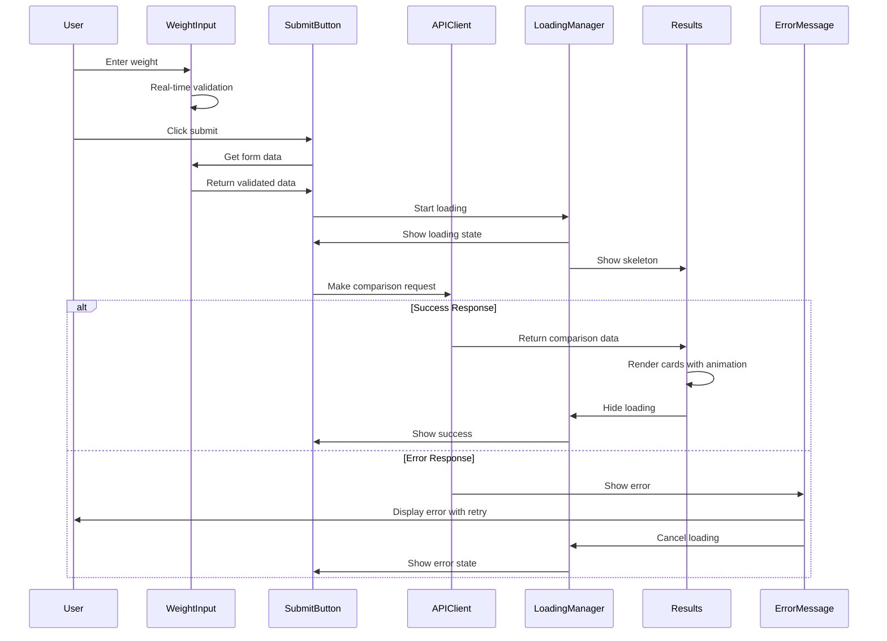

# SizeComparator UI Components Specification

Last Updated: 2025-07-13

## 1. Overview & Architecture Integration

### Component Design Philosophy

SizeComparator's UI components follow a vanilla HTML/CSS/JavaScript architecture with zero external dependencies. Each component is designed as a self-contained module that integrates seamlessly with the overall system architecture while maintaining clear separation of concerns.

**Core Design Principles**:
- **Progressive Enhancement**: Base functionality works without JavaScript
- **Accessibility First**: WCAG 2.1 AA compliance built into every component
- **Theme Integration**: All components support light/dark themes via CSS custom properties
- **Responsive Design**: Mobile-first approach with fluid layouts
- **Performance Focused**: Minimal DOM manipulation and optimized animations

### Component Architecture Overview

```
UI Component Layer
├── Form Components
│   ├── WeightInputComponent (number validation + unit selection)
│   └── SubmitButtonComponent (loading states + error feedback)
├── Display Components
│   ├── ResultsDisplayComponent (animated comparison cards)
│   └── ComparisonCardComponent (individual result presentation)
├── Feedback Components
│   ├── ErrorMessageComponent (multi-severity messaging)
│   └── LoadingSpinnerComponent (skeleton states)
└── Utility Components
    ├── ThemeToggleComponent (integrated with theme system)
    └── AccessibilityManager (ARIA management)
```

### Integration Points

| System Component | UI Integration | Data Flow |
|------------------|----------------|-----------|
| Theme System | CSS custom properties | ThemeManager ↔ All Components |
| API Client | Event-driven updates | APIClient → Form → Results |
| Weight Parser | Real-time validation | Input → Validator → Feedback |
| Error Handler | User-friendly messaging | Errors → ErrorComponent → User |

### CSS Custom Properties Reference

All components utilize the theme system's CSS custom properties defined in THEME_SYSTEM_SPEC.md:

```css
/* Core theme variables used by all components */
:root {
    /* Colors */
    --color-bg-primary: #ffffff;
    --color-bg-secondary: #f8fafc;
    --color-text-primary: #0f172a;
    --color-text-secondary: #475569;
    --color-accent: #3b82f6;
    --color-accent-hover: #2563eb;
    --color-error: #ef4444;
    --color-success: #10b981;
    --color-warning: #f59e0b;
    --color-info: #3b82f6;
    
    /* Spacing */
    --spacing-xs: 0.25rem;
    --spacing-sm: 0.5rem;
    --spacing-md: 1rem;
    --spacing-lg: 1.5rem;
    --spacing-xl: 2rem;
    
    /* Typography */
    --font-size-sm: 0.875rem;
    --font-size-md: 1rem;
    --font-size-lg: 1.125rem;
    --font-size-xl: 1.25rem;
    --font-size-2xl: 1.5rem;
    --font-weight-medium: 500;
    --font-weight-semibold: 600;
    --font-weight-bold: 700;
    
    /* Borders & Shadows */
    --border-radius-sm: 0.25rem;
    --border-radius-md: 0.375rem;
    --border-radius-lg: 0.5rem;
    --border-radius-full: 9999px;
    --shadow-card: 0 4px 6px -1px rgba(0, 0, 0, 0.1);
    --shadow-button: 0 2px 4px rgba(0, 0, 0, 0.1);
    
    /* Transitions */
    --transition-theme: all 200ms ease;
    
    /* Component-specific */
    --color-bg-hover: rgba(0, 0, 0, 0.05);
    --color-border: #e2e8f0;
    --color-disabled: #9ca3af;
    --color-disabled-text: #6b7280;
    --color-accent-alpha: rgba(59, 130, 246, 0.2);
    --color-accent-contrast: #ffffff;
    --color-accent-light: rgba(59, 130, 246, 0.1);
    --color-error-alpha: rgba(239, 68, 68, 0.2);
    --color-skeleton-base: #e2e8f0;
    --color-skeleton-shimmer: rgba(255, 255, 255, 0.8);
    
    /* Responsive typography scale */
    --font-size-base: 16px;
    --line-height-base: 1.5;
    --line-height-tight: 1.25;
    --line-height-loose: 1.75;
}

/* Dark theme overrides (see THEME_SYSTEM_SPEC.md for full dark theme implementation) */
[data-theme="dark"] {
    --color-bg-primary: #0f172a;
    --color-bg-secondary: #1e293b;
    --color-text-primary: #f8fafc;
    --color-text-secondary: #cbd5e1;
    --color-accent: #60a5fa;
    --color-accent-hover: #3b82f6;
    --color-border: #334155;
    --color-bg-hover: rgba(255, 255, 255, 0.05);
    --color-skeleton-base: #334155;
    --color-skeleton-shimmer: rgba(255, 255, 255, 0.1);
    --shadow-card: 0 4px 6px -1px rgba(0, 0, 0, 0.4);
    
    /* Dark theme specific adjustments */
    --color-error-bg: rgba(239, 68, 68, 0.1);
    --color-warning-bg: rgba(245, 158, 11, 0.1);
    --color-success-bg: rgba(16, 185, 129, 0.1);
    --color-info-bg: rgba(59, 130, 246, 0.1);
}
```

### Accessibility Requirements

All components must meet WCAG 2.1 AA standards:

1. **Keyboard Navigation**: Full functionality via keyboard only
2. **Screen Reader Support**: Proper ARIA labels and live regions
3. **Focus Management**: Visible focus indicators and logical tab order
4. **Color Contrast**: Minimum 4.5:1 for normal text, 3:1 for large text
5. **Motion Sensitivity**: Respect prefers-reduced-motion preference
6. **Error Announcements**: Clear error messages announced to screen readers
7. **Loading States**: Proper ARIA busy and loading announcements

### Responsive Design Patterns

Components follow a mobile-first responsive approach:

```css
/* Mobile: 0-767px (default styles) */
/* Tablet: 768px-1023px */
@media (min-width: 768px) { }
/* Desktop: 1024px+ */
@media (min-width: 1024px) { }
```

## 2. Weight Input Form Component

### Component Purpose

The Weight Input Form component provides a user-friendly interface for entering weight values with real-time validation, unit selection, and comprehensive error handling. It integrates with the API client to submit weight comparisons and provides immediate feedback on input validity.

### HTML Structure & Accessibility

```html
<form id="comparison-form" class="weight-form" role="form" aria-labelledby="form-title">
    <fieldset class="weight-input-group">
        <legend id="form-title" class="form-title">Enter Weight for Comparison</legend>
        
        <!-- Weight Input with Validation -->
        <div class="input-group">
            <label for="weight-input" class="weight-label">
                Weight
                <span class="required-indicator" aria-label="required">*</span>
            </label>
            <input 
                type="number" 
                id="weight-input" 
                class="weight-input"
                min="0.1" 
                max="1000000" 
                step="0.01"
                placeholder="Enter weight..."
                aria-describedby="weight-hint weight-error"
                aria-required="true"
                autocomplete="off"
            >
            <div id="weight-hint" class="input-hint">
                Between 0.1 and 1,000,000
            </div>
            <div id="weight-error" class="error-text" role="alert" aria-live="polite"></div>
        </div>
        
        <!-- Unit Selector -->
        <fieldset class="unit-selector" role="radiogroup" aria-labelledby="unit-legend">
            <legend id="unit-legend" class="unit-legend">Unit</legend>
            <div class="radio-group">
                <label class="radio-label">
                    <input type="radio" name="unit" value="lbs" checked aria-describedby="lbs-hint">
                    <span class="radio-custom"></span>
                    <span class="radio-text">Pounds (lbs)</span>
                </label>
                <label class="radio-label">
                    <input type="radio" name="unit" value="kg" aria-describedby="kg-hint">
                    <span class="radio-custom"></span>
                    <span class="radio-text">Kilograms (kg)</span>
                </label>
            </div>
            <div id="lbs-hint" class="unit-hint">Standard US weight measurement</div>
            <div id="kg-hint" class="unit-hint">Metric weight measurement</div>
        </fieldset>
    </fieldset>
</form>
```

### CSS Implementation with Theme Integration

```css
/* Weight Form Component Styles */
.weight-form {
    max-width: 100%;
    margin: 0 auto;
    padding: var(--spacing-lg);
    background: var(--color-bg-secondary);
    border: 1px solid var(--color-border);
    border-radius: var(--border-radius-lg);
    box-shadow: var(--shadow-card);
    transition: var(--transition-theme);
}

.weight-input-group {
    border: none;
    margin: 0;
    padding: 0;
}

.form-title {
    font-size: var(--font-size-xl);
    font-weight: var(--font-weight-semibold);
    color: var(--color-text-primary);
    margin-bottom: var(--spacing-lg);
    text-align: center;
}

/* Weight Input Styles */
.input-group {
    margin-bottom: var(--spacing-lg);
    position: relative;
}

.weight-label {
    display: block;
    font-weight: var(--font-weight-medium);
    color: var(--color-text-primary);
    margin-bottom: var(--spacing-sm);
    font-size: var(--font-size-md);
}

.required-indicator {
    color: var(--color-error);
    margin-left: var(--spacing-xs);
}

.weight-input {
    width: 100%;
    padding: var(--spacing-md);
    font-size: var(--font-size-lg);
    border: 2px solid var(--color-border);
    border-radius: var(--border-radius-md);
    background: var(--color-bg-primary);
    color: var(--color-text-primary);
    transition: border-color 200ms ease, box-shadow 200ms ease;
    box-sizing: border-box;
}

.weight-input:focus {
    outline: none;
    border-color: var(--color-accent);
    box-shadow: 0 0 0 3px var(--color-accent-alpha);
}

.weight-input:invalid {
    border-color: var(--color-error);
}

.weight-input:invalid:focus {
    box-shadow: 0 0 0 3px var(--color-error-alpha);
}

/* Unit Selector Styles */
.unit-selector {
    border: none;
    margin: 0;
    padding: 0;
}

.unit-legend {
    font-weight: var(--font-weight-medium);
    color: var(--color-text-primary);
    margin-bottom: var(--spacing-md);
    font-size: var(--font-size-md);
}

.radio-group {
    display: flex;
    gap: var(--spacing-lg);
    flex-wrap: wrap;
}

.radio-label {
    display: flex;
    align-items: center;
    cursor: pointer;
    padding: var(--spacing-sm);
    border-radius: var(--border-radius-md);
    transition: background-color 200ms ease;
    position: relative;
}

.radio-label:hover {
    background: var(--color-bg-hover);
}

.radio-label input[type="radio"] {
    position: absolute;
    opacity: 0;
    pointer-events: none;
}

.radio-custom {
    width: 20px;
    height: 20px;
    border: 2px solid var(--color-border);
    border-radius: 50%;
    margin-right: var(--spacing-sm);
    position: relative;
    transition: border-color 200ms ease, background-color 200ms ease;
}

.radio-custom::after {
    content: '';
    position: absolute;
    top: 50%;
    left: 50%;
    width: 8px;
    height: 8px;
    background: var(--color-accent);
    border-radius: 50%;
    transform: translate(-50%, -50%) scale(0);
    transition: transform 200ms ease;
}

.radio-label input[type="radio"]:checked + .radio-custom {
    border-color: var(--color-accent);
}

.radio-label input[type="radio"]:checked + .radio-custom::after {
    transform: translate(-50%, -50%) scale(1);
}

.radio-label input[type="radio"]:focus + .radio-custom {
    box-shadow: 0 0 0 3px var(--color-accent-alpha);
}

/* Helper Text */
.input-hint, .unit-hint {
    font-size: var(--font-size-sm);
    color: var(--color-text-secondary);
    margin-top: var(--spacing-xs);
}

.error-text {
    font-size: var(--font-size-sm);
    color: var(--color-error);
    margin-top: var(--spacing-xs);
    min-height: 1.2em;
    display: block;
}

/* Responsive Design */
@media (min-width: 768px) {
    .weight-form {
        padding: var(--spacing-xl);
    }
    
    .radio-group {
        justify-content: center;
    }
}

@media (min-width: 1024px) {
    .weight-form {
        max-width: 600px;
    }
}
```

### JavaScript Validation & Interaction

```javascript
class WeightInputComponent {
    constructor(formSelector = '#comparison-form') {
        this.form = document.querySelector(formSelector);
        this.weightInput = this.form.querySelector('#weight-input');
        this.errorDisplay = this.form.querySelector('#weight-error');
        this.unitInputs = this.form.querySelectorAll('[name="unit"]');
        
        this.validationRules = {
            min: 0.1,
            max: 1000000,
            decimals: 2,
            required: true
        };
        
        this.init();
    }
    
    init() {
        this.setupEventListeners();
        this.setupAccessibility();
    }
    
    setupEventListeners() {
        // Real-time validation on input
        this.weightInput.addEventListener('input', (e) => {
            this.debounce(() => this.validateWeight(e.target.value), 300);
        });
        
        // Validation on blur
        this.weightInput.addEventListener('blur', (e) => {
            this.validateWeight(e.target.value, true);
        });
        
        // Prevent invalid characters
        this.weightInput.addEventListener('keydown', (e) => {
            this.preventInvalidInput(e);
        });
        
        // Format value on change
        this.weightInput.addEventListener('change', (e) => {
            this.formatWeightValue(e.target);
        });
        
        // Unit change handling
        this.unitInputs.forEach(input => {
            input.addEventListener('change', () => {
                this.handleUnitChange();
                this.validateWeight(this.weightInput.value);
            });
        });
    }
    
    setupAccessibility() {
        // Ensure proper ARIA relationships
        this.weightInput.setAttribute('aria-describedby', 
            'weight-hint weight-error');
        
        // Add live region for dynamic feedback
        if (!this.errorDisplay.hasAttribute('aria-live')) {
            this.errorDisplay.setAttribute('aria-live', 'polite');
        }
    }
    
    validateWeight(value, showErrors = false) {
        const validation = this.performValidation(value);
        
        if (showErrors || (!validation.valid && value.length > 0)) {
            this.displayValidationErrors(validation.errors);
        } else if (validation.valid) {
            this.clearValidationErrors();
        }
        
        this.updateInputState(validation.valid);
        return validation;
    }
    
    performValidation(value) {
        const errors = [];
        const numValue = parseFloat(value);
        
        // Required validation
        if (!value || value.trim() === '') {
            if (this.validationRules.required) {
                errors.push('Please enter a weight');
            }
            return { valid: false, errors };
        }
        
        // Numeric validation
        if (isNaN(numValue)) {
            errors.push('Please enter a valid number');
            return { valid: false, errors };
        }
        
        // Range validation
        if (numValue < this.validationRules.min) {
            errors.push(`Weight must be at least ${this.validationRules.min}`);
        }
        
        if (numValue > this.validationRules.max) {
            errors.push(`Weight cannot exceed ${this.validationRules.max.toLocaleString()}`);
        }
        
        // Decimal places validation
        if (this.hasExcessDecimals(value)) {
            errors.push('Maximum 2 decimal places allowed');
        }
        
        return { valid: errors.length === 0, errors };
    }
    
    hasExcessDecimals(value) {
        const parts = value.toString().split('.');
        return parts.length > 1 && parts[1].length > this.validationRules.decimals;
    }
    
    displayValidationErrors(errors) {
        this.errorDisplay.textContent = errors.join('. ');
        this.errorDisplay.style.display = 'block';
        this.weightInput.setAttribute('aria-invalid', 'true');
    }
    
    clearValidationErrors() {
        this.errorDisplay.textContent = '';
        this.errorDisplay.style.display = 'none';
        this.weightInput.setAttribute('aria-invalid', 'false');
    }
    
    updateInputState(isValid) {
        if (isValid) {
            this.weightInput.classList.remove('error');
            this.weightInput.classList.add('valid');
        } else {
            this.weightInput.classList.remove('valid');
            this.weightInput.classList.add('error');
        }
    }
    
    preventInvalidInput(event) {
        const invalidChars = ['e', 'E', '+', '-'];
        if (invalidChars.includes(event.key)) {
            event.preventDefault();
        }
    }
    
    formatWeightValue(input) {
        const value = parseFloat(input.value);
        if (!isNaN(value)) {
            input.value = value.toFixed(2).replace(/\.?0+$/, '');
        }
    }
    
    handleUnitChange() {
        const selectedUnit = this.getSelectedUnit();
        this.announceUnitChange(selectedUnit);
    }
    
    getSelectedUnit() {
        return Array.from(this.unitInputs)
            .find(input => input.checked)?.value || 'lbs';
    }
    
    announceUnitChange(unit) {
        const announcement = `Unit changed to ${unit === 'lbs' ? 'pounds' : 'kilograms'}`;
        this.announceToScreenReader(announcement);
    }
    
    announceToScreenReader(message) {
        const announcement = document.createElement('div');
        announcement.setAttribute('aria-live', 'polite');
        announcement.setAttribute('aria-atomic', 'true');
        announcement.className = 'sr-only';
        announcement.textContent = message;
        
        document.body.appendChild(announcement);
        setTimeout(() => document.body.removeChild(announcement), 1000);
    }
    
    debounce(func, wait) {
        clearTimeout(this.debounceTimeout);
        this.debounceTimeout = setTimeout(func, wait);
    }
    
    // Public API for integration with other components
    getFormData() {
        const validation = this.validateWeight(this.weightInput.value, true);
        if (!validation.valid) {
            throw new ValidationError(validation.errors);
        }
        
        return {
            weight: parseFloat(this.weightInput.value),
            unit: this.getSelectedUnit()
        };
    }
    
    reset() {
        this.weightInput.value = '';
        this.clearValidationErrors();
        this.updateInputState(false);
        this.unitInputs[0].checked = true; // Default to lbs
    }
    
    disable() {
        this.weightInput.disabled = true;
        this.unitInputs.forEach(input => input.disabled = true);
        this.form.setAttribute('aria-busy', 'true');
    }
    
    enable() {
        this.weightInput.disabled = false;
        this.unitInputs.forEach(input => input.disabled = false);
        this.form.removeAttribute('aria-busy');
        this.weightInput.focus();
    }
    
    // Integration with API Client
    async submitComparison(apiClient) {
        try {
            const formData = this.getFormData();
            this.disable();
            
            // Notify other components of submission start
            this.form.dispatchEvent(new CustomEvent('comparisonStart', {
                detail: formData,
                bubbles: true
            }));
            
            const result = await apiClient.compareWeight(formData);
            
            // Notify success
            this.form.dispatchEvent(new CustomEvent('comparisonSuccess', {
                detail: result,
                bubbles: true
            }));
            
            return result;
        } catch (error) {
            // Notify error
            this.form.dispatchEvent(new CustomEvent('comparisonError', {
                detail: error,
                bubbles: true
            }));
            throw error;
        } finally {
            this.enable();
        }
    }
}

// Validation Error Class
class ValidationError extends Error {
    constructor(errors) {
        super(errors.join('. '));
        this.name = 'ValidationError';
        this.errors = errors;
    }
}
```

## 3. Submit Button Component with Loading States

### Component Purpose

The Submit Button component manages the submission process with visual feedback, loading states, and error handling. It coordinates with the Weight Input Form, API Client, and Results Display components to provide a seamless user experience during the comparison process.

### HTML Structure & Accessibility

```html
<div class="submit-container">
    <button 
        type="submit" 
        id="compare-btn" 
        class="submit-btn primary-btn"
        aria-describedby="submit-status"
        disabled
    >
        <span class="btn-content">
            <span class="btn-text">Compare Weight</span>
            <span class="btn-icon" aria-hidden="true">
                <svg class="icon-compare" viewBox="0 0 24 24" width="20" height="20">
                    <path d="M9 12l2 2 4-4m6 2a9 9 0 11-18 0 9 9 0 0118 0z"/>
                </svg>
                <svg class="icon-loading" viewBox="0 0 24 24" width="20" height="20">
                    <circle cx="12" cy="12" r="10" stroke="currentColor" stroke-width="4" fill="none" opacity="0.25"/>
                    <path d="m12 2 a10 10 0 0 1 10 10" stroke="currentColor" stroke-width="4" fill="none" stroke-linecap="round"/>
                </svg>
            </span>
        </span>
    </button>
    <div id="submit-status" class="submit-status" aria-live="polite" aria-atomic="true"></div>
</div>
```

### CSS Implementation with Loading Animations

```css
/* Submit Button Component */
.submit-container {
    margin-top: var(--spacing-xl);
    text-align: center;
}

.submit-btn {
    position: relative;
    display: inline-flex;
    align-items: center;
    justify-content: center;
    padding: var(--spacing-md) var(--spacing-xl);
    font-size: var(--font-size-lg);
    font-weight: var(--font-weight-medium);
    border: none;
    border-radius: var(--border-radius-lg);
    cursor: pointer;
    transition: all 200ms ease;
    min-width: 160px;
    min-height: 48px;
    box-sizing: border-box;
}

.primary-btn {
    background: var(--color-accent);
    color: var(--color-accent-contrast);
    box-shadow: var(--shadow-button);
}

.primary-btn:hover:not(:disabled) {
    background: var(--color-accent-hover);
    transform: translateY(-1px);
    box-shadow: var(--shadow-button-hover);
}

.primary-btn:active:not(:disabled) {
    transform: translateY(0);
    box-shadow: var(--shadow-button-active);
}

.primary-btn:focus {
    outline: none;
    box-shadow: var(--shadow-button), 0 0 0 3px var(--color-accent-alpha);
}

.primary-btn:disabled {
    background: var(--color-disabled);
    color: var(--color-disabled-text);
    cursor: not-allowed;
    transform: none;
    box-shadow: none;
}

/* Button Content and States */
.btn-content {
    display: flex;
    align-items: center;
    gap: var(--spacing-sm);
}

.btn-text {
    transition: opacity 200ms ease;
}

.btn-icon {
    display: inline-flex;
    align-items: center;
    justify-content: center;
    width: 20px;
    height: 20px;
    position: relative;
}

.icon-compare,
.icon-loading {
    position: absolute;
    top: 0;
    left: 0;
    width: 100%;
    height: 100%;
    transition: opacity 200ms ease, transform 200ms ease;
}

/* Default state - show compare icon */
.submit-btn:not(.loading) .icon-compare {
    opacity: 1;
    transform: scale(1);
}

.submit-btn:not(.loading) .icon-loading {
    opacity: 0;
    transform: scale(0.8);
}

/* Loading state - show spinner */
.submit-btn.loading .icon-compare {
    opacity: 0;
    transform: scale(0.8);
}

.submit-btn.loading .icon-loading {
    opacity: 1;
    transform: scale(1);
    animation: spin 1s linear infinite;
}

.submit-btn.loading .btn-text {
    opacity: 0.8;
}

/* Loading animation */
@keyframes spin {
    from { transform: rotate(0deg); }
    to { transform: rotate(360deg); }
}

/* Success state */
.submit-btn.success {
    background: var(--color-success);
    color: var(--color-success-contrast);
}

.submit-btn.success .btn-text::after {
    content: ' ✓';
    margin-left: var(--spacing-xs);
}

/* Error state */
.submit-btn.error {
    background: var(--color-error);
    color: var(--color-error-contrast);
    animation: shake 0.5s ease-in-out;
}

@keyframes shake {
    0%, 100% { transform: translateX(0); }
    25% { transform: translateX(-4px); }
    75% { transform: translateX(4px); }
}

/* Submit Status Message */
.submit-status {
    margin-top: var(--spacing-sm);
    font-size: var(--font-size-sm);
    min-height: 1.2em;
    color: var(--color-text-secondary);
}

.submit-status.error {
    color: var(--color-error);
}

.submit-status.success {
    color: var(--color-success);
}

/* Responsive adjustments */
@media (max-width: 767px) {
    .submit-btn {
        width: 100%;
        padding: var(--spacing-lg) var(--spacing-md);
    }
}
```

### JavaScript Implementation with Error Feedback

```javascript
class SubmitButtonComponent {
    constructor(buttonSelector = '#compare-btn') {
        this.button = document.querySelector(buttonSelector);
        this.statusDisplay = document.querySelector('#submit-status');
        this.originalText = 'Compare Weight';
        this.state = 'idle'; // idle, loading, success, error
        
        this.init();
    }
    
    init() {
        this.setupEventListeners();
        this.updateAccessibility();
    }
    
    setupEventListeners() {
        // Form submission handling
        this.button.addEventListener('click', (e) => {
            if (this.state === 'loading') {
                e.preventDefault();
                return;
            }
            
            // Will be handled by form submit event
        });
        
        // Keyboard accessibility
        this.button.addEventListener('keydown', (e) => {
            if (e.key === 'Enter' || e.key === ' ') {
                if (this.state === 'loading') {
                    e.preventDefault();
                }
            }
        });
    }
    
    updateAccessibility() {
        // Ensure proper ARIA attributes
        this.button.setAttribute('aria-describedby', 'submit-status');
        
        if (!this.statusDisplay.hasAttribute('aria-live')) {
            this.statusDisplay.setAttribute('aria-live', 'polite');
            this.statusDisplay.setAttribute('aria-atomic', 'true');
        }
    }
    
    setState(newState, options = {}) {
        this.clearStateClasses();
        this.state = newState;
        
        switch (newState) {
            case 'idle':
                this.setIdleState();
                break;
            case 'loading':
                this.setLoadingState(options);
                break;
            case 'success':
                this.setSuccessState(options);
                break;
            case 'error':
                this.setErrorState(options);
                break;
        }
        
        this.updateStatus(options.message || '');
    }
    
    setIdleState() {
        this.button.disabled = false;
        this.button.setAttribute('aria-busy', 'false');
        this.updateButtonText(this.originalText);
    }
    
    setLoadingState(options = {}) {
        this.button.disabled = true;
        this.button.classList.add('loading');
        this.button.setAttribute('aria-busy', 'true');
        
        const loadingText = options.loadingText || 'Getting comparisons...';
        this.updateButtonText(loadingText);
        
        // Announce loading state to screen readers
        this.announceToScreenReader('Loading comparison results');
    }
    
    setSuccessState(options = {}) {
        this.button.disabled = false;
        this.button.classList.add('success');
        this.button.setAttribute('aria-busy', 'false');
        
        const successText = options.successText || 'Compare Again';
        this.updateButtonText(successText);
        
        // Auto-reset after delay
        setTimeout(() => {
            if (this.state === 'success') {
                this.setState('idle');
            }
        }, 3000);
    }
    
    setErrorState(options = {}) {
        this.button.disabled = false;
        this.button.classList.add('error');
        this.button.setAttribute('aria-busy', 'false');
        
        const errorText = options.errorText || 'Try Again';
        this.updateButtonText(errorText);
        
        // Auto-reset after delay
        setTimeout(() => {
            if (this.state === 'error') {
                this.setState('idle');
            }
        }, 5000);
    }
    
    updateButtonText(text) {
        const textElement = this.button.querySelector('.btn-text');
        if (textElement) {
            textElement.textContent = text;
        }
    }
    
    updateStatus(message) {
        this.statusDisplay.textContent = message;
        this.statusDisplay.className = `submit-status ${this.state}`;
    }
    
    clearStateClasses() {
        this.button.classList.remove('loading', 'success', 'error');
    }
    
    announceToScreenReader(message) {
        const announcement = document.createElement('div');
        announcement.setAttribute('aria-live', 'assertive');
        announcement.setAttribute('aria-atomic', 'true');
        announcement.className = 'sr-only';
        announcement.textContent = message;
        
        document.body.appendChild(announcement);
        setTimeout(() => document.body.removeChild(announcement), 1000);
    }
    
    // Public API methods
    showLoading(message = 'Processing your request...') {
        this.setState('loading', { 
            message,
            loadingText: 'Getting comparisons...' 
        });
    }
    
    showSuccess(message = 'Comparison completed successfully!') {
        this.setState('success', { 
            message,
            successText: 'Compare Again' 
        });
    }
    
    showError(message = 'Something went wrong. Please try again.') {
        this.setState('error', { 
            message,
            errorText: 'Try Again' 
        });
    }
    
    reset() {
        this.setState('idle');
    }
    
    enable() {
        if (this.state !== 'loading') {
            this.button.disabled = false;
        }
    }
    
    disable() {
        this.button.disabled = true;
    }
}
```

## 4. Results Display with Animated Comparison Cards

### Component Purpose

The Results Display component presents weight comparison results in an engaging, accessible format. It receives data from the API client, renders animated comparison cards, and provides interactive features for exploring the results. The component handles loading states, empty states, and error conditions gracefully.

### API Response Integration

The component expects data in the format returned by the API client (aligned with BACKEND_CORE_SPEC):

```javascript
interface ComparisonResult {
    request_weight: string;           // "24 lbs"
    comparisons: ComparisonItem[];    // Array of comparison objects
    metadata: {
        processing_time_ms: number;
        confidence_scores: number[];
    };
}

interface ComparisonItem {
    description: string;          // "Four Medium Chickens"
    individual_weight: string;    // "6 lbs each"
    total_weight: string;         // "24 lbs total"
    quantity: number;             // 4
    category: string;             // "animals"
    confidence: number;           // 0.9
}
```

### HTML Structure & Accessibility

```html
<section id="results" class="results-container" aria-labelledby="results-title" aria-live="polite">
    <h2 id="results-title" class="results-title sr-only">Comparison Results</h2>
    
    <!-- Loading state placeholder -->
    <div class="loading-placeholder" aria-hidden="true">
        <div class="skeleton-card"></div>
        <div class="skeleton-card"></div>
    </div>
    
    <!-- Results content -->
    <div class="results-content" aria-live="polite">
        <div class="results-header">
            <h3 class="weight-display" id="weight-summary"></h3>
            <p class="results-subtitle">Here are two relatable comparisons:</p>
        </div>
        
        <div class="comparison-cards-grid" role="list">
            <!-- Comparison cards will be dynamically inserted here -->
        </div>
        
        <div class="results-actions">
            <button type="button" class="secondary-btn" id="new-comparison-btn">
                Make Another Comparison
            </button>
        </div>
    </div>
</section>
```

### Individual Comparison Card Structure

```html
<article class="comparison-card" role="listitem" tabindex="0" aria-labelledby="card-title-1" aria-describedby="card-details-1">
    <div class="card-header">
        <div class="card-icon" aria-hidden="true">
            <span class="icon-category" data-category="animals">🐾</span>
        </div>
        <h4 id="card-title-1" class="card-title">Four Medium Chickens</h4>
    </div>
    
    <div class="card-content">
        <div class="weight-breakdown">
            <span class="individual-weight">6 lbs each</span>
            <span class="total-weight">24 lbs total</span>
        </div>
        
        <div id="card-details-1" class="card-description">
            Each chicken weighs about 6 pounds, giving you a familiar reference for your 24-pound measurement.
        </div>
        
        <div class="confidence-indicator" aria-label="Accuracy rating">
            <span class="confidence-label">Accuracy:</span>
            <div class="confidence-bar">
                <div class="confidence-fill" style="width: 90%" aria-label="90% confident"></div>
            </div>
            <span class="confidence-value">90%</span>
        </div>
    </div>
</article>
```

### CSS Implementation with Animations

```css
/* Results Container */
.results-container {
    margin-top: var(--spacing-xl);
    opacity: 0;
    transform: translateY(20px);
    transition: opacity 400ms ease, transform 400ms ease;
}

.results-container.visible {
    opacity: 1;
    transform: translateY(0);
}

.results-title {
    /* Screen reader only - visually hidden but accessible */
    position: absolute;
    width: 1px;
    height: 1px;
    padding: 0;
    margin: -1px;
    overflow: hidden;
    clip: rect(0, 0, 0, 0);
    white-space: nowrap;
    border: 0;
}

/* Loading Skeleton */
.loading-placeholder {
    display: none;
    grid-template-columns: repeat(auto-fit, minmax(300px, 1fr));
    gap: var(--spacing-lg);
    margin-bottom: var(--spacing-xl);
}

.loading-placeholder.visible {
    display: grid;
}

.skeleton-card {
    height: 200px;
    background: var(--color-bg-secondary);
    border-radius: var(--border-radius-lg);
    position: relative;
    overflow: hidden;
}

.skeleton-card::before {
    content: '';
    position: absolute;
    top: 0;
    left: -100%;
    width: 100%;
    height: 100%;
    background: linear-gradient(
        90deg,
        transparent,
        var(--color-skeleton-shimmer),
        transparent
    );
    animation: skeleton-loading 1.5s infinite;
}

@keyframes skeleton-loading {
    0% { left: -100%; }
    100% { left: 100%; }
}

/* Results Content */
.results-content {
    display: none;
}

.results-content.visible {
    display: block;
    animation: fadeInUp 500ms ease;
}

@keyframes fadeInUp {
    from {
        opacity: 0;
        transform: translateY(30px);
    }
    to {
        opacity: 1;
        transform: translateY(0);
    }
}

.results-header {
    text-align: center;
    margin-bottom: var(--spacing-xl);
}

.weight-display {
    font-size: var(--font-size-2xl);
    font-weight: var(--font-weight-bold);
    color: var(--color-accent);
    margin-bottom: var(--spacing-sm);
}

.results-subtitle {
    font-size: var(--font-size-lg);
    color: var(--color-text-secondary);
    margin: 0;
}

/* Comparison Cards Grid */
.comparison-cards-grid {
    display: grid;
    grid-template-columns: repeat(auto-fit, minmax(300px, 1fr));
    gap: var(--spacing-lg);
    margin-bottom: var(--spacing-xl);
}

/* Individual Comparison Card */
.comparison-card {
    background: var(--color-bg-primary);
    border: 1px solid var(--color-border);
    border-radius: var(--border-radius-lg);
    padding: var(--spacing-lg);
    box-shadow: var(--shadow-card);
    transition: all 300ms ease;
    opacity: 0;
    transform: translateY(20px) scale(0.95);
    position: relative;
    outline: none;
}

.comparison-card.animate-in {
    animation: cardAppear 500ms ease forwards;
}

.comparison-card:nth-child(1).animate-in {
    animation-delay: 100ms;
}

.comparison-card:nth-child(2).animate-in {
    animation-delay: 200ms;
}

@keyframes cardAppear {
    to {
        opacity: 1;
        transform: translateY(0) scale(1);
    }
}

.comparison-card:hover {
    transform: translateY(-4px);
    box-shadow: var(--shadow-card-hover);
    border-color: var(--color-accent-light);
}

.comparison-card:focus {
    border-color: var(--color-accent);
    box-shadow: var(--shadow-card), 0 0 0 3px var(--color-accent-alpha);
}

/* Card Header */
.card-header {
    display: flex;
    align-items: center;
    gap: var(--spacing-md);
    margin-bottom: var(--spacing-md);
}

.card-icon {
    width: 40px;
    height: 40px;
    display: flex;
    align-items: center;
    justify-content: center;
    background: var(--color-accent-light);
    border-radius: var(--border-radius-full);
    font-size: var(--font-size-xl);
}

.icon-category[data-category="animals"] {
    background: var(--color-category-animals);
}

.icon-category[data-category="objects"] {
    background: var(--color-category-objects);
}

.icon-category[data-category="food"] {
    background: var(--color-category-food);
}

.card-title {
    font-size: var(--font-size-xl);
    font-weight: var(--font-weight-semibold);
    color: var(--color-text-primary);
    margin: 0;
    flex: 1;
}

/* Card Content */
.card-content {
    space-y: var(--spacing-md);
}

.weight-breakdown {
    display: flex;
    justify-content: space-between;
    align-items: center;
    padding: var(--spacing-sm) var(--spacing-md);
    background: var(--color-bg-secondary);
    border-radius: var(--border-radius-md);
    margin-bottom: var(--spacing-md);
}

.individual-weight {
    font-size: var(--font-size-sm);
    color: var(--color-text-secondary);
    font-weight: var(--font-weight-medium);
}

.total-weight {
    font-size: var(--font-size-lg);
    color: var(--color-accent);
    font-weight: var(--font-weight-bold);
}

.card-description {
    font-size: var(--font-size-md);
    color: var(--color-text-secondary);
    line-height: 1.5;
    margin-bottom: var(--spacing-md);
}

/* Confidence Indicator */
.confidence-indicator {
    display: flex;
    align-items: center;
    gap: var(--spacing-sm);
    font-size: var(--font-size-sm);
}

.confidence-label {
    color: var(--color-text-secondary);
    font-weight: var(--font-weight-medium);
}

.confidence-bar {
    flex: 1;
    height: 8px;
    background: var(--color-bg-secondary);
    border-radius: var(--border-radius-full);
    overflow: hidden;
    position: relative;
}

.confidence-fill {
    height: 100%;
    background: linear-gradient(
        90deg,
        var(--color-success),
        var(--color-accent)
    );
    border-radius: var(--border-radius-full);
    transition: width 800ms ease;
    animation: confidenceFill 1s ease 500ms both;
}

@keyframes confidenceFill {
    from { width: 0 !important; }
}

.confidence-value {
    color: var(--color-text-primary);
    font-weight: var(--font-weight-medium);
    min-width: 35px;
    text-align: right;
}

/* Results Actions */
.results-actions {
    text-align: center;
    margin-top: var(--spacing-xl);
}

.secondary-btn {
    padding: var(--spacing-md) var(--spacing-xl);
    font-size: var(--font-size-md);
    font-weight: var(--font-weight-medium);
    background: transparent;
    color: var(--color-accent);
    border: 2px solid var(--color-accent);
    border-radius: var(--border-radius-md);
    cursor: pointer;
    transition: all 200ms ease;
}

.secondary-btn:hover {
    background: var(--color-accent);
    color: var(--color-accent-contrast);
    transform: translateY(-1px);
}

.secondary-btn:focus {
    outline: none;
    box-shadow: 0 0 0 3px var(--color-accent-alpha);
}

/* Responsive Design */
@media (max-width: 767px) {
    .comparison-cards-grid {
        grid-template-columns: 1fr;
        gap: var(--spacing-md);
    }
    
    .comparison-card {
        padding: var(--spacing-md);
    }
    
    .weight-breakdown {
        flex-direction: column;
        gap: var(--spacing-xs);
        text-align: center;
    }
}

@media (min-width: 768px) and (max-width: 1023px) {
    .comparison-cards-grid {
        grid-template-columns: repeat(2, 1fr);
    }
}

@media (min-width: 1024px) {
    .comparison-cards-grid {
        grid-template-columns: repeat(2, 1fr);
        max-width: 800px;
        margin-left: auto;
        margin-right: auto;
    }
}
```

### JavaScript Implementation with Animation Control

```javascript
class ResultsDisplayComponent {
    constructor(containerSelector = '#results') {
        this.container = document.querySelector(containerSelector);
        this.loadingPlaceholder = this.container.querySelector('.loading-placeholder');
        this.resultsContent = this.container.querySelector('.results-content');
        this.cardsGrid = this.container.querySelector('.comparison-cards-grid');
        this.weightDisplay = this.container.querySelector('#weight-summary');
        this.newComparisonBtn = this.container.querySelector('#new-comparison-btn');
        
        this.isVisible = false;
        this.currentResults = null;
        
        this.init();
    }
    
    init() {
        this.setupEventListeners();
        this.setupIntersectionObserver();
    }
    
    setupEventListeners() {
        if (this.newComparisonBtn) {
            this.newComparisonBtn.addEventListener('click', () => {
                this.handleNewComparison();
            });
        }
        
        // Keyboard navigation for cards
        this.container.addEventListener('keydown', (e) => {
            this.handleKeyboardNavigation(e);
        });
    }
    
    setupIntersectionObserver() {
        // Animate cards when they come into view
        const observer = new IntersectionObserver((entries) => {
            entries.forEach(entry => {
                if (entry.isIntersecting) {
                    entry.target.classList.add('animate-in');
                }
            });
        }, { threshold: 0.1 });
        
        this.observer = observer;
    }
    
    showLoading() {
        this.hide();
        this.container.classList.add('visible');
        this.loadingPlaceholder.classList.add('visible');
        this.resultsContent.classList.remove('visible');
        
        // Announce loading to screen readers
        this.announceToScreenReader('Loading comparison results');
    }
    
    hideLoading() {
        this.loadingPlaceholder.classList.remove('visible');
    }
    
    displayResults(data) {
        this.currentResults = data;
        this.hideLoading();
        
        // Update weight display
        this.updateWeightDisplay(data);
        
        // Clear existing cards
        this.clearCards();
        
        // Create and display new cards
        this.createComparisonCards(data.comparisons);
        
        // Show results content
        this.resultsContent.classList.add('visible');
        this.container.classList.add('visible');
        this.isVisible = true;
        
        // Announce results to screen readers
        const count = data.comparisons.length;
        this.announceToScreenReader(
            `Found ${count} comparison${count === 1 ? '' : 's'} for ${data.request_weight}`
        );
        
        // Focus first card for keyboard users
        setTimeout(() => {
            const firstCard = this.cardsGrid.querySelector('.comparison-card');
            if (firstCard) {
                firstCard.scrollIntoView({ behavior: 'smooth', block: 'nearest' });
            }
        }, 300);
    }
    
    updateWeightDisplay(data) {
        if (this.weightDisplay) {
            this.weightDisplay.textContent = data.request_weight;
        }
    }
    
    createComparisonCards(comparisons) {
        comparisons.forEach((comparison, index) => {
            const card = this.createComparisonCard(comparison, index);
            this.cardsGrid.appendChild(card);
            
            // Observe for intersection animation
            this.observer.observe(card);
        });
    }
    
    createComparisonCard(comparison, index) {
        const card = document.createElement('article');
        card.className = 'comparison-card';
        card.setAttribute('role', 'listitem');
        card.setAttribute('tabindex', '0');
        card.setAttribute('aria-labelledby', `card-title-${index}`);
        card.setAttribute('aria-describedby', `card-details-${index}`);
        
        const categoryIcon = this.getCategoryIcon(comparison.category);
        const confidencePercentage = Math.round((comparison.confidence || 0.8) * 100);
        
        card.innerHTML = `
            <div class="card-header">
                <div class="card-icon" aria-hidden="true">
                    <span class="icon-category" data-category="${comparison.category || 'objects'}">
                        ${categoryIcon}
                    </span>
                </div>
                <h4 id="card-title-${index}" class="card-title">${comparison.description}</h4>
            </div>
            
            <div class="card-content">
                <div class="weight-breakdown">
                    <span class="individual-weight">${comparison.individual_weight}</span>
                    <span class="total-weight">${comparison.total_weight}</span>
                </div>
                
                <div id="card-details-${index}" class="card-description">
                    ${this.generateDescription(comparison)}
                </div>
                
                <div class="confidence-indicator" aria-label="Accuracy rating: ${confidencePercentage}%">
                    <span class="confidence-label">Accuracy:</span>
                    <div class="confidence-bar">
                        <div class="confidence-fill" style="width: ${confidencePercentage}%" 
                             aria-label="${confidencePercentage}% confident"></div>
                    </div>
                    <span class="confidence-value">${confidencePercentage}%</span>
                </div>
            </div>
        `;
        
        return card;
    }
    
    getCategoryIcon(category) {
        const icons = {
            animals: '🐾',
            objects: '📦',
            food: '🍎',
            vehicles: '🚗',
            sports: '⚽',
            household: '🏠',
            default: '⚖️'
        };
        
        return icons[category] || icons.default;
    }
    
    generateDescription(comparison) {
        // Generate a helpful description based on the comparison
        const templates = [
            `Each ${comparison.description.toLowerCase()} provides a familiar reference for understanding your weight measurement.`,
            `This comparison helps visualize ${comparison.total_weight} in everyday terms.`,
            `${comparison.description} offers a relatable way to understand this weight.`
        ];
        
        return templates[Math.floor(Math.random() * templates.length)];
    }
    
    clearCards() {
        // Remove existing cards and their observers
        const existingCards = this.cardsGrid.querySelectorAll('.comparison-card');
        existingCards.forEach(card => {
            this.observer.unobserve(card);
            card.remove();
        });
    }
    
    hide() {
        this.container.classList.remove('visible');
        this.resultsContent.classList.remove('visible');
        this.loadingPlaceholder.classList.remove('visible');
        this.isVisible = false;
    }
    
    handleNewComparison() {
        // Emit custom event for parent application to handle
        const event = new CustomEvent('newComparisonRequested', {
            detail: { previousResults: this.currentResults }
        });
        this.container.dispatchEvent(event);
        
        // Scroll back to form
        const form = document.querySelector('#comparison-form');
        if (form) {
            form.scrollIntoView({ behavior: 'smooth' });
            
            // Focus the weight input
            const weightInput = form.querySelector('#weight-input');
            if (weightInput) {
                setTimeout(() => weightInput.focus(), 500);
            }
        }
    }
    
    handleKeyboardNavigation(event) {
        const cards = Array.from(this.cardsGrid.querySelectorAll('.comparison-card'));
        const currentIndex = cards.findIndex(card => card === document.activeElement);
        
        switch (event.key) {
            case 'ArrowRight':
            case 'ArrowDown':
                event.preventDefault();
                const nextIndex = Math.min(currentIndex + 1, cards.length - 1);
                if (cards[nextIndex]) {
                    cards[nextIndex].focus();
                }
                break;
                
            case 'ArrowLeft':
            case 'ArrowUp':
                event.preventDefault();
                const prevIndex = Math.max(currentIndex - 1, 0);
                if (cards[prevIndex]) {
                    cards[prevIndex].focus();
                }
                break;
                
            case 'Home':
                event.preventDefault();
                if (cards[0]) {
                    cards[0].focus();
                }
                break;
                
            case 'End':
                event.preventDefault();
                if (cards[cards.length - 1]) {
                    cards[cards.length - 1].focus();
                }
                break;
        }
    }
    
    announceToScreenReader(message) {
        const announcement = document.createElement('div');
        announcement.setAttribute('aria-live', 'polite');
        announcement.setAttribute('aria-atomic', 'true');
        announcement.className = 'sr-only';
        announcement.textContent = message;
        
        document.body.appendChild(announcement);
        setTimeout(() => document.body.removeChild(announcement), 2000);
    }
    
    // Public API
    isDisplayed() {
        return this.isVisible;
    }
    
    getCurrentResults() {
        return this.currentResults;
    }
    
    reset() {
        this.hide();
        this.clearCards();
        this.currentResults = null;
    }
}
```

## 5. Error Message Component with Severity Levels

### Component Purpose

The Error Message component provides consistent, accessible error feedback across the application. It supports multiple severity levels (error, warning, info, success) with appropriate styling, auto-dismiss functionality, and retry capabilities. The component integrates with the API client's error handling to display user-friendly messages for all error scenarios.

### Error Severity Mapping

Integration with API client error categories (from BACKEND_CORE_SPEC):

```javascript
const errorSeverityMap = {
    // Network errors
    'NetworkError': { severity: 'error', autoDismiss: false, showRetry: true },
    'TimeoutError': { severity: 'error', autoDismiss: false, showRetry: true },
    
    // Validation errors
    'ValidationError': { severity: 'warning', autoDismiss: true, showRetry: false },
    'InvalidInputError': { severity: 'warning', autoDismiss: true, showRetry: false },
    
    // Server errors
    'ServerError': { severity: 'error', autoDismiss: false, showRetry: true },
    'ServiceUnavailable': { severity: 'error', autoDismiss: false, showRetry: true },
    
    // Rate limiting
    'RateLimitError': { severity: 'warning', autoDismiss: true, showRetry: false },
    
    // Success messages
    'Success': { severity: 'success', autoDismiss: true, showRetry: false },
    
    // Info messages
    'Info': { severity: 'info', autoDismiss: true, showRetry: false }
};
```

### HTML Structure & Accessibility

```html
<div id="error-display" class="error-container" role="alert" aria-live="assertive" aria-atomic="true">
    <div class="error-content">
        <div class="error-icon" aria-hidden="true">
            <svg class="icon-error" viewBox="0 0 24 24" width="24" height="24">
                <circle cx="12" cy="12" r="10" stroke="currentColor" stroke-width="2" fill="none"/>
                <line x1="15" y1="9" x2="9" y2="15" stroke="currentColor" stroke-width="2"/>
                <line x1="9" y1="9" x2="15" y2="15" stroke="currentColor" stroke-width="2"/>
            </svg>
            <svg class="icon-warning" viewBox="0 0 24 24" width="24" height="24">
                <path d="m21.73 18-8-14a2 2 0 0 0-3.48 0l-8 14A2 2 0 0 0 4 21h16a2 2 0 0 0 1.73-3Z" stroke="currentColor" stroke-width="2" fill="none"/>
                <line x1="12" y1="9" x2="12" y2="13" stroke="currentColor" stroke-width="2"/>
                <circle cx="12" cy="17" r="1" fill="currentColor"/>
            </svg>
            <svg class="icon-info" viewBox="0 0 24 24" width="24" height="24">
                <circle cx="12" cy="12" r="10" stroke="currentColor" stroke-width="2" fill="none"/>
                <line x1="12" y1="16" x2="12" y2="12" stroke="currentColor" stroke-width="2"/>
                <circle cx="12" cy="8" r="1" fill="currentColor"/>
            </svg>
        </div>
        
        <div class="error-message">
            <div class="error-title" id="error-title"></div>
            <div class="error-description" id="error-description"></div>
        </div>
        
        <div class="error-actions">
            <button type="button" class="error-dismiss" aria-label="Dismiss error message">
                <svg viewBox="0 0 24 24" width="16" height="16">
                    <line x1="18" y1="6" x2="6" y2="18" stroke="currentColor" stroke-width="2"/>
                    <line x1="6" y1="6" x2="18" y2="18" stroke="currentColor" stroke-width="2"/>
                </svg>
            </button>
            <button type="button" class="error-retry" style="display: none;">
                Retry
            </button>
        </div>
    </div>
    
    <div class="error-progress" aria-hidden="true">
        <div class="error-progress-bar"></div>
    </div>
</div>
```

### CSS Implementation with Severity Styling

```css
/* Error Message Component */
.error-container {
    position: fixed;
    top: var(--spacing-lg);
    right: var(--spacing-lg);
    max-width: 400px;
    min-width: 300px;
    background: var(--color-bg-primary);
    border: 1px solid var(--color-error);
    border-radius: var(--border-radius-lg);
    box-shadow: var(--shadow-toast);
    transform: translateX(100%);
    opacity: 0;
    transition: all 300ms ease;
    z-index: 1000;
    overflow: hidden;
}

.error-container.visible {
    transform: translateX(0);
    opacity: 1;
}

.error-container.slide-out {
    transform: translateX(100%);
    opacity: 0;
}

/* Severity Level Variations */
.error-container.severity-error {
    border-color: var(--color-error);
    background: var(--color-error-bg);
}

.error-container.severity-error .error-content {
    color: var(--color-error-text);
}

.error-container.severity-warning {
    border-color: var(--color-warning);
    background: var(--color-warning-bg);
}

.error-container.severity-warning .error-content {
    color: var(--color-warning-text);
}

.error-container.severity-info {
    border-color: var(--color-info);
    background: var(--color-info-bg);
}

.error-container.severity-info .error-content {
    color: var(--color-info-text);
}

.error-container.severity-success {
    border-color: var(--color-success);
    background: var(--color-success-bg);
}

.error-container.severity-success .error-content {
    color: var(--color-success-text);
}

/* Error Content Layout */
.error-content {
    display: flex;
    align-items: flex-start;
    gap: var(--spacing-md);
    padding: var(--spacing-lg);
    position: relative;
}

/* Error Icons */
.error-icon {
    flex-shrink: 0;
    width: 24px;
    height: 24px;
    display: flex;
    align-items: center;
    justify-content: center;
    margin-top: 2px;
}

.error-icon svg {
    display: none;
    width: 100%;
    height: 100%;
}

.severity-error .icon-error {
    display: block;
    color: var(--color-error);
}

.severity-warning .icon-warning {
    display: block;
    color: var(--color-warning);
}

.severity-info .icon-info,
.severity-success .icon-info {
    display: block;
    color: var(--color-info);
}

/* Error Message Content */
.error-message {
    flex: 1;
    min-width: 0; /* Allow text truncation */
}

.error-title {
    font-weight: var(--font-weight-semibold);
    font-size: var(--font-size-md);
    margin-bottom: var(--spacing-xs);
    color: inherit;
}

.error-description {
    font-size: var(--font-size-sm);
    line-height: 1.4;
    color: inherit;
    opacity: 0.9;
    word-wrap: break-word;
}

/* Error Actions */
.error-actions {
    display: flex;
    align-items: flex-start;
    gap: var(--spacing-sm);
    flex-shrink: 0;
}

.error-dismiss {
    background: none;
    border: none;
    padding: var(--spacing-xs);
    cursor: pointer;
    border-radius: var(--border-radius-sm);
    color: inherit;
    opacity: 0.7;
    transition: opacity 200ms ease, background-color 200ms ease;
    display: flex;
    align-items: center;
    justify-content: center;
}

.error-dismiss:hover {
    opacity: 1;
    background: rgba(0, 0, 0, 0.1);
}

.error-dismiss:focus {
    outline: none;
    opacity: 1;
    box-shadow: 0 0 0 2px currentColor;
}

.error-retry {
    background: currentColor;
    color: var(--color-bg-primary);
    border: none;
    padding: var(--spacing-xs) var(--spacing-sm);
    font-size: var(--font-size-xs);
    font-weight: var(--font-weight-medium);
    border-radius: var(--border-radius-sm);
    cursor: pointer;
    transition: opacity 200ms ease;
}

.error-retry:hover {
    opacity: 0.9;
}

.error-retry:focus {
    outline: none;
    box-shadow: 0 0 0 2px var(--color-bg-primary);
}

/* Auto-dismiss Progress Bar */
.error-progress {
    position: absolute;
    bottom: 0;
    left: 0;
    right: 0;
    height: 3px;
    background: rgba(0, 0, 0, 0.1);
    overflow: hidden;
}

.error-progress-bar {
    height: 100%;
    background: currentColor;
    transform: translateX(-100%);
    transition: transform linear;
}

.error-container.auto-dismiss .error-progress-bar {
    transform: translateX(0);
}

/* Responsive Design */
@media (max-width: 767px) {
    .error-container {
        position: fixed;
        top: auto;
        bottom: var(--spacing-lg);
        right: var(--spacing-md);
        left: var(--spacing-md);
        max-width: none;
        min-width: 0;
        transform: translateY(100%);
    }
    
    .error-container.visible {
        transform: translateY(0);
    }
    
    .error-container.slide-out {
        transform: translateY(100%);
    }
    
    .error-content {
        padding: var(--spacing-md);
    }
    
    .error-actions {
        flex-direction: column;
        align-items: stretch;
    }
    
    .error-retry {
        width: 100%;
        padding: var(--spacing-sm);
        font-size: var(--font-size-sm);
    }
}

/* Reduced Motion */
@media (prefers-reduced-motion: reduce) {
    .error-container {
        transition: opacity 200ms ease;
        transform: none;
    }
    
    .error-container.visible {
        opacity: 1;
    }
    
    .error-container.slide-out {
        opacity: 0;
    }
}

/* Dark Theme Adjustments */
[data-theme="dark"] .error-container {
    box-shadow: var(--shadow-toast-dark);
}

[data-theme="dark"] .error-dismiss:hover {
    background: rgba(255, 255, 255, 0.1);
}
```

### JavaScript Implementation with Severity Management

```javascript
class ErrorMessageComponent {
    constructor(containerSelector = '#error-display') {
        this.container = document.querySelector(containerSelector);
        this.titleElement = this.container.querySelector('#error-title');
        this.descriptionElement = this.container.querySelector('#error-description');
        this.dismissButton = this.container.querySelector('.error-dismiss');
        this.retryButton = this.container.querySelector('.error-retry');
        this.progressBar = this.container.querySelector('.error-progress-bar');
        
        this.currentError = null;
        this.dismissTimer = null;
        this.retryCallback = null;
        
        this.severityConfig = {
            error: {
                title: 'Error',
                autoDismiss: false,
                duration: 0,
                showRetry: true
            },
            warning: {
                title: 'Warning',
                autoDismiss: true,
                duration: 8000,
                showRetry: false
            },
            info: {
                title: 'Information',
                autoDismiss: true,
                duration: 5000,
                showRetry: false
            },
            success: {
                title: 'Success',
                autoDismiss: true,
                duration: 4000,
                showRetry: false
            }
        };
        
        this.init();
    }
    
    init() {
        this.setupEventListeners();
        this.setupAccessibility();
    }
    
    setupEventListeners() {
        // Dismiss button
        this.dismissButton.addEventListener('click', () => {
            this.dismiss();
        });
        
        // Retry button
        this.retryButton.addEventListener('click', () => {
            this.handleRetry();
        });
        
        // Keyboard handling
        this.container.addEventListener('keydown', (e) => {
            this.handleKeydown(e);
        });
        
        // Touch swipe dismiss on mobile
        this.setupSwipeGesture();
    }
    
    setupAccessibility() {
        // Ensure proper ARIA attributes
        this.container.setAttribute('role', 'alert');
        this.container.setAttribute('aria-live', 'assertive');
        this.container.setAttribute('aria-atomic', 'true');
    }
    
    setupSwipeGesture() {
        let startX = 0;
        let startY = 0;
        let currentX = 0;
        let currentY = 0;
        let isDragging = false;
        
        this.container.addEventListener('touchstart', (e) => {
            startX = e.touches[0].clientX;
            startY = e.touches[0].clientY;
            isDragging = true;
        });
        
        this.container.addEventListener('touchmove', (e) => {
            if (!isDragging) return;
            
            currentX = e.touches[0].clientX;
            currentY = e.touches[0].clientY;
            
            const deltaX = currentX - startX;
            const deltaY = Math.abs(currentY - startY);
            
            // Horizontal swipe
            if (Math.abs(deltaX) > deltaY && Math.abs(deltaX) > 20) {
                e.preventDefault();
                
                // Apply transform for visual feedback
                const progress = Math.min(Math.abs(deltaX) / 100, 1);
                this.container.style.transform = `translateX(${deltaX}px)`;
                this.container.style.opacity = 1 - progress * 0.5;
            }
        });
        
        this.container.addEventListener('touchend', () => {
            if (!isDragging) return;
            isDragging = false;
            
            const deltaX = currentX - startX;
            
            // Reset transform
            this.container.style.transform = '';
            this.container.style.opacity = '';
            
            // Dismiss if swiped far enough
            if (Math.abs(deltaX) > 100) {
                this.dismiss();
            }
        });
    }
    
    show(message, severity = 'error', options = {}) {
        // Clear any existing error
        this.dismiss(false);
        
        const config = { ...this.severityConfig[severity], ...options };
        
        this.currentError = {
            message,
            severity,
            config,
            timestamp: Date.now()
        };
        
        // Update content
        this.updateContent(message, config);
        
        // Update styling
        this.updateSeverityStyle(severity);
        
        // Configure retry functionality
        this.configureRetry(config, options.onRetry);
        
        // Show the error
        this.display();
        
        // Set up auto-dismiss if configured
        if (config.autoDismiss && config.duration > 0) {
            this.setupAutoDismiss(config.duration);
        }
        
        // Log for debugging
        this.logError(message, severity);
        
        // Announce to screen readers
        this.announceError(message, severity);
    }
    
    updateContent(message, config) {
        // Parse message if it's an object with title and description
        if (typeof message === 'object') {
            this.titleElement.textContent = message.title || config.title;
            this.descriptionElement.textContent = message.description || '';
        } else {
            this.titleElement.textContent = config.title;
            this.descriptionElement.textContent = message;
        }
    }
    
    updateSeverityStyle(severity) {
        // Remove existing severity classes
        this.container.className = this.container.className
            .replace(/severity-\w+/g, '');
        
        // Add new severity class
        this.container.classList.add(`severity-${severity}`);
    }
    
    configureRetry(config, onRetry) {
        if (config.showRetry && onRetry) {
            this.retryButton.style.display = 'block';
            this.retryCallback = onRetry;
        } else {
            this.retryButton.style.display = 'none';
            this.retryCallback = null;
        }
    }
    
    display() {
        this.container.classList.add('visible');
        
        // Focus the dismiss button for keyboard accessibility
        setTimeout(() => {
            this.dismissButton.focus();
        }, 300);
    }
    
    setupAutoDismiss(duration) {
        this.container.classList.add('auto-dismiss');
        this.progressBar.style.transitionDuration = `${duration}ms`;
        
        // Start progress bar animation
        setTimeout(() => {
            this.progressBar.style.transform = 'translateX(0)';
        }, 50);
        
        // Set dismiss timer
        this.dismissTimer = setTimeout(() => {
            this.dismiss();
        }, duration);
    }
    
    dismiss(animate = true) {
        // Clear any existing timers
        if (this.dismissTimer) {
            clearTimeout(this.dismissTimer);
            this.dismissTimer = null;
        }
        
        // Reset progress bar
        this.container.classList.remove('auto-dismiss');
        this.progressBar.style.transform = 'translateX(-100%)';
        this.progressBar.style.transitionDuration = '0s';
        
        if (animate) {
            // Slide out animation
            this.container.classList.add('slide-out');
            
            setTimeout(() => {
                this.hide();
            }, 300);
        } else {
            this.hide();
        }
    }
    
    hide() {
        this.container.classList.remove('visible', 'slide-out', 'auto-dismiss');
        this.currentError = null;
        this.retryCallback = null;
        
        // Return focus to previously focused element if applicable
        this.restoreFocus();
    }
    
    handleRetry() {
        if (this.retryCallback) {
            this.dismiss(false);
            this.retryCallback();
        }
    }
    
    handleKeydown(event) {
        switch (event.key) {
            case 'Escape':
                event.preventDefault();
                this.dismiss();
                break;
                
            case 'Enter':
                if (event.target === this.retryButton) {
                    this.handleRetry();
                } else {
                    this.dismiss();
                }
                break;
        }
    }
    
    logError(message, severity) {
        const logMethod = severity === 'error' ? 'error' : 
                         severity === 'warning' ? 'warn' : 'info';
        
        console[logMethod]('[ErrorComponent]', {
            message,
            severity,
            timestamp: new Date().toISOString()
        });
    }
    
    announceError(message, severity) {
        const prefix = severity === 'error' ? 'Error: ' :
                      severity === 'warning' ? 'Warning: ' :
                      severity === 'success' ? 'Success: ' : '';
        
        const fullMessage = typeof message === 'object' ? 
            `${prefix}${message.title}. ${message.description}` : 
            `${prefix}${message}`;
        
        // The aria-live region will automatically announce this
        // No additional announcement needed
    }
    
    restoreFocus() {
        // Restore focus to the previously focused element
        const focusableElements = document.querySelectorAll(
            'button, [href], input, select, textarea, [tabindex]:not([tabindex="-1"])'
        );
        
        if (focusableElements.length > 0) {
            focusableElements[0].focus();
        }
    }
    
    // Public API methods
    showError(message, options = {}) {
        this.show(message, 'error', options);
    }
    
    showWarning(message, options = {}) {
        this.show(message, 'warning', options);
    }
    
    showInfo(message, options = {}) {
        this.show(message, 'info', options);
    }
    
    showSuccess(message, options = {}) {
        this.show(message, 'success', options);
    }
    
    isVisible() {
        return this.container.classList.contains('visible');
    }
    
    getCurrentError() {
        return this.currentError;
    }
    
    // Common error patterns
    showNetworkError(onRetry) {
        this.showError({
            title: 'Connection Error',
            description: 'Unable to connect to the server. Please check your internet connection and try again.'
        }, { onRetry });
    }
    
    showValidationError(fields) {
        const fieldList = Array.isArray(fields) ? fields.join(', ') : fields;
        this.showError({
            title: 'Validation Error',
            description: `Please check the following fields: ${fieldList}`
        });
    }
    
    showServiceError(onRetry) {
        this.showError({
            title: 'Service Unavailable',
            description: 'The comparison service is temporarily unavailable. Please try again in a moment.'
        }, { onRetry });
    }
    
    showRateLimitError() {
        this.showWarning({
            title: 'Rate Limit Exceeded',
            description: 'Too many requests. Please wait a moment before trying again.'
        });
    }
}
```

## 6. Loading Spinner and Skeleton Components

### Component Purpose

The Loading components provide visual feedback during asynchronous operations. The system includes:
- **Global Loading Spinner**: For full-page loading states (initial load, form submission)
- **Skeleton Components**: For progressive content loading (results, form data)
- **Loading State Manager**: Coordinates multiple concurrent loading operations

### Loading State Scenarios

```javascript
const loadingScenarios = {
    'initial-load': {
        useSpinner: false,
        useSkeleton: true,
        skeletonType: 'form',
        message: 'Loading application...'
    },
    'form-submission': {
        useSpinner: true,
        useSkeleton: false,
        message: 'Getting comparisons...',
        rotateMessages: true
    },
    'results-update': {
        useSpinner: false,
        useSkeleton: true,
        skeletonType: 'results',
        message: 'Updating results...'
    },
    'retry-operation': {
        useSpinner: true,
        useSkeleton: false,
        message: 'Retrying request...',
        rotateMessages: false
    }
};
```

### HTML Structure for Loading States

```html
<!-- Spinner Component -->
<div id="loading-spinner" class="loading-spinner" aria-hidden="true">
    <div class="spinner-container">
        <div class="spinner-circle">
            <svg viewBox="0 0 50 50" class="spinner-svg">
                <circle 
                    cx="25" 
                    cy="25" 
                    r="20" 
                    fill="none" 
                    stroke="currentColor" 
                    stroke-width="3" 
                    stroke-linecap="round" 
                    stroke-dasharray="31.416" 
                    stroke-dashoffset="31.416"
                    class="spinner-path"
                />
            </svg>
        </div>
        <div class="spinner-text" aria-live="polite">Loading...</div>
    </div>
</div>

<!-- Skeleton Components for Different Content Types -->
<div class="skeleton-container" aria-hidden="true">
    <!-- Form Skeleton -->
    <div class="skeleton-form">
        <div class="skeleton-title"></div>
        <div class="skeleton-input"></div>
        <div class="skeleton-radio-group">
            <div class="skeleton-radio"></div>
            <div class="skeleton-radio"></div>
        </div>
        <div class="skeleton-button"></div>
    </div>
    
    <!-- Results Skeleton -->
    <div class="skeleton-results">
        <div class="skeleton-results-header">
            <div class="skeleton-weight-display"></div>
            <div class="skeleton-subtitle"></div>
        </div>
        <div class="skeleton-cards-grid">
            <div class="skeleton-card">
                <div class="skeleton-card-header">
                    <div class="skeleton-icon"></div>
                    <div class="skeleton-card-title"></div>
                </div>
                <div class="skeleton-card-content">
                    <div class="skeleton-weight-breakdown"></div>
                    <div class="skeleton-description"></div>
                    <div class="skeleton-confidence"></div>
                </div>
            </div>
            <div class="skeleton-card">
                <div class="skeleton-card-header">
                    <div class="skeleton-icon"></div>
                    <div class="skeleton-card-title"></div>
                </div>
                <div class="skeleton-card-content">
                    <div class="skeleton-weight-breakdown"></div>
                    <div class="skeleton-description"></div>
                    <div class="skeleton-confidence"></div>
                </div>
            </div>
        </div>
    </div>
</div>
```

### CSS Implementation for Loading Animations

```css
/* Loading Spinner Component */
.loading-spinner {
    position: fixed;
    top: 0;
    left: 0;
    right: 0;
    bottom: 0;
    background: rgba(var(--color-bg-primary-rgb), 0.8);
    backdrop-filter: blur(4px);
    display: flex;
    align-items: center;
    justify-content: center;
    z-index: 9999;
    opacity: 0;
    visibility: hidden;
    transition: opacity 300ms ease, visibility 300ms ease;
}

.loading-spinner.visible {
    opacity: 1;
    visibility: visible;
}

.spinner-container {
    display: flex;
    flex-direction: column;
    align-items: center;
    gap: var(--spacing-lg);
    background: var(--color-bg-primary);
    padding: var(--spacing-xl);
    border-radius: var(--border-radius-lg);
    box-shadow: var(--shadow-modal);
    border: 1px solid var(--color-border);
}

.spinner-circle {
    width: 60px;
    height: 60px;
    display: flex;
    align-items: center;
    justify-content: center;
}

.spinner-svg {
    width: 100%;
    height: 100%;
    transform-origin: center;
    animation: spin 2s linear infinite;
}

.spinner-path {
    stroke: var(--color-accent);
    animation: dash 1.5s ease-in-out infinite;
}

@keyframes spin {
    0% { transform: rotate(0deg); }
    100% { transform: rotate(360deg); }
}

@keyframes dash {
    0% {
        stroke-dasharray: 1, 150;
        stroke-dashoffset: 0;
    }
    50% {
        stroke-dasharray: 90, 150;
        stroke-dashoffset: -35;
    }
    100% {
        stroke-dasharray: 90, 150;
        stroke-dashoffset: -124;
    }
}

.spinner-text {
    font-size: var(--font-size-lg);
    color: var(--color-text-primary);
    font-weight: var(--font-weight-medium);
    animation: pulse 2s ease-in-out infinite;
}

@keyframes pulse {
    0%, 100% { opacity: 1; }
    50% { opacity: 0.5; }
}

/* Skeleton Components Base Styles */
.skeleton-container {
    opacity: 0;
    visibility: hidden;
    transition: opacity 300ms ease, visibility 300ms ease;
}

.skeleton-container.visible {
    opacity: 1;
    visibility: visible;
}

/* Base skeleton element */
.skeleton-element {
    background: var(--color-skeleton-base);
    border-radius: var(--border-radius-sm);
    position: relative;
    overflow: hidden;
}

.skeleton-element::before {
    content: '';
    position: absolute;
    top: 0;
    left: -100%;
    width: 100%;
    height: 100%;
    background: linear-gradient(
        90deg,
        transparent,
        var(--color-skeleton-shimmer),
        transparent
    );
    animation: skeleton-shimmer 1.5s infinite;
}

@keyframes skeleton-shimmer {
    0% { left: -100%; }
    100% { left: 100%; }
}

/* Form Skeleton Styles */
.skeleton-form {
    max-width: 600px;
    margin: 0 auto;
    padding: var(--spacing-lg);
    background: var(--color-bg-secondary);
    border-radius: var(--border-radius-lg);
    margin-bottom: var(--spacing-xl);
}

.skeleton-title {
    @extend .skeleton-element;
    height: 32px;
    width: 60%;
    margin: 0 auto var(--spacing-lg);
}

.skeleton-input {
    @extend .skeleton-element;
    height: 48px;
    width: 100%;
    margin-bottom: var(--spacing-lg);
}

.skeleton-radio-group {
    display: flex;
    gap: var(--spacing-lg);
    justify-content: center;
    margin-bottom: var(--spacing-xl);
}

.skeleton-radio {
    @extend .skeleton-element;
    height: 20px;
    width: 120px;
}

.skeleton-button {
    @extend .skeleton-element;
    height: 48px;
    width: 160px;
    margin: 0 auto;
}

/* Results Skeleton Styles */
.skeleton-results {
    margin-top: var(--spacing-xl);
}

.skeleton-results-header {
    text-align: center;
    margin-bottom: var(--spacing-xl);
}

.skeleton-weight-display {
    @extend .skeleton-element;
    height: 36px;
    width: 200px;
    margin: 0 auto var(--spacing-sm);
}

.skeleton-subtitle {
    @extend .skeleton-element;
    height: 24px;
    width: 300px;
    margin: 0 auto;
}

/* Cards Grid Skeleton */
.skeleton-cards-grid {
    display: grid;
    grid-template-columns: repeat(auto-fit, minmax(300px, 1fr));
    gap: var(--spacing-lg);
    max-width: 800px;
    margin: 0 auto;
}

.skeleton-card {
    background: var(--color-bg-primary);
    border: 1px solid var(--color-border);
    border-radius: var(--border-radius-lg);
    padding: var(--spacing-lg);
}

.skeleton-card-header {
    display: flex;
    align-items: center;
    gap: var(--spacing-md);
    margin-bottom: var(--spacing-md);
}

.skeleton-icon {
    @extend .skeleton-element;
    width: 40px;
    height: 40px;
    border-radius: var(--border-radius-full);
    flex-shrink: 0;
}

.skeleton-card-title {
    @extend .skeleton-element;
    height: 24px;
    flex: 1;
}

.skeleton-card-content {
    display: flex;
    flex-direction: column;
    gap: var(--spacing-md);
}

.skeleton-weight-breakdown {
    @extend .skeleton-element;
    height: 40px;
    border-radius: var(--border-radius-md);
}

.skeleton-description {
    @extend .skeleton-element;
    height: 60px;
}

.skeleton-confidence {
    @extend .skeleton-element;
    height: 20px;
    width: 100%;
}

/* Responsive Skeleton Adjustments */
@media (max-width: 767px) {
    .skeleton-cards-grid {
        grid-template-columns: 1fr;
        gap: var(--spacing-md);
    }
    
    .skeleton-form {
        padding: var(--spacing-md);
        margin-bottom: var(--spacing-lg);
    }
    
    .skeleton-radio-group {
        flex-direction: column;
        align-items: center;
    }
}

/* Reduced Motion Support */
@media (prefers-reduced-motion: reduce) {
    .spinner-svg {
        animation: none;
    }
    
    .skeleton-element::before {
        animation: none;
        background: var(--color-skeleton-shimmer);
        left: 0;
    }
    
    .spinner-text {
        animation: none;
    }
}

/* Dark Theme Skeleton Adjustments */
[data-theme="dark"] .skeleton-element {
    background: var(--color-skeleton-base-dark);
}

[data-theme="dark"] .skeleton-element::before {
    background: linear-gradient(
        90deg,
        transparent,
        var(--color-skeleton-shimmer-dark),
        transparent
    );
}
```

### JavaScript Implementation for Loading States

```javascript
class LoadingComponent {
    constructor() {
        this.spinner = document.querySelector('#loading-spinner');
        this.skeletonContainers = document.querySelectorAll('.skeleton-container');
        this.spinnerText = document.querySelector('.spinner-text');
        
        this.activeLoadingStates = new Set();
        this.loadingMessages = [
            'Loading...',
            'Getting comparisons...',
            'Processing your request...',
            'Finding perfect matches...',
            'Almost there...'
        ];
        
        this.messageIndex = 0;
        this.messageInterval = null;
        
        this.init();
    }
    
    init() {
        this.setupAccessibility();
        this.createSkeletonElements();
    }
    
    setupAccessibility() {
        // Ensure proper ARIA attributes for loading states
        if (this.spinner) {
            this.spinner.setAttribute('aria-label', 'Loading comparison results');
            this.spinner.setAttribute('role', 'status');
        }
        
        this.skeletonContainers.forEach(container => {
            container.setAttribute('aria-label', 'Loading content');
            container.setAttribute('role', 'status');
        });
    }
    
    createSkeletonElements() {
        // Dynamically add skeleton-element class using CSS
        const style = document.createElement('style');
        style.textContent = `
            .skeleton-title,
            .skeleton-input,
            .skeleton-radio,
            .skeleton-button,
            .skeleton-weight-display,
            .skeleton-subtitle,
            .skeleton-icon,
            .skeleton-card-title,
            .skeleton-weight-breakdown,
            .skeleton-description,
            .skeleton-confidence {
                background: var(--color-skeleton-base);
                border-radius: var(--border-radius-sm);
                position: relative;
                overflow: hidden;
            }
            
            .skeleton-title::before,
            .skeleton-input::before,
            .skeleton-radio::before,
            .skeleton-button::before,
            .skeleton-weight-display::before,
            .skeleton-subtitle::before,
            .skeleton-icon::before,
            .skeleton-card-title::before,
            .skeleton-weight-breakdown::before,
            .skeleton-description::before,
            .skeleton-confidence::before {
                content: '';
                position: absolute;
                top: 0;
                left: -100%;
                width: 100%;
                height: 100%;
                background: linear-gradient(
                    90deg,
                    transparent,
                    var(--color-skeleton-shimmer),
                    transparent
                );
                animation: skeleton-shimmer 1.5s infinite;
            }
        `;
        document.head.appendChild(style);
    }
    
    showSpinner(message = 'Loading...', options = {}) {
        if (!this.spinner) return;
        
        this.activeLoadingStates.add('spinner');
        
        // Update message
        this.updateSpinnerMessage(message);
        
        // Show spinner
        this.spinner.classList.add('visible');
        this.spinner.setAttribute('aria-hidden', 'false');
        
        // Start rotating messages if enabled
        if (options.rotateMessages) {
            this.startMessageRotation();
        }
        
        // Disable page interactions
        this.disablePageInteractions();
        
        // Announce to screen readers
        this.announceLoading(message);
    }
    
    hideSpinner() {
        if (!this.spinner) return;
        
        this.activeLoadingStates.delete('spinner');
        
        // Stop message rotation
        this.stopMessageRotation();
        
        // Hide spinner
        this.spinner.classList.remove('visible');
        this.spinner.setAttribute('aria-hidden', 'true');
        
        // Re-enable page interactions
        this.enablePageInteractions();
        
        // Announce completion
        this.announceLoadingComplete();
    }
    
    showSkeleton(type = 'form') {
        const container = document.querySelector(`.skeleton-${type}`);
        if (!container) return;
        
        this.activeLoadingStates.add(`skeleton-${type}`);
        
        // Show skeleton container
        container.parentElement.classList.add('visible');
        container.parentElement.setAttribute('aria-hidden', 'false');
        
        // Hide actual content
        this.hideContentForSkeleton(type);
    }
    
    hideSkeleton(type = 'form') {
        const container = document.querySelector(`.skeleton-${type}`);
        if (!container) return;
        
        this.activeLoadingStates.delete(`skeleton-${type}`);
        
        // Hide skeleton container
        container.parentElement.classList.remove('visible');
        container.parentElement.setAttribute('aria-hidden', 'true');
        
        // Show actual content
        this.showContentAfterSkeleton(type);
    }
    
    updateSpinnerMessage(message) {
        if (this.spinnerText) {
            this.spinnerText.textContent = message;
            this.spinnerText.setAttribute('aria-label', message);
        }
    }
    
    startMessageRotation() {
        if (this.messageInterval) {
            clearInterval(this.messageInterval);
        }
        
        this.messageInterval = setInterval(() => {
            this.messageIndex = (this.messageIndex + 1) % this.loadingMessages.length;
            this.updateSpinnerMessage(this.loadingMessages[this.messageIndex]);
        }, 2000);
    }
    
    stopMessageRotation() {
        if (this.messageInterval) {
            clearInterval(this.messageInterval);
            this.messageInterval = null;
        }
        this.messageIndex = 0;
    }
    
    disablePageInteractions() {
        // Add inert attribute to main content
        const mainContent = document.querySelector('main') || document.body;
        mainContent.setAttribute('inert', '');
        
        // Prevent scrolling
        document.body.style.overflow = 'hidden';
    }
    
    enablePageInteractions() {
        // Remove inert attribute
        const mainContent = document.querySelector('main') || document.body;
        mainContent.removeAttribute('inert');
        
        // Restore scrolling
        document.body.style.overflow = '';
    }
    
    hideContentForSkeleton(type) {
        switch (type) {
            case 'form':
                const form = document.querySelector('#comparison-form');
                if (form) {
                    form.style.visibility = 'hidden';
                }
                break;
            case 'results':
                const results = document.querySelector('#results .results-content');
                if (results) {
                    results.style.visibility = 'hidden';
                }
                break;
        }
    }
    
    showContentAfterSkeleton(type) {
        switch (type) {
            case 'form':
                const form = document.querySelector('#comparison-form');
                if (form) {
                    form.style.visibility = 'visible';
                    form.style.animation = 'fadeIn 300ms ease';
                }
                break;
            case 'results':
                const results = document.querySelector('#results .results-content');
                if (results) {
                    results.style.visibility = 'visible';
                    results.style.animation = 'fadeIn 300ms ease';
                }
                break;
        }
    }
    
    announceLoading(message) {
        const announcement = document.createElement('div');
        announcement.setAttribute('aria-live', 'assertive');
        announcement.setAttribute('aria-atomic', 'true');
        announcement.className = 'sr-only';
        announcement.textContent = message;
        
        document.body.appendChild(announcement);
        setTimeout(() => document.body.removeChild(announcement), 1000);
    }
    
    announceLoadingComplete() {
        const announcement = document.createElement('div');
        announcement.setAttribute('aria-live', 'polite');
        announcement.setAttribute('aria-atomic', 'true');
        announcement.className = 'sr-only';
        announcement.textContent = 'Loading complete';
        
        document.body.appendChild(announcement);
        setTimeout(() => document.body.removeChild(announcement), 1000);
    }
    
    // Public API methods
    showFormSkeleton() {
        this.showSkeleton('form');
    }
    
    hideFormSkeleton() {
        this.hideSkeleton('form');
    }
    
    showResultsSkeleton() {
        this.showSkeleton('results');
    }
    
    hideResultsSkeleton() {
        this.hideSkeleton('results');
    }
    
    showGlobalLoading(message = 'Processing your request...') {
        this.showSpinner(message, { rotateMessages: true });
    }
    
    hideGlobalLoading() {
        this.hideSpinner();
    }
    
    isLoading() {
        return this.activeLoadingStates.size > 0;
    }
    
    getActiveLoadingStates() {
        return Array.from(this.activeLoadingStates);
    }
    
    hideAllLoading() {
        this.hideSpinner();
        ['form', 'results'].forEach(type => {
            this.hideSkeleton(type);
        });
        this.activeLoadingStates.clear();
    }
    
    // Utility method for common loading patterns
    async withLoading(asyncFn, loadingMessage = 'Loading...') {
        try {
            this.showGlobalLoading(loadingMessage);
            const result = await asyncFn();
            return result;
        } finally {
            this.hideGlobalLoading();
        }
    }
}

// Loading state manager for coordinating different loading components
class LoadingStateManager {
    constructor() {
        this.loadingComponent = new LoadingComponent();
        this.pendingOperations = new Map();
    }
    
    async performWithLoading(operationId, asyncOperation, options = {}) {
        // Prevent duplicate operations
        if (this.pendingOperations.has(operationId)) {
            return this.pendingOperations.get(operationId);
        }
        
        const {
            loadingMessage = 'Loading...',
            useSpinner = true,
            useSkeleton = false,
            skeletonType = 'form'
        } = options;
        
        // Create promise for this operation
        const operationPromise = (async () => {
            try {
                // Show appropriate loading state
                if (useSpinner) {
                    this.loadingComponent.showGlobalLoading(loadingMessage);
                }
                if (useSkeleton) {
                    this.loadingComponent.showSkeleton(skeletonType);
                }
                
                // Perform the operation
                const result = await asyncOperation();
                
                return result;
            } finally {
                // Clean up loading states
                if (useSpinner) {
                    this.loadingComponent.hideGlobalLoading();
                }
                if (useSkeleton) {
                    this.loadingComponent.hideSkeleton(skeletonType);
                }
                
                // Remove from pending operations
                this.pendingOperations.delete(operationId);
            }
        })();
        
        // Store the promise
        this.pendingOperations.set(operationId, operationPromise);
        
        return operationPromise;
    }
    
    isOperationPending(operationId) {
        return this.pendingOperations.has(operationId);
    }
    
    cancelOperation(operationId) {
        this.pendingOperations.delete(operationId);
        // Note: This doesn't actually cancel the async operation,
        // it just removes it from tracking
    }
    
    cancelAllOperations() {
        this.pendingOperations.clear();
        this.loadingComponent.hideAllLoading();
    }
}
```

## 7. Complete Integration Example

### Application Bootstrap

This example demonstrates how all components integrate to create the complete SizeComparator user interface:

```javascript
// Main application controller
class SizeComparatorApp {
    constructor() {
        // Initialize theme system
        this.themeManager = ThemeManager;
        this.themeManager.init();
        
        // Initialize API client
        this.apiClient = new SizeComparatorAPIClient({
            baseURL: '/api/v1',
            timeout: 30000
        });
        
        // Initialize UI components
        this.components = {
            weightInput: new WeightInputComponent('#comparison-form'),
            submitButton: new SubmitButtonComponent('#compare-btn'),
            results: new ResultsDisplayComponent('#results'),
            errorMessage: new ErrorMessageComponent('#error-display'),
            loading: new LoadingComponent(),
            themeToggle: new ThemeToggle()
        };
        
        // Setup event listeners
        this.setupEventListeners();
        
        // Initialize loading state manager
        this.loadingManager = new LoadingStateManager();
    }
    
    setupEventListeners() {
        // Form submission handling
        const form = document.querySelector('#comparison-form');
        form.addEventListener('submit', async (e) => {
            e.preventDefault();
            await this.handleFormSubmission();
        });
        
        // Weight input validation feedback
        document.addEventListener('comparisonStart', (e) => {
            this.components.submitButton.showLoading('Getting comparisons...');
            this.components.results.showLoading();
        });
        
        // Success handling
        document.addEventListener('comparisonSuccess', (e) => {
            this.components.submitButton.showSuccess();
            this.components.results.displayResults(e.detail);
            this.components.errorMessage.dismiss();
        });
        
        // Error handling
        document.addEventListener('comparisonError', (e) => {
            const error = e.detail;
            this.handleError(error);
        });
        
        // New comparison request
        document.addEventListener('newComparisonRequested', () => {
            this.components.results.reset();
            this.components.weightInput.reset();
        });
    }
    
    async handleFormSubmission() {
        try {
            // Validate form data
            const formData = this.components.weightInput.getFormData();
            
            // Show loading states
            this.components.submitButton.showLoading();
            this.components.results.showLoading();
            
            // Make API request
            const result = await this.loadingManager.performWithLoading(
                'weight-comparison',
                () => this.apiClient.compareWeight(formData),
                {
                    loadingMessage: 'Processing your weight comparison...',
                    useSpinner: true
                }
            );
            
            // Display results
            this.components.results.displayResults(result);
            this.components.submitButton.showSuccess();
            
            // Clear any existing errors
            this.components.errorMessage.dismiss();
            
        } catch (error) {
            this.handleError(error);
        }
    }
    
    handleError(error) {
        // Map error type to severity
        const errorConfig = errorSeverityMap[error.type] || {
            severity: 'error',
            autoDismiss: false,
            showRetry: true
        };
        
        // Show appropriate error message
        this.components.errorMessage.show(
            error.userMessage || 'An unexpected error occurred',
            errorConfig.severity,
            {
                ...errorConfig,
                onRetry: errorConfig.showRetry ? 
                    () => this.handleFormSubmission() : undefined
            }
        );
        
        // Update button state
        this.components.submitButton.showError();
        
        // Hide loading states
        this.components.results.hide();
        this.loadingManager.cancelAllOperations();
    }
}

// Initialize application when DOM is ready
document.addEventListener('DOMContentLoaded', () => {
    window.sizeComparatorApp = new SizeComparatorApp();
});
```

### Component Communication Flow



### Performance Optimization Checklist

1. **Initial Load Performance**
   - Inline critical CSS for above-the-fold content
   - Lazy load component JavaScript modules
   - Preload theme preference to prevent flicker
   - Use skeleton screens for perceived performance

2. **Runtime Performance**
   - Debounce input validation (300ms)
   - Use CSS transforms for animations
   - Implement virtual scrolling for many results
   - Cache API responses when appropriate

3. **Memory Management**
   - Remove event listeners when components unmount
   - Clear timeouts and intervals
   - Limit stored results history
   - Use WeakMap for component references

### Accessibility Compliance Summary

All components meet WCAG 2.1 AA standards:

✅ **Keyboard Navigation**: All interactive elements accessible via keyboard
✅ **Screen Reader Support**: Proper ARIA labels, live regions, and announcements
✅ **Focus Management**: Visible focus indicators and logical tab order
✅ **Color Contrast**: Minimum 4.5:1 ratio maintained in both themes
✅ **Motion Sensitivity**: Respects prefers-reduced-motion preference
✅ **Error Handling**: Clear, actionable error messages announced to users
✅ **Loading States**: Proper busy states and progress announcements

### Browser Support Matrix

| Feature | Chrome 90+ | Firefox 88+ | Safari 14+ | Edge 90+ |
|---------|------------|-------------|------------|----------|
| CSS Custom Properties | ✅ | ✅ | ✅ | ✅ |
| CSS Grid/Flexbox | ✅ | ✅ | ✅ | ✅ |
| Async/Await | ✅ | ✅ | ✅ | ✅ |
| Custom Events | ✅ | ✅ | ✅ | ✅ |
| IntersectionObserver | ✅ | ✅ | ✅ | ✅ |
| CSS Animations | ✅ | ✅ | ✅ | ✅ |

---

This UI Components specification provides a comprehensive implementation guide for all the core components needed for the SizeComparator application. Each component is designed with accessibility, performance, and maintainability in mind, while integrating seamlessly with the overall system architecture. The specification includes detailed HTML structures, CSS implementations with theme support, and JavaScript functionality that handles all the complex interactions and edge cases.

The components work together to create a cohesive user experience that meets WCAG 2.1 AA accessibility standards, provides excellent responsive design across all device sizes, and maintains high performance through optimized animations and efficient DOM manipulation.