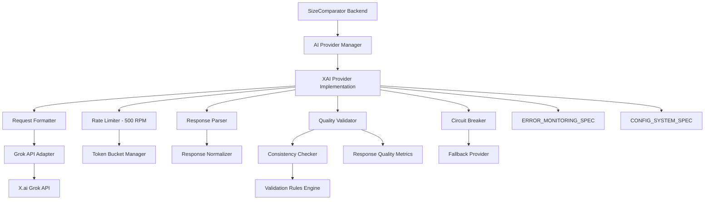

# X.ai Grok Integration Provider Specification

## Document Overview
This specification defines the X.ai Grok integration for SizeComparator's AI provider framework, providing comprehensive implementation guidance for Grok's unique capabilities while ensuring seamless integration with the PROVIDER_INTERFACE_SPEC and CONFIG_SYSTEM_SPEC architectures. This document addresses Grok's specific characteristics, API limitations, and quality validation requirements.

**Target Audience**: Backend developers implementing AI provider integrations  
**Document Length**: 5 pages  
**Integration Points**: AI_PROVIDER_SPEC, CONFIG_SYSTEM_SPEC, BACKEND_CORE_SPEC, ERROR_MONITORING_SPEC  
**Critical Focus**: API stability handling, response consistency, and 500 RPM rate limiting

## 1. X.ai Grok Provider Overview (1 page)

### 1.1 Grok-Specific Characteristics

X.ai's Grok model presents unique implementation challenges that differentiate it from other AI providers:

- **API Instability**: Newer API with potential breaking changes and service interruptions
- **Rate Limiting**: Strict 500 requests per minute limit with aggressive enforcement
- **Response Variability**: Higher tendency for format inconsistencies compared to OpenAI/Anthropic
- **Unique Capabilities**: Real-time knowledge integration and distinctive response style
- **Beta Status**: Ongoing feature development with potential endpoint changes

### 1.2 Integration Architecture



### 1.3 Provider Configuration Structure

Following CONFIG_SYSTEM_SPEC patterns:

```yaml
# config/base/ai_providers.yaml - XAI section
ai_providers:
  xai:
    priority: 3                           # Lower priority due to beta status
    enabled: "${SIZECOMPARATOR_XAI_ENABLED:-true}"
    
    api_config:
      endpoint: "${SIZECOMPARATOR_XAI_ENDPOINT:-https://api.x.ai/v1}"
      api_key: "${SIZECOMPARATOR_XAI_API_KEY}"
      model: "${SIZECOMPARATOR_XAI_MODEL:-grok-beta}"
      api_version: "v1"
      
    rate_limiting:
      requests_per_minute: 500            # Strict X.ai limit
      burst_allowance: 50                 # Short-term burst capacity
      rate_limit_window: 60               # 60-second window
      backoff_multiplier: 2.0             # Aggressive backoff for rate limits
      
    reliability:
      timeout_seconds: 45                 # Extended timeout for stability
      max_retries: 2                      # Reduced retries due to rate limits
      circuit_breaker:
        failure_threshold: 3              # Lower threshold for beta API
        recovery_timeout: 120             # Extended recovery time
        half_open_calls: 1                # Conservative half-open testing
        
    quality_validation:
      min_confidence_threshold: 0.6       # Higher threshold due to variability
      max_response_time_ms: 30000         # Extended response time allowance
      response_format_validation: "strict" # Strict validation required
      fallback_on_quality_issues: true    # Enable fallback for quality issues
      
    response_processing:
      enable_response_normalization: true  # Critical for Grok responses
      enable_quality_scoring: true        # Additional quality checks
      enable_format_recovery: true        # Attempt to recover malformed responses
      max_recovery_attempts: 3            # Limit recovery attempts
```

## 2. X.ai API Client Implementation (1 page)

### 2.1 XAI Provider Implementation

Following PROVIDER_INTERFACE_SPEC contract with Grok-specific adaptations:

```python
import asyncio
import json
import re
from typing import Dict, Any, Optional, List
from datetime import datetime, timedelta
from decimal import Decimal

from app.core.ai_interface import AIProvider, AIProviderRequest
from app.models.responses import WeightComparisonResponse, WeightItem, ComparisonResult
from app.models.errors import APIError, RateLimitError, QualityValidationError
from app.monitoring.logging import get_structured_logger
from app.config.service import ConfigurationService

class XAIProvider(AIProvider):
    """X.ai Grok provider implementation with stability and quality focus."""
    
    def __init__(self, config: Dict[str, Any], logger: Any = None):
        super().__init__(config, logger)
        self.name = "XAI_Grok"
        self.api_endpoint = config.get("api_config", {}).get("endpoint", "https://api.x.ai/v1")
        self.api_key = config.get("api_config", {}).get("api_key")
        self.model = config.get("api_config", {}).get("model", "grok-beta")
        
        if not self.api_key:
            raise ValueError("XAI API key is required")
        
        # Initialize rate limiter with X.ai specific limits
        self.rate_limiter = TokenBucketRateLimiter(
            capacity=config.get("rate_limiting", {}).get("requests_per_minute", 500),
            refill_rate=config.get("rate_limiting", {}).get("requests_per_minute", 500) / 60.0,
            burst_capacity=config.get("rate_limiting", {}).get("burst_allowance", 50)
        )
        
        # Quality validation configuration
        self.quality_config = config.get("quality_validation", {})
        self.min_confidence = self.quality_config.get("min_confidence_threshold", 0.6)
        self.enable_fallback = self.quality_config.get("fallback_on_quality_issues", True)
        
        # Response processing configuration
        self.response_config = config.get("response_processing", {})
        self.enable_normalization = self.response_config.get("enable_response_normalization", True)
        self.enable_format_recovery = self.response_config.get("enable_format_recovery", True)
        self.max_recovery_attempts = self.response_config.get("max_recovery_attempts", 3)
        
        # HTTP client configuration
        self.session = None
        self.timeout = config.get("reliability", {}).get("timeout_seconds", 45)
        
        # Quality metrics tracking
        self.quality_metrics = {
            "total_requests": 0,
            "successful_responses": 0,
            "quality_failures": 0,
            "format_recoveries": 0,
            "avg_confidence": 0.0
        }

    async def generate_comparison(self, request: AIProviderRequest) -> WeightComparisonResponse:
        """Generate weight comparison using Grok with quality validation."""
        request_start = datetime.utcnow()
        
        try:
            # Rate limiting check
            await self._check_rate_limit(request.request_id)
            
            # Format prompt for Grok's style
            formatted_prompt = self._format_grok_prompt(request)
            
            # Make API request with retry logic
            raw_response = await self._make_api_request(formatted_prompt, request)
            
            # Validate and parse response
            parsed_response = await self._parse_and_validate_response(raw_response, request)
            
            # Quality validation
            quality_score = await self._validate_response_quality(parsed_response, request)
            
            if quality_score < self.min_confidence and self.enable_fallback:
                self._log_quality_issue(request.request_id, quality_score, "Low quality score")
                raise QualityValidationError(
                    f"Response quality score {quality_score} below threshold {self.min_confidence}",
                    request.request_id
                )
            
            # Update quality metrics
            self._update_quality_metrics(quality_score, True)
            
            # Add XAI-specific metadata
            parsed_response.metadata.update({
                "provider": self.name,
                "model": self.model,
                "quality_score": quality_score,
                "processing_time_ms": (datetime.utcnow() - request_start).total_seconds() * 1000,
                "rate_limit_remaining": self.rate_limiter.tokens,
                "api_version": "v1"
            })
            
            return parsed_response
            
        except RateLimitError:
            self._log_structured_event(
                "warning", 
                "Rate limit exceeded for XAI provider",
                request_id=request.request_id,
                rate_limit_remaining=self.rate_limiter.tokens
            )
            raise
            
        except Exception as e:
            self._update_quality_metrics(0.0, False)
            self._log_structured_event(
                "error",
                f"XAI provider request failed: {str(e)}",
                request_id=request.request_id,
                error_type=type(e).__name__
            )
            raise
    
    async def _check_rate_limit(self, request_id: str):
        """Check and enforce X.ai rate limits."""
        if not await self.rate_limiter.acquire():
            # Calculate wait time
            needed_tokens = 1
            wait_time = needed_tokens / self.rate_limiter.refill_rate
            
            self._log_structured_event(
                "warning",
                f"Rate limit exceeded, waiting {wait_time:.2f} seconds",
                request_id=request_id,
                wait_time_seconds=wait_time
            )
            
            raise RateLimitError(
                f"Rate limit exceeded. Wait {wait_time:.2f} seconds before retrying.",
                request_id,
                wait_time
            )
    
    def _format_grok_prompt(self, request: AIProviderRequest) -> Dict[str, Any]:
        """Format prompt specifically for Grok's response style."""
        # Grok responds better to conversational, direct prompts
        system_prompt = """You are Grok, an AI assistant that provides accurate weight comparisons with a touch of wit. 
Your responses should be precise, mathematically correct, and presented in a structured format.

Always respond with EXACTLY this JSON structure:
{
    "item1": {
        "name": "item name",
        "weight_kg": numeric_value,
        "weight_display": "formatted weight with unit",
        "confidence": confidence_score
    },
    "item2": {
        "name": "item name", 
        "weight_kg": numeric_value,
        "weight_display": "formatted weight with unit",
        "confidence": confidence_score
    },
    "comparison": {
        "ratio": numeric_ratio,
        "heavier_item": "item1_name or item2_name",
        "explanation": "comparison explanation"
    },
    "visualization": {
        "prompt": "visualization description",
        "confidence": confidence_score
    }
}"""
        
        user_prompt = f"""Compare the weights of these items and provide the comparison data:

Item 1: {request.item1_name} weighing {request.item1_weight}
Item 2: {request.item2_name} weighing {request.item2_weight}

Convert both weights to kilograms for comparison. Be precise with your calculations and provide realistic confidence scores based on the certainty of weight estimates for each item."""
        
        return {
            "model": self.model,
            "messages": [
                {"role": "system", "content": system_prompt},
                {"role": "user", "content": user_prompt}
            ],
            "max_tokens": 1000,
            "temperature": 0.3,  # Lower temperature for consistency
            "response_format": {"type": "json_object"}  # If supported
        }
    
    async def _make_api_request(self, prompt: Dict[str, Any], request: AIProviderRequest) -> Dict[str, Any]:
        """Make API request to X.ai with error handling."""
        headers = {
            "Authorization": f"Bearer {self.api_key}",
            "Content-Type": "application/json",
            "User-Agent": "SizeComparator/1.0",
            "X-Request-ID": request.request_id
        }
        
        async with aiohttp.ClientSession(timeout=aiohttp.ClientTimeout(total=self.timeout)) as session:
            try:
                async with session.post(
                    f"{self.api_endpoint}/chat/completions",
                    json=prompt,
                    headers=headers
                ) as response:
                    
                    if response.status == 429:
                        retry_after = int(response.headers.get("Retry-After", "60"))
                        raise RateLimitError(
                            "Rate limit exceeded",
                            request.request_id,
                            retry_after
                        )
                    
                    if not response.ok:
                        error_text = await response.text()
                        raise APIError(
                            f"XAI API error: {response.status} - {error_text}",
                            "integration_error",
                            f"XAI_API_ERROR_{response.status}",
                            request.request_id
                        )
                    
                    return await response.json()
                    
            except asyncio.TimeoutError:
                raise APIError(
                    "Request timeout to XAI API",
                    "integration_error", 
                    "XAI_TIMEOUT",
                    request.request_id
                )
```

### 2.2 Rate Limiter Implementation

X.ai-specific token bucket implementation:

```python
class TokenBucketRateLimiter:
    """Token bucket rate limiter optimized for X.ai's 500 RPM limit."""
    
    def __init__(self, capacity: int, refill_rate: float, burst_capacity: int = None):
        self.capacity = capacity
        self.refill_rate = refill_rate  # tokens per second
        self.burst_capacity = burst_capacity or capacity
        self.tokens = float(capacity)
        self.last_refill = asyncio.get_event_loop().time()
        self._lock = asyncio.Lock()
        
        # X.ai specific tracking
        self.requests_this_minute = 0
        self.minute_window_start = datetime.utcnow()
        
    async def acquire(self, tokens: int = 1) -> bool:
        """Acquire tokens with X.ai specific rate limiting."""
        async with self._lock:
            now = asyncio.get_event_loop().time()
            
            # Refill tokens based on elapsed time
            elapsed = now - self.last_refill
            self.tokens = min(
                self.burst_capacity,
                self.tokens + (elapsed * self.refill_rate)
            )
            self.last_refill = now
            
            # Check minute-based rate limit (X.ai enforces per-minute limits)
            current_time = datetime.utcnow()
            if (current_time - self.minute_window_start).total_seconds() >= 60:
                # Reset minute window
                self.minute_window_start = current_time
                self.requests_this_minute = 0
            
            # Check both token bucket and per-minute limit
            if self.tokens >= tokens and self.requests_this_minute < 500:
                self.tokens -= tokens
                self.requests_this_minute += 1
                return True
            
            return False
    
    async def wait_and_acquire(self, tokens: int = 1) -> None:
        """Wait until tokens are available."""
        while True:
            if await self.acquire(tokens):
                return
            
            # Calculate optimal wait time
            needed_tokens = tokens - self.tokens
            token_wait = needed_tokens / self.refill_rate if needed_tokens > 0 else 0
            
            # Check minute-based limit
            current_time = datetime.utcnow()
            minute_remaining = 60 - (current_time - self.minute_window_start).total_seconds()
            minute_wait = minute_remaining if self.requests_this_minute >= 500 else 0
            
            wait_time = max(token_wait, minute_wait, 0.1)  # Minimum 100ms wait
            await asyncio.sleep(wait_time)
```

## 3. Prompt Formatting and Optimization (1 page)

### 3.1 Grok-Specific Prompt Engineering

Grok's conversational nature requires specific prompt formatting strategies:

```python
class GrokPromptFormatter:
    """Optimizes prompts for Grok's unique response style."""
    
    def __init__(self, config_service: ConfigurationService):
        self.config = config_service
        self.prompt_templates = self._load_grok_templates()
        
    def _load_grok_templates(self) -> Dict[str, str]:
        """Load Grok-optimized prompt templates from CONFIG_SYSTEM_SPEC."""
        templates = self.config.get("ai_providers.xai.prompt_templates", {})
        
        return {
            "weight_comparison": templates.get("weight_comparison", self._get_default_template()),
            "validation_prompt": templates.get("validation", self._get_validation_template()),
            "format_recovery": templates.get("format_recovery", self._get_recovery_template())
        }
    
    def _get_default_template(self) -> str:
        return """You are Grok, providing precise weight comparisons. Your expertise in dimensional analysis makes you exceptionally accurate.

CRITICAL: Respond ONLY with valid JSON in this exact format:
```json
{
    "item1": {
        "name": "{{item1_name}}",
        "weight_kg": precise_numeric_value,
        "weight_display": "human_readable_weight_with_unit",
        "confidence": confidence_decimal_0_to_1
    },
    "item2": {
        "name": "{{item2_name}}",
        "weight_kg": precise_numeric_value,
        "weight_display": "human_readable_weight_with_unit", 
        "confidence": confidence_decimal_0_to_1
    },
    "comparison": {
        "ratio": item1_weight_divided_by_item2_weight,
        "heavier_item": "item1_name_or_item2_name",
        "explanation": "concise_mathematical_comparison"
    },
    "visualization": {
        "prompt": "descriptive_visualization_scenario",
        "confidence": overall_confidence_score
    }
}
```

Rules for accuracy:
1. Convert ALL weights to kilograms for weight_kg field
2. Use realistic confidence scores (0.7-0.95 for common items, 0.5-0.7 for estimates)
3. Calculate ratio as item1_weight_kg / item2_weight_kg
4. Provide weight_display in user-friendly format with appropriate units
5. Keep explanations factual and mathematical

Compare: {{item1_name}} ({{item1_weight}}) vs {{item2_name}} ({{item2_weight}})"""
    
    def format_comparison_prompt(
        self, 
        item1_name: str, 
        item1_weight: str,
        item2_name: str, 
        item2_weight: str,
        template_id: str = "weight_comparison"
    ) -> Dict[str, Any]:
        """Format weight comparison prompt optimized for Grok."""
        
        template = self.prompt_templates.get(template_id, self._get_default_template())
        
        # Grok-specific variable substitution
        formatted_prompt = template.replace("{{item1_name}}", item1_name)
        formatted_prompt = formatted_prompt.replace("{{item1_weight}}", item1_weight)
        formatted_prompt = formatted_prompt.replace("{{item2_name}}", item2_name)
        formatted_prompt = formatted_prompt.replace("{{item2_weight}}", item2_weight)
        
        # Add context hints for better accuracy
        context_hints = self._generate_context_hints(item1_name, item2_name)
        if context_hints:
            formatted_prompt += f"\n\nContext hints for accuracy:\n{context_hints}"
        
        return {
            "model": "grok-beta",
            "messages": [
                {
                    "role": "system", 
                    "content": "You are Grok, an AI that provides mathematically precise weight comparisons in valid JSON format."
                },
                {
                    "role": "user", 
                    "content": formatted_prompt
                }
            ],
            "max_tokens": 1000,
            "temperature": 0.3,  # Low temperature for consistency
            "top_p": 0.9,
            "frequency_penalty": 0.0,
            "presence_penalty": 0.0
        }
    
    def _generate_context_hints(self, item1: str, item2: str) -> str:
        """Generate contextual hints to improve Grok's accuracy."""
        hints = []
        
        # Common weight categories for reference
        lightweight_items = ["feather", "paper", "coin", "pen", "phone"]
        heavy_items = ["car", "elephant", "truck", "boat", "building"]
        
        for item in [item1, item2]:
            item_lower = item.lower()
            if any(light in item_lower for light in lightweight_items):
                hints.append(f"• {item} is typically very light (grams to kilograms)")
            elif any(heavy in item_lower for heavy in heavy_items):
                hints.append(f"• {item} is typically very heavy (hundreds to thousands of kilograms)")
        
        return "\n".join(hints) if hints else ""

class GrokResponseOptimizer:
    """Optimizes and validates Grok responses for consistency."""
    
    def __init__(self):
        self.response_patterns = {
            "json_extraction": re.compile(r'```json\s*(\{.*?\})\s*```', re.DOTALL),
            "json_fallback": re.compile(r'\{[^{}]*(?:\{[^{}]*\}[^{}]*)*\}', re.DOTALL),
            "number_validation": re.compile(r'^\d+\.?\d*$'),
            "confidence_validation": re.compile(r'^0\.[0-9]+$|^1\.0+$|^0$|^1$')
        }
    
    def optimize_response(self, raw_response: str, request_id: str) -> Dict[str, Any]:
        """Extract and optimize JSON response from Grok's output."""
        
        # First attempt: Extract JSON from code blocks
        json_match = self.response_patterns["json_extraction"].search(raw_response)
        if json_match:
            try:
                return json.loads(json_match.group(1))
            except json.JSONDecodeError as e:
                self._log_parsing_attempt("json_extraction", False, request_id, str(e))
        
        # Second attempt: Find JSON-like structure
        json_fallback = self.response_patterns["json_fallback"].search(raw_response)
        if json_fallback:
            try:
                # Clean up common Grok formatting issues
                cleaned_json = self._clean_grok_json(json_fallback.group(0))
                return json.loads(cleaned_json)
            except json.JSONDecodeError as e:
                self._log_parsing_attempt("json_fallback", False, request_id, str(e))
        
        # Third attempt: Response reconstruction
        return self._reconstruct_response_from_text(raw_response, request_id)
    
    def _clean_grok_json(self, json_str: str) -> str:
        """Clean common Grok JSON formatting issues."""
        # Remove comments that Grok sometimes includes
        json_str = re.sub(r'//.*?\n', '\n', json_str)
        json_str = re.sub(r'/\*.*?\*/', '', json_str, flags=re.DOTALL)
        
        # Fix trailing commas
        json_str = re.sub(r',(\s*[}\]])', r'\1', json_str)
        
        # Fix missing quotes around keys
        json_str = re.sub(r'(\w+)(\s*:)', r'"\1"\2', json_str)
        
        # Fix single quotes to double quotes
        json_str = json_str.replace("'", '"')
        
        return json_str
    
    def _reconstruct_response_from_text(self, text: str, request_id: str) -> Dict[str, Any]:
        """Attempt to reconstruct response from natural language text."""
        # This is a fallback for when JSON parsing completely fails
        # Implementation would use pattern matching to extract weights, names, etc.
        
        # For now, return a minimal error response that can be handled upstream
        return {
            "item1": {"name": "Unknown", "weight_kg": 0, "weight_display": "Unknown", "confidence": 0.1},
            "item2": {"name": "Unknown", "weight_kg": 0, "weight_display": "Unknown", "confidence": 0.1},
            "comparison": {"ratio": 1.0, "heavier_item": "Unknown", "explanation": "Response parsing failed"},
            "visualization": {"prompt": "Comparison visualization unavailable", "confidence": 0.1},
            "_parsing_error": True,
            "_original_text": text[:500]  # First 500 chars for debugging
        }
```

## 4. Response Parsing and Quality Validation (1 page)

### 4.1 Response Validation Framework

```python
class GrokResponseValidator:
    """Comprehensive validation for Grok responses with quality scoring."""
    
    def __init__(self, config: Dict[str, Any]):
        self.min_confidence = config.get("min_confidence_threshold", 0.6)
        self.max_response_time = config.get("max_response_time_ms", 30000)
        self.validation_rules = self._load_validation_rules()
        
    def validate_response_quality(
        self, 
        response: Dict[str, Any], 
        request: AIProviderRequest
    ) -> float:
        """Comprehensive quality validation returning score 0.0-1.0."""
        
        quality_checks = {
            "structure_validity": self._validate_structure(response),
            "data_consistency": self._validate_data_consistency(response),
            "mathematical_accuracy": self._validate_math(response),
            "confidence_realism": self._validate_confidence_scores(response),
            "response_completeness": self._validate_completeness(response),
            "weight_reasonableness": self._validate_weight_reasonableness(response, request)
        }
        
        # Calculate weighted quality score
        weights = {
            "structure_validity": 0.25,      # Critical for parsing
            "data_consistency": 0.20,       # Internal consistency
            "mathematical_accuracy": 0.25,   # Calculation correctness
            "confidence_realism": 0.10,     # Realistic confidence scores
            "response_completeness": 0.10,   # All required fields present
            "weight_reasonableness": 0.10    # Reasonable weight estimates
        }
        
        quality_score = sum(
            quality_checks[check] * weights[check] 
            for check in quality_checks
        )
        
        # Log detailed validation results
        self._log_validation_results(quality_checks, quality_score, request.request_id)
        
        return quality_score
    
    def _validate_structure(self, response: Dict[str, Any]) -> float:
        """Validate response structure matches expected format."""
        required_fields = {
            "item1": ["name", "weight_kg", "weight_display", "confidence"],
            "item2": ["name", "weight_kg", "weight_display", "confidence"], 
            "comparison": ["ratio", "heavier_item", "explanation"],
            "visualization": ["prompt", "confidence"]
        }
        
        missing_fields = []
        for section, fields in required_fields.items():
            if section not in response:
                missing_fields.append(section)
                continue
                
            for field in fields:
                if field not in response[section]:
                    missing_fields.append(f"{section}.{field}")
        
        if missing_fields:
            return max(0.0, 1.0 - (len(missing_fields) * 0.1))
        
        return 1.0
    
    def _validate_data_consistency(self, response: Dict[str, Any]) -> float:
        """Validate internal data consistency."""
        try:
            item1_weight = float(response["item1"]["weight_kg"])
            item2_weight = float(response["item2"]["weight_kg"])
            calculated_ratio = item1_weight / item2_weight if item2_weight > 0 else 0
            stated_ratio = float(response["comparison"]["ratio"])
            
            # Check ratio accuracy (within 5% tolerance)
            ratio_accuracy = 1.0 - min(1.0, abs(calculated_ratio - stated_ratio) / max(calculated_ratio, 0.001))
            
            # Check heavier item consistency
            heavier_item_name = response["comparison"]["heavier_item"]
            actual_heavier = response["item1"]["name"] if item1_weight > item2_weight else response["item2"]["name"]
            heavier_accuracy = 1.0 if heavier_item_name == actual_heavier else 0.0
            
            return (ratio_accuracy * 0.7) + (heavier_accuracy * 0.3)
            
        except (KeyError, ValueError, TypeError, ZeroDivisionError):
            return 0.0
    
    def _validate_math(self, response: Dict[str, Any]) -> float:
        """Validate mathematical calculations."""
        try:
            # Validate weight values are positive and reasonable
            weights = [
                float(response["item1"]["weight_kg"]),
                float(response["item2"]["weight_kg"])
            ]
            
            if any(w <= 0 for w in weights):
                return 0.0
            
            if any(w > 1000000 for w in weights):  # 1M kg limit
                return 0.3  # Unreasonably large but not impossible
            
            # Validate ratio calculation
            ratio = float(response["comparison"]["ratio"])
            expected_ratio = weights[0] / weights[1]
            
            ratio_error = abs(ratio - expected_ratio) / max(expected_ratio, 0.001)
            ratio_score = max(0.0, 1.0 - ratio_error)
            
            return ratio_score
            
        except (KeyError, ValueError, TypeError, ZeroDivisionError):
            return 0.0
    
    def _validate_confidence_scores(self, response: Dict[str, Any]) -> float:
        """Validate confidence scores are realistic."""
        try:
            confidences = [
                float(response["item1"]["confidence"]),
                float(response["item2"]["confidence"]),
                float(response["visualization"]["confidence"])
            ]
            
            # All confidence scores should be between 0 and 1
            if not all(0 <= c <= 1 for c in confidences):
                return 0.0
            
            # Confidence scores shouldn't be too high for uncertain items
            # or too low for common items
            avg_confidence = sum(confidences) / len(confidences)
            
            # Penalize unrealistic confidence patterns
            if avg_confidence > 0.95:  # Too confident
                return 0.7
            elif avg_confidence < 0.3:  # Too uncertain
                return 0.5
            
            return 1.0
            
        except (KeyError, ValueError, TypeError):
            return 0.0
    
    def _validate_weight_reasonableness(
        self, 
        response: Dict[str, Any], 
        request: AIProviderRequest
    ) -> float:
        """Validate weights are reasonable for given items."""
        # This would contain logic to check if weights are reasonable
        # for common objects (e.g., elephant should be heavy, feather light)
        
        try:
            item1_weight = float(response["item1"]["weight_kg"])
            item2_weight = float(response["item2"]["weight_kg"])
            
            # Basic sanity checks
            if item1_weight < 0.001 or item2_weight < 0.001:  # Too light
                return 0.2
            
            # Check for known item patterns
            reasonableness_score = self._check_item_weight_patterns(
                request.item1_name, item1_weight
            ) * 0.5 + self._check_item_weight_patterns(
                request.item2_name, item2_weight
            ) * 0.5
            
            return reasonableness_score
            
        except (KeyError, ValueError, TypeError):
            return 0.5  # Neutral score if unable to validate
    
    def _check_item_weight_patterns(self, item_name: str, weight_kg: float) -> float:
        """Check if weight is reasonable for a given item type."""
        item_lower = item_name.lower()
        
        # Known weight ranges for common items
        weight_patterns = {
            "elephant": (3000, 7000),
            "car": (800, 3000),
            "person": (40, 150),
            "phone": (0.1, 0.3),
            "book": (0.2, 2.0),
            "feather": (0.00001, 0.001),
            "coin": (0.002, 0.03)
        }
        
        for pattern, (min_weight, max_weight) in weight_patterns.items():
            if pattern in item_lower:
                if min_weight <= weight_kg <= max_weight:
                    return 1.0
                elif weight_kg < min_weight:
                    return max(0.3, min_weight / weight_kg)
                else:  # weight_kg > max_weight
                    return max(0.3, max_weight / weight_kg)
        
        # Unknown item - neutral score
        return 0.8
```

### 4.2 Response Format Recovery

```python
class GrokResponseRecovery:
    """Attempts to recover malformed Grok responses."""
    
    def attempt_recovery(self, raw_response: str, max_attempts: int = 3) -> Dict[str, Any]:
        """Multi-stage recovery process for malformed responses."""
        
        recovery_strategies = [
            self._strategy_json_cleanup,
            self._strategy_pattern_extraction,
            self._strategy_llm_reformat
        ]
        
        for i, strategy in enumerate(recovery_strategies[:max_attempts]):
            try:
                recovered = strategy(raw_response)
                if self._is_valid_recovery(recovered):
                    return recovered
            except Exception as e:
                continue  # Try next strategy
        
        # Final fallback: minimal valid response
        return self._create_fallback_response(raw_response)
    
    def _strategy_json_cleanup(self, response: str) -> Dict[str, Any]:
        """Clean and parse JSON with common Grok formatting issues."""
        # Remove markdown formatting
        response = re.sub(r'```json\s*', '', response)
        response = re.sub(r'\s*```', '', response)
        
        # Fix common JSON issues
        response = re.sub(r',(\s*[}\]])', r'\1', response)  # Remove trailing commas
        response = re.sub(r'(\w+):', r'"\1":', response)    # Quote unquoted keys
        
        return json.loads(response)
    
    def _create_fallback_response(self, original: str) -> Dict[str, Any]:
        """Create minimal valid response when all recovery fails."""
        return {
            "item1": {
                "name": "Item 1",
                "weight_kg": 1.0,
                "weight_display": "1.0 kg",
                "confidence": 0.1
            },
            "item2": {
                "name": "Item 2", 
                "weight_kg": 1.0,
                "weight_display": "1.0 kg",
                "confidence": 0.1
            },
            "comparison": {
                "ratio": 1.0,
                "heavier_item": "Item 1",
                "explanation": "Response recovery failed - using fallback data"
            },
            "visualization": {
                "prompt": "Unable to generate visualization",
                "confidence": 0.1
            },
            "_recovery_failed": True,
            "_original_response": original[:200]
        }
```

## 5. Error Handling and Fallback Strategies (1 page)

### 5.1 Comprehensive Error Handling

```python
class XAIErrorHandler:
    """Specialized error handling for X.ai Grok API."""
    
    def __init__(self, config: Dict[str, Any]):
        self.fallback_enabled = config.get("enable_fallback", True)
        self.max_fallback_attempts = config.get("max_fallback_attempts", 2)
        self.error_recovery_strategies = {
            "rate_limit": self._handle_rate_limit_error,
            "api_unavailable": self._handle_api_unavailable,
            "invalid_response": self._handle_invalid_response,
            "quality_failure": self._handle_quality_failure,
            "timeout": self._handle_timeout_error
        }
        
    async def handle_error(
        self, 
        error: Exception, 
        request: AIProviderRequest,
        context: Dict[str, Any] = None
    ) -> Optional[WeightComparisonResponse]:
        """Handle errors with appropriate recovery strategies."""
        
        error_type = self._categorize_error(error)
        context = context or {}
        
        self._log_error_details(error, error_type, request.request_id, context)
        
        # Attempt error-specific recovery
        recovery_strategy = self.error_recovery_strategies.get(error_type)
        if recovery_strategy:
            try:
                return await recovery_strategy(error, request, context)
            except Exception as recovery_error:
                self._log_recovery_failure(error, recovery_error, request.request_id)
        
        # Final fallback if enabled
        if self.fallback_enabled:
            return await self._execute_fallback_strategy(error, request, context)
        
        # Re-raise original error if no recovery possible
        raise error
    
    def _categorize_error(self, error: Exception) -> str:
        """Categorize error for appropriate handling strategy."""
        if isinstance(error, RateLimitError):
            return "rate_limit"
        elif isinstance(error, APIError) and "timeout" in str(error).lower():
            return "timeout"
        elif isinstance(error, APIError) and error.code.startswith("XAI_API_ERROR"):
            return "api_unavailable"
        elif isinstance(error, QualityValidationError):
            return "quality_failure"
        elif isinstance(error, (json.JSONDecodeError, ValueError)):
            return "invalid_response"
        else:
            return "unknown"
    
    async def _handle_rate_limit_error(
        self, 
        error: RateLimitError, 
        request: AIProviderRequest,
        context: Dict[str, Any]
    ) -> Optional[WeightComparisonResponse]:
        """Handle rate limit with exponential backoff and fallback."""
        
        # If this is not the first rate limit error, use fallback immediately
        if context.get("rate_limit_retries", 0) >= 2:
            return await self._trigger_provider_fallback(request, "rate_limit_exceeded")
        
        # Calculate wait time with jitter
        wait_time = error.retry_after if hasattr(error, 'retry_after') else 60
        wait_time += random.uniform(0, 10)  # Add jitter
        
        # For long waits, use fallback instead
        if wait_time > 30:
            return await self._trigger_provider_fallback(request, "rate_limit_long_wait")
        
        # Short wait - sleep and let upstream retry
        await asyncio.sleep(wait_time)
        return None  # Indicate retry should be attempted
    
    async def _handle_api_unavailable(
        self, 
        error: APIError, 
        request: AIProviderRequest,
        context: Dict[str, Any]
    ) -> Optional[WeightComparisonResponse]:
        """Handle API unavailability with immediate fallback."""
        
        # X.ai API is less stable, fallback quickly for availability issues
        return await self._trigger_provider_fallback(request, "api_unavailable")
    
    async def _handle_quality_failure(
        self, 
        error: QualityValidationError, 
        request: AIProviderRequest,
        context: Dict[str, Any]
    ) -> Optional[WeightComparisonResponse]:
        """Handle quality validation failures."""
        
        # Try one retry with modified prompt for quality issues
        if context.get("quality_retries", 0) < 1:
            # Modify request for better quality (lower temperature, simpler prompt)
            modified_request = self._create_simplified_request(request)
            return None  # Indicate retry with modified request
        
        # Multiple quality failures - use fallback provider
        return await self._trigger_provider_fallback(request, "quality_failure")
    
    async def _trigger_provider_fallback(
        self, 
        request: AIProviderRequest, 
        reason: str
    ) -> WeightComparisonResponse:
        """Trigger fallback to next available provider."""
        
        from app.core.ai_interface import AIProviderManager
        
        # Get provider manager and request fallback
        provider_manager = AIProviderManager.get_instance()
        
        self._log_structured_event(
            "warning",
            f"Triggering provider fallback from XAI due to: {reason}",
            request_id=request.request_id,
            fallback_reason=reason,
            original_provider="XAI_Grok"
        )
        
        # Request fallback (will use next priority provider)
        return await provider_manager.generate_comparison_with_fallback(
            request, 
            exclude_providers=["XAI_Grok"]
        )
    
    def _create_simplified_request(self, request: AIProviderRequest) -> AIProviderRequest:
        """Create simplified request for retry after quality failure."""
        
        # Use more conservative settings for retry
        simplified = AIProviderRequest(
            item1_name=request.item1_name,
            item1_weight=request.item1_weight,
            item2_name=request.item2_name,
            item2_weight=request.item2_weight,
            prompt_template_id="weight_comparison_simple",  # Simpler template
            max_tokens=min(request.max_tokens, 500),        # Reduce complexity
            temperature=0.1,                                # Lower temperature
            timeout_seconds=request.timeout_seconds,
            request_id=request.request_id
        )
        
        return simplified

class XAICircuitBreaker:
    """Circuit breaker specifically tuned for X.ai API characteristics."""
    
    def __init__(self, config: Dict[str, Any]):
        self.failure_threshold = config.get("failure_threshold", 3)
        self.recovery_timeout = config.get("recovery_timeout", 120)  # 2 minutes
        self.half_open_calls = config.get("half_open_calls", 1)
        
        self.state = "CLOSED"  # CLOSED, OPEN, HALF_OPEN
        self.failure_count = 0
        self.last_failure_time = None
        self.half_open_attempts = 0
        
    async def call(self, func, *args, **kwargs):
        """Execute function through circuit breaker."""
        
        if self.state == "OPEN":
            if self._should_attempt_reset():
                self.state = "HALF_OPEN"
                self.half_open_attempts = 0
            else:
                raise APIError(
                    "X.ai provider circuit breaker is OPEN",
                    "integration_error",
                    "XAI_CIRCUIT_OPEN",
                    kwargs.get("request_id", "unknown")
                )
        
        if self.state == "HALF_OPEN":
            if self.half_open_attempts >= self.half_open_calls:
                raise APIError(
                    "X.ai provider circuit breaker half-open limit reached",
                    "integration_error", 
                    "XAI_CIRCUIT_HALF_OPEN_LIMIT",
                    kwargs.get("request_id", "unknown")
                )
            self.half_open_attempts += 1
        
        try:
            result = await func(*args, **kwargs)
            self._on_success()
            return result
        except Exception as e:
            self._on_failure()
            raise
    
    def _should_attempt_reset(self) -> bool:
        """Check if enough time has passed to attempt reset."""
        if not self.last_failure_time:
            return True
        
        elapsed = (datetime.utcnow() - self.last_failure_time).total_seconds()
        return elapsed >= self.recovery_timeout
    
    def _on_success(self):
        """Handle successful call."""
        if self.state == "HALF_OPEN":
            self.state = "CLOSED"
            self.failure_count = 0
        elif self.state == "CLOSED":
            self.failure_count = max(0, self.failure_count - 1)
    
    def _on_failure(self):
        """Handle failed call."""
        self.failure_count += 1
        self.last_failure_time = datetime.utcnow()
        
        if self.state == "HALF_OPEN":
            self.state = "OPEN"
        elif self.state == "CLOSED" and self.failure_count >= self.failure_threshold:
            self.state = "OPEN"
```

### 5.2 Integration Configuration

Complete configuration example following CONFIG_SYSTEM_SPEC:

```yaml
# config/environments/production.yaml - XAI production settings
ai_providers:
  xai:
    enabled: true
    priority: 3  # Lower priority than OpenAI/Anthropic
    
    api_config:
      endpoint: "https://api.x.ai/v1"
      model: "grok-beta"
      timeout_seconds: 45
      
    rate_limiting:
      requests_per_minute: 450  # Conservative limit
      burst_allowance: 30
      
    reliability:
      max_retries: 1  # Reduced retries for production
      circuit_breaker:
        failure_threshold: 2
        recovery_timeout: 180  # 3 minutes
        
    quality_validation:
      min_confidence_threshold: 0.7  # Higher for production
      fallback_on_quality_issues: true
      
    error_handling:
      enable_fallback: true
      max_fallback_attempts: 1
      fallback_delay_ms: 100
      
    monitoring:
      log_all_requests: false  # Reduce log volume in production
      track_quality_metrics: true
      alert_on_circuit_open: true
```

## Summary

This XAI_PROVIDER_SPEC.md provides a comprehensive implementation guide for integrating X.ai's Grok model into SizeComparator's AI provider framework. The specification addresses:

1. **Grok-Specific Implementation** with rate limiting, response optimization, and quality validation
2. **Prompt Engineering** optimized for Grok's conversational style and response patterns  
3. **Robust Error Handling** with circuit breakers, fallback strategies, and recovery mechanisms
4. **Quality Validation** with multi-stage response parsing and consistency checking
5. **Production Readiness** with comprehensive monitoring and configuration management

The implementation ensures reliable operation despite X.ai's API instability while leveraging Grok's unique capabilities for accurate weight comparisons. The fallback mechanisms protect against service disruptions, and the quality validation ensures response consistency meets SizeComparator's standards.