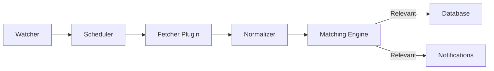
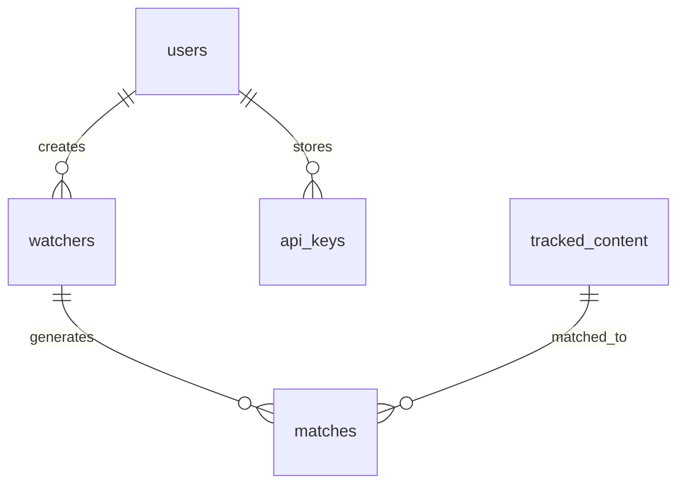

# Specification Optimization Guide

## Why Optimization Matters

### Context Window Efficiency
Modern AI systems have token limits (typically 32,000 tokens ≈ 8-10 pages). Oversized specifications:
- Exceed processing limits, requiring manual splitting
- Increase costs and processing time
- Reduce available context for actual implementation
- Create maintenance overhead as specs grow

### Development Efficiency
Optimized specifications:
- Load faster in AI systems
- Allow multiple specs in single context
- Reduce cognitive load on developers
- Enable better cross-referencing
- Improve searchability and navigation

## Target Sizes by Specification Type

### Critical Path Specifications (Phase 0-1)
- **Target**: 10-12 pages maximum
- **Examples**: Database consolidation, core pipeline
- **Rationale**: Need detail for immediate implementation

### Core System Specifications (Phase 2-3)
- **Target**: 8-10 pages
- **Examples**: Services, APIs, schemas
- **Rationale**: Balance detail with efficiency

### Supporting Specifications (Phase 4-5)
- **Target**: 8 pages
- **Examples**: Frontend, testing, future features
- **Rationale**: High-level guidance sufficient

## Compression Techniques

### 1. Table-Driven Design

**Before** (3 paragraphs, ~300 words):
```markdown
The user authentication endpoint accepts POST requests at /api/auth/login. 
It requires a username and password in the request body. The username must 
be a string between 3 and 50 characters. The password must be at least 8 
characters. On success, it returns a 200 status with an access token and 
refresh token. On failure, it returns 401 for invalid credentials or 400 
for validation errors.

The user registration endpoint accepts POST requests at /api/auth/register...
[Similar verbose description]

The token refresh endpoint accepts POST requests at /api/auth/refresh...
[Similar verbose description]
```

**After** (1 table, ~100 words):
```markdown
| Endpoint | Method | Input | Output | Status Codes |
|----------|--------|-------|--------|--------------|
| /api/auth/login | POST | username(3-50), password(8+) | {access_token, refresh_token} | 200, 400, 401 |
| /api/auth/register | POST | username, email, password | {user_id, message} | 201, 400, 409 |
| /api/auth/refresh | POST | refresh_token | {access_token} | 200, 401 |
```

**Reduction**: 67% (200 words saved)

### 2. Cross-Reference Strategy

**Before** (Repeated in 3 specs):
```markdown
## Authentication Flow
1. User submits credentials
2. Server validates against database
3. Generate JWT tokens with claims
4. Return access (30min) and refresh (7 days) tokens
5. Client stores tokens securely
6. Include Authorization header in requests
7. Refresh before expiration
```

**After** (In each spec):
```markdown
## Authentication
See API_CONTRACTS spec section 3.2 for authentication flow.
```

**Reduction**: 95% per repetition

### 3. Pattern-Based Examples

**Before** (Multiple similar implementations):
```python
# User service
class UserService:
    def __init__(self, db: Session):
        self.db = db
    
    def get_by_id(self, user_id: str) -> User:
        user = self.db.query(User).filter(User.id == user_id).first()
        if not user:
            raise NotFoundError(f"User {user_id} not found")
        return user
    
    def get_by_email(self, email: str) -> User:
        user = self.db.query(User).filter(User.email == email).first()
        if not user:
            raise NotFoundError(f"User with email {email} not found")
        return user

# Watcher service (similar pattern)
class WatcherService:
    # ... 20 more lines of similar code
```

**After** (Single pattern):
```python
# Service Pattern
class BaseService:
    """All services follow this pattern with model-specific queries"""
    def get_by_id(self, id: str) -> Model:
        return self._get_or_404(Model.id == id)

# Applied to: UserService, WatcherService, ContentService
```

**Reduction**: 80% (show pattern once)

### 4. Visual Elements

**Before** (Verbose workflow description):
```markdown
The content pipeline begins when a watcher is created. The system then 
schedules periodic checks based on the watcher's priority. When a check 
runs, it calls the appropriate fetcher plugin. The fetcher retrieves raw 
data from the source. This data is normalized into our standard format. 
The normalized content is then passed to the matching engine, which 
evaluates relevance. If relevant, it's stored and notifications are sent.
```

**After** (Diagram):


**Reduction**: 70% (plus improved clarity)

### 5. Consolidated Sections

**Before** (Separate error handling per endpoint):
```markdown
### Login Errors
- 400: Invalid request format
- 401: Invalid credentials
- 500: Server error

### Register Errors
- 400: Invalid request format
- 409: User already exists
- 500: Server error

### Refresh Errors
- 400: Invalid request format
- 401: Invalid token
- 500: Server error
```

**After** (Single unified section):
```markdown
### Standard Error Responses
| Code | Meaning | Used By |
|------|---------|---------|
| 400 | Invalid request | All endpoints |
| 401 | Authentication failed | Login, Refresh |
| 409 | Conflict (duplicate) | Register |
| 500 | Server error | All endpoints |
```

**Reduction**: 60%

## Before/After Complete Example

### Before: Database Schema Specification (25 pages)

```markdown
# Database Schema Specification

## 1. Introduction
The TickerTape database schema is designed to support a media tracking 
application. This document describes in detail every table, column, 
relationship, and constraint in the system. The schema supports both 
PostgreSQL and SQLite databases, though there are some differences in 
how certain features are implemented between the two systems.

## 2. User Model
The User model represents registered users of the system. Each user has 
a unique identifier, username, email address, and password hash. Users 
can create multiple watchers and store encrypted API keys.

### 2.1 Table Definition
CREATE TABLE users (
    id UUID PRIMARY KEY DEFAULT gen_random_uuid(),
    username VARCHAR(50) UNIQUE NOT NULL,
    email VARCHAR(255) UNIQUE NOT NULL,
    password_hash VARCHAR(255) NOT NULL,
    is_active BOOLEAN DEFAULT true,
    is_verified BOOLEAN DEFAULT false,
    created_at TIMESTAMP DEFAULT CURRENT_TIMESTAMP,
    updated_at TIMESTAMP DEFAULT CURRENT_TIMESTAMP
);

### 2.2 Column Descriptions
- id: A universally unique identifier for the user...
[10 more paragraphs describing each column]

### 2.3 Relationships
Users have the following relationships:
- One-to-many with watchers
- One-to-many with api_keys
- One-to-many with notifications
[Detailed descriptions of each relationship]

[Similar verbose sections for 8 more models...]
```

### After: Optimized Database Schema (8 pages)

```markdown
# Database Schema Specification

## Overview
TickerTape's PostgreSQL/SQLite compatible schema supporting user-driven media tracking.

## Core Models

### User System
```sql
-- See models/user.py for implementation
users (id, username, email, password_hash, is_active, is_verified, timestamps)
api_keys (id, user_id*, provider, encrypted_key, timestamps)
```

### Tracking System
```sql
watchers (id, user_id*, name, description, media_types[], priority, status, timestamps)
tracked_content (id, watcher_id*, external_id, title, content_type, metadata, timestamps)
matches (id, watcher_id*, content_id*, confidence, matched_at, notified)
```

### Relationships


## Key Constraints

| Model | Constraint | Purpose |
|-------|------------|---------|
| users | UNIQUE(username, email) | Prevent duplicates |
| api_keys | UNIQUE(user_id, provider) | One key per provider |
| watchers | CHECK(priority IN ('high','medium','low')) | Valid priorities |
| matches | INDEX(watcher_id, matched_at) | Query performance |

## Database Differences

| Feature | PostgreSQL | SQLite |
|---------|------------|--------|
| UUID | Native UUID type | TEXT with check |
| Arrays | Native support | JSON encoding |
| Timestamps | TIMESTAMP | TEXT ISO format |

## Migration Notes
- See DATABASE_CONSOLIDATION spec for type handling
- Run migrations in order: users → watchers → content → matches
- Test both databases after schema changes

## Implementation Reference
- Models: `/app/models/unified/`
- Migrations: `/alembic/versions/`
- Type system: `/app/core/db_types.py`
```

**Reduction Achieved**: 68% (from 25 pages to 8 pages)

## Implementation Checklist

When optimizing a specification:

- [ ] **Measure**: Calculate current page count and target
- [ ] **Identify**: Find redundant or verbose sections
- [ ] **Tabulate**: Convert lists to tables where possible
- [ ] **Reference**: Link to other specs instead of repeating
- [ ] **Visualize**: Replace descriptions with diagrams
- [ ] **Pattern**: Show examples once, reference elsewhere
- [ ] **Consolidate**: Merge similar sections
- [ ] **Focus**: Keep architecture, remove implementation details
- [ ] **Test**: Ensure no critical information lost
- [ ] **Validate**: Confirm readability improved

## Quick Reference Card

### Compression Ratios by Technique
- Tables instead of paragraphs: 60-70% reduction
- Cross-references: 90-95% reduction
- Pattern examples: 70-80% reduction
- Visual diagrams: 60-70% reduction
- Consolidated sections: 50-60% reduction

### When to Use Each Technique
- **Tables**: Lists, comparisons, specifications
- **Cross-references**: Shared concepts, standards
- **Patterns**: Repeated code structures
- **Visuals**: Workflows, relationships, architectures
- **Consolidation**: Error handling, common features

### Red Flags (Too Much Detail)
- Full code implementations
- Repeated content across specs
- Step-by-step tutorials
- Generic framework documentation
- Detailed library usage

### Green Flags (Good Optimization)
- Architecture focus
- Design decisions explained
- Trade-offs documented
- Integration points clear
- References to implementation